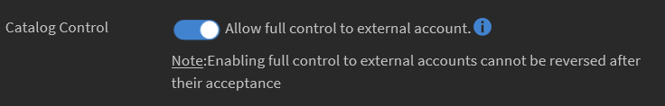

# 공유 카탈로그 전체 제어 활성화

## 카탈로그 만들기 {#createcatalog}

책임자는 강의 카탈로그, 학습 프로그램, 작업 지원 및 인증을 생성할 수 있습니다.

자세한 내용은 [카탈로그](/help/migrated/administrators/feature-summary/catalogs.md)를 참조하십시오.

## 카탈로그 공유 {#sharecatalog}

조직의 내부 사용자 또는 모든 외부 사용자와 카탈로그를 공유할 수 있습니다. 그러나 공유는 독점적입니다. 다른 말로 하면 내부에서 공유된 카탈로그는 외부 그룹과 공유할 수 없으며 그 반대도 마찬가지입니다.

강의, 학습 프로그램, 작업 지원 및 인증은 공유 카탈로그에서 지원되는 학습 객체입니다.

자세한 내용은 [카탈로그 공유](/help/migrated/administrators/feature-summary/catalogs.md)를 참조하십시오.

## 공유 카탈로그 전체 제어 활성화 {#fullcontrol}

카탈로그에 외부 계정에 대한 전체 액세스 권한을 부여할 수 있습니다. 그런 다음 계정 책임자는 카탈로그를 수락하고 학습 또는 모듈을 각각 추가 또는 삭제할 수 있습니다.

외부 계정에 대해 전체 제어를 허용하려면,

1. 학습을 추가한 다음 카탈로그를 외부 사용자와 공유해야 합니다.
1. 외부 계정 대화 상자에서 외부 조직 책임자의 하위 도메인 및 전자 메일 ID를 추가합니다.
1. 옵션 카탈로그 제어에서 버튼을 전환하여 카탈로그의 외부 사용자에 대한 전체 제어를 허용합니다.

   

   *공유 카탈로그의 전체 제어 허용*

   전체 카탈로그 제어를 허용하면 외부 조직의 책임자는 카탈로그의 수정 요청을 수락합니다. 그러면 외부 조직의 작성자는 강의를 편집하거나 모듈을 추가할 수 있습니다.

   자세한 내용은 다음 섹션을 참조하십시오.

## 외부 조직의 책임자 {#administratorofexternalorganization}

이전 조직의 책임자가 카탈로그의 전체 제어를 활성화하면, 외부 조직의 책임자는 카탈로그를 수락하고 확인합니다.

1. 알림 아이콘을 클릭하여 카탈로그 수락 알림을 봅니다.

   <!---->

1. 카탈로그 초대를 수락하려면 수락을 클릭합니다.
1. 카탈로그 목록에서 자신에게 공유된 카탈로그를 실행하는 경우 카탈로그가 이제 전체 제어 권한을 가졌다는 메시지가 표시됩니다.

   

   *카탈로그 세부 정보 보기*

1. 카탈로그의 이름 및 설명을 수정할 수 있습니다.

## 학습 프로그램, 인증, 작업 지원을 위한 카탈로그 공유 {#sharecatalogforlearningprogramcertificationandjobaids}

강의에 대한 전체 카탈로그 제어 허용과 마찬가지로 책임자는 다음에 대해서도 전체 카탈로그 제어를 허용할 수 있습니다.

* 학습 프로그램
* 인증
* 작업 지원

## 강의 재설정 {#resetcourse}

1. 연결이 끊어진 카탈로그 카드에서 **[!UICONTROL 강의 재설정]**.

<!-- -->

1. 재설정 버튼을 클릭하면 경고 메시지가 표시됩니다. 강의 재설정하기:

   * 새로 추가된 모든 콘텐츠를 카탈로그에서 제거합니다.
   * 원본 공유 카탈로그와의 동기화로 카탈로그를 업데이트합니다.
   * 상위 학습 개체와의 관계를 복원합니다.

   카탈로그 재설정은 되돌릴 수 없습니다. 카탈로그의 변경 사항을 실행 취소할 수 없습니다.

1. 변경을 수락하려면 예를 클릭합니다.
1. 강의 카탈로그에서 더 이상 카탈로그에 *연결이 끊어진 링크* 메시지가 표시되지 않습니다.

   카탈로그 세부 정보에서 카탈로그가 이제 원본 상태로 복원되었음을 확인할 수 있습니다.

## 학습 개체 다시 추가 {#readdalearningobject}

강의, 학습 프로그램, 인증 또는 작업 지원을 실수로 제거했더라도, 해당 항목을 복원할 수 있습니다.

삭제된 학습 개체를 복원하려면 다시 추가를 클릭합니다.

이 작업은 작업을 되돌리고 학습 개체를 카탈로그 보기에 복원합니다.

*학습 개체 다시 추가*

다시 추가 버튼을 클릭하면 학습 개체가 카탈로그에 추가되었다는 확인 메시지가 표시됩니다.

## 외부 조직 {#externalorganization}

외부 계정의 책임자가 카탈로그를 수락하면, 작성자는 이제 강의 및 학습 프로그램을 추가할 수 있습니다.

1. 사용자는 이제 사용자 계정에서 카탈로그를 사용할 수 있다는 알림을 받습니다.
1. 강의 목록을 보려면 왼쪽 탐색 창의 **[!UICONTROL 강의]**&#x200B;를 클릭합니다. 자신이 만들고 자신에게 공유된 모든 강의를 볼 수 있습니다.
1. 강의 세부 정보를 보려면 강의 카드의 **[!UICONTROL 강의 보기]**&#x200B;를 클릭합니다.

   <!---->

1. 강의 세부 정보 페이지에서 강의 및 공유 모듈의 정보를 볼 수 있습니다. 모듈을 추가하려면 모듈 추가를 클릭합니다. 모듈을 기존 모듈에 추가하면 새 모듈이 기존 모듈의 끝에 표시됩니다. 모듈의 순서는 언제든지 조정할 수 있습니다.
1. 모듈을 추가했으면 다시 게시를 클릭합니다.

   모듈을 다시 게시했으면 카탈로그 카드에 *연결이 끊어진 링크* 메시지가 표시됩니다.

   원본 카탈로그를 새 모듈로 업데이트했으므로 획득한 강의에 대한 기존 관계는 더 이상 존재하지 않습니다.

   학습 개체의 콘텐츠가 수정되어 소스 계정의 학습 개체는 동기화되지 않은 상태가 됩니다.

   <!---->

모듈을 추가하고 다시 게시한 후 이전에 카탈로그에서 실수로 강의를 추가하거나 삭제했다고 생각되는 경우 모듈을 재설정하고 모듈이 전체 제어와 처음 공유되었을 때의 원래 상태로 되돌릴 수 있습니다.
