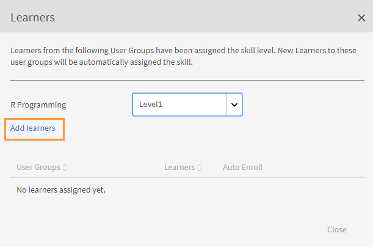
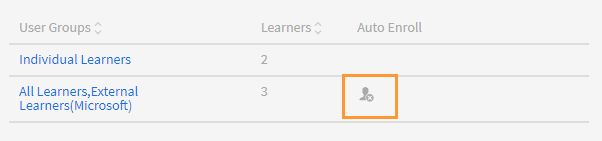
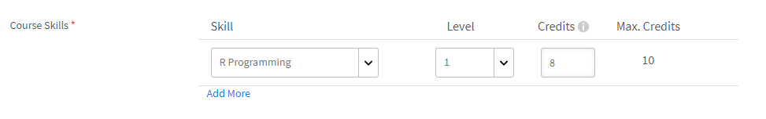

# 스킬과 레벨 만들기 및 수정하기

스킬과 레벨 만들기, 할당하기, 수정하기.

스킬 맵은 조직의 직원이 가진 스킬 세트, 지식, 특징을 그룹화한 것입니다. 이러한 스킬 맵은 회사/조직이 직원의 기대 성과를 설정하거나 올리는 데 도움을 줍니다. 스킬을 통해 직원은 조직의 기대에 맞는 행동을 할 수 있습니다.

Adobe Learning Manager에서는 스킬 맵을 사용하여 스킬 세트에 근거한 학습자 성과를 매핑할 수 있습니다. 학습자는 강의를 완료하면 스킬 맵을 보고 각 스킬에 대한 자신의 순위를 알 수 있습니다.

Learning Manager LMS에서 스킬의 기본 목적은 책임자에게 비즈니스 목적에 맞게 학습을 연계하는 도구를 제공하는 것입니다.

## 스킬 추가 {#addaskill}

책임자는 다음을 수행할 수 있습니다.

* 스킬에 도메인 매핑
* 여러 레벨의 스킬 추가
* 레벨에 배지 추가

스킬을 추가하려면 다음 단계를 따르십시오.

1. 왼쪽 창에서 다음을 선택합니다. **[!UICONTROL 스킬]** > **[!UICONTROL 추가]** > **[!UICONTROL SKills 추가]**. 스킬의 이름과 설명을 입력합니다.

   

   *스킬의 이름 및 설명 추가*

1. 스킬에 도메인을 할당합니다. 스킬을 만드는 동안 Learning Manager가 지원하는 가장 관련 있는 스킬 도메인으로 스킬을 매핑할 수 있습니다. 자세한 내용은 [***도메인으로 스킬 매핑***](/help/migrated/administrators/feature-summary/curation-skills.md)&#x200B;을 참조하십시오.

   필드에 도메인 입력을 시작하면 권장 사항이 표시됩니다. 기술과 관련이 있는 옵션을 선택합니다.

   

   *도메인 추가*

1. 스킬에 레벨을 할당합니다. 레벨을 추가하려면 **[!UICONTROL 추가]**&#x200B;를 클릭합니다.

   스킬을 만들어 직원에게 할당할 수 있습니다. 스킬에는 다양한 레벨이 있으며 모든 레벨은 지정된 점수를 획득해야 달성할 수 있습니다.

   하나의 스킬에 최대 3개의 레벨을 할당할 수 있습니다. 학습 경로는 다양한 학습 객체에 학습자를 등록하는 것으로, 이는 다양한 레벨의 스킬에 대한 요구 사항을 충족하는 특정 점수로 변환됩니다.

   이러한 학습 객체(LO)와 레벨을 달성하면 학습자는 이제 이전보다 생산적인 레벨에서 수행할 준비를 갖추게 됩니다.

   

   *스킬 레벨 추가*

   스킬을 추가하면 점수에 소수점을 지정할 수도 있습니다. 점수는 소수점 두 자리까지 표시됩니다.

   소수점 지원은 영어로만 사용할 수 있습니다.

1. 레벨에 대한 배지를 선택합니다. **[!UICONTROL 배지]** 드롭다운 목록에서 해당 레벨의 배지로 사용할 이미지를 선택합니다.
1. 변경 사항을 저장하려면 **[!UICONTROL 저장]**&#x200B;을 클릭합니다.

   스킬을 만들면 **[!UICONTROL 스킬]** 페이지에서 새로 만든 스킬을 찾을 수 있습니다. 또한 도메인 및 스킬의 간략한 설명을 볼 수 있습니다. 해당 레벨과 각 레벨에 할당된 점수도 확인할 수 있습니다.

   

   *OIF 스킬 목록 보기*

## 학습자에게 스킬 할당 {#assigntheskilltolearners}

책임자는 학습자에게 스킬을 할당할 수 있습니다.

스킬을 만들어 저장하면 스킬 페이지에 나열됩니다. 이제 다음과 같이 학습자에게 이러한 스킬을 부여할 수 있습니다.

1. **[!UICONTROL 스킬]** 페이지에서 스킬에 등록된 학습자 수가 포함된 하이퍼링크를 클릭합니다. 새로 만든 스킬의 경우 모든 레벨의 학습자 수는 0입니다.

   

   *스킬에 할당된 학습자 보기*

   이 예에서는 레벨 1에 대한 학습자를 추가합니다. 레벨 1 옆에 있는 하이퍼링크를 클릭합니다.

1. 학습자 대화 상자에서 **[!UICONTROL 학습자 추가]**&#x200B;를 클릭합니다.

   

   *학습자 추가*

1. 학습자를 검색하여 추가합니다. 학습자 그룹을 추가할 수도 있습니다.

   

   *학습자 검색 및 추가*

1. 변경 사항을 저장하려면 **[!UICONTROL 저장]**&#x200B;을 클릭합니다.

   학습자를 할당하면 해당되는 경우 기본적으로 사용자 그룹의 모든 학습자가 스킬에 자동 등록됩니다. **[!UICONTROL 자동 등록]** 버튼을 클릭하여 학습자의 자동 등록을 해제할 수 있습니다.

   

   *자동 등록 비활성화*

   개별 학습자는 직접 자동 등록하거나 책임자가 학습 프로그램에 등록할 수 있습니다.

1. **[!UICONTROL 닫기]**&#x200B;를 클릭하면 생성한 스킬에 할당된 총 학습자의 수를 볼 수 있습니다.

   이 예에서는 사용자 그룹에 두 명의 개별 학습자와 세 명의 학습자가 있습니다.

   

   *스킬에 할당된 학습자 수*

## 강의에 스킬 할당 {#assignskilltocourse}

스킬을 만들면 작성자가 강의를 만들고 해당 강의에 스킬을 할당할 수 있습니다.

*강의에 스킬 할당*

작성자가 강의를 게시하면 **[!UICONTROL 스킬]** 페이지에서 스킬 레벨에 연결된 강의 수를 볼 수 있으며, 새로운 강의에 해당 스킬을 할당하면 숫자가 늘어납니다.

*스킬 레벨과 연관된 강의의 수*

## 스킬에 작업 지원 할당 {#assignajobaidtotheskill}

작업 지원은 강의 또는 학습 프로그램과 같은 특정 학습 객체에 등록하지 않고도 학습자가 접속할 수 있는 교육 콘텐츠입니다.

작업 지원을 만드는 동안 작성자는 스킬 레벨을 작업 지원에 연결할 수 있습니다. 스킬 없이 작업 지원을 만들어 스킬이 있는 강의에 연결하면 스킬이 작업 지원에 연결되지 않습니다.

*작업 지원 생성*

**[!UICONTROL 스킬]** 페이지에서 해당 스킬 레벨에 연결된 작업 지원 수를 확인할 수 있습니다.

*스킬의 작업 지원 수*

## 스킬 검색 {#searchskill}

스킬의 이름을 입력하고 표시되는 옵션에서 스킬을 선택하여 스킬을 검색합니다. 타이프 어헤드 검색을 적용할 수도 있습니다.

스킬 페이지의 **[!UICONTROL 활성]** 및 **[!UICONTROL 중단]** 섹션 모두에서 스킬을 검색할 수 있습니다.

## 스킬 편집 {#editaskill}

**[!UICONTROL 스킬]** 페이지에서 수정하려는 스킬을 클릭합니다. (으)로 **[!UICONTROL 스킬 편집]** 대화 상자에서 필요한 변경을 수행합니다. 예를 들면 다음과 같습니다.

* 스킬 도메인 추가 또는 삭제
* 스킬의 이름 및 설명 편집
* 스킬 레벨 추가 또는 기존 레벨 수정
* 스킬에 대한 배지 추가 또는 삭제

변경을 완료한 후 **[!UICONTROL 저장]**&#x200B;을 클릭합니다.

## 스킬 사용 중단 {#retireaskill}

스킬 사용을 중단하려면 **[!UICONTROL 스킬]** 페이지에서 사용을 중단하려는 스킬을 선택합니다.

**[!UICONTROL 작업]** 메뉴의 페이지 오른쪽 상단 모서리에서 **[!UICONTROL 중단]**&#x200B;을 클릭합니다.

스킬 사용을 중단하면 해당 스킬이 더 이상 강의에 표시되지 않습니다.

스킬 사용을 중단하면 다시 게시될 때까지 해당 스킬을 강의 또는 작업 지원을 연결하거나 학습자에게 할당할 수 없습니다. 기존 연결 및 할당은 스킬 사용 중단에 영향을 받지 않습니다.

## 스킬 다시 게시하기 {#republishaskill}

스킬 사용을 중단하면 해당 스킬이 **[!UICONTROL 중단됨]** 탭에 표시됩니다. 이 탭에는 사용 중단된 모든 스킬 목록이 표시됩니다.

사용 중단한 스킬을 다시 게시하려면 해당 스킬을 선택하고 **[!UICONTROL 작업]** 메뉴에서 **[!UICONTROL 다시 게시]**&#x200B;를 클릭합니다.

이렇게 하면 스킬이 복원되고 **[!UICONTROL 활성]** 탭에 스킬이 다시 표시됩니다.

## 스킬 삭제 {#deleteaskill}

이전에 사용 중단한 스킬만 삭제할 수 있습니다.

**[!UICONTROL 중단됨]** 탭에서 삭제하려는 스킬을 선택하고 **[!UICONTROL 동작]** 메뉴에서 **[!UICONTROL 삭제]**&#x200B;를 클릭합니다.

학습자 또는 강의나 작업 지원과 연결되어 있지 않은 경우에만 스킬을 삭제할 수 있습니다.

## 강사에 스킬 할당하기

강사의 스킬로 구성된 CSV 파일을 추가합니다. 그러면 다음 스킬이 스킬 목록에 추가됩니다.

1. 화면의 오른쪽 상단 모서리에서 **[!UICONTROL 추가]** > **[!UICONTROL 강사에게 스킬 할당]**.
1. csv를 업로드합니다. CSV의 열은 다음과 같습니다.

   * 스킬 이름
   * 스킬 레벨
   * 강사 이메일 또는 강사 UUID

   UUID가 활성화된 계정의 경우 강사 이메일 열을 강사 UUID로 바꿉니다.

   &#39;저장&#39;을 클릭합니다.

   

   *CSV에서 강사 스킬 추가*

1. 확인 팝업 메시지가 표시됩니다.

   참고: CSV에 잘못된 필드가 있는 경우 다음 오류 메시지가 표시됩니다.

   

   *잘못된 필드에 대한 오류 메시지*

### 스킬 페이지

스킬 페이지에는 스킬에 할당된 강사의 수를 나타내는 강사 열이 있습니다. 강사 수를 클릭하면 스킬에 할당된 강사가 표시되는 팝업이 표시됩니다.

*스킬 페이지*

### 스킬 할당 CSV 다운로드

1. 스킬 페이지에서 **[!UICONTROL 추가]** > **[!UICONTROL 강사에게 스킬 할당]**.
1. 대화 상자에서 **[!UICONTROL 이전에 추가된 할당]**.
1. 마지막으로 업로드한 CSV가 다운로드됩니다.

>[!NOTE]
>
>먼저 스킬 할당 CSV를 다운로드하고 편집한 다음 파일을 업로드하는 것이 좋습니다.

## 자주 묻는 질문 {#frequentlyaskedquestions}

+++스킬에서 학습자를 제거하려면 어떻게 해야 합니까?

스킬에서 학습자를 제거할 수 없습니다. 그러나 신규 학습자 또는 사용자 그룹을 스킬에 추가할 수는 있습니다.
+++

+++학습자를 스킬에 자동 등록하는 방법

자동 등록은 사용자 그룹 전용 기능입니다. 사용자 그룹(예: 모든 작성자)을 스킬에 등록하고 저장하면 기본적으로 자동 등록이 활성화됩니다. 그러면 &#39;모든 작성자&#39; 사용자 그룹의 모든 추가 사항이 스킬에도 할당됩니다.

모든 작성자의 해당 스킬 레벨에 대한 자동 등록을 중지하면 모든 작성자 사용자 그룹에 추가되는 모든 새로운 사용자는 해당 스킬에 할당되지 않습니다.
+++

+++자동 등록을 다시 시작하는 방법

동일한 사용자 그룹을 자동 등록이 중지된 해당 스킬 레벨에 다시 등록합니다.

그러면 자동 등록이 다시 시작되고 이 기능이 꺼졌을 때 그룹에 추가된 학습자도 이제 스킬에 할당됩니다.

즉 자동 등록을 시작하기 위해 사용자 그룹을 다시 등록할 때마다 사용자 그룹 구성원이 새로 고침되며 모든 현재 구성원에게 스킬이 할당됩니다.
+++

+++강의에 스킬을 할당하려면 어떻게 해야 합니까?

해당 절차에 대한 자세한 내용은 [강의에 스킬 할당](skills-levels.md#assignskilltocourse) 섹션을 참조하십시오.
+++

+++스킬 레벨을 변경하려면 어떻게 해야 합니까?

스킬에서 하나 이상의 레벨을 변경하려면 스킬을 편집하고 기존 레벨의 속성을 수정하십시오.
+++

+++배지 및 스킬을 활성화하여 강의 완료에 연결하려면 어떻게 해야 합니까?

작성자가 강의를 만드는 동안 스킬을 강의 완료에 연결할 수 있습니다. 설정 섹션에서 강의 완료를 위한 스킬 조건을 설정할 수 있습니다.

강의 완료에 대한 배지를 활성화하려면 작성자 앱의 **[!UICONTROL 인스턴스]** 섹션에서 필요한 배지를 활성화하십시오.
+++

+++배지에 &#39;진행 중&#39;이 표시되어도 책임자가 배지를 완료로 표시할 수 있습니까?

책임자는 학습 객체를 완료로 표시할 수 있습니다. 스킬과 배지는 학습 객체와 연결되어 있고 개별적으로&#x200B;**[!UICONTROL 완료]**&#x200B;로 표시될 수 없습니다.

즉, 배지를 획득하려면 **배지가 연결되어 있는 학습 객체를 완료해야 합니다**.
+++

### 연관 검색

* [스킬 및 Adobe Learning Manager](https://elearning.adobe.com/2018/11/skills-captivate-prime/)
