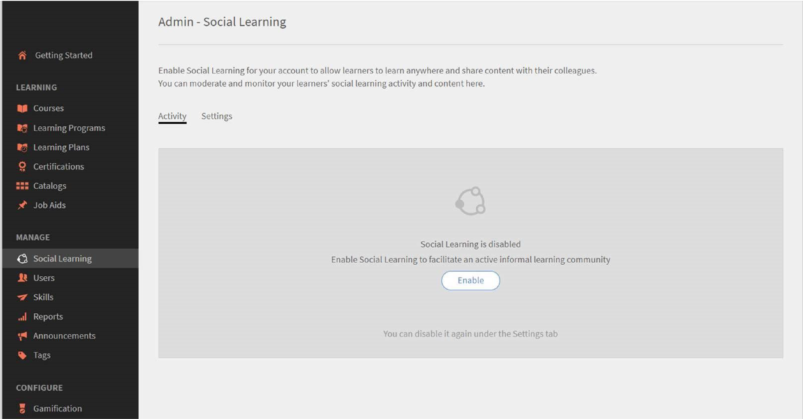
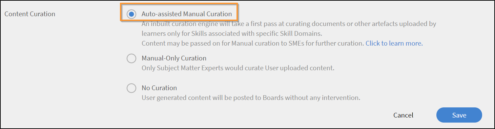
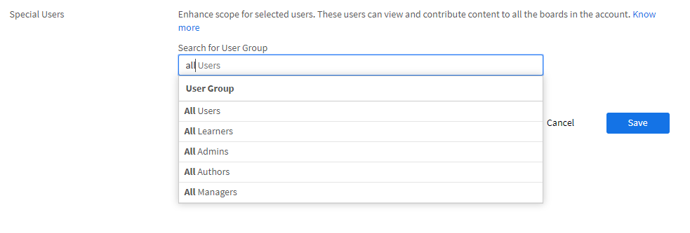
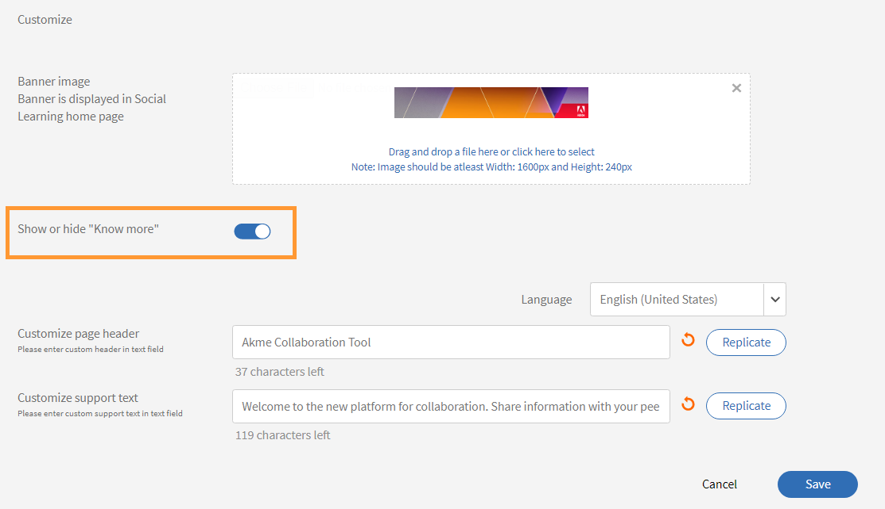

# 책임자로 소셜 학습 모니터링 및 중재

책임자는 소셜 학습에서 수행된 활동을 활성화/비활성화하고 모니터링할 수 있습니다. 소셜 학습 기능이 활성화되면 학습자가 이를 확인하고 소셜 학습에 참여할 수 있습니다.

## 소셜 학습에서 설정 활성화 및 구성 {#enableandconfiguresettingsinsociallearning}

소셜 학습 기능을 활성화 및 구성하려면 다음을 수행하십시오.

1. 왼쪽 탐색 창에서 **[!UICONTROL 소셜 학습]**&#x200B;을 클릭합니다. 활동 페이지로 리디렉션됩니다.
1. 활성화 **[!UICONTROL 소셜 학습]** 기능을 사용하여 **[!UICONTROL 활성화]** 처음으로 켜는 경우 [활동] 페이지의 단추입니다. 그렇지 않으면 **[!UICONTROL 설정]** 페이지.

   아래 스크린샷과 같은 팝업 대화 상자가 표시됩니다.

    

   *소셜 학습 활성화*

<!--  -->

책임자는 소셜 학습 설정을 구성할 수 있습니다. 설정에는 다음과 같은 콘텐츠 큐레이션 유형이 포함됩니다 **[!UICONTROL 수동 전용 큐레이션]** 및 **[!UICONTROL 큐레이션 없음]**. 범위 설정은 사용자 유형(내부/외부) 또는 계정에 있는 다른 활성 필드와 같이 다른 범위로 설정할 수 있습니다. 책임자는 학습자가 Adobe Learning Manager 데스크탑 응용 프로그램을 다운로드하는 위치에서 URL 경로를 설정할 수 있습니다.

## 콘텐츠 큐레이션 {#contentcuration}

소셜 학습은 비공식 학습이므로 소셜 학습의 기능은 다른 소셜 미디어 플랫폼과 유사합니다. 사람들은 종종 소셜 미디어가 생산성에 영향을 미치는 관련성이 없는 콘텐츠를 자주 소비하기 때문에 산만함을 발견합니다. 이 같은 문제는 콘텐츠 중재 및 큐레이션으로 해결할 수 있습니다.

**[!UICONTROL 수동 전용 큐레이션]** 및 **[!UICONTROL 큐레이션 없음]** 책임자가 선택할 수 있는 두 가지 큐레이션 옵션입니다.

**[!UICONTROL 자동 지원 수동 큐레이션]:** Learning Manager에는 나중에 원하는 학습자에게 제공할 수 있는 모든 형식의 콘텐츠에 대한 본질을 지능적으로 찾을 수 있는 인공 지능 기반 자동 큐레이션 엔진이 있습니다. 또한 제공된 신뢰 점수를 기반으로 게시된 콘텐츠를 승인하거나 거부할 수 있습니다.

예를 들어 Adarsh는 학습자이며 흥미로운 블로그를 발견하여 Adobe Learning Manager의 소셜 학습 플랫폼에 게시합니다. 그런 다음 게시물은 AI가 제공하는 콘텐츠 큐레이션 엔진에 공급되며, 콘텐츠에 있는 기술을 예측하고 해당 기술을 관련된 보드 기술과 비교합니다. 스킬이 일치하는 경우 콘텐츠가 게시되고, 그렇지 않은 경우 수동 전용 큐레이션을 위해 전송됩니다.

게시물에 필요한 최소 신뢰 점수는 50%입니다.

**[!UICONTROL 수동 전용 큐레이션]:** 콘텐츠가 실행되기 전에 콘텐츠의 진위를 확인하기 위해 책임자는 수동 전용 큐레이션 설정을 활성화할 수 있습니다. 수동 전용 큐레이션 설정이 활성화되면 큐레이션을 위해 상위 SME(최대 3명)로 이동합니다. 평균 응답을 기반으로 게시물은 그에 따라 승인/거부됩니다. 응답이 50%보다 크거나 같으면 게시물이 거부되지 않고 실행됩니다. SME에 대한 자세한 내용을 보려면 [여기를 클릭](social-learning-configurations-as-an-admin.md#SubjectMatterExpertsSMEs)하십시오.

## 자동 콘텐츠 큐레이션 {#autocuration}

콘텐츠를 수동으로 중재하면 오류가 발생하고 시간이 많이 소요될 수 있습니다. 또한 크기를 조정할 수 없으며 많은 양의 소셜 활동에 적합하지 않습니다. 그러므로 소셜 활동을 하는 많은 사람을 지원하는 경우 자동으로 콘텐츠를 큐레이션하는 것이 중요해지고 있습니다.

Learning Manager에서는 자동으로 콘텐츠를 큐레이션하는 옵션이 제공됩니다. 책임자가 특정 스킬로 미리 정의된 스킬을 매핑한 후 AI 지원 엔진으로 큐레이션이 수행되며 이 때 매핑은 미리 정의된 스킬로 진행됩니다. 자세한 내용은 [스킬 도메인 매핑](curation-skills.md)을 참조하십시오.

자동 큐레이션에는 다음 콘텐츠 유형이 허용됩니다.

* PDF
* 오디오 및 비디오 파일
* 프레젠테이션- PPT 또는 PPTX
* 문서- .doc, .docx

책임자는 책임자 앱 내에서 콘텐츠를 자동으로 큐레이션하는 옵션을 활성화할 수 있습니다.

1. 책임자 앱의 왼쪽 창에서 **[!UICONTROL 소셜 학습]**&#x200B;을 클릭합니다.
1. 해당 페이지에서 **[!UICONTROL 설정]** 탭을 클릭합니다.
1. **[!UICONTROL 자동 지원 수동 큐레이션]** 옵션을 활성화합니다.

   

   *자동 지원 수동 큐레이션 옵션 선택*

사용자가 게시판에서 콘텐츠를 업로드하면 AI 기반 알고리즘이 콘텐츠에서 텍스트를 수집한 후 해당 텍스트가 큐레이션 엔진으로 전달됩니다. 큐레이션 엔진이 콘텐츠에 있는 스킬 검색을 시도합니다.

업로드된 콘텐츠에서 예측한 스킬은 콘텐츠가 업로드된 보드에서의 스킬과 일치한다.  스킬이 보드 스킬의 50% 이상의 신뢰 점수와 일치하는 경우 콘텐츠는 보드에 게시됩니다. 신뢰 점수가 50% 이하인 경우 콘텐츠가 수동 큐레이션을 위해 전송됩니다.

콘텐츠가 자동으로 큐레이션될 때마다 사용자는 콘텐츠가 이전에 업로드된 게시판에서 해당 콘텐츠를 사용할 수 있다는 알림을 받습니다.

*큐레이션 설정 흐름도*

수동 전용 큐레이션을 사용하는 경우 책임자가 스킬에 SME를 추가하는 것이 좋습니다. 책임자는 스킬 전문 지식이 있는 사용자에게 미리 SME 점수를 제공하여 SME를 추가할 수 있습니다. SME에게 포인트를 제공하는 방법에 대한 자세한 내용은  [여기를 클릭](social-learning-configurations-as-an-admin.md#SubjectMatterExpertsSMEs).

**큐레이션 없음:** 모든 학습자의 게시물은 콘텐츠 조정 없이 자동으로 게시됩니다.

<!---->

## 자동 콘텐츠 큐레이션에 대한 자주 묻는 질문 {#faq-auto-curation}

+++SME가 게시물을 큐레이션하는 데 걸리는 시간은 얼마나 됩니까?

SME가 게시물을 큐레이션하는 데는 최소 24시간이 걸립니다. 시간대 차이로 인해 47시간까지 늘어날 수 있습니다.

+++

+++3개 SME가 모두 있는 경우 다음 3개 SME 세트로 이동됩니까? 항상 3명의 SME가 관여합니까?

첫날 큐레이션 요청은 상위 3명의 SME에게 전달됩니다. 응답이 없으면 다음날 그 다음 3명의 SME에게 요청이 전달됩니다.

새로운 3명의 SME가 응답하지 않으면 해당 요청은 게시판 중재자에게 전달됩니다.

보드 중재자가 응답하지 않는 경우 요청은 자동으로 승인됩니다.

+++

+++2명의 SME가 큐레이션하고 1명은 큐레이션하지 않는 경우 요청은 4번째 SME에게 전달됩니까, 아니면 게시물에 대해 첫 번째 SME 그룹이 내린 평가의 평균치가 적용됩니까?

게시물을 승인하려면 50%의 승인 비율이 필요합니다. 마찬가지로, 거절 비율이 50%가 되어야 게시물을 거절할 수 있습니다. SME가 승인할 때마다 50%에 도달했는지 평가됩니다.

하루가 지난 후 50%에 도달하지 않으면 다음 3명의 SME에게 큐레이션 요청이 전달되고 이전에 응답되지 않은 큐레이션 요청은 만료됩니다.

예를 들어, 첫날 큐레이션 요청이 3명의 SME에게 전달되고, 그중 한 명만 승인하고 나머지 두 명은 응답하지 않았습니다. 다음날 해당 큐레이션 요청은 다음 3명의 SME에게 전달됩니다. 이 시점에 총 4명의 SME가 평가에 관여하게 됩니다. 최소 2명의 SME가 게시물을 승인해야 큐레이션이 승인됩니다.(2명이 승인하고 2명이 거절하면 먼저 50%에 도달하는 쪽으로 결정됩니다.)

+++

+++&#39;중재자&#39;는 누군가 새 게시판을 생성할 때만 할당(의무적이진 않음)되는 것으로 보입니다. SME가 게시판과 관련된 스킬에 할당될 때 학습자가 &#39;중재자&#39;를 게시판에 할당하게 되는 경우는 무엇입니까?

소셜 게시판 중재자의 역할은 다음과 같습니다.

* 게시판 이름, 설명, 게시판 가시성 설정 및 기타 구성을 편집합니다.
* 게시물이 대상자에 적합하지 않은 경우 게시판에서 삭제합니다.
* 중재자가 보드에 대한 &#39;오용 신고&#39; 알림을 받습니다.
* 게시판에 할당된 SME가 없을 경우 중재자가 큐레이션 요청을 수신합니다.

+++

+++당사의 교육 팀은 스킬 레벨과 관련된 스킬과 해당 스킬에 할당된 SME를 추가하고 모니터링할 예정입니다.

SME는 스킬 레벨이 아니라, 스킬에 따라 추가되고 할당됩니다. 이 디자인은 다음과 같습니다.

+++

+++소셜 학습 &#39;중재자&#39;와 소셜 학습 &#39;SME&#39;의 차이점은 무엇입니까?

**중재자:** 게시판의 보조 소유자입니다. 중재자는 게시판 생성자가 게시판을 만들 때 추가하며, 생성자 부재 시 게시판을 관리하는 역할을 맡습니다. 기본적으로 게시판 생성자는 중재자입니다.

**SME:** SME(주제전문가)는 특정 분야의 전문가입니다. 책임자는 SME를 특정 스킬에 할당해 해당 스킬의 콘텐츠를 큐레이션하도록 만들 수 있습니다. SME는 해당 스킬과 연결된 게시판의 큐레이션 요청을 수신합니다. 또한 학습자도 SME 점수를 획득해 SME가 될 수 있습니다.

+++

+++스킬에 2~3명의 SME가 할당된 경우 소셜 학습 게시물의 승인 또는 거절은 모든 SME의 큐레이션에 따라 결정됩니까, 아니면 제일 먼저 큐레이션하는 SME의 평가를 따릅니까?

게시물을 승인하려면 50%의 승인 비율이 필요합니다. 마찬가지로, 거절 비율이 50%가 되어야 게시물을 거절할 수 있습니다. SME가 승인할 때마다 50%에 도달했는지 평가됩니다.

하루가 지난 후 50%에 도달하지 않으면 다음 3명의 SME에게 큐레이션 요청이 전달되고 이전에 응답되지 않은 큐레이션 요청은 만료됩니다.

+++

## 범위 설정 {#scopesettings}

소셜 학습에서 범위는 사용자가 확인할 수 있는 보드를 결정하며, 이를 통해 콘텐츠의 가시성을 제어할 수 있습니다. 사용자가 범위를 가지고 있는 경우, 예: ***Vendor_A***&#x200B;동일한 범위에 속하는 다른 사람이 만든 게시판 및 관련 게시물만 볼 수 있습니다 ***Vendor_A***.

이를 통해 책임자는 사용자의 집단(예: 공급업체, 조직 부서의 파트너)을 각각 관리할 수 있습니다.

내부 및 외부 사용자 모두에 대해 소셜 학습 및 순위표를 활성화하십시오.

내부 및 외부 사용자를 활성화할 수 있는 별도의 섹션이 있습니다.

**내부 학습자에 대해 활성화**

이 섹션에서는 내부 사용자에 대한 소셜 학습의 범위를 정의하기 위해 사용자 특성을 선택할 수 있습니다. 동일한 특성을 가진 사용자 **값** 동일한 소셜 학습 공간을 공유합니다.

(으)로부터 **사용자 특성** 드롭다운 목록에서 필수 옵션을 선택합니다.

*범위를 정의할 사용자 특성을 선택합니다.*

기본적으로 옵션은 **[!UICONTROL 모든 내부 사용자]** 사용자 특성 드롭다운 목록 옵션이 항상 선택됩니다.

사용자의 활성 필드를 기반으로 내부 사용자 범위를 지정할 수 있습니다.

**외부 학습자에 대해 활성화**

외부 사용자에 대한 학습 범위를 정의하려면 외부 프로필을 사용하십시오. 같은 외부 프로필의 학습자는 공통 소셜 학습 공간을 공유합니다.

*외부 학습자에 대한 범위 활성화*

외부 사용자의 범위는 외부 프로필을 기반으로 지정됩니다.

예를 들어 위 목록에서 **[!UICONTROL Acme Corp]**&#x200B;을 활성화하면 Acme Corp에 속한 모든 학습자는 자신이 생성한 보드를 볼 수 있습니다. **Henry Cavill** 옵션을 비활성화하면 학습자는 Henry Cavill이 생성한 모든 보드를 볼 수 없습니다.

책임자는 **[!UICONTROL 사용자 특성]** 필드에 표시되는 활성 필드를 기반으로 콘텐츠의 가시성 범위를 지정할 수 있습니다.

예를 들어 책임자는 **[!UICONTROL 사용자 유형(내부/외부)]** 사용자에 대한 범위를 설정할 수 있습니다. 범위를 사용자 유형으로 설정하면 내부 학습자가 소셜 학습 플랫폼에서 공유한 콘텐츠는 외부 사용자가 아닌 조직의 다른 내부 학습자에게만 표시되고 그 반대의 경우도 마찬가지입니다.

책임자가 사용자 특성을 선택한 후 사용자는 사용자 특성 필드 아래 확인란을 선택하여 소셜 학습 기능을 학습자 및 학습자 그룹으로 제한할 수 있습니다. 값 필드를 클릭하여 소셜 학습 기능을 활성화하려는 학습자 또는 학습자 그룹을 선택합니다.

기본적으로 범위는 **[!UICONTROL 사용자 유형]** 내부 또는 외부 학습자입니다.

활성 필드에 어떤 값도 포함되어 있지 않은 경우 **[!UICONTROL 값]** 필드 드롭다운 목록이 책임자에게 표시되지 않습니다.

<!-- -->

또한 사용자는 Adobe Learning Manager 데스크탑 응용 프로그램을 사용하여 콘텐츠를 게시할 수 있습니다. Mac 또는 Windows 사용자인지에 따라 제공된 링크를 클릭하여 데스크탑 애플리케이션을 다운로드하고 지정된 단계에 따라 시스템에 설치하십시오. 설치 중 문제가 발생하는 경우 [여기를 클릭](../../kb/troubleshooting-issues-with-adobe-learning-manager-desktop-app.md)하십시오.

## 보드 생성 권한 {#permission}

모든 학습자가 보드를 생성하는 것을 제한하고 보드를 효과적으로 중재하기 위해 책임자는 사용자의 사용자 그룹을 선택하여 보드 생성 권한을 부여할 수 있습니다.

*보드를 만들기 위한 권한 설정*

기본적으로 **[!UICONTROL 모든 학습자]** 옵션은 활성화되어 있습니다.

**[!UICONTROL 모든 학습자]:** 이 옵션을 선택하면 모든 내부 및 외부 사용자가 보드를 만들 수 있습니다.

**학습자 그룹:** 이 옵션을 선택하면 보드 생성 권한이 있는 사용자만 소셜 학습의 **[!UICONTROL 새 보드 만들기]** 링크를 볼 수 있습니다. 보드를 만들 수 있는 권한을 부여받아야 하는 사용자 그룹을 선택합니다. 자동 생성된 사용자 및 사용자 정의 사용자 그룹을 추가할 수도 있습니다.

<!---->

같은 범위를 공유하는 사용자만 보드를 볼 수 있습니다. 권한이 없는 사용자의 경우 **[!UICONTROL 새 보드 만들기]** 링크가 표시되지 않습니다.

변경 사항은 60분 후에 적용됩니다.

## 특별 사용자 {#privilege}

책임자는 모든 보드에 참여할 수 있는 그룹의 구성원을 사용하여 사용자 그룹에 특별한 권한을 부여할 수 있습니다. 특별 사용자 그룹은 범위 설정 섹션에서 설정한 모든 제한의 영향을 받지 않습니다.

사용자 그룹은 자동 생성되거나 사용자 정의할 수 있습니다.

이 권한이 부여된 사용자는 **개인 보드**&#x200B;를 제외한 모든 보드에 액세스할 수 있습니다.

*특별 권한 부여*

책임자가 사용자 그룹을 선택하면 기본적으로 그룹의 모든 사용자는 사용자 범위에 관계없이 모든 보드에 액세스할 수 있습니다. 이러한 상위 권한을 가진 모든 사용자는 모든 내부 및 외부 보드를 보고 참여할 수 있습니다.

사용자가 해당 스킬에 대한 충분한 SME 포인트를 보유하는 경우 특별 사용자는 모든 범위에서 큐레이션 요청을 받습니다.

사용자에게 필요한 SME 포인트가 없는 경우 큐레이션 권한이 해당 기술에 대한 상위 3명의 SME에게 전달됩니다.

새로운 범위의 여러 보드에서 활동에 대한 포인트를 얻습니다.

소셜 리더 보드 섹션에서 사용자는 자신의 범위에 속한 모든 사용자와 특별 사용자를 볼 수 있습니다.

특별 사용자 권한이 부여된 경우 사용자의 범위에 관계없이 리더 보드에서 계정의 모든 사용자를 볼 수 있습니다.

특별 사용자가 충분한 점수를 획득하여 SME가 되는 경우 다음에 나타납니다. **[!UICONTROL 최고 주제전문가]** 을 선택합니다.

변경 사항은 60분 후에 적용됩니다.

## 소셜 배너 사용자 정의 {#customize-social-banner}

책임자는 소셜 학습 홈페이지에서 헤더 이미지에 표시되는 제목과 부제를 사용자 정의할 수 있습니다. 책임자가 제목과 부제로 입력하는 내용이 무엇이든 간에 학습자의 소셜 학습 홈페이지의 기능은 동일합니다.

1. 책임자 앱에서 **[!UICONTROL 소셜 학습]** > **[!UICONTROL 설정]**.
1. 다음을 수행합니다. **[!UICONTROL 사용자 정의]**.
1. 배너 이미지를 변경합니다. 이미지의 치수는 최소 이상이어야 합니다 **1600px X 240px**.
1. 옵션을 전환하여 다음을 숨기거나 표시합니다 **[!UICONTROL 자세히 알아보기]** 배너의 링크.
1. 아래 지정된 필드에 제목과 부제를 입력합니다.

   

   *소셜 배너 사용자 정의*

다음과 같은 몇 가지 옵션이 있습니다.

* **[!UICONTROL 언어]:** 드롭다운 목록에서 제목과 부제를 번역할 언어를 선택합니다. 다른 언어에 대해 사용자 정의 텍스트를 추가할 수도 있습니다.
* **[!UICONTROL 복제]:** 모든 언어에 제목과 부제를 복제하려면 이 단추를 클릭합니다.
* **[!UICONTROL 재설정]:** 원래 제목과 부제로 되돌리려면 이 단추를 클릭합니다.

  소셜 학습 홈페이지에서 책임자가 제공한 정보는 페이지 헤더로 표시됩니다.

  <!---->

## 트렌드 {#trends}

학습자의 소셜 활동 트렌드는 트렌드 섹션의 활동 탭에서 보고 추적할 수 있습니다. 이 데이터는 최근 7일, 지난달, 최근 3개월, 전체 기간 등 여러 기간별로 확인할 수 있습니다.

날짜 필터에서 기본값은 지난 7일입니다.

>[!NOTE]
>
>날짜 필터에서 기본값은 지난 7일입니다.

첫 번째 시각적 요소는 날짜 필터에서 선택한 기간에 대해 다음 정보를 책임자에게 제공합니다.

1. **[!UICONTROL 새 게시물]**: 날짜 기간 내에 생성된 새 게시물의 수를 표시합니다. 전체 기간의 총게시물 수도 표시됩니다.
1. **[!UICONTROL 활성 사용자 백분율]**: 소셜 학습에서의 활성 사용자의 전체 백분율을 계정에서 사용 가능한 총사용자 수와 비교하여 표시합니다.
1. **[!UICONTROL 새 게시판]**: 생성된 새 게시판의 수를 표시합니다. 또한 전체 기간에 대한 총 보드 수도 표시됩니다.

두 번째 시각 요소는 날짜 필터에서 선택한 기간을 기준으로 생성된 게시판 또는 게시물 수의 트렌드를 표시하는 선 그래프입니다. 필터를 클릭하면 최근 7일, 지난달, 최근 3개월, 전체 기간 등 다른 시간 옵션을 볼 수 있습니다.

*추세를 표시하는 새 그래프*

## 스킬 {#skills}

이 섹션에서는 소셜 활동 플랫폼에서 사용된 모든 스킬을 볼 수 있습니다. 책임자는 검색 필드를 사용하여 게시판을 작성하고 SME를 게시판에 맵핑하는 동안 아직 사용되지 않은 스킬을 검색할 수 있습니다. 이를 수행함으로써 SME는 이 스킬을 사용하여 게시판을 작성하면 알림을 받고 수동 큐레이션 워크플로우의 일부로 해당 게시물을 볼 수 있습니다.

소셜 학습이 비활성화된 계정의 경우 스킬이 표시되지 않습니다. 책임자가 스킬을 검색하고 SME를 추가할 수 있는 기능을 검색할 수 있도록 검색 바를 그러한 계정에 대해 사용할 수 있습니다.

책임자는 활동 점수, 게시물, 게시판, 사용자 수, 게시판 또는 게시물을 작성하는 동안 사용된 각 스킬에 대한 SME 이름을 볼 수 있습니다.

<!---->

<table>
 <tbody>
  <tr>
   <td>
    
<b>소셜 학습 번호</b>
</td>
   <td>
    
<b>열 이름</b>
</td>
   <td>
    
<b>설명</b>
</td>
  </tr>
  <tr>
   <td>
    
1
</td>
   <td>
    
스킬 이름
</td>
   <td>
    
소셜 학습에서 사용된 스킬 이름이 표시됩니다.
</td>
  </tr>
  <tr>
   <td>
    
2
</td>
   <td>
    
활동 점수
</td>
   <td>
    
해당 스킬에 속하는 모든 보드의 활동 점수 합계를 표시합니다.
</td>
  </tr>
  <tr>
   <td>
    
3
</td>
   <td>
    
게시물
</td>
   <td>
    
스킬을 사용하여 작성한 총게시물 수를 표시합니다.
</td>
  </tr>
  <tr>
   <td>
    
4
</td>
   <td>
    
게시판
</td>
   <td>
    
스킬을 사용하여 작성한 총게시판 수를 표시합니다.
</td>
  </tr>
  <tr>
   <td>
    
5
</td>
   <td>
    
사용자
</td>
   <td>
    
해당 스킬을 사용한 총학습자 수를 표시합니다.
</td>
  </tr>
  <tr>
   <td>
    
6
</td>
   <td>
    
SME
</td>
   <td>
    
해당 스킬에 대한 현재 상위 3명의 SME를 표시합니다. 책임자는 링크를 클릭하여 SME를 추가 또는 수정할 수 있습니다.
</td>
  </tr>
 </tbody>
</table>

## 스킬 도메인 {#skilldomain}

Adobe Learning Manager는 Learning Manager 최종 사용자가 주로 사용하는 스킬을 기반으로 자동 큐레이션 시스템에서 콘텐츠 큐레이션에 사용하는 25개의 스킬 도메인 목록을 분류했습니다. 책임자는 구성된 기업 스킬을 Prime에서 제공하는 스킬 도메인에 매핑해야 합니다. 스킬을 작성하거나 기존 스킬을 수정하여 책임자 스킬 페이지에서 스킬 매핑을 수행할 수 있습니다. 스킬을 매핑하거나 추가하는 방법에 대한 자세한 내용은 [여기를 클릭](skills-levels.md#Createaskillandalevel).

+++Learning Manager의 큐레이션 시스템에서 사용되는 스킬 도메인 목록

1. 회계
1. 분석
1. 기업 윤리
1. 상법
1. 비즈니스 프로세스
1. 컴퓨터 보안
1. 고객 관계 관리
1. 디자인
1. 재무
1. 인적 자원 관리
1. 정보 기술
1. 학습
1. 관리
1. 마케팅
1. 의학
1. 생산 및 제조
1. 품질 관리
1. 판매
1. 과학 연구 및 엔지니어링
1. 소셜 미디어
1. 소프트 스킬
1. 전략적 관리
1. 공급 체인 관리
1. 기술적 소통
1. 사업장 안전

+++

## SME(주제전문가) {#subjectmatterexpertssmes}

**주제전문가** 상당한 지식과 기술 전문 지식을 가진 사람들입니다. 안 **SME** 책임자가 현재 큐레이션 설정을 수동으로 설정했거나 자동 큐레이션 방식으로 콘텐츠 큐레이션에 실패한 경우 소셜 학습에서 중요한 역할을 합니다. 상위 3명의 SME만 SME 열에 표시됩니다.

## SME가 되기 위한 요구 사항 {#requirementstobeansme}

SME 상태는 소셜 학습의 활동을 통해 SME 점수를 얻어 획득할 수 있습니다. 책임자는 스킬 레벨의 전문성을 기반으로 SME에게 점수를 부여할 수 있습니다.

## 스킬에 SME 추가 {#addingsmestoaskill}

스킬에 SME를 추가하려면 다음 단계를 따르십시오.

1. 다음을 수행합니다. **[!UICONTROL SME 추가]** 또는 **[!UICONTROL SME 수정]**.

   

   *SME 추가 또는 수정*

1. 다음을 수행합니다. **[!UICONTROL 고급 옵션]** 를 클릭합니다.

   

   *고급 옵션 대화 상자 보기*

1. 스킬의 전문성을 갖춘 사용자를 검색합니다. 사용자가 발견되면 제공하려는 포인트 수를 **포인트 추가** 입력 상자.

   사용자에게 이미 받은 점수가 있는 경우 사용자에게 제공된 새로운 점수가 현재 점수에 추가됩니다.

   기본적으로 소셜 학습의 모든 신규 사용자의 경우 현재 점수는 0입니다.

   

   *사용자에 대한 포인트 추가*

1. **[!UICONTROL 최소 SME 점수 활성화]** 확인란을 선택하면 상위 SME 목록에서 사용자가 SME로 표시되기 위해 필요한 최소 점수에 대한 제한을 설정할 수 있습니다. 임계값이 설정되면 필요한 최소 점수 값보다 작거나 같은 점수를 획득한 SME는 SME 목록에 나열되지 않습니다.

   해당하는 경우 **[!UICONTROL 최소 SME 포인트 활성화]** 확인란을 선택하지 않으면 가장 높은 점수를 얻은 상위 3명의 사용자가 해당 스킬의 SME로 간주됩니다.

1. 다음을 수행합니다. **[!UICONTROL 저장]** 버튼을 클릭하여 변경 내용을 표시합니다.

## SME 점수 시스템 {#smepointsystem}

**다음을 기반으로 SME에게 점수가 부여됩니다.**

* 다른 사용자가 해당 사용자가 작성한 게시물을 업보트할 때마다 2점이 부여됩니다.
* 다른 사용자가 해당 사용자의 의견을 업보트할 때마다 2점이 부여됩니다.
* 질문에 대답하는 학습자에게는 5점이 부여됩니다.
* 제공된 대답이 업보트를 받을 때마다 학습자에게 2점 이상이 부여됩니다.

## 큐레이션 활동에 따른 SME 상태 점수 {#smestatuspointsbasedoncurationactivity}

**다음에 대한 큐레이션 활동을 기반으로도 SME에게 점수가 부여됩니다.**

* 자동 큐레이션은 콘텐츠의 관련성 여부를 확인할 수 없기 때문에 점수가 수동 큐레이션에 대해 전송되는 경우 SME는 중재 제출 시 5점을 획득합니다.

## 다운로드 구성 {#downloadconfigurations}

<!---->

Enterprise 서버의 경우 책임자는 학습자가 Windows 및 Mac용 데스크탑 애플리케이션을 모두 다운로드할 수 있는 위치를 변경할 수 있습니다.

*다운로드 위치 변경*

Enterprise 서버 URL은 공개적으로 호스팅되어야 합니다.

## 월별 활성 사용자 과금 계획에 대한 소셜 활동 {#socialactivitiesformonthlyactiveusersbillingplan}

사용자가 새 소셜 게시판, 소셜 게시물 또는 소셜 주석을 만들 때마다 유효한 활동으로 간주되어 다음에 대해 계산됩니다. **월별 활성화 사용자**(MAU) 계정이 MAU 청구 모델을 따르는 경우 플랜. 자세한 내용은 [과금 관리](billing-management.md)를 참조하십시오.

## 자주 묻는 질문 {#frequentlyaskedquestions}

+++외부 학습자에 대한 소셜 학습을 활성화하는 방법

위치 **[!UICONTROL 소셜 학습]** > **[!UICONTROL 설정]**, 범위 설정 섹션에서 옵션을 활성화합니다 **[!UICONTROL 외부 학습자 활성화]**. 드롭다운에서 외부 프로필을 선택하고 해당 프로필의 학습 범위를 정의합니다.

*외부 학습자에 대해 활성화 옵션을 선택합니다*
+++
