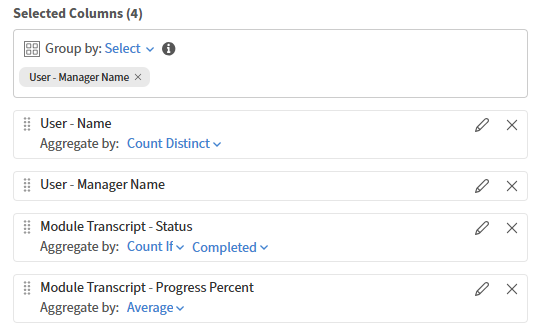
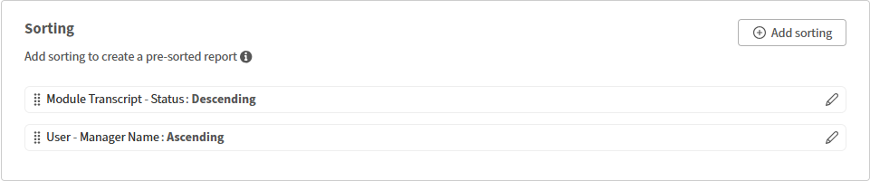

# Report Builder에서 보고서 열 정렬

## 개요

정렬은 다운로드한 보고서 파일의 행 순서를 결정합니다. 일관성 있는 출력이 중요할 때마다 정렬을 적용합니다.

## 정렬 추가

이 예제에서는 가장 높은 완성도를 가진 강의를 찾습니다.

1. Report Builder을 시작하고 **보고서 만들기**&#x200B;를 선택합니다.
2. 보고서의 이름 및 설명을 입력합니다.
3. 다음 열을 선택합니다. <dataset>:<column name>

   * 학습 개체 - 학습 개체 이름
   * 학습 개체 - 학습 개체 상태
   * 학습 개체 - 완료 개수

4. 정렬 섹션에서 **정렬 추가**&#x200B;를 선택합니다.
5. **학습 개체 - 완료 횟수**&#x200B;를 선택합니다.
6. 정렬 순서 선택 - **오름차순** 또는 **내림차순**

   

7. **추가**&#x200B;를 선택합니다.
8. **보고서 저장**&#x200B;을 선택하고 **작업** > **다운로드**&#x200B;를 선택하여 보고서를 다운로드합니다.

다운로드한 보고서에는 모든 기록이 나열되며 강의 완료 횟수별로 정렬됩니다.

## 여러 열 정렬 추가

이 예에서는 관리자 전체의 성과를 측정하는 보고서를 생성합니다.

열을 두 개 이상 기준으로 정렬하려면 다음을 수행합니다.

1. Report Builder을 시작하고 **보고서 만들기**&#x200B;를 선택합니다.
2. 보고서의 이름 및 설명을 입력합니다.
3. 다음 열을 선택합니다. <dataset>:<column name>

   * 사용자 - 이름
   * 사용자 - 관리자 이름
   * 모듈 대본 - 상태
   * 모듈 대본 - 진행률

4. 다음 집계를 추가합니다.

   * 사용자-관리자 이름별 그룹화
   * 고유 사용자 이름 수
   * Count If=COMPLETED Module Transcript - 상태
   * 평균 모듈 대본 - 진행률

   

5. 정렬 섹션에서 다음과 같은 여러 열 정렬을 추가합니다.

   * 모듈 성적 증명서 - 상태: 내림차순
   * 사용자 - 관리자 이름: 오름차순

   

6. **보고서 저장**&#x200B;을 선택하고 **작업** > **다운로드**&#x200B;를 선택하여 보고서를 다운로드합니다.

다운로드된 보고서에는 개별 학습자 수, 상태 기반 등록 수, 평균 진행 백분율을 보여 주는 관리자 수준의 성과 요약이 제공됩니다. 이는 다양한 관리자 그룹의 참여 수준과 교육 진행률을 강조합니다.
