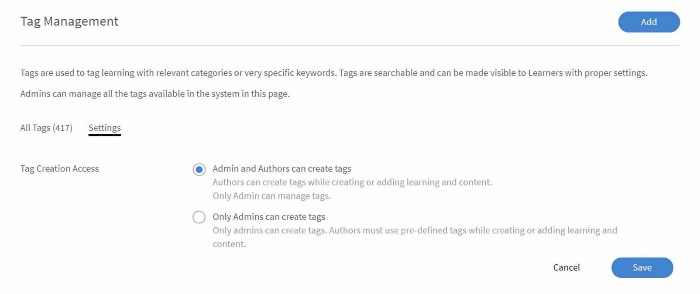

# 태그

이제 책임자는 Learning Manager에서 태그를 관리할 수 있습니다. 더 나은 태그 지정 및 관리 가능한 데이터 베이스를 사용하면 학습자가 더 나은 검색 결과를 빠르게 찾고 적절한 검색 결과를 얻을 수 있습니다. 이 기능을 사용하면 철자가 틀린 중복된 태그 및 관련 없는 태그를 관리할 수 있습니다. 태그를 추가, 편집, 삭제, 추가 또는 바꿀 수도 있습니다.

태그와 연결된 학습 객체 목록은 각 태그 옆에 제공된 개수를 클릭하면 볼 수 있습니다. 목록에는 강의, 학습 프로그램, 인증서, 작업 지원 및 콘텐츠 그룹 수가 표시됩니다. 목록을 보려면 다음 옵션 중 하나를 클릭합니다.

다음을 사용하여 사용량 또는 알파벳 순서에 따라 태그를 정렬할 수 있습니다. **[!UICONTROL 정렬 기준]** 선택 사항입니다.

## 태그 추가/삭제/편집 {#adddeleteedittags}

1. 책임자 권한으로 왼쪽 탐색 창에서 **[!UICONTROL 태그]**. 대상 **[!UICONTROL Tag Management]** 페이지가 열립니다.
1. 새 태그를 추가하려면 **[!UICONTROL 추가]**. 추가 버튼은 페이지의 오른쪽 상단 모서리에 있습니다. 기존 태그가 없는 경우 **[!UICONTROL 추가]** 또한 버튼은 **[!UICONTROL Tag Management]** 페이지.

   여러 태그를 추가할 때는 (,) 또는 (;)를 사용하여 태그를 구분합니다. 태그 이름은 최대 50자를 사용할 수 있습니다.

1. 기존 태그를 삭제하려면 확인란을 클릭하여 태그를 선택합니다. 최대 50개까지의 여러 태그를 선택하여 한 번에 삭제할 수 있습니다. 삭제하려면 다음 단계를 따르십시오.

   * 삭제할 태그를 선택하고 **[!UICONTROL 액션]** 드롭다운 메뉴 > 선택 **[!UICONTROL 삭제]**.

1. 한 번에 하나의 태그만 편집할 수 있습니다. 태그를 편집하려면 다음 단계를 따르십시오.

   * 편집할 태그를 선택하고 > ** 열기[!UICONTROL 액션]**드롭다운 메뉴 > **[!UICONTROL 편집]**.

   대상 **[!UICONTROL 태그 편집]** 대화 상자가 나타납니다. 새 태그 이름을 입력하고 아이콘을 클릭합니다. **[!UICONTROL 저장]**.

   입력한 태그 이름이 이미 있으면 Adobe Learning Manager에 경고 메시지가 표시됩니다. 같은 이름의 태그가 두 개 없을 수 있습니다.

## 태그 바꾸기 {#replacetags}

1. 교체할 태그를 선택합니다. 한 번에 최대 50개의 태그를 선택할 수 있습니다. 열기 **[!UICONTROL 액션]** 드롭다운 메뉴 및 선택 **[!UICONTROL 바꾸기]**.
1. 대상 **[!UICONTROL 태그 바꾸기]** 선택한 태그를 보여주는 대화 상자가 나타납니다.

1. (으)로 **[!UICONTROL 교체된 태그의 이름]** 선택한 태그를 대체할 새 태그의 이름을 입력합니다. 드롭다운에서 기존 태그로 바꾸거나 새 태그를 추가할 수 있습니다.

   세미콜론이나 쉼표는 태그 이름의 일부가 될 수 없습니다.  일부 LO의 일부로 이러한 태그를 사용하는 동안 세미콜론이 없는 태그와 오류 메시지 표시는 마이그레이션 시나리오에서 처리되지 않습니다.

1. 다음을 수행합니다. **[!UICONTROL 바꾸기]**.

## 태그 추가 {#appendtags}

태그에 대한 추가 작업의 경우, 새/기존 태그가 선택된 태그와 연관된 LO 및 콘텐츠 그룹의 모든 목록에 추가됩니다.

1. 추가할 태그를 선택합니다. 한 번에 최대 50개의 태그를 선택할 수 있습니다. 작업 드롭다운 메뉴를 열고 다음을 선택합니다. **[!UICONTROL 첨부]**.
1. 대상  **[!UICONTROL 태그 추가]** 선택한 태그를 보여주는 대화 상자가 나타납니다.
1. 선택한 태그의 이름을 입력하여 모든 학습에 추가 태그를 추가할 수 있습니다. **[!UICONTROL 새 태그]** 기존 태그의 드롭다운 목록에서 선택합니다. 새 태그는 Learning Manager 관련 모든 학습에 추가됩니다.

   세미콜론이나 쉼표는 태그 이름의 일부가 될 수 없습니다. 사용하는 경우 Prime에 오류 메시지가 표시됩니다. 일부 LO의 일부로 이러한 태그를 사용하는 동안 세미콜론이 없는 태그와 오류 메시지 표시는 마이그레이션 시나리오에서 처리되지 않습니다.

1. 다음을 수행합니다. **[!UICONTROL 첨부]**.

## 설정 {#settings}

책임자는 설정 옵션을 클릭하여 작성자에게 태그를 만들 수 있는 권한을 제공할 수 있습니다.

*태그 작성을 위한 설정 페이지*

* 사용자가 태그를 만들 수 있는 권한이 있고 현재 유효하지 않은 기존 태그를 선택할 경우

  선택한 태그가 더 이상 유효하지 않다는 오류 메시지가 나타납니다. 지원되지 않는 문자를 제거하여 새 태그가 생성됩니다. 이 경우 작성자가 저장하기 전에 이전 태그가 새 태그로 변경되는 것을 볼 수 있습니다.

* 사용자에게 새 태그를 만들 수 있는 권한이 없는 경우 선택한 태그가 더 이상 유효하지 않다는 오류 메시지가 나타납니다. 작성자는 관리자에게 문의하여 잘못된 태그를 수정할 수 있습니다.

  작성자는 유효하지 않은 태그를 만들거나 저장할 수 없습니다. 유효하지 않은 태그를 제거하고 기존의 다른 유효한 태그를 추가하여 작업을 계속할 수 있습니다.
