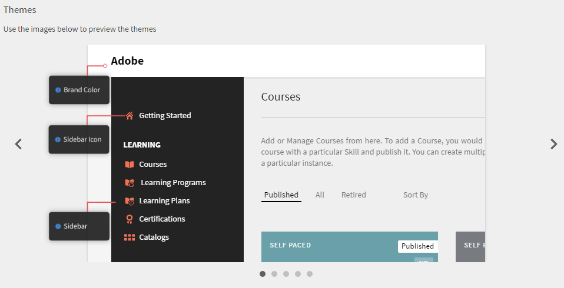
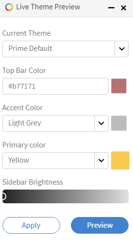

# 색상 테마

Learning Manager의 색상 테마 및 브랜딩

Learning Manager에서는 조직의 브랜딩 요구 사항에 부합하도록 응용 프로그램의 모습을 변경할 수 있습니다.

## 브랜딩 {#branding}

다음을 수행합니다. **[!UICONTROL 브랜딩]** 왼쪽 창에서 조직 이름을 업데이트하고 하위 도메인, 로그 스타일 및 테마를 변경합니다. 다음을 수행합니다. **[!UICONTROL 편집]** 콘텐츠를 수정하려면 각 항목 옆에 추가합니다.

## 로고 스타일링 {#logostyling}

다음을 수행합니다. **[!UICONTROL 편집]** - Learning Manager 응용 프로그램 내 로고의 모양과 회사 이름을 설정합니다.

다음을 수행합니다. **[!UICONTROL 새 로고 업로드]** 컴퓨터에서 업로드할 로고를 선택합니다. 아래에서 로고 모양과 조직 이름을 미리 볼 수 있습니다. 원하는 머리글 스타일을 선택하고 **[!UICONTROL 저장]**.

## 테마 {#themes}

색상 테마 변경 사항을 응용 프로그램에 적용하기 전에 미리 볼 수 있는 5가지 대표 이미지 세트가 제공됩니다. 미리 볼 이미지의 왼쪽과 오른쪽에 있는 &lt; 및 > 기호를 클릭하여 이러한 이미지를 찾아봅니다. 또는 이러한 이미지 하단에 있는 탐색 원을 클릭하여 미리 보기 스냅샷 세트를 탐색할 수도 있습니다.

**테마 선택**

다음을 클릭합니다. **[!UICONTROL 힌트 표시]** 이 섹션 아래에서 아래와 같이 이미지에 힌트를 표시합니다.

*테마에 대한 힌트 보기*

Learning Manager 응용 프로그램은 사용자에게 5개의 색상 테마 옵션을 제공합니다.

* Prime 기본값
* 조약돌
* 카니발
* 가을
* 겨울 하늘
* 선명함

*테마 색상 사용자 정의*

Prime 기본 테마를 제외하고 테마의 상단 바 색상, 강조 색상(예: 왼쪽 창의 아이콘 색상), 기본 색상, 사이드바 밝기를 사용자 정의할 수 있습니다.

(으)로 **[!UICONTROL 기본 색상]** 피커에서 몰입형 UI에 사용된 색상을 선택할 수 있습니다.

사용자 정의하려면 왼쪽 창에서 테마 유형을 선택하고 브랜드 색상 및 사이드바 아이콘 색상 옆의 사각형을 클릭합니다. 사이드바 밝기에서 사이드바를 클릭하고 앞이나 뒤로 드래그하여 밝기를 조정합니다. 위 이미지에서 이러한 옵션을 수정할 때 미리보기를 확인할 수 있습니다.

다음을 수행합니다. **[!UICONTROL 테마 재설정]** 테마의 원래 설정을 복원합니다. 다음을 수행합니다. **[!UICONTROL 저장]** 변경 완료 후.

**실시간 미리 보기**

다음을 수행합니다. **[!UICONTROL 실시간 미리 보기]** 테마 섹션의 왼쪽 하단 모서리 팝업이 아래와 같이 나타납니다.

*실시간 미리 보기 팝업*

드롭다운 목록에서 원하는 테마를 선택하고 설정을 조정한 다음 클릭합니다. **[!UICONTROL 미리 보기]** 라이브 로 변경 내용을 볼 수 있습니다. 이제 애플리케이션의 모든 기능을 살펴보고 변경 사항을 확인할 수 있습니다. 실시간 미리 보기를 진행하는 동안 역할을 변경할 수도 있습니다. 변경이 만족스러우면 라이브 테마 미리 보기 팝업 기능으로 돌아가 다음을 클릭할 수 있습니다. **[!UICONTROL 테마 적용]**.

변경 내용을 실시간으로 미리 보는 동안 실시간 테마 미리 보기 팝업이 화면 하단에 계속 나타납니다. 팝업을 최소화하도록 선택할 수 있습니다.

## 계정 사용자 정의 {#customize}

Adobe Learning Manager를 사용하면 계정을 사용자 정의하여 향상된 사용자 경험을 제공할 수 있습니다.

아래 목록은 사용자 정의할 수 있는 구성 요소를 표시합니다. 계정을 사용자 정의하려면 Learning Manager에 문의하십시오  [지원](mailto:captivateprimesupport@adobe.com).

<table>
 <tbody>
  <tr>
   <td>
    
<b>사용자 정의</b>
</td>
   <td>
    
<b>권장 사항</b>
</td>
  </tr>
  <tr>
   <td>
    
교육 카드 색상 사용자 정의
</td>
   <td>
    
 

    <ul>
     <li>최대 12가지 맞춤형 색상만 가능합니다. </li>
     <li>색상은 모든 학습 객체에 적용됩니다. 색상은 모든 학습 객체(교육)에 순차적으로 적용되며 모든 색상에 #ffffff 같은 16진수 색상 코드 형식을 사용해야 합니다.</li>
     <li>하나의 색상만 제공되는 경우 해당 색상이 모든 학습 객체에 적용됩니다.</li>
    </ul>
    
 
</td>
  </tr>
  <tr>
   <td>
    
커서 포인터 이미지
</td>
   <td>
    
사용자 정의 이미지는 사용자가 학습 개체를 가리킬 때 나타납니다. 

    <ul>
     <li>적용된 사용자 설정 이미지는 사용자가 마우스를 Learning Manager 웹 페이지 위에 놓으면 표시됩니다. </li>
     <li>권장 크기 - 16x16 또는 24x24픽셀</li>
     <li>권장 이미지 형식 - PNG, JPG</li>
    </ul></td>
  </tr>
  <tr>
   <td>
    
진행률 아이콘 이미지
</td>
   <td>페이지 사이를 탐색하는 동안 표시됩니다. '4-square' 진행 gif가 보이는 위치에 표시됩니다. 
    <ul>
     <li>권장 크기 - 32x32px 이하</li>
     <li>권장 이미지 형식 - GIF, PNG, JPG</li>
    </ul>
    
 
</td>
  </tr>
  <tr>
   <td>
    
글꼴
</td>
   <td>
    
글꼴을 적용하려면 CDN은 필수입니다. 적용할 글꼴 모음도 공유해야 합니다.

    
<b>참고:</b> 글꼴 모음은 모든 브라우저에서 지원되어야 합니다.
</td>
  </tr>
  <tr>
   <td>
    
배경 이미지
</td>
   <td>
    
배경 이미지는 학습자 역할에서만 표시됩니다. 

    
학습자의 배경에 적용해야 하는 이미지가 있어야 합니다.

    <ul>
     <li><b>권장 이미지 형식:</b> PNG, JPG, JPEG</li>
     <li><b>권장 크기: </b>1400x908픽셀</li>
    </ul></td>
  </tr>
 </tbody>
</table>

## 추천 설정 구성 {#configurerecommendationsettings}

켜기 **브랜딩** > **일반**, 내부 및 외부 학습자에 대한 추천 범위를 구성하고 학습자가 학습자 홈페이지에서 스킬을 선택하도록 할 수 있습니다.

에 **일반** 페이지에서 다음과 같은 옵션을 사용할 수 있습니다.

<table>
 <tbody>
  <tr>
   <td>
    
학습자 홈페이지
</td>
   <td>
    
다음 중 하나를 선택합니다. <strong>클래식 </strong>또는 <strong>몰입형</strong>. [몰입형]을 선택하면 다른 옵션이 나타납니다.
</td>
  </tr>
  <tr>
   <td>
    
교육 유형 
</td>
   <td>
    
다음 중 하나를 선택합니다. <strong>사용자 정의 </strong>또는 <strong>산업 정렬</strong>. 학습자가 1,000명 미만인 경우 전체 계정이 하나의 범위로 간주됩니다. 추천은 모든 학습자를 기반으로 합니다. 
</td>
  </tr>
  <tr>
   <td>
    
추천 범위 설정 
</td>
   <td>
    
하나 이상의 활성 필드를 선택합니다. 대상 <strong>사용자 정의</strong>, 최대 한 개의 활성 필드를 선택할 수 있습니다. 대상 <strong>산업 정렬</strong>, 최대 다섯 개의 활성 필드를 선택할 수 있습니다. 
</td>
  </tr>
  <tr>
   <td>
    
학습자가 관심 영역을 탐색할 수 있도록 활성화
</td>
   <td>
    
클래식 경험에만 해당됩니다. 선택 <strong>예 </strong>또는 <strong>아니요</strong>. 
</td>
  </tr>
  <tr>
   <td>
    
사용자에게 관심 영역(스킬)을 선택하라는 메시지 표시  
</td>
   <td>
    
몰입형 경험에 대해서만 적용됩니다. 선택 <strong>예</strong> 또는 <strong>아니요</strong>. 
</td>
  </tr>
 </tbody>
</table>
