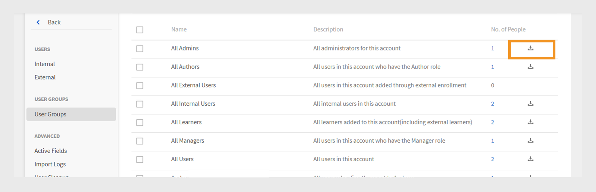

# Adobe Learning Manager의 사용자 그룹

Adobe Learning Manager의 사용자 그룹을 사용하면 부서, 위치 또는 역할과 같은 일반적인 속성을 기반으로 학습자를 구성할 수 있습니다. 사용자를 그룹화하면 한 번에 여러 사용자에게 강의를 할당하고, 권한을 관리하고, 학습 진행률을 추적할 수 있습니다.

>[!INFO]
>
>이 ALM Academy 교육을 통해 이름, 이메일 ID 및 여러 자동 생성된 사용자 그룹을 결합하여 사용자 그룹을 만드는 방법을 살펴보십시오.   

## 사용자 그룹 유형

Adobe Learning Manager은 다음 사용자 그룹을 지원합니다.

1. **자동 생성된 사용자 그룹:** Adobe Learning Manager에서 시스템은 사용자 역할 및 특성을 기반으로 일부 사용자 그룹을 자동으로 만듭니다. 이러한 시스템 정의 그룹에는 모든 작성자, 모든 관리자, 모든 학습자 및 모든 관리자가 포함됩니다. Adobe Learning Manager은 이러한 그룹을 생성하여 역할별로 사용자를 구성합니다. 이러한 시스템 정의 그룹의 이름을 바꾸거나 삭제할 수 없습니다.

2. **사용자 정의 사용자 그룹:** 관리자는 Adobe Learning Manager에서 사용자 정의 사용자 그룹을 만들어 특정 기준에 따라 학습자를 구성할 수 있습니다. 이러한 그룹은 동적이며 정의된 조건을 충족하는 사용자를 자동으로 추가합니다. 사용자 정의 그룹을 사용하면 대상 학습 경로를 할당하고, 사용자 정의 브랜딩을 적용하고, 집중된 보고서를 생성할 수 있습니다. 학습 환경을 관리하고 개인화하기 위한 유연한 도구입니다.

## 사용자 정의 사용자 그룹 만들기

관리자는 정의된 속성을 기반으로 사용자를 구성하기 위해 수동으로 사용자 그룹을 만듭니다. 이러한 그룹은 지정된 기준을 충족하는 사용자를 자동으로 추가함으로써 동적일 수 있습니다. 사용자 그룹은 학습 경로 할당, 사용자 정의 브랜딩 적용, 대상 보고서 생성 등의 작업을 간소화합니다.

사용자 정의 사용자 그룹을 만들려면 다음을 수행하십시오.

1. 관리자 홈페이지에서 **사용자**&#x200B;를 선택합니다.
2. **사용자 그룹**&#x200B;을 선택한 다음 **추가**&#x200B;를 선택합니다.

   
   _사용자 그룹 페이지에서 새 사용자 그룹을 추가하는 단추_

3. 그룹 이름과 설명을 입력합니다.

   
   _그룹 이름 및 설명(옵션)을 입력하는 입력 필드_

## 사용자 그룹에 사용자 추가

관리자는 다음 두 가지 방법으로 사용자 그룹에 사용자를 추가할 수 있습니다.

### 사용자 섹션

관리자는 포함 및 제외 세트를 사용하여 사용자 섹션에서 사용자 또는 사용자 그룹을 추가하거나 제거할 수 있습니다.

* **포함 집합** 사용자 지정 사용자 그룹에 사용자를 추가합니다. 하나 이상의 사용자 그룹을 포함할 수 있으며 Adobe Learning Manager은 논리(AND/OR)를 사용하여 포함할 사용자를 결정합니다. AND/OR 논리에 대한 자세한 내용은 이 [섹션](#_Inclusion_and_exclusion)을 참조하세요.
* **제외 집합**&#x200B;은(는) 사용자가 포함 집합에 속하더라도 그룹에서 사용자를 제거합니다. 이렇게 하면 그룹의 사용자 목록이 구체화됩니다.

그룹에 사용자를 추가하려면 다음을 수행합니다.

1. **학습자 포함** 필드에서 사용자 또는 기존 사용자 그룹을 검색하고 선택합니다.

_사용자 정의 사용자 그룹에 특정 사용자 또는 그룹을 추가하기 위한 포함 설정_

### 이메일 ID 섹션

1. 사용자를 그룹에 추가하려면 사용자 이메일 주소를 쉼표로 구분된 세미콜론 또는 줄바꿈 형식으로 입력합니다.

2. **전자 메일 Id 확인**&#x200B;을 선택합니다.

   
   _이메일 ID 유효성 검사를 선택하여 입력한 이메일 ID를 확인합니다_

   Adobe Learning Manager에 전자 메일 ID가 없거나 전자 메일 ID가 잘못된 경우 오류가 표시됩니다.

   
   _그룹에 사용자를 추가하기 위해 여러 전자 메일 주소를 수동으로 입력하는 필드_

3. **저장**&#x200B;을 선택하여 그룹을 만듭니다.

## 그룹에서 사용자 제외

관리자는 특정 사용자가 그룹의 기준을 충족하더라도 사용자 그룹에서 제외할 수 있습니다. 이는 특정 사용자가 할당된 강의를 받지 못하거나 해당 그룹에 연결된 보고서에 나타나지 않도록 하는 등의 예외를 만들려는 경우 유용합니다.

사용자 정의 사용자 그룹을 만들 때 특정 사용자 또는 전체 사용자 그룹을 제외하려면 다음을 수행합니다.

1. **사용자 그룹**&#x200B;을 선택한 다음 **추가**&#x200B;를 선택합니다.
2. **학습자 제외** 섹션으로 이동합니다.
3. 제외할 사용자 또는 그룹을 선택합니다.

_사용자 지정 그룹에서 사용자 또는 그룹을 제거하는 제외 설정_

## 그룹 멤버 보기

관리자는 이름, 이메일 ID 및 상태와 같은 세부 정보를 포함하여 사용자 그룹의 사용자 목록을 볼 수 있습니다. 사용자 목록을 보려면 다음을 수행합니다.

1. **사용자**&#x200B;를 선택한 다음 **사용자 그룹**&#x200B;을 선택합니다.
2. 그룹을 선택한 다음 **No에서 값을 선택합니다. 사용자** 열

_선택한 사용자 그룹에 현재 포함된 사용자 목록_

_선택한 사용자 그룹에서 사용할 수 있는 사용자 목록_

## 그룹 멤버 다운로드

관리자는 그룹 구성원 목록을 다운로드하여 이름, 이메일, 상태, 추가 날짜(UTC 시간대), 삭제 날짜(UTC 시간대) 및 마지막 로그인 날짜(UTC 시간대)를 포함한 사용자 세부 정보를 검토할 수 있습니다. 이렇게 하면 그룹 구성원을 추적, 보고 및 감사하는 데 도움이 됩니다.

1. **사용자**&#x200B;를 선택한 다음 **사용자 그룹**&#x200B;을 선택합니다.
2. 보고서를 CSV 파일로 내보내려면 그룹 옆에 있는 다운로드 아이콘을 선택합니다.

_그룹 구성원 데이터를 CSV 파일로 내보내는 다운로드 아이콘_

다음은 그룹 구성원 보고서의 열입니다.

* **이름**: 사용자의 이름
* **전자 메일**: 사용 전자 메일 ID
* **상태**: 사용자의 상태(등록됨 또는 등록되지 않음)입니다.
* **추가된 날짜(UTC 시간대)**: 사용자가 UTC 시간대로 추가된 날짜.
* **삭제 날짜(UTC 시간대)**: 사용자가 UTC 시간대에서 삭제된 날짜입니다.
* **마지막 로그인 날짜(UTC 시간대)**: 사용자가 UTC 시간대로 마지막으로 로그인한 날짜입니다.

_샘플 CSV에는 사용자 세부 정보가 포함되어 있습니다._

## 사용자 그룹 편집

관리자는 그룹을 편집하여 이름, 설명 또는 기타 세부 정보를 변경할 수 있습니다.

사용자 그룹을 편집하려면 다음을 수행합니다.

1. 관리자 홈 페이지에서 **사용자**&#x200B;를 선택합니다.
2. **사용자 그룹**&#x200B;을 선택합니다.
3. 편집할 사용자 그룹을 선택합니다.
4. 이름, 설명 또는 기타 세부 정보를 업데이트하는 등 필요한 변경 작업을 수행합니다.
5. **저장**&#x200B;을 선택하여 변경 내용을 적용합니다. 변경 사항이 사용자 그룹에 적용됩니다.

_사용자 그룹 이름, 설명 또는 멤버십 규칙을 수정하는 필드_

## 사용자 그룹 삭제

관리자는 더 이상 그룹 목록을 구성하고 최신 상태로 유지할 필요가 없는 사용자 그룹을 삭제할 수 있습니다.

사용자 그룹을 삭제하려면 다음을 수행합니다.

1. **사용자**&#x200B;를 선택한 다음 **사용자 그룹**&#x200B;을 선택합니다.
2. 삭제할 그룹을 선택합니다.
3. **작업**&#x200B;을 선택한 다음 **삭제**&#x200B;를 선택합니다.

   
   _사용자 그룹을 제거하려면 [동작] 메뉴에서 옵션을 삭제하십시오_

4. 메시지가 표시되면 삭제를 확인합니다. 사용자 그룹이 삭제됩니다.

## 사용자 그룹 보고서 다운로드

Adobe Learning Manager의 사용자 그룹 보고서는 관리자와 관리자에게 부서, 역할 또는 외부 파트너와 같은 다양한 사용자 그룹의 성과에 대한 통찰력을 제공합니다. 이러한 보고서를 통해 그룹 간 비교를 통해 학습 진행률, 강의 완료율 및 참여 수준을 평가할 수 있습니다.

보고서를 다운로드하려면 다음을 수행하십시오.

1. **사용자**&#x200B;를 선택한 다음 **사용자 그룹**&#x200B;을 선택합니다.
2. **작업**&#x200B;을 선택한 다음 **사용자 그룹 보고서 다운로드**&#x200B;를 선택합니다.

_작업 메뉴에서 그룹 수준 정보 및 메타데이터를 다운로드하는 옵션_

이 보고서에는 다음이 포함됩니다.

| 열 | 설명 |
|---|---|
| 사용자 그룹 유형 | 자동 생성 또는 사용자 정의 그룹과 같은 사용자 그룹의 범주입니다. |
| 이름 | 사용자 그룹에 할당된 이름입니다. |
| 설명 | 사용자 그룹의 목적 또는 범위에 대한 간단한 설명 |
| 제작자 (이름) | 그룹을 만든 관리자의 전체 이름입니다. |
| 제작자(이메일) | 그룹을 만든 관리자의 이메일 주소입니다. |
| 제작일(UTC 시간대) | 그룹을 만든 날짜 및 시간으로, UTC(협정 세계시)로 표시됩니다. |
| 사용자 수 | 현재 그룹에 포함된 총 사용자 수입니다. |

_사용자 그룹 보고서에 모든 필드가 포함되어 있습니다_

## 사용자 정의 사용자 그룹을 만들기 위한 포함 및 제외 규칙

자동 생성되거나 기존 사용자 그룹을 추가하여 **사용자 지정 사용자 그룹**&#x200B;을 만들 때 Adobe Learning Manager은 **AND/OR 논리**&#x200B;를 기반으로 특정 **포함 및 제외 규칙**&#x200B;을 적용합니다. 이러한 규칙은 사용자 그룹이 포함 및 제외 세트에서 결합되는 방법에 따라 다릅니다.

하나 이상의 자동 생성된 사용자 그룹을 포함 집합에 추가할 수 있습니다. 적용되는 논리는 이러한 그룹을 선택하는 방법에 따라 다릅니다.

### 사용자 그룹에서 AND 논리 사용

동일한 포함 집합 내에서 여러 사용자 그룹을 선택하는 경우 사용자는 모든 조건을 충족해야 포함됩니다.

For example,

* 영업팀 그룹: 120명의 사용자
* 위치 (Bangalore) 그룹: 80 사용자
* **모두** 그룹의 일반 사용자: 40명

Adobe Learning Manager은 AND 논리를 사용하여 40명의 사용자만 있는 그룹을 만듭니다. 이들 사용자는 영업 팀의 일원이며 Bangalore에 위치해 두 조건을 모두 충족합니다.

_AND 논리를 사용하여 결합된 여러 그룹 표시 예_

### 사용자 그룹에서 OR 논리 사용

별도의 포함 집합에 사용자 그룹을 추가하면 모든 조건을 충족하는 사용자가 포함됩니다. For example:

* 영업팀 그룹: 120명의 사용자
* 위치 (Bangalore) 그룹: 80 사용자
* 두 그룹 중 하나의 총 사용자 수: 160명(일부 사용자가 두 그룹 모두에 있을 수 있음)

OR 논리를 사용하면 Adobe Learning Manager에서 영업팀에 있거나 벵갈루루에 있는 사용자를 추가합니다. 이는 두 조건 중 하나에 일치하는 사용자를 포함한다는 것을 의미합니다. 그 결과 중복을 제거한 후 그룹에는 160명의 사용자가 포함됩니다.

_OR 논리를 사용하여 결합된 여러 그룹 표시 예_

