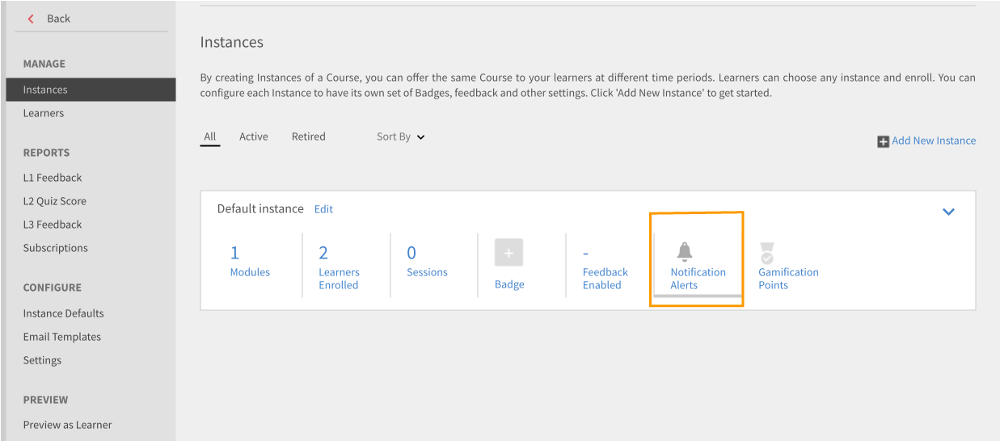

# 알림

알림 기능은 Adobe Learning Manager의 모든 사용자에게 적용됩니다. 그러나, 역할에 따라 각 사용자는 다양한 시나리오에 대한 각기 다른 알림을 받습니다. 사용자에게 온 모든 경보 및 알림은 알림 팝업 대화 상자를 통해 표시됩니다.

## 액세스 알림 {#accessnotifications}

사용자는 창의 오른쪽 상단 모서리에 있는 알림 아이콘을 클릭하여 알림을 볼 수 있습니다. 이 팝업 대화 상자에는 모든 알림의 강조 표시와 함께 스크롤 막대가 나타나는 시간이 표시됩니다. 모든 알림에 대한 자세한 내용을 보려면 팝업 대화 상자의 맨 아래에 있는 &#39;모든 알림 표시&#39;를 클릭합니다. 알림 페이지가 나타납니다.

알림 아이콘 위에 있는 강조 표시된 숫자를 통해 최신 알림의 수를 알 수 있습니다. 예를 들어 마지막으로 로그인한 후 5개의 알림이 왔다면, 알림 아이콘 위에 표시된 숫자 5를 볼 수 있습니다. 이 숫자는 최신 알림을 전부 읽으면 사라집니다.

## 관리자 알림 유형 {#typesofnotificationsforadministrators}

관리자는 다음 인스턴스에 대한 알림을 받게 됩니다.

* 사용자의 csv 목록 업로드가 성공할 때마다 알림을 받습니다.
* 사용자의 csv 목록 업로드가 실패할 때마다 알림을 받습니다. 관리자는 실패의 이유에 대한 메시지를 받습니다.
* 관리자는 강의 및 학습 프로그램에 대한 인스턴스 레벨 알림 경보를 설정할 수 있습니다. 이러한 경우 관리자는 인스턴스 레벨에서 선택된 빈도에 따라 알림을 받게 됩니다.

>[!NOTE]
>
>책임자에게 책임자 역할뿐만 아니라 작성자 또는 관리자 권한이 있다면, 책임자는 역할마다 알림을 받게 됩니다.

관리자 역할에 관한 샘플 알림 창을 다음 스크린샷에서 볼 수 있습니다.

*관리자 알림 보기*

이 팝업 창에는 모든 알림의 강조 표시와 함께 발생 시간 및 스크롤 막대가 표시됩니다. 알림 아이콘 위에 있는 강조 표시된 숫자를 통해 최신 알림의 수를 알 수 있습니다. 예를 들어 마지막으로 로그인한 후 5개의 알림이 왔다면, 알림 아이콘 위에 표시된 숫자 5를 볼 수 있습니다. 이 숫자는 최신 알림을 전부 읽으면 사라집니다.

다음을 수행합니다. **[!UICONTROL 모든 알림 표시]** 알림 팝업 창의 하단에 있는 링크를 통해 별도의 페이지에서 모든 알림을 확인할 수 있습니다. 알림 페이지에서 다음을 확인할 수 있습니다.

* **모든 알림**: 여기에서 모든 알림 보기
* **보류 중**: 여기서 보류 중인 알림을 봅니다.
* **토론**: 강의를 검색하여 토론이 진행되는 것을 확인합니다.

## 다중 레벨 에스컬레이션 알림 설정 {#setupmultilevelescalationnotifications}

학습자가 기한을 넘겼을 때 에스컬레이션 전자 메일을 관리자와 스킵 관리자에게 전송할 수 있습니다. 강의를 생성할 때 강의 미완료에 대한 다중 레벨 에스컬레이션 알림을 설정할 수 있습니다. 강의 생성이 끝난 후에도 설정할 수 있습니다. 에스컬레이션 알림이 정해진 빈도에 따라 관리자와 스킵 관리자에게 전송되도록 설정할 수 있습니다.

1. 관리자 또는 작성자로 로그인하여 &#39;강의&#39;를 클릭합니다.
1. 에스컬레이션 알림을 수정하려는 강의를 선택하고 을 클릭합니다. **[!UICONTROL 강의 보기]**.

   

   *강의 보기 옵션을 선택합니다.*

1. 클릭 **[!UICONTROL 인스턴스]** > **[!UICONTROL 알림 경고]**.

   

   *알림 경고 옵션을 선택합니다.*

1. 강의의 기한이 빨간색으로 강조 표시된 달력이 열립니다. 학습자에게 알림 메시지가 설정되어 있는지 보려면 강조 표시된 날짜를 클릭합니다.

   

   *기한 미리 알림 보기*

1. 기한 이전의 날짜를 선택하여 알림 메시지를 설정합니다. 이렇게 하면 예정된 기한에 대해 학습자에게 알림 메시지를 설정할 수 있습니다.

   

   *기한 알림 날짜 설정*

1. 기한 이후의 날짜를 선택하여 학습자를 위한 알림 메시지 일정 및 관리자의 에스컬레이션 알림을 설정합니다.

   

   *알림 메시지 및 에스컬레이션 날짜 설정*

1. 관리자에게 에스컬레이션 후에도 학습자가 강의를 완료하지 못한 경우 설정을 통해 학습자의 건너뛰기 관리자로 에스컬레이션할 수 있습니다. 연장된 기한 이후의 날짜를 클릭하고 미리 알림 되풀이, 예약 일 수를 선택한 다음 다음을 선택합니다. **관리자 및 건너뛰기 수준 관리자** 이미지를 **에스컬레이션** 드롭다운. 파란 체크 표시를 클릭하여 알림 설정을 저장합니다.

   

   *알림 설정 저장*

## 자주 묻는 질문 {#frequentlyaskedquestions}

+++인스턴스에서 알림 메시지를 설정하는 방법은 무엇입니까?

인스턴스에서 &#39;알림 경고&#39;를 클릭합니다. 강의의 기한이 빨간색으로 강조 표시된 달력이 열립니다. 학습자에게 알림 메시지가 설정되어 있는지 보려면 강조 표시된 날짜를 클릭합니다. 이 [섹션](user-notifications.md#Setupmultilevelescalationnotifications)에서 설명한 대로 알림 메시지를 설정합니다.
+++
