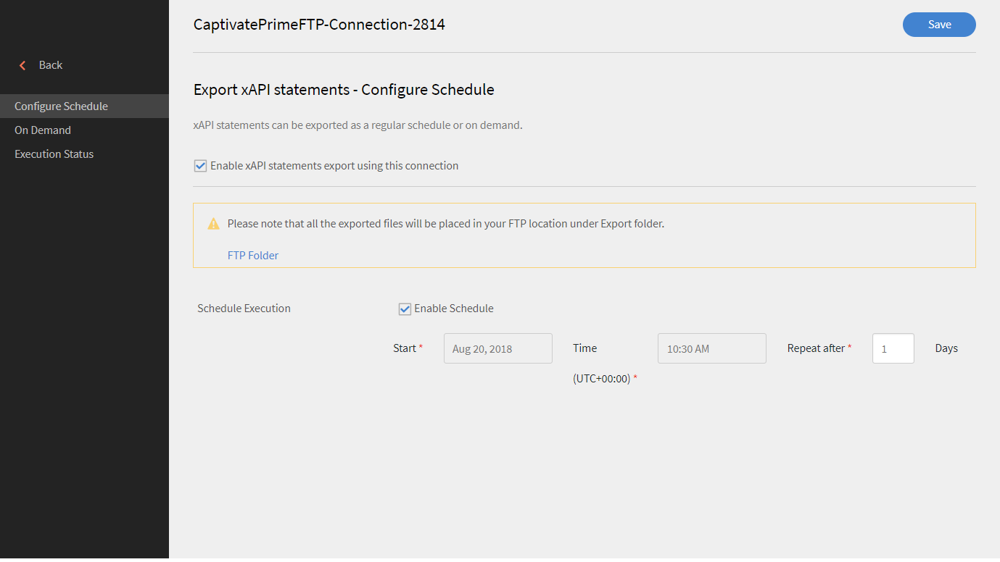

# Learning Manager의 xAPI

## xAPI란 무엇입니까? {#whatisxapi}

경험 API(xAPI)란 모든 유형의 학습 경험을 기록 및 추적하는 방식으로 학습 콘텐트 및 학습 시스템이 소통할 수 있는 e러닝 소프트웨어 사양입니다. 학습 경험은 LRS(학습 기록 저장소)에 기록됩니다. LRS는 LMS(기존 학습 관리 시스템) 내에 존재하거나 자체적으로 존재할 수 있습니다.

xAPI에 대한 자세한 내용은 [xAPIc 사양](https://github.com/adlnet/xAPI-Spec)을 참조하세요.

## Learning Manager가 xAPI를 지원하는 방법은 무엇입니까? {#howdoeslearningmanagersupportxapi}

Learning Manager는 내장된 학습 기록 저장소를 갖고 있습니다. LRS는 Learning Manager에 xAPI의 명령문을 수용하는 완전한 권한이 있습니다. 타사에서 생성한 xAPI 명령문도 수락합니다. 이러한 xAPI 명령문은 Learning Manager 내에 저장되며 Learning Manager 외부로 내보내 타사 데이터 웨어하우징 시스템으로 시각화할 수 있습니다.

## 언제 xAPI를 사용합니까? {#whendoyouusexapi}

여러 시스템에 걸쳐 있는 최종 사용자의 학습 경험을 캡처해야 하는 경우가 늘어나고 있습니다.  교육 콘텐츠와 함께 학습자의 정확한 참여를 추적할 필요성도 존재한다. xAPI는 &#39;시작&#39;, &#39;진행 중&#39; 및 &#39;완료&#39;(SCORM에서 캡처하는 유일한 속성) 전반에서 사용됩니다.

## Learning Manager에서 xAPI 사용 {#usingxapiinprime}

### 응용 프로그램 설정 {#setupyourapplication}

1. 통합 책임자로 로그인합니다. **[!UICONTROL 응용 프로그램 > 등록]**&#x200B;을 선택합니다.

   

   *응용 프로그램을 등록하기 위한 시작 페이지*

1. 새로운 응용 프로그램을 등록합니다.

   

   *새 응용 프로그램 등록*

1. 응용 프로그램의 범위를 정의합니다.

   * **[!UICONTROL 책임자 역할 xAPI 읽기 및 쓰기 액세스]**&#x200B;를 허용하면 책임자가 xAPI 명령문 및 문서를 게시하고 받을 수 있습니다.
   * **[!UICONTROL 학습자 역할 xAPI 읽기 및 쓰기 액세스]**&#x200B;를 허용하면 책임자가 xAPI 명령문 및 문서를 게시하고 받을 수 있습니다.

1. 변경 사항을 저장합니다. 개발자 ID 및 시크릿을 받습니다.

**끝점**:

xAPI swagger 문서를 보려면 아래 링크를 클릭합니다.

[xAPI Swagger 문서](https://learningmanagereu.adobe.com/docs/primeapi/xapi/)

>[!NOTE]
>
>Learning Manager에서 지원되는 xAPI 버전은 1.0.3입니다.


## API 인증 {#apiauthentication}

Learning Manager xAPI는 클라이언트 응용 프로그램 인증 및 승인에 OAuth 2.0 프레임워크를 사용합니다. 응용 프로그램을 등록하면 clientId 및 clientSecret을 가져올 수 있습니다. 브라우저에서는 SSO, Adobe ID 등 사전 구성된 계정을 이용하여 Learning Manager 사용자를 인증하는 Get URL이 사용됩니다.

```
GET https://learningmanager.adobe.com/oauth/o/authorize?client_id=<Enter your clientId>&redirect_uri=<Enter a url to redirect to>&state=<Any String data>&scope=<admin:xapi or learner:xapi>&response_type=CODE.
```

## Learning Manager LO로 xAPI 명세서 추적 {#trackingxapistatementsasprimelo}

이제 작성자는 강의 생성 시 xAPI 모듈을 선택하여 Learning Manager 외부의 사용자 경험을 모니터링할 수 있습니다. 예를 들어 이 기능을 사용하여 강의 수료에 사용된 타사 플랫폼의 사용자 활동을 평가할 수 있습니다.

1. **[!UICONTROL 활동 모듈]**&#x200B;을 만드는 동안 **[!UICONTROL 유형]**옵션에서 팝업 메뉴를 사용하여 **[!UICONTROL xAPI 기반 모듈]**&#x200B;을 선택합니다.

   

   *xAPI 기반 모듈 옵션 선택*

1. IRI를 제공하라는 요청을 받았습니다. 제공되지 않은 경우 Learning Manager에서 자동으로 생성합니다.

   활동에 필요한 IRI는 계정에 대해 고유합니다. 즉, Learning Manager의 두 모듈은 동일한 IRI를 가질 수 없습니다. 다음과 같은 경우 새 IRI가 생성됩니다.

   * xAPI 모듈이 있는 강의가 계정 간에 공유되는 경우.
   * xAPI 모듈이 있는 인증이 반복될 때


   언급된 IRI가 포함된 모든 xAPI 명령문은 위의 모듈에서 추적되며 Learning Manager 보고서에 반영됩니다.

1. 자동 생성된 IRI를 복사하려면 활동 모듈 페이지를 재방문합니다.
1. 모듈을 게시합니다.

**참고 사항:**

* Learning Manager는 현재 다음 항목만 지원합니다   mbox를 식별자로 사용합니다. mboz_sha1, openid , 계정을 포함한 다른 식별자는 지원되지 않습니다.

* stateId 및 profileId는 Learning Manager와 함께 사용되는 UUID입니다.
* PUT 요청은 xAPI 에이전트/프로필, 활동/프로필 및 활동/상태에 대한 문서를 덮어쓰지 않습니다.
* 알 수 없는 그룹은 Actor에서 지원되지 않습니다.
* &quot;related_activities&quot; 매개 변수는 GET 문에서 지원되지 않습니다.
* 매개 변수 format=ids 및 format=canonical은 GET명령어에서 지원되지 않습니다.
* xAPI 명령문을 무효화해도 명령문이 게시될 때 Learning Manager에서 발생한 작업은 실행 취소되지 않습니다.

## 보고서 생성  {#generatereports}

xAPI 보고서는 excel 보고서로 생성할 수 있습니다. 책임자로 **[!UICONTROL &#39;보고서&#39; > &#39;Excel 보고서&#39; > &#39;xAPI 활동 보고서&#39;]**&#x200B;를 엽니다.

다운로드된 보고서는 학습자와 책임자가 어떤 명령문에든 게시한 모든 정보를 불러옵니다.

타사 통합을 위해 FTP 및 Box 커넥터를 사용하여 동일한 보고서를 생성/예약할 수 있습니다. 다음 단계를 따르십시오.

왼쪽 패널에서 **통합 책임자 > FTP/Box 커넥터 열기 > xAPI 활동 보고서 선택**(으)로 로그인합니다. 보고서를 예약/생성하도록 선택합니다.



*보고서 예약 또는 생성*

* xAPI 명령문에서 최대 점수 없이 원시 점수만 전송되면, LT에 퀴즈 점수가 표시되지 않습니다.

* Learning Manager에서 백분율 점수를 얻기 위해 배율이 조정된 점수가 xAPI를 통해 전송됩니다.

## 샘플 보고서 {#samplereport}

[샘플 xAPI 보고서입니다.](assets/xapireport8842560559890766717csv.zip)
