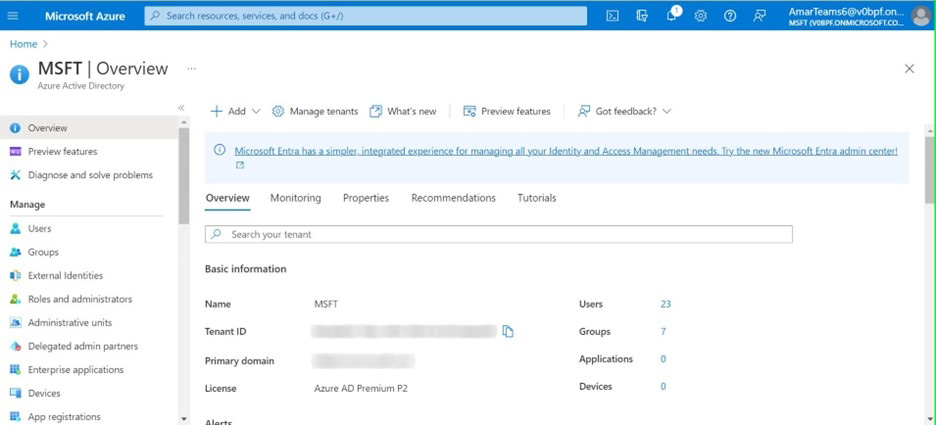

# Microsoft Teams용 Adobe Learning Manager 앱

## 설정 방법

MS Teams에서 ALM을 설정하려면 세 개의 단계가 필요하며 ALM 관리자와 Microsoft Azure 관리자의 도움이 필요합니다. 일부 조직에서는 Azure 관리자와 MS Teams 관리자가 동일한 인물이 아니므로, 추가 MS Teams 관리자도 필요합니다.

**ALM 관리자 - 통합 관리자 역할이 팀 앱을 승인함**

통합 책임자가 MS Teams 앱을 승인하면 MS Teams 앱 스토어에서 Adobe Learning Manager 앱을 사용할 수 있으며 학습자가 액세스할 수 있습니다. 그러나 앱에는 알림, 자동 로그인이 없으며 MS Teams의 학습자를 위해 앱이 고정되지 않습니다.

**Microsoft Azure 관리자가 Azure 대시보드에서 ALM 앱에 대한 권한을 승인함**

Azure 관리자는 ALM 앱에 필요한 권한을 승인해야 합니다. 그러면 ALM 앱에서 MS Teams에 대한 알림 전송 및 자동 로그인이 허용됩니다. 자동 로그인에서는 사용자가 브라우저에서 Adobe Learning Manager에 별도로 로그인하지 않아도 됩니다.

**MS 팀 관리자가 ALM 팀에 대한 정책을 만듭니다**

관리 센터의 MS Teams 관리자는 모든 사용자에 대해 ALM 앱을 고정하고 이것을 전역 정책으로 허용해야 합니다. 회사의 특정 그룹만 ALM을 사용하는 경우, MS Teams 관리자는 반드시 사용자 지정 정책을 선택하고 이를 특정 그룹에만 적용해야 합니다.

## 통합 책임자 역할이 팀 앱을 승인함

아래 단계를 따르십시오.

1. 통합 관리자 앱에서 **[!UICONTROL 응용 프로그램]** > **[!UICONTROL 추천 앱]**&#x200B;을 선택한 다음 **[!UICONTROL ALM 팀 앱]**&#x200B;을 선택합니다.

   
   *ALM 팀 앱 선택*

1. 화면의 오른쪽 상단 모서리에서 **[!UICONTROL 승인]**&#x200B;을 선택합니다.

   
   *앱 설정 페이지에서 승인 선택*

1. 표시되는 대화 상자에서 **[!UICONTROL 확인]**&#x200B;을 선택합니다.

   
   *승인 후 확인 선택*

1. 승인되면 외부 앱 섹션에 &#39;ALM Teams 앱&#39;이 표시됩니다.

   
   *ALM Teams 앱이 앱 페이지에 나타납니다*

이제 사용자는 MS Teams에서 ALM 앱에 액세스할 수 있습니다.

## Microsoft Azure 관리자가 Azure 대시보드에서 ALM 앱 권한 승인

아래 단계를 따르십시오.

1. Azure 관리자는 Azure 대시보드의 Azure Active Directory 관리 섹션으로 이동합니다.

   
   *Azure 대시보드 시작*

1. 별도의 브라우저 창에 다음 링크를 붙여 넣습니다.

   `https://login.microsoftonline.com/<tenantIdTobeReplaced>/oauth2/authorize?client_id=8d349d9f-bf59-4ece-8022-a41e87d81903&response_type=code&redirect_uri=https://learningmanager.adobe.com`

1. 위의 링크에서 `<tenantIdTobeReplaced>`을(를) 아래의 개요 페이지에서 사용할 수 있는 테넌트 ID로 바꾸십시오. 새 URL을 입력합니다.

1. Azure 애플리케이션에 Adobe Learning Manager 앱을 추가합니다.

   
   *Azure에 추가*

1. Enterprise 응용 프로그램 탭을 선택하고 전체 응용 프로그램을 선택합니다. 여기에 나열된 ALMTeamsApp이 표시됩니다.

   
   *ALM 앱 보기*

1. 앱을 클릭하고 권한 탭으로 이동합니다.

   
   *사용 권한 탭 보기*

1. 권한 탭에서 &#39;**[!UICONTROL MSFT에 대한 관리자 동의 부여]**&#39;를 선택하여 ALM 팀 앱 권한을 부여합니다.

   
   *권한 선택*

1. **[!UICONTROL 수락]**&#x200B;을 선택합니다.

   
   *수락 선택*

1. 권한이 부여되면 해당 권한은 ALM 앱에 자동 로그인을 허용하고 MS Teams 앱에서 학습자에게 알림을 보낼 수 있도록 합니다.

   
   *액세스 권한 부여*

## MS Teams 관리자가 Teams 앱의 정책 생성

아래 단계를 따르십시오.

1. MS Teams 관리자는 관리 센터에서 학습자의 Teams 앱에 Teams 앱을 추가하는 정책을 만듭니다.

   
   *정책 만들기*

1. 정책 설정 섹션으로 이동합니다. 전역 정책을 만들고 고정된 앱 하위 섹션에서 **[!UICONTROL 앱 추가]**&#x200B;를 선택합니다.

   
   *정책 추가*

1. 다음 대화 상자에서 **[!UICONTROL Adobe Learning Manager]**&#x200B;를 검색하고, 앱을 추가합니다. 그러면 설치된 앱 섹션에 Adobe Learning Manager이 추가됩니다.

   
   *앱 설치*

1. 이 정책을 저장합니다. 이렇게 하면 조직의 모든 사용자가 앱을 사용할 수 있습니다.

또는 관리자가 전역 정책 대신 사용자 지정 정책을 생성할 수도 있습니다. 해당 사용자 정의 정책에 Adobe Learning Manager을 추가한 다음 Adobe Learning Manager에 액세스해야 하는 사용자 집합에만 사용자 정의 정책을 적용합니다.
