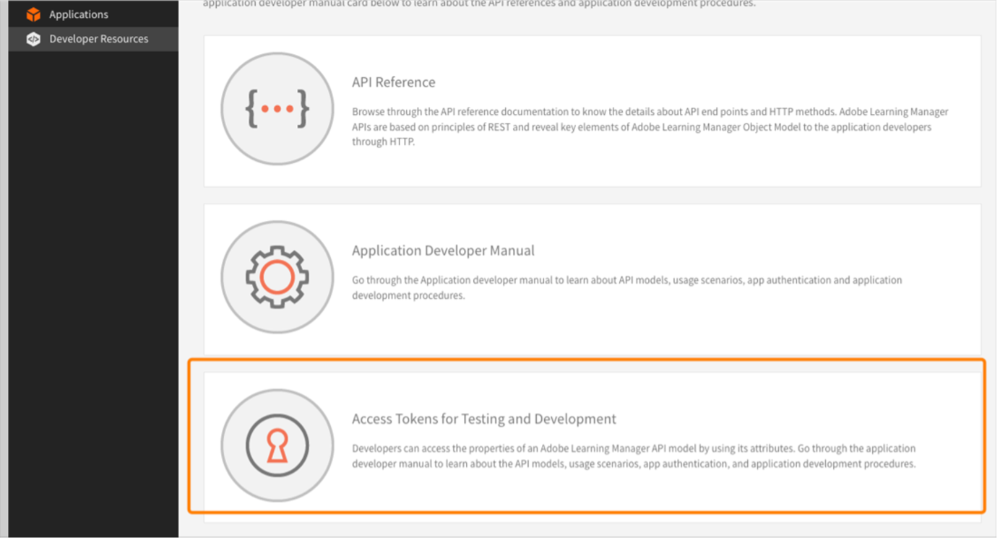

# AEM Sites용 Adobe Learning Manager 참조 사이트(ALM 참조 사이트) 패키지

Adobe Learning Manager(ALM)는 Adobe Experience Manager(AEM) 사이트와 통합됩니다. 이렇게 하면 최소한의 코딩 노력으로 Adobe Learning Manager에 대한 자신의 웹사이트 및 반응형 모바일 인터페이스를 생성할 수 있습니다. 이 통합을 통해 사용자에 대해 사용자 정의된 학습 경험을 만들 수 있습니다.

이러한 경험을 쌓기 위해 ALM은 AEM Sites 인스턴스에 설치할 수 있는 ZIP 파일의 형태로 AEM Sites용 Adobe Learning Manager 참조 사이트 패키지(ALM 참조 사이트 패키지)를 제공합니다.

패키지에는 학습 카탈로그, 포함 가능한 위젯, 달력 등과 같은 포함 가능한 위젯과 함께 AEM Sites 웹 페이지 템플릿 및 웹 사이트 구성 요소가 포함됩니다.

ALM 참조 사이트 패키지를 설치한 후, AEM Sites 인스턴스에서 호스팅할 수 있는 Adobe Learning Manager에 대한 웹 사이트 구축을 시작할 수 있습니다. 그런 다음 사용자는 웹 사이트에 구성 요소를 끌어 놓을 수 있습니다.

ALM 참조 사이트 패키지 설치

## 필수 구성 요소

* AEM Sites 및 Adobe Commerce에 대한 라이선스.
* AEM 온-프레미스 6.5 또는 Adobe Experience Manager - Cloud Service
* Adobe Commerce 2.4.3

AEM Sites 환경을 보호한 후에는 ALM 참조 사이트 패키지를 설치해야 합니다. 이 패키지에는 학습 플랫폼 구성에 도움을 주는 AEM 웹 페이지 및 웹 사이트 구성 요소가 포함되어 있습니다.

참조 사이트 패키지는 [**GitHub 저장소**](https://github.com/adobe/adobe-learning-manager-reference-site/releases/tag/1.0.0).

자세한 내용은 README를 참조하십시오.

## 응용 프로그램 만들기 [!DNL Adobe Learning Manager]

AEM 사이트 패키지를 설치한 후, 학습 포털을 AEM 사이트와 연결하기 위해 ALM 응용 프로그램을 구성해야 합니다.

이 시나리오는 AEM을 [!DNL Adobe Learning Manager].

다음 단계를 따르십시오.

1. 통합 책임자는 **[!UICONTROL 응용 프로그램]**.
1. 새 응용 프로그램을 생성하려면 페이지의 오른쪽 상단 모서리에서 **[!UICONTROL 등록]**.
1. 새 응용 프로그램 등록 화면에서 다음 세부 정보를 입력합니다.

   1. 응용 프로그램 이름: 생성 중인 응용 프로그램의 이름입니다.
   1. URL: 조직의 URL입니다.
   1. 리디렉션 도메인: AEM 웹 사이트의 호스팅 도메인입니다. 또한 와일드카드를 지정할 수 있습니다.
   1. 설명: 응용 프로그램에 대한 설명입니다.
   1. 범위: 학습자 역할 읽기 액세스 및 학습자 역할 쓰기 액세스를 선택합니다.
   1. 이 계정에만 해당합니까?: 기존 ALM 계정에 대한 응용 프로그램을 사용하려면 [예]를 선택합니다.

1. 변경한 다음 저장 을 클릭합니다.

화면에서 응용 프로그램 자격 증명을 적어 둡니다.

*응용 프로그램 자격 증명*

응용 프로그램을 승인하려면 **[!UICONTROL 승인]**.

## 토큰 가져오기

1. 개발자 리소스 탭에서 **[!UICONTROL 테스트 및 개발용 액세스 토큰]**.

   

   *테스트 및 개발용 액세스 토큰 선택*

1. 다음 세부 사항을 입력합니다.

   
   *토큰 세부 정보 입력*

   1. OAuth 코드 받기: 이전 섹션에서 받은 클라이언트 ID를 입력하고 범위를 변경합니다. [제출]을 클릭하여 OAuth 코드를 받습니다.
   1. 새로 고침 토큰 받기: 이전 섹션에서 받은 클라이언트 ID와 비밀번호를 입력합니다. 또한 이전 단계에서 받은 OAuth 코드를 입력합니다. [제출]을 클릭합니다.
   1. 액세스 토큰 받기: 이전 섹션에서 받은 클라이언트 ID와 비밀번호를 입력합니다. 또한 이전 단계에서 받은 새로 고침 토큰을 입력합니다. [제출]을 클릭합니다.
   1. 액세스 토큰 세부 정보 받기: 이전 단계에서 받은 액세스 토큰을 입력합니다. [제출]을 클릭합니다.

1. 다음의 JSON 응답에서 세부 정보를 얻을 수 있습니다. 응답은 액세스 토큰, 새로 고침 토큰, 사용자 역할, 계정 ID, 사용자 ID 및 만료 시간으로 구성됩니다. 새로 고침 토큰을 다시 사용하므로, 적어 두십시오.

## AEM에서 ALM 계정 구성

1. AEM 인스턴스를 실행합니다.
1. [설정] > [Cloud Service]를 클릭합니다.
1. Learning Manager 구성 Adobe 를 클릭합니다.

   
   *Adobe Learning Manager 구성 선택*

1. 만들기 > 구성 폴더를 클릭합니다. 폴더 이름을 지정합니다.

   
   *구성 만들기*

1. 학습 프로젝트에서 만든 구성을 선택합니다.

1. 구성 세부 정보를 입력합니다.

   
   *구성 폴더 만들기*

   1. Adobe Learning Manager 모드: 로그인한 학습자와 로그인하지 않은 학습자 모두에 대해 원하는 학습 환경을 선택합니다.
   1. Adobe Learning Manager URL: 학습 서비스가 호스팅되는 ALM 인스턴스의 URL을 입력합니다.
   1. 계정 ID: ALM 계정의 ID입니다.
   1. 클라이언트 ID, 클라이언트 비밀번호 및 작성자 새로 고침 토큰: ALM에서 응용 프로그램을 만들면서 얻은 자격 증명을 입력합니다.
   1. 위젯 사용자 정의: 자세한 내용은 다음을 참조하십시오. [AEM과 통합](/help/migrated/integrate-aem-learning-manager.md) `.`

1. 구성을 저장하고 닫습니다.

### AEM + Adobe Learning Manager(로그인한/로그인하지 않은 사용자)

Adobe 이제 Learning Manager를 사용하여 계정을 생성하거나 로그인하지 않고도 기존 및 잠재 고객과 파트너에게 제품 및 교육을 공개할 수 있습니다. 이 기능은 학습자에게 제품 특징을 강조하고 홍보하는 빠르고 쉬운 교육 미리 보기를 제공하여 제품 및 교육 채택률을 높이는 데 도움을 줍니다. 따라서 특히 잠재 고객 및 파트너에게 제품 및 오퍼링을 효과적으로 선보여 제품 인지도를 높일 수 있습니다. 액세스의 용이성과 접근성의 편리함은 관심을 높여, 교육 등록 및 학습 채택을 촉구할 수 있습니다.

이 작업 과정을 통해 학습자는 Adobe Learning Manager에 로그인하지 않고 교육을 미리 보거나, 교육 정보에 액세스하거나, 교육을 검색할 수 있습니다. 이 작업 과정은 기본 Learning Manager 인터페이스에는 해당하지 않습니다(AEM Sites 및 기타 헤드리스 인터페이스에만 해당).

**학습 플랫폼 커넥터 구성 및 활성화**

이 섹션에서는 다음 커넥터를 구성하고 활성화하는 데 필요한 단계를 설명합니다.

**교육 데이터 액세스**

이 커넥터를 사용하여 AEM Sites 기반 또는 다른 맞춤 제작된 헤드리스 사용자 인터페이스에서 학습자가 로그인하기 전 또는 후에 교육 정보를 검색하고 학습자에게 렌더링하여 원활한 교육 정보 검색을 실현할 수 있습니다.

이 커넥터는 AEM Sites 기반 또는 기타 헤드리스 인터페이스를 사용하는 경우에만 필요합니다.

커넥터는 교육 메타데이터를 데이터 저장소 및 검색 솔루션뿐만 아니라, 검색 활성화 시스템으로도 내보냅니다. 따라서 AEM Sites 기반 또는 다른 맞춤 제작된 헤드리스 사용자 인터페이스를 구성하고 이러한 두 서비스를 사용하여 교육 데이터를 검색하고, 웹 페이지를 렌더링하고, 학습자에게 최적화된 교육 검색 기능을 제공할 수 있습니다. 예를 들어, 로그인하지 않은 AEM Sites 기반 인터페이스는 내보낸 메타데이터를 사용하여 학습자가 교육 정보를 보여주는 교육 페이지를 검색, 탐색 및 액세스하는 데 유용할 수 있습니다.

이 커넥터를 활성화하여 AEM Sites 기반 웹 페이지를 구축 및 렌더링하고 학습자에게 로그인 전과 후에 사용자 정의된 환경을 제공하십시오. 이 커넥터를 활성화하여 AEM Sites 기반 웹 페이지를 구축 및 렌더링하고 학습자에게 로그인 전과 후에 사용자 정의된 환경을 제공하십시오.

* Adobe Learning Manager cdn 기본 URL - 교육 데이터 액세스 연결 페이지에서 데이터 검색 CDN 서비스 경로의 기본 URL을 입력하십시오.
* 관리자 새로 고침 토큰 - 이전 섹션에서 결정한 새로 고침 토큰을 입력하십시오.
* 교육 메타데이터 기본 URL - 교육 데이터 액세스 연결 페이지에서 검색 활성화 및 검색 데이터 검색 서비스 경로의 기본 URL을 입력하십시오.
* Adobe Learning Manager 등록 URL - 학습자가 교육에 등록하는 데 사용되는 계정의 통합 관리자가 생성한 자체 등록 URL을 입력합니다.

### AEM + Adobe Learning Manager + Adobe Commerce(로그인한/로그인하지 않은 사용자)

Adobe Learning Manager는 이제 학습 플랫폼을 Adobe Commerce과 원활하게 통합하는 데 유용한 솔루션을 제공합니다. 이 릴리스에서는 기본, AEM 사이트 기반 또는 기타 헤드리스 Learning Manager 인터페이스를 Adobe Commerce에 쉽게 연결할 수 있습니다. 이 통합을 통해 학습 플랫폼 내에서 전자상거래 기능을 실현할 수 있습니다. 이제 고객 및 비즈니스 파트너에게 유료 교육을 제공할 수 있을 뿐만 아니라, 기본 및 기본이 아닌 Learning Manager 인터페이스 모두에서 쉽게 교육 구매를 활성화할 수 있습니다. 또한 학습자는 Learning Manager에 로그인하지 않고 Adobe을 미리 보거나, 교육 정보에 액세스하거나, 교육을 검색할 수 있습니다.

사용자는 이미 준비된 AEM 응용 프로그램을 따로 생성할 필요 없이 사용하고 승인할 수 있습니다.

* Adobe Learning Manager cdn 기본 URL - Adobe Commerce 연결 페이지에서 데이터 검색 CDN 서비스 경로의 기본 URL을 입력하십시오.
* Adobe Commerce URL - 사용 중인 Adobe Commerce 인스턴스의 URL을 입력합니다.
* GraphQL 프록시 경로 - 클라이언트측 Learning Manager 구성 요소는 Adobe Commerce GraphQL 엔드포인트에 직접 액세스하므로 CORS 오류가 발생할 수 있습니다. 이 오류를 방지하려면 모든 호출을 AEM과 동일한 엔드 포인트에서 제공하거나 CORS 헤더를 추가하는 프록시를 통해 제공해야 합니다.
* Adobe Commerce 스토어 이름 - 이전 섹션에서 확인한 Adobe Commerce 스토어 이름을 입력합니다.
* Adobe Commerce 고객 토큰 수명(초) - 로그인 세션의 미리 결정된 기간을 나타내는 고객 토큰 수명을 입력하십시오.
* 관리자 새로 고침 토큰 - 이전 섹션에서 결정한 새로 고침 토큰을 입력하십시오.

## 웹 페이지 사용자 정의

AEM 참조 사이트 및 사용 가능한 위젯을 사용하여 웹 페이지를 사용자 정의하십시오.

1. AEM 인스턴스를 실행합니다.
1. [사이트]를 클릭하고 구성 페이지를 엽니다.
1. 다음을 수행합니다. **[!UICONTROL 학습 사이트]** > **[!UICONTROL 언어 마스터]** > **[!UICONTROL 영어]**. 프로젝트의 모든 웹 페이지가 폴더에 포함되어 있습니다.

   
   *모든 웹 페이지 보기*

1. 템플릿을 선택하고 **[!UICONTROL 편집]**.

1. 페이지에서 구성 요소 설정 단추를 클릭하고 구성 요소의 속성을 변경합니다.

   
   *설정 선택 단추*

1. 변경 사항을 미리 보거나 페이지를 게시할 수 있습니다.

## 웹 페이지 만들기

참조 사이트 패키지에서 제공하는 사용할 수 있는 템플릿과 별도로, 템플릿 ibn AEM을 기반으로 웹 페이지를 만들 수도 있습니다.

1. 기본 AEM 페이지에서 [만들기] > [페이지]를 클릭합니다.

1. 사용자 정의할 템플릿을 선택합니다. [다음]을 클릭합니다.

1. 페이지 속성을 입력합니다.

   
   *페이지 속성*

1. 페이지를 만들려면 **[!UICONTROL 만들기]**.

1. 새 페이지를 선택하고 **[!UICONTROL 편집]**.

1. 페이지에 구성 요소를 삽입합니다(예: **학습 - 콘텐츠**.

   
   *사이트별 필터링*

1. 페이지에 표시될 필수 카탈로그 필터를 선택합니다.

## 청사진에서 사이트 만들기

ALM 참조 사이트 패키지는 &#39;학습 사이트 청사진&#39;을 제공하는데, 이를 사용하여 학습 플랫폼에 대한 웹 사이트를 만들 수 있습니다. AEM 청사진을 사용하면 AEM Sites 구성 요소에서 직접 웹 페이지를 구축할 수 있습니다. 템플릿을 사용할 필요가 없습니다.

1. AEM 시작 페이지에서 **[!UICONTROL 사이트]**.

1. 다음을 수행합니다. **[!UICONTROL 만들기]** > **[!UICONTROL 사이트]**.

1. [학습 사이트 청사진]을 클릭합니다.

   

   *청사진에서 사이트 만들기*

1. [다음]을 클릭합니다.

1. 속성 페이지에서 페이지 메타데이터를 입력합니다. [만들기]를 클릭합니다.

   
   *학습 사이트 청사진 선택*

1. [홈] 하이퍼링크를 클릭하여 생성한 사이트의 홈 페이지로 이동합니다. 이 페이지에서 위젯 및 카탈로그 구성 요소를 사용자 정의할 수 있습니다.

## 웹 사이트 코딩

내장 템플릿을 사용하고 WYSIWYG 구성 요소를 사용하여 처음부터 웹 사이트를 만드는 것 외에도 코드를 작성하고 사이트를 구축할 수도 있습니다.

코드는에 있습니다. [참조 사이트 GitHub 저장소](https://github.com/adobe/adobe-learning-manager-reference-site) 시작합니다.

템플릿의 주요 부분은 다음과 같습니다.

* core: OSGi 서비스, 수신기 또는 스케줄러와 같은 모든 핵심 기능뿐만 아니라, 서블릿 또는 필수 필터와 같은 구성 요소 관련 Java 코드를 포함하는 Java 번들.
* ui.apps: 프로젝트의 /apps(및 /etc) 부분(즉, JS&amp;CSS clientlibs, 구성 요소, 템플릿)을 포함합니다.
* ui.content: ui.apps의 구성 요소를 사용하는 샘플 콘텐츠를 포함합니다.
* ui.frontend: React 구성 요소를 포함합니다.

모든 코드는 시작하고 실행하기 위해 repo에 있습니다.

## 기존 웹 페이지 또는 템플릿에 learning manager 구성 요소 가져오기 및 추가

AEM 참조 사이트 패키지를 설치하면 Learning Manager 구성 요소가 AEM Sites 인스턴스에 추가됩니다. 기본적으로 이러한 구성 요소를 기본 제공 웹 프로젝트(웹 사이트) 학습 사이트에 추가할 수 있습니다. 이러한 구성 요소는 학습 사이트 청사진에서 만드는 웹 사이트에서도 사용할 수 있습니다.

그러나 기존 웹 프로젝트 또는 웹 사이트에 새로 추가된 Learning Manager 구성 요소를 사용하려면 다음 절차를 통해 해당 구성 요소를 가져와야 합니다.

1. ALM 참조 사이트 패키지를 설치합니다.

1. 웹 프로젝트를 열고 HTML 파일로 이동합니다(Learning Manager 구성 요소를 추가할 웹 페이지 또는 웹 템플릿용).
1. 회의 참여

   학습 구성 요소가 페이지 렌더링에 나타나기 전에 코드가 실행되도록 HTML 파일을 열고 다음 코드 스니펫을 페이지 구성 요소에 추가합니다.

   *`<sly data-sly-use.configModel="com.adobe.learning.core.models.GlobalConfigurationModel"/>`*
   *`<meta name="cp-config" content="${configModel.config}" />`*

   위 코드는 페이지의 메타 태그에 매핑된 구성을 추가합니다. 이것은 학습 구성 요소를 렌더링하는 데 필요합니다. 자세한 내용은 다음을 참조하십시오. [Adobe Learning Manager 참조 시트](https://github.com/adobe/adobe-learning-manager-reference-site/blob/master/ui.apps/src/main/content/jcr_root/apps/learning/components/page/customheaderlibs.html).

1. 구성을 웹 프로젝트와 매핑했는지 확인하십시오.
1. Learning Manager 구성 요소를 가져올 AEM Sites 템플릿을 엽니다.
1. 템플릿 페이지 편집기에서 [허용된 구성 요소] 컨테이너로 이동하고 **정책**.
1. 정책 페이지에서 속성 > 허용된 구성 요소 로 이동하고 &#39;학습 - 콘텐츠&#39;, &#39;학습 - 양식&#39; 및 &#39;학습 - 구조&#39; 구성 요소를 선택합니다.

다음 절차를 따르면 템플릿이 가져온 Learning Manager 구성 요소의 클라이언트 라이브러리 종속성을 충족할 수 있습니다.

이러한 구성 요소를 포함하는 웹 페이지에서 구성 요소를 성공적으로 렌더링하고 사용하려면 이러한 라이브러리를 로드해야 합니다.

1. 템플릿 페이지 편집기에서 [페이지 정보]를 클릭한 다음 [페이지 정책]을 클릭합니다.
1. [정책] 페이지에서 [속성] > [클라이언트 라이브러리]로 이동하여 다음 항목을 템플릿 페이지에 추가합니다.

   1. learning.site
   1. learning.ui
   1. learning.commerce

이 템플릿을 저장한 후 이 템플릿에서 파생된 모든 웹 페이지에서 Learning Manager 구성 요소를 추가할 수 있습니다.
