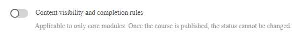
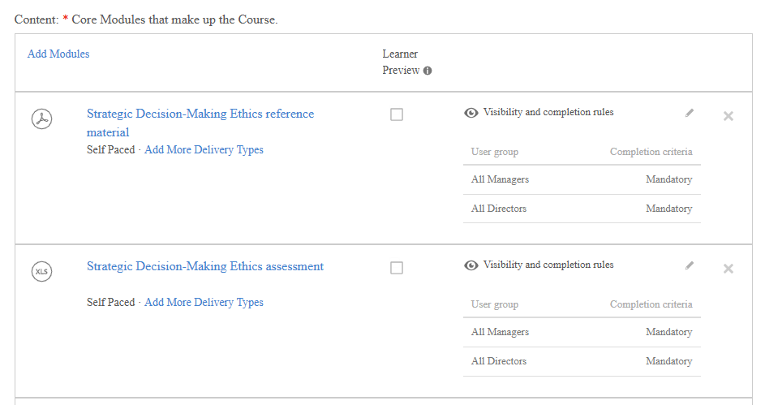

# 작성자를 위한 적응형 강의

## 적응형 강의 생성 및 구성

모듈별 가시성 및 완료 규칙을 통해 다양한 학습자가 사용자 그룹을 기반으로 다양한 콘텐츠를 보고 완료할 수 있는 강의를 구축합니다.

>[!NOTE]
>
>적응형 과정 유형은 계정에 **표시 및 완료 규칙**&#x200B;이 활성화된 경우에만 사용할 수 있습니다. 적응형 강의를 생성하는 옵션이 표시되지 않으면 관리자에게 문의하여 적응형 학습을 활성화하십시오.

### 적응형 과정 만들기

1. 작성자로 Adobe Learning Manager에 로그인합니다.

   

2. 왼쪽 탐색에서 **과정**&#x200B;을 선택합니다. 그런 다음 **추가**&#x200B;를 선택합니다.
3. 강의 이름, 설명 및 기타 세부 정보를 입력합니다.
4. **콘텐츠 표시 여부 및 완료 규칙** 토글을 선택합니다.

   

5. 확인 대화 상자에서 **예**&#x200B;를 선택합니다.

   

   **적응형 강의에 모듈 추가**

   필요한 모듈을 추가합니다. 콘텐츠를 업로드하거나, 콘텐츠 라이브러리에서 선택하거나, 강의실 또는 가상 강의실 세션을 추가하여 콘텐츠 모듈을 추가합니다.

   **적응형 규칙을 지원하는 모듈 유형(콘텐츠 모듈):**

   * 자가 진행식 e-러닝
   * 강의실 세션
   * 가상 강의실 세션
   * 활동 모듈

   **적응형 규칙을 지원하지 않는 모듈 유형:**

   * **사전 작업 모듈:** 핵심 콘텐츠가 시작되기 전에 모든 학습자에게 표시됩니다. 가시성 또는 완료 규칙을 설정할 수 없습니다.
   * **테스트 모듈:** 모든 학습자가 사용할 수 있습니다. 테스트 종료를 완료하면 콘텐츠 모듈 상태에 관계없이 전체 과정이 완료됩니다. 가시성 또는 완료 규칙을 설정할 수 없습니다.
   * **작업 지원:** 등록된 모든 학습자에게 항상 표시됩니다.

6. **추가**&#x200B;를 선택합니다.

### 각 모듈의 가시성 및 완료 규칙 구성

콘텐츠 모듈을 추가한 후 적응형 규칙을 구성합니다.

1. 구성할 모듈을 선택합니다.
2. 모듈 설정에서 **표시 및 완료 규칙** 섹션을 찾습니다.

   

3. **규칙 추가**&#x200B;를 선택하여 이 모듈을 볼 수 있는 사용자 그룹을 추가합니다.

   

   

   이러한 그룹의 학습자는 강의에서 모듈을 확인하지만 필수 사항일 때만 모듈을 완료할 필요가 없습니다.

4. **저장**&#x200B;을 선택합니다.
5. 과정의 모든 콘텐츠 모듈에 대해 반복합니다.

**키 규칙:**

* 여러 사용자 그룹에 속한 학습자는 가장 제한적인 결과를 얻습니다. 그룹이 모듈을 필수적으로 만드는 경우 해당 학습자는 필수적입니다.
* 게시하려면 먼저 하나 이상의 사용자 그룹에 대해 하나 이상의 모듈을 **필수**(으)로 구성해야 합니다. 시스템은 이 조건이 충족될 때까지 게시를 차단합니다.

### 초안 상태의 강의

강의가 초안 상태일 때는 학습자에게 잠기기 전에 전체 적응형 구조를 완전히 설계, 구성 및 조정할 수 있는 단계를 나타냅니다. 이 단계에서 작성자는 강의가 적응형 강의로 작동해야 하는지 일반 강의로 작동해야 하는지 정의할 수 있으며, 이러한 결정은 강의가 게시될 때까지 되돌릴 수 있습니다. 이는 과정의 핵심 적응 특성이 성립하거나 변경될 수 있는 유일한 지점이므로 초안 단계를 중요하게 만듭니다.

초안에서 작성자는 강의 구조를 완전히 제어할 수 있습니다. 모듈을 자유롭게 추가, 제거 및 재배열하여 의도한 학습 흐름을 형성할 수 있습니다. 동시에 각 모듈에 대한 가시성 규칙을 정의하여 적응형 동작을 세분화된 수준으로 구성할 수 있습니다. 이러한 규칙은 특정 모듈에 액세스할 수 있는 사용자 그룹을 결정하므로 강의에서 나중에 개인화된 학습 경험을 제공할 수 있습니다. 작성자는 가시성과 함께 다른 사용자 그룹에 대해 모듈을 필수 또는 옵션으로 표시하는 완료 규칙을 정의할 수도 있습니다. 시스템에서 의미 있는 완료 기준을 확인하려면 최소 하나 이상의 모듈이 필수적입니다.

초안 상태를 사용하면 적응형 논리를 제한 없이 편집할 수도 있습니다. 작성자는 시스템 제한 없이 규칙을 반복적으로 추가, 수정 또는 제거할 수 있으므로 과정을 완료하기 전에 다른 구성을 실험할 수 있습니다. 적응형 설정 외에도 제목 및 설명과 같은 강의 메타데이터와 SCORM 모듈 또는 기타 에셋을 포함한 기본 학습 콘텐츠를 포함하여 모든 표준 강의 요소는 편집 가능한 상태로 유지됩니다.

초안의 적응형 구성은 핵심 강의 모듈에만 적용된다는 것을 이해하는 것이 중요합니다. 사전 작업 또는 테스트 종료 콘텐츠와 같은 기타 구성 요소는 적응형 규칙을 지원하지 않으며 가시성 또는 완료 구성의 영향을 받지 않습니다.

마지막으로 초안 상태는 게시하기 전에 강의 설정을 검증할 수 있는 마지막 기회입니다. 과정이 게시되면 적응형 구성이 영구적으로 유지되므로 되돌릴 수 없습니다.

### 학습자로 미리 보기

**학습자로 미리 보기**&#x200B;를 선택하면 사용자 그룹 규칙과 관계없이 과정의 모든 모듈이 표시됩니다. 이렇게 하면 작성자와 책임자가 강의 구조를 전체적으로 볼 수 있습니다. 프로덕션 학습자는 사용자 그룹이 표시한 모듈만 볼 수 있습니다.

### Publish 적응형 과정

적응형 강의를 게시하는 것은 일반 강의를 게시하는 것과 동일한 워크플로우를 따릅니다.

모든 모듈과 해당 규칙을 구성한 후 **Publish**&#x200B;을(를) 선택합니다.

게시되면 강의를 등록할 수 있습니다. 학습자가 강의를 열면 사용자 그룹에 대해 구성된 모듈만 표시됩니다.

>[!IMPORTANT]
>
>게시되면 강의를 적응형 강의에서 정규 강의로 또는 그 반대로 전환할 수 없습니다. 게시하기 전에 구성을 확인하십시오.

### 게시된 적응형 과정 업데이트

게시된 적응형 강의는 언제든지 업데이트할 수 있습니다. 변경 사항은 거의 실시간으로 등록된 학습자에게 적용됩니다.

적응형 강의에서는 더 이상 가시성 설정을 변경할 수 없습니다. 강의를 자동 적응형 강의로 지정할 수 없습니다.

### 모듈 추가 또는 수정

1. 게시된 과정을 엽니다.
2. **편집**&#x200B;을 선택합니다.
3. 모듈을 추가, 편집 또는 제거하고 가시성 및 완료 규칙을 조정합니다.
4. 과정을 다시 게시합니다.

**영향:**

| 변경 | 등록된 진행 중인 학습자에 대한 효과 |
|---|---|
| 새로운 필수 모듈이 추가됨(학습자의 사용자 그룹에 표시됨) | 완료 요구 사항에 모듈이 추가됩니다. 모듈이 남은 시트가 없는 강의실 또는 가상 강의실 세션인 경우 학습자는 해당 모듈에 대기자 명단에 나열됩니다. |
| 학습자의 사용자 그룹에서 모듈이 제거되었거나 숨겨졌습니다. | 완료 요구 사항에서 모듈이 제거되었습니다. 이것이 마지막 필수 모듈이라면 학습자에 대한 강의가 자동으로 완료됩니다. |
| 학습자의 사용자 그룹에 대한 모듈이 필수에서 선택 사항으로 변경됨 | 모듈이 계속 표시됩니다. 학습자는 강의를 완료하기 위해 더 이상 모듈을 완료할 필요가 없습니다. |
| 새로운 필수 모듈이 추가됨(학습자는 이미 강의를 완료함) | 모듈이 학습자에게 표시되지만 학습자에게 자동으로 시트가 지정되거나 모듈이 액세스되지는 않습니다. 새로 고침 완료가 트리거될 때만 새 모듈에 액세스할 수 있습니다. |

### 인스턴스 전환 동작

적응형 강의의 인스턴스를 전환하는 학습자는 진행 상황을 전달합니다.

* 이미 완료한 모듈은 새 인스턴스에 완료된 상태로 유지됩니다.
* 시트는 새 인스턴스에서 완료되지 않은 보이는 모듈에만 사용됩니다.
* 새 인스턴스에 표시되는 모듈에 사용 가능한 시트가 없는 경우 학습자는 해당 세션의 대기자 명단에 등록됩니다.

## 적응 과정에서 인원 제한 및 대기자 명단 관리

Adobe Learning Manager의 적응형 강의는 개별 강의실 또는 가상 강의실 세션 수준에서 인원 제한을 적용합니다. 전체 세션이 전체 등록을 차단하는 일반 강의와 달리, 적응형 강의는 학습자를 즉시 등록하고 사용 가능한 좌석이 없는 특정 세션에서만 대기를 나열합니다. 학습자는 중단 없이 다른 모든 모듈에 액세스할 수 있습니다.

### 적응형 강의에서 인원 제한이 작동하는 방식

학습자가 강의실 또는 가상 강의실 모듈을 포함하는 적응형 강의에 등록하면 시스템은 사용자 그룹을 기반으로 학습자에게 표시되는 세션에 대해서만 시트 가용성을 확인합니다.

* 보이는 모든 강의실 또는 가상 강의실 세션에 사용 가능한 좌석이 있는 경우 학습자가 등록되고 즉시 전체 액세스 권한을 갖습니다.
* 하나 이상의 보이는 세션에 사용 가능한 좌석이 없는 경우 학습자는 등록되고 해당 특정 세션에만 즉시 대기자 명단에 등록됩니다. 다른 모든 모듈을 즉시 시작하고 진행할 수 있습니다.

다음 표에서는 적응 과정에 대한 모든 시트 및 대기자 명단 시나리오에 대해 설명합니다.

| 등록 시 조건 | 결과 |
|---|---|
| 보이는 모든 CR/VC 세션에 사용 가능한 시트가 있음 | 모든 모듈에 대한 전체 액세스 권한으로 등록됨 |
| 하나 이상의 표시된 CR/VC 세션이 꽉 찼습니다. | 등록됨, 전체 세션에만 대기가 나열됨, 다른 모든 모듈은 즉시 액세스 가능 |
| 학습자가 이미 등록되었습니다. 작성자가 시트가 없는 새로운 필수 CR/VC 세션을 추가합니다. | 학습자가 새 세션에 대기자 명단에 등록됨, 기존 진행 상황 및 액세스는 영향을 받지 않음 |
| 학습자가 등록 취소 | 보류된 모든 좌석이 즉시 해제됨, 다음 대기자 명단에 등록된 학습자가 등록 날짜 순서로 삭제됨 |
| 사용자 그룹 변경은 학습자의 표시 집합에서 세션을 제거합니다 | 즉시 사용 가능한 시트 |
| 학습자가 강의를 완료하고 새로운 필수 CR/VC 세션이 표시됨 | 모듈이 표시되지만 시트가 자동으로 할당되지 않습니다. 학습자가 세션에 액세스하려면 새로 고침 완료를 트리거해야 합니다. |
| 책임자 또는 강사가 시트 할당 | 해당 학습자에 대한 대기자 명단에 등록된 모든 CR/VC 세션이 동시에 지워집니다 |

### 대기자 명단 보기

1. 관리자 보기에서 적응형 강의를 엽니다.
2. **학습자**&#x200B;를 선택합니다.
3. **대기자 명단** 탭을 선택합니다.

대기자 명단 탭에는 하나 이상의 모듈에 대기자 명단에 등록된 학습자가 나열됩니다. 적응형 강의의 경우 보고서는 강의 인스턴스 수준이 아닌 강의 인스턴스 모듈 수준에 있습니다. 학습자가 일부 모듈에서 진행 중일 수 있으며 다른 모듈에서 동시에 대기할 수 있기 때문입니다.

### 대기자 명단 지우기 및 시트 할당

학습자의 등록 취소, 인원 제한 증가 또는 수동 할당으로 인해 좌석을 사용할 수 있게 되면 대기자 명단에 등록된 학습자가 등록 날짜 순서(가장 빠른 등록 날짜가 먼저)에 따라 지워집니다.

한 명 이상의 학습자에게 시트를 수동으로 할당하려면 다음을 수행하십시오.

1. 적응 과정을 엽니다.
2. **학습자** > **대기자 명단** 탭을 선택합니다.
3. 시트를 할당할 학습자 옆의 확인란을 선택합니다.
4. **시트 할당**&#x200B;을 선택합니다.

시트 할당을 선택하면 현재 보고 있는 세션뿐만 아니라 대기자 명단에 등록된 모든 세션의 대기자 목록에서 동시에 선택한 학습자가 지워집니다. 시스템은 학습자에게 시트가 물리적으로 또는 가상으로 배치되었다고 가정합니다.

**대기자 명단 승인 트리거:**

대기자 명단은 다음 중 하나가 발생하면 자동으로 처리됩니다.

* 학습자가 강의에서 등록 취소(진행 중인 모든 세션에서 자리 비움)
* 세션 인원 제한이 증가되었습니다.
* 학습자가 인스턴스를 전환합니다.
* 책임자 또는 강사가 시트 할당

>[!NOTE]
>
>적응형 강의의 새 인스턴스를 만들면 **대기자 명단에 등록된 학습자에게 알림** 옵션을 사용할 수 없습니다. 이는 예상 동작이며 일반 강의와 다릅니다.

일반 강의에서는 인스턴스 레벨에서 대기자 명단이 추적되므로 새 인스턴스가 열릴 때 대기 중인 학습자에게 통지하라는 메시지가 표시될 수 있습니다. 적응형 과정에서 대기자 목록은 인스턴스 수준이 아닌 개별 강의실 또는 가상 강의실 **세션** 수준에서 추적됩니다. 새 인스턴스가 만들어질 때 알림을 보낼 인스턴스 수준 대기 목록이 없으므로 프롬프트가 표시되지 않고 자동 알림이 전송되지 않습니다.

## 적응형 강의에 대한 새로 고침 완료 트리거

Adobe Learning Manager에서 새로 고침 완료 기능을 사용하면 학습 요구 사항이 변경될 때 학습자의 적응 강의 완료 여부를 다시 평가할 수 있습니다. 이는 학습자의 사용자 그룹이 변경되거나, 작성자가 모듈 규칙을 업데이트하거나, 학습자가 현재 프로필에서 적응 강의를 다시 수강하려는 경우에 적용됩니다.

### 새로 고침 완료의 기능

적응형 강의에서 학습자의 필수 모듈 세트는 강의를 완료할 때 사용자 그룹에 의해 결정됩니다. 나중에 사용자 그룹이 변경되거나 작성자가 새로운 필수 모듈을 추가하는 경우, 학습자는 새 프로필의 요구 사항을 충족하기 위해 추가 콘텐츠를 완료해야 할 수 있습니다.

새로 고침 완료는 다음 두 가지 작업을 수행합니다.

1. 이제 학습자의 기존 강의 완료 시 미완료 새 필수 모듈이 있으면 롤백합니다.
2. 업데이트된 완료 요구 사항을 나타내는 새 기록을 학습자 성적 증명서에 만듭니다.

원래 완료 기록은 학습자 성적 증명서에 기록 항목으로 유지됩니다. 이전에 완료한 모듈은 완료된 상태로 유지됩니다. 이전에 표시되지 않았거나 완료되지 않은 새로운 필수 모듈이 아니라면 학습자는 이를 반복할 필요가 없습니다.

### 새로 고침 완료가 적용되는 경우

**시나리오 1: 사용자 그룹 변경으로 새 필수 모듈이 추가됨**

학습자가 적응형 강의를 완료합니다. 해당 사용자 그룹은 나중에 변경되며, 새 사용자 그룹은 이전에 숨겨진 모듈 또는 선택적 모듈을 필수 항목으로 지정합니다.

* 기존 완료 항목은 학습자 성적 증명서에 남아 있습니다.
* 학습자에게 완료되지 않은 새 필수 모듈이 있으면 새 학습자 성적 증명서 행이 생성되고 강의가 진행 중으로 표시됩니다.
* 학습자는 새로운 완료를 위해 새로운 필수 모듈을 완료해야 합니다.

**시나리오 2: 사용자 그룹 변경으로 인해 새 필수 모듈이 없습니다.**

학습자가 적응형 강의를 완료합니다. 사용자 그룹이 변경되지만 기존 완료에서 새 사용자 그룹의 요구 사항이 이미 충족되었습니다.

* 강의가 완료 상태로 유지됩니다.
* 새로운 학습자 성적 증명서 행이 생성되지 않습니다.
* 학습자의 조치가 필요하지 않습니다.

**시나리오 3: 학습자가 시작한 다시 촬영**

이미 적응 강의를 완료한 학습자는 현재 사용자 그룹 프로필에서 해당 강의를 다시 수강하여 완료하도록 선택할 수 있습니다. 이는 최초 완료 이후 학습자의 역할이 변경된 경우 유용합니다.

1. 학습자가 완료된 적응 과정을 엽니다.
2. 학습자는 강의를 다시 수강하거나 다시 시작할 수 있는 옵션을 선택합니다.
3. 현재 사용자 그룹을 사용하여 강의를 다시 평가하고 새로운 필수 모듈 세트를 결정합니다.
4. 새로운 학습자 성적 증명서 행이 생성됩니다.

**시나리오 4: 모듈 동작 테스트**

학습자가 새로 고침 완료가 트리거되기 전에 테스트 아웃 모듈을 완료한 경우 새로 고침 후에도 테스트 아웃 완료 상태가 유효합니다. 시스템에서 강의 완료(모든 모듈 완료 또는 학습자 동작으로 트리거됨)를 평가하면, 이제 필수 콘텐츠 모듈이 추가로 필요하고 미완료인 경우가 아니면 이미 테스트가 완료되었기 때문에 강의가 다시 자동으로 완료됩니다.

>[!NOTE]
>
>학습자가 테스트 아웃을 통해 새 강의실 또는 가상 강의실 세션을 완료한 후 적응 강의에 추가되고 새로 고침 완료가 후속 트리거되면 학습자가 새 세션에 대해 **출석 및 점수** 탭 또는 **대기자 명단**&#x200B;에 자동으로 나타나지 않을 수 있습니다. 이는 테스트 아웃 완료로 인해 강의가 완료 상태로 유지되고 시트 할당 로직이 다시 트리거되지 않기 때문에 발생합니다. 새로 추가된 세션에 대한 테스트 학습자의 출석을 추적해야 하는 경우 **대기자 명단** 탭에서 수동으로 좌석을 할당하십시오. 테스트 모듈을 사용하는 것이 적응형 강의에 권장되는 방법은 아닙니다.

**시나리오 5: 관리자가 새로 고침을 트리거함**

학습자 프로필이 변경되고 관리자가 기존 완료 기록이 현재 요구 사항을 더 이상 반영하지 않는다고 판단하는 경우 책임자는 학습자 대신 새로 고침 완료를 트리거할 수 있습니다.

>[!CAUTION]
>
>적응형 강의가 반복 인증의 일부인 경우 새로 고침 완료는 루트 인증 주기의 학습자 등록에만 적용됩니다. 후속 반복 순환에는 새로 고침의 영향을 받지 않는 적응 과정의 별도 인스턴스가 포함됩니다. 반복 주기에 등록된 학습자는 모듈 업데이트를 볼 수 없으며 완료한 내용을 롤백할 수 없습니다. 조직에서 반복 인증에 적응 강의를 사용하는 경우 새로 고침 완료를 트리거하기 전에 이 제한 사항을 관리자에게 전달하십시오

1. 관리자 보기에서 학습자의 프로필 또는 강의의 학습자 탭을 엽니다.
2. 학습자 등록을 찾습니다.
3. **표시 여부 및 완료 새로 고침**&#x200B;을 선택합니다.

ALM은 학습자의 현재 사용자 그룹을 기반으로 필수 모듈을 다시 평가하고 새로운 필수 모듈이 있는 경우 완료를 롤백합니다.
