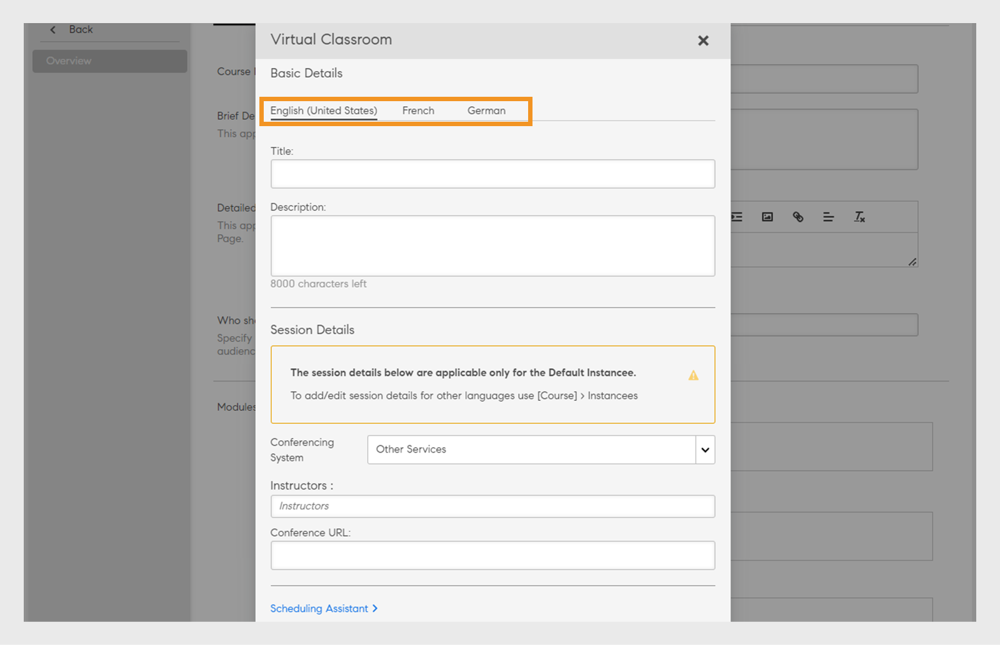

# 다른 로케일로 학습 객체 추가

이 주제에서 다른 언어로 강의, 인증 및 학습 계획을 추가하는 방법을 알아보십시오.

작성자는 강의, 인증 및 학습 계획 등의 학습 객체를 생성할 수 있습니다. 또한 다른 언어로 학습 객체를 생성할 수 있습니다.

Learning Manager를 통해 여러 언어로 학습 개체를 생성할 수 있습니다. 학습 객체를 생성할 때 추가 언어로 콘텐트 및/또는 메타데이터를 추가할 수 있습니다. 언제든지 학습 객체의 세부 정보를 편집할 수 있으며 학습 객체에 추가 언어를 제공할 수 있습니다.

새 언어를 추가하려면 새 로케일을 추가할 강의, 인증 또는 학습 계획을 클릭합니다. 기본 정보 페이지 상단에 있는 &#39;새 언어 추가&#39;를 클릭합니다.

*새 언어 추가*

팝업 대화 상자에서 학습자에게 제공할 하나 이상의 언어를 선택한 다음 &#39;저장&#39;을 클릭합니다.

*언어 선택*

강의에 변경 사항을 적용하려면 다시 게시합니다.

## 언어 태그가 지정된 CR/VC 인스턴스에 대한 다국어 지원

작성자는 ALM(Adobe Learning Manager)을 사용하여 강의실 및 가상 강의실 모듈에 언어 태그 지정을 사용하여 언어별 인스턴스를 만들 수 있습니다. 이 기능을 통해 학습자는 원하는 언어로 CR/VC 모듈에 액세스할 수 있습니다. 예를 들어 작성자는 두 개의 인스턴스, 즉 영어와 프랑스어로 된 인스턴스로 CR/VC 모듈을 만들 수 있습니다. 학습자는 원하는 언어로 인스턴스를 선택할 수 있습니다.

### 워크플로

먼저 작성자는 인스턴스 생성 페이지에서 언어 옵션을 활성화하여 여러 언어로 된 강의를 생성하고 게시합니다. 그런 다음 작성자는 각각에 대해 언어를 선택하여 다른 인스턴스를 만들 수 있습니다. 학습자는 매핑된 언어를 기반으로 인스턴스를 선택할 수 있습니다.

### 여러 언어로 강의 생성

여러 언어로 된 강의를 생성하려면 다음 단계를 따르십시오.

1. **[!UICONTROL 작성자]**(으)로 로그인합니다.
2. **[!UICONTROL 과정]** > **[!UICONTROL 추가]**&#x200B;를 선택하여 과정을 만듭니다.
3. 강의의 **[!UICONTROL 이름]** 및 **[!UICONTROL 설명]**&#x200B;을 입력하십시오.
4. **[!UICONTROL 새 언어 추가]**&#x200B;를 선택하고 필요한 언어를 선택합니다. 이렇게 하면 각 언어에 대해 여러 탭이 만들어집니다.

   
   _새 언어 추가 - 과정_
5. 각 언어 탭으로 이동하여 강의의 **[!UICONTROL 이름]** 및 **[!UICONTROL 설명]**&#x200B;을 입력합니다.
6. 영어(미국) 탭에서 **[!UICONTROL 모듈 추가]** > **[!UICONTROL 가상 강의실 모듈]**&#x200B;을 선택합니다.

   >[!NOTE]
   >
   >강의실 모듈의 절차도 동일합니다.

   
VC 모듈용 새 언어 추가

7. 각 언어 탭에 **[!UICONTROL 제목]** 및 **[!UICONTROL 설명]**&#x200B;을 입력하고 **[!UICONTROL 추가]**&#x200B;를 선택합니다.
8. 강의에 필요한 세부 정보를 입력하고 강의를 게시합니다.

### 각 언어에 대한 인스턴스 만들기

책임자 및 작성자 앱에서 각 언어에 대한 인스턴스를 만들 수 있습니다. 작성자 앱에서 인스턴스를 만들려면 다음 단계를 따르십시오.

1. **[!UICONTROL 작성자]**(으)로 로그인합니다.
2. **[!UICONTROL 과정]**&#x200B;을 선택하고 다국어 과정을 선택합니다.
3. **[!UICONTROL 인스턴스]** > **[!UICONTROL 새 인스턴스 추가]**&#x200B;를 선택하여 인스턴스를 만듭니다.
4. **[!UICONTROL 인스턴스 이름]**&#x200B;을 입력하고 **[!UICONTROL 완료 기한]**&#x200B;을 선택합니다.
5. 다른 옵션을 보려면 **[!UICONTROL 옵션 더 보기]**&#x200B;를 선택하세요.
6. **[!UICONTROL 언어]** 드롭다운에서 필요한 언어를 선택합니다.

   
   _인스턴스의 언어 선택_

7. 다른 세부 정보를 입력하고 **[!UICONTROL 저장]**&#x200B;을 선택합니다.
8. 동일한 단계를 사용하여 다른 언어에 대한 인스턴스를 만듭니다. 학습자는 이 강의의 모든 언어 인스턴스를 볼 수 있습니다.

### 인스턴스를 선택하고 등록 - 학습자 워크플로우

학습자는 앱에서 이러한 언어 인스턴스를 볼 수 있습니다. 원하는 언어 인스턴스를 선택하고 등록하여 해당 언어로 CR/VC 세션에 참석할 수 있습니다.

인스턴스를 선택하고 등록하려면 다음 단계를 따르십시오.

1. 학습자 앱에서 **[!UICONTROL 카탈로그]**(으)로 이동하여 강의를 선택합니다.
2. 여러 인스턴스에서 다음 화면을 볼 수 있습니다.

   
   _학습자용 VC 모듈_

3. 언어 필터 옵션을 사용하여 필터링할 수 있습니다. 원하는 언어를 선택하고 강의에 등록하십시오.
4. 선택하면 강의 개요 페이지에서 다음 세부 정보를 확인할 수 있습니다.

_인스턴스 세부 정보_

