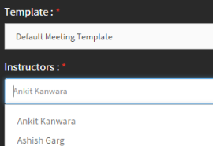

# Adobe Connect 통합

작성자는 강의 생성 절차 중 Adobe Connect로 가상 강의실 강의를 생성할 수 있습니다. Learning Manager 계정에서 Adobe Connect를 허용하려면 조직의 관리자에게 문의하십시오.

## Adobe Connect로 가상 강의실(VC) 강의 생성 {#createvirtualclassroomvccoursewithadobeconnect}

1. 내 강의 페이지에서 모듈 추가를 클릭한 다음 가상 강의실을 선택합니다. 가상 강의실 생성 대화 상자가 나타납니다.
1. **라이브 가상 교육 도구** 옵션에서 **Adobe Connect**&#x200B;을(를) 선택합니다.

   

   *가상 강의실 만들기*

1. 제목, 설명, VC 날짜, 시작 시간 및 종료 시간을 입력합니다.

   Adobe Connect가 계정에 구성되지 않는 경우 위 스크린샷처럼 경고 메시지가 나타납니다. 템플릿, 강사 및 다른 Adobe Connect 옵션이 비활성화됩니다. 계정에 Adobe Connect를 구성하려면 책임자에게 문의하십시오.

1. Adobe Learning Manager 응용 프로그램은 Adobe Connect에서 기본 템플릿(회의, 교육 및 이벤트) 및 강사 목록(호스트 권한이 있는 사용자)을 불러옵니다. 원하는 템플릿을 선택합니다.
1. 강사 목록에서 VC 강의 강사를 선택합니다.

   

   *목록에서 강사 선택*

1. VC 강의의 완료 조건을 입력합니다. 완료 조건은 학습자가 강의를 완료하기까지 참석해야 하는 총 시간 대비 비율입니다. 1시간짜리 강의를 예로 들어 보겠습니다. 완료 조건에 50%를 입력하면, 학습자가 강의에 30분만 참여했다고 해도 학습자는 강의를 완료한 것으로 간주됩니다.
1. **[!UICONTROL 완료]**&#x200B;를 클릭합니다.

## Adobe Connect의 공유 템플릿 {#sharedtemplatesofadobeconnect}

기본적으로 Adobe Connect 계정에서 생성된 모든 공유 템플릿을 Learning Manager 응용 프로그램에 가져오게 됩니다. Adobe Connect 계정에서 사용자 정의 템플릿을 공유 템플릿으로 만들어 추가할 수 있습니다.

## 라이브 허브로 가상 강의실 강의 생성

Live Hub는 조직에서 서드파티 회의 도구를 사용하지 않고 라이브 교육을 제공할 수 있도록 해 주는 Adobe Learning Manager의 기본 AI 기반 가상 강의실 솔루션입니다.

관리자가 계정에 대해 Live Hub를 활성화하면 Adobe Connect과 같은 기타 지원되는 공급자와 함께 **라이브 가상 교육 도구** 목록에서 사용할 수 있습니다.

또한 Live Hub에는 가상 강의실 요구 사항, 필요한 스킬 및 세션 세부 정보를 기반으로 강사를 추천하는 AI 기반 강사 Finder가 포함되어 있습니다. 이렇게 하면 전체 강사 목록을 수동으로 검색할 필요 없이 적합한 강사를 식별할 수 있습니다.

자세한 내용은 [Live Hub 세션 만들기](../../getting-started-with-live-hub/create-a-live-hub-session.md)를 참조하세요.