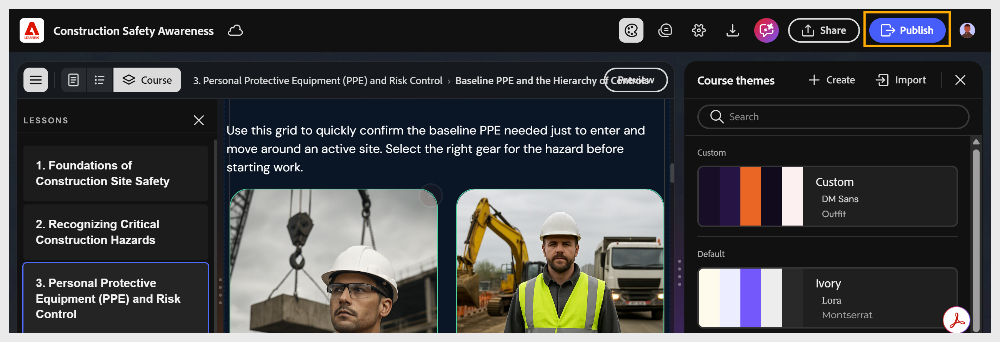

# Adobe Learning Manager Content Composer와 Adobe Learning Manager의 연동 방법

내용 컴포저는 작성을 처리합니다. Adobe Learning Manager에서는 전달, 등록, 추적 및 보고를 처리합니다. 두 제품은 게시 단계를 통해 연결됩니다. Content Composer에서 게시하면 강의가 ALM 콘텐츠 라이브러리의 모듈이 되어 강의로 취합되어 학습자에게 할당될 수 있습니다.

## 콘텐츠 컴포저의 제어 사항

- 단원 및 주제 구조

- 강의 콘텐츠 - 텍스트, 이미지, 비디오, 구성 요소 및 지식 점검

- 질문 유형 및 답변 옵션을 포함한 학습 종료 퀴즈

- 시각적 테마

- 완료 기준 및 성공 기준

- 보고에 사용되는 SCORM 버전

## Adobe Learning Manager의 컨트롤

- 학습자 등록 및 액세스

- 모듈 메타데이터 - 지속 시간, 태그, 고유 ID, 만료

- 강의 어셈블리 - Content Composer 모듈과 다른 학습 콘텐츠 결합

- 학습자 추적, 보고 및 성적 증명서

- 강의 버전 관리

- 알림 및 미리 알림

## 강의 생성에서 학습자 완료까지

1. **Content Composer에서 강의 작성**: Content Composer에서 강의, 주제, 테마, 퀴즈 및 완료 설정을 포함하여 강의를 만듭니다. 게시하기 전에 강의 설정(완료 조건, 성공 조건 및 퀴즈 점수)을 구성합니다.
자세한 내용은 [강의 설정 구성](#settings)을 참조하세요.

2. **Publish에서 Adobe Learning Manager으로:** 작성을 완료하면 **내보내기** 설정을 통해 콘텐츠 컴포저를 ALM 계정에 연결하고 과정을 게시합니다. 콘텐츠 컴포저는 SCORM 호환 모듈로 ALM 콘텐츠 라이브러리에 과정을 전송합니다.
   

3. **ALM에서 모듈 구성:** 게시되면 강의가 ALM 콘텐츠 라이브러리에 모듈로 표시됩니다. ALM 작성자는 기간, 태그, 고유 ID 및 만료 설정을 포함한 모듈 메타데이터를 구성하고 다른 학습 콘텐츠와 함께 ALM 강의에 모듈을 추가합니다.
   

>[!NOTE]
>
>ALM(Adobe Learning Manager)에서 완료 및 성공 조건을 설정하면 해당 설정이 Content Composer에 정의된 설정보다 우선합니다.

4.**ALM 과정 Publish:** ALM 작성자는 모듈을 ALM 과정으로 어셈블하고 과정 이미지와 설정을 추가한 다음 게시합니다. 이 단계를 완료해야만 학습자를 등록할 수 있습니다.

자세한 내용은 [Adobe Learning Manager](https://experienceleague.adobe.com/en/docs/learning-manager/using/get-started/getting-started-author)을 참조하세요.

자세한 내용은 [ALM에서 작성자로 강의 생성](https://experienceleague.adobe.com/en/docs/learning-manager/using/authors/courses)을 참조하세요.

5.**학습자 과정 완료:** 학습자는 Adobe Learning Manager을 통해 과정에 액세스하고, Content Composer 모듈을 실행하고, 강의 및 퀴즈를 완료하며, 1단계에서 구성한 완료 및 성공 기준에 따라 점수를 받습니다.

자세한 내용은 [학습자로 강의 액세스](https://experienceleague.adobe.com/en/docs/learning-manager/using/get-started/getting-started-learner)를 참조하세요.

6.ALM 학습자 진행률 기록: 완료 상태, 퀴즈 점수 및 학습자 데이터는 ALM에 기록되며 학습자 성적 증명서 및 관리 보고를 통해 사용할 수 있습니다.

7.**버전 관리를 사용하여 강의 업데이트**: Content Composer에서 콘텐츠를 업데이트하고 다시 게시하면 ALM이 새로운 버전의 모듈을 만듭니다. ALM 작성자는 기존 강의를 최신 버전으로 업데이트할 수 있습니다.
