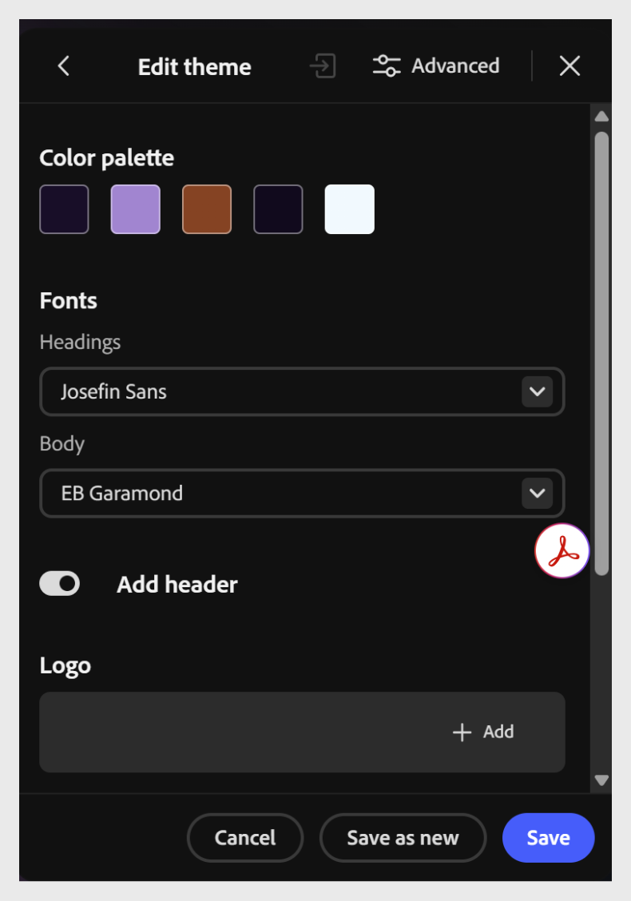

# 글꼴 변경

콘텐츠 또는 브랜드와 더 잘 일치하도록 제목 및 본문 글꼴을 업데이트하십시오.

1. 도구 모음에서 **테마**&#x200B;를 선택한 다음 적용된 테마 위로 마우스를 가져간 다음 **편집**&#x200B;을 선택합니다. **테마 편집** 패널이 열리고 테마의 색상 팔레트와 글꼴이 표시됩니다.

   

2. **글꼴**&#x200B;에서 **머리글** 드롭다운을 선택하고 과정의 모든 머리글에 대한 글꼴을 선택합니다. 예를 들어 **Outfit**&#x200B;을(를) 선택합니다.

   

3. **본문** 드롭다운을 선택하고 과정의 본문 텍스트에 사용할 글꼴을 선택합니다. 예를 들어 **DM Sans**&#x200B;을 선택합니다.

   

4. **저장**&#x200B;을 선택하여 기존 테마를 변경 내용으로 덮어쓰거나 **저장** **새로 만들기**&#x200B;를 선택하여 원본을 변경하지 않고 새 사용자 지정 테마를 만듭니다.

   

>[!NOTE]
>
>기본 테마는 직접 편집할 수 없습니다. 기본 테마를 사용자 정의하려면 기본 테마를 편집한 다음 [새 테마로 저장]을 선택하여 원본을 기준으로 사용자 정의 테마를 만듭니다.
