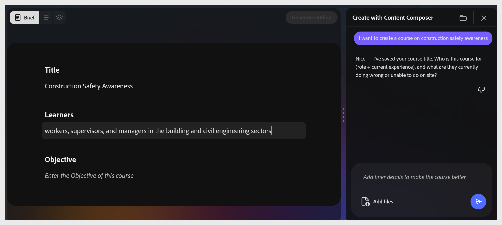

# 강의 요약

**요약** 단계에는 세 개의 필드(**제목**, **학습자** 및 **목표**)가 있습니다. 보조자는 이를 대화에서 채워 주고, 가치 제시, 대안 제시, 각 분야의 확인을 요청한다. **윤곽선 생성** 단추가 활성화되기 전에 세 필드 모두에 콘텐츠가 있어야 합니다.

## 강의 제목 설정

도우미는 프롬프트에 따라 두 개의 제목 옵션을 제안합니다. 원하는 옵션을 선택하거나 채팅 입력에 원하는 옵션을 입력합니다. 캔버스가 즉시 업데이트됩니다.

### 학습자 정의

조교는 학습자들이 누구인지를 질문하는데, 역할, 경험 수준, 현재 무엇을 고민하고 있는지 등이다. 채팅에 답변을 입력하거나 제안된 옵션을 선택합니다.

**팁:** 학습자가 이미 알고 있는 내용과 모르는 내용을 모두 언급합니다. 이렇게 하면 생성된 강의 전체에 걸쳐 어휘 및 시나리오 선택 사항이 형성됩니다.

## 목표 작성

조교는 학습자가 강의를 완료한 후 어떤 작업을 할 수 있을지 묻는다. 동작을 동사로 시작하는 동작으로 목표를 작성합니다.

**목표 예시:**

위험 인식, 건강 및 안전법에 따른 고용주 및 피용자 책임 이해. 위험 관리. 안전 장비의 사용.

목표가 수락되면 **윤곽선 생성**&#x200B;이 파란색으로 바뀌고 활성화됩니다.

>[!TIP]
>
>목표는 모든 것을 하류로 몰아갑니다. AI가 소스 파일에서 사용하는 부분, 윤곽선 구성 방법, 퀴즈 테스트 내용을 제어합니다.
