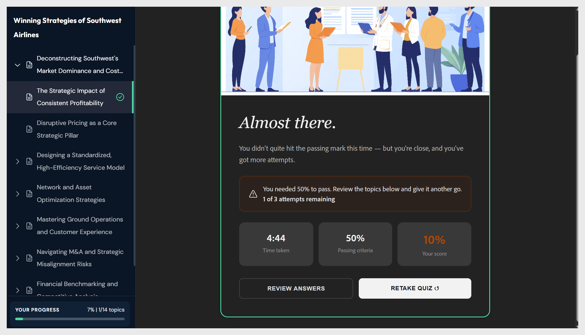

# Adobe Learning Manager Content Composer FAQ

Content Composer 사용과 관련하여 자주 묻는 질문에 대한 답변을 살펴보십시오.

**윤곽선 생성 단추가 회색으로 표시됩니다. 어떻게 해야 합니까?**

**윤곽선 생성**&#x200B;이 활성화되기 전에 세 개의 **요약** 필드, **제목**, **학습자** 및 **목표**&#x200B;에 모두 콘텐츠가 있어야 합니다. 캔버스에서 *여기에 학습자 프로필을 입력* 또는 *이 강의의 목표 입력*&#x200B;과 같이 자리 표시자 텍스트를 이탤릭체로 표시하는 필드가 있는지 확인합니다. 빈 필드를 채우면 버튼이 즉시 활성화됩니다.

**강의 이름을 바꿀 윤곽선을 선택할 수 없습니다. 이유**

현재 Beta 버전에서는 개요 편집에 대한 대화가 제공되고 있습니다. 캔버스에서 강의나 주제를 선택하여 이름을 바꾸거나 순서를 변경할 수 없습니다. 도우미 채팅 패널에서 일반 언어로 변경 내용을 입력합니다.

예:

- &quot;1과의 이름을 &#39;피싱 작동 방식&#39;으로 바꾸기&quot;

- &quot;주제 1.3을 2과에서 첫 번째 주제로 이동&quot;

- &quot;4과를 삭제하고 3과 전체에 주제를 배포합니다.&quot;

**생성된 윤곽선이 원하는 것과 일치하지 않습니다. 무엇이 잘못되었습니까?**

윤곽선은 신속하고 간결하게 표시됩니다. 구조가 틀어진 것처럼 느껴질 경우, 가장 일반적인 원인은 너무 많은 주제를 한 번에 다루는 프롬프트 또는 과정에서 개발해야 하는 특정 기술이나 동작에 대해 이름을 지정하지 않는 학습 목표입니다.

**AI가 업로드한 파일의 중요한 섹션을 건너뛰었습니다. 해결 방법은 무엇입니까?**

Content Composer는 소스 파일에서 학습 목표와 가장 관련이 있는 섹션의 우선 순위를 지정합니다. 한 구간을 건너뛰었다면 목표에 반영되지 않았을 가능성이 크다.

이 문제를 해결하려면:

1. **요약** 패널로 돌아가서 누락된 항목에 명시적으로 이름을 지정하도록 목표를 업데이트합니다.

2. 도우미에게 아웃라인을 다시 생성하도록 요청하십시오. &quot;아웃라인을 다시 생성하고 데이터 보존 정책 섹션을 포함해야 합니다.&quot;

개요 대화에서 누락된 콘텐츠를 &quot;강의 2에 &#39;데이터 보존 정책&#39;이라는 새 주제 추가&quot;에 수동으로 추가할 수도 있습니다.

**Adobe Captivate에서 콘텐츠 컴포저를 사용할 수 있습니까?**

아니요. 콘텐츠 컴포저와 Adobe Captivate은 라운드트립 작업 과정을 공유하지 않습니다. Content Composer 프로젝트는 Captivate에서 열 수 없으며 Captivate 프로젝트는 Content Composer에서 열 수 없습니다.

Captivate으로 내보낸 MP4는 콘텐츠 컴포저에 **비디오** 구성 요소로 삽입할 수 있습니다.

**Content Composer를 규정 준수 또는 규제 대상 교육에 사용할 수 있습니까?**

예. 이것은 그것의 가장 강력한 사례 중 하나입니다. 소스 파일 관리에서 정책 또는 절차 문서를 업로드하고, 출력 제한 을 선택하여 일반적인 지식을 보완하는 대신 사용자가 제공한 것만 AI가 생성되도록 합니다.

**지식 검사가 점수를 매기지 않는 이유는 무엇입니까?**

Content Composer에서 지식 검사는 점수를 매기기 위한 것이 아니라 수업 중 학습 강화를 위해 설계되었습니다. 학습자에게 즉각적인 피드백을 제공하지만 성적 또는 완료 기록은 생성하지 않습니다.

수업이 끝난 퀴즈 평가만 등급이 매겨집니다. 학습자의 점수에 기여하는 평가가 필요한 경우 지식 검사 구성 요소가 아닌 퀴즈를 사용합니다.

**퀴즈 질문이 강의하는 내용과 일치하지 않습니다. 해결 방법은 무엇입니까?**

콘텐츠 컴포저는 AI를 사용하여 퀴즈 질문을 생성하고 AI 출력은 비결정적입니다. 그 질문들은 항상 당신이 기대하는 것을 정확히 반영하지는 않을 수도 있다. 강의가 생성된 후 모든 퀴즈 질문을 검토하고, 조정이 필요한 질문은 강의 편집기에서 직접 편집하고, 게시하기 전에 내용이 정확한지 확인합니다.

## 검토용으로 공유 정보

**콘텐츠 컴포저에서 검토용으로 공유란 무엇입니까?**

검토용으로 공유를 사용하면 게시하기 전에 피드백을 위해 검토자에게 강의를 배포할 수 있습니다. 검토자는 콘텐츠 컴포저를 설치하거나 구독할 필요 없이 브라우저에서 과정을 열고 구성 요소에 주석을 추가하고 퀴즈를 시도합니다.

**검토자에게 Content Composer 라이선스가 필요합니까?**

아니요. 검토자는 Content Composer 구독 또는 설치가 필요하지 않습니다. 검토 링크가 있는 사용자는 누구나 브라우저에서 강의를 열 수 있습니다.

**검토자가 참여하려면 Adobe ID이 필요합니까?**

예. 강의를 검토하려면 로그인해야 하므로 Adobe ID이 필요합니다. 로그인한 검토자는 강의를 열고, 댓글을 추가하고, 퀴즈를 시도하고, @mentions 를 사용하여 작성자 또는 다른 검토자에 태그를 지정할 수 있습니다.

**검토자가 강의 콘텐츠를 편집할 수 있습니까?**

아니요. 검토 액세스는 주석 전용입니다. 검토자는 주석을 추가, 응답, 해결 및 필터링할 수 있지만 강의 텍스트, 이미지 또는 구조를 변경할 수 없습니다.

검토 파일은 어디에 저장됩니까? 검토 파일은 Adobe 클라우드에서 호스팅됩니다. 작성자는 파일 스토리지를 관리하거나 강의 파일을 검토자에게 직접 보낼 필요가 없습니다.

### 공유 및 액세스

**누가 리뷰 링크에 액세스할 수 있습니까?**

기본적으로 이름 또는 이메일로 초대하는 사람만 프로젝트에 액세스할 수 있습니다. 링크를 보내기 전에 프로젝트 공유 패널의 액세스 권한이 있는 사람 섹션에서 확인하십시오.

**Adobe 사용자가 아닌 외부 관련자를 초대할 수 있습니까?**

예. 이메일 주소로 다른 사용자를 초대할 수 있습니다. 단, 로그인하고 강의를 검토하려면 Adobe 계정이 필요합니다.

**리뷰가 이미 시작된 후에 리뷰어를 추가할 수 있습니까?**

예. 언제든지 프로젝트 공유 패널을 열고 이름 또는 이메일 주소를 추가한 다음 주석 달기에 초대 를 선택합니다. 새 검토자는 즉시 초대를 받습니다.

**공유 후 검토자를 제거할 수 있습니까?**

예. 프로젝트 공유 패널의 액세스 권한이 있는 사용자 아래에서 검토자를 찾아 제거합니다. 이전에 공유한 링크를 사용하여 강의를 열려고 하면 액세스 거부 메시지가 표시됩니다.

**검토자가 액세스 권한을 상실하면 어떻게 됩니까?**

액세스 거부 화면에서 액세스 권한 요청 을 선택할 수 있습니다. 강의 소유자는 액세스 권한을 복원하라는 알림을 받습니다.

### 주석 달기 및 피드백

검토자가 강의의 특정 부분에 주석을 달 수 있습니까?

예. 검토자는 텍스트 블록, 이미지 또는 퀴즈 질문과 같은 강의 구성 요소를 선택하고 해당 요소에서 직접 주석을 추가합니다. 댓글은 자신이 추가된 구성 요소에 계속 문맥상 연결됩니다.

**여러 검토자가 동시에 주석을 달 수 있습니까?**

예. 모든 검토자는 [댓글] 패널에서 서로의 댓글을 보고 서로 답글을 달거나, 해결하거나, @mention 수 있습니다.

**해결되지 않은 피드백을 찾기 위해 댓글을 필터링할 수 있습니까?**

예. [댓글] 패널의 [해결됨] 필터를 사용하여 해결되지 않은 댓글만 표시합니다. 검토자를 기준으로 필터링하여 특정 사용자의 피드백을 보거나 시간별로 필터링하여 가장 최근의 댓글을 찾을 수도 있습니다.

**댓글에서 다른 리뷰어에 태그를 지정하려면 어떻게 해야 합니까?**

@ 다음에 해당 이름 또는 이메일 주소를 입력하고 드롭다운에서 선택합니다. 태그가 지정된 사용자는 알림을 받습니다. 이를 위해서는 검토자가 Adobe ID으로 로그인해야 합니다.

#### 퀴즈 및 학습자 액세스

**검토자가 퀴즈를 풀 수 있습니까?**

예. 검토자는 지정된 재시도 횟수까지 퀴즈를 시도할 수 있습니다. 점수는 기록되지 않으며 강의나 LMS 보고에 영향을 주지 않습니다.

**학습자를 위한 검토용으로 공유와 공유의 차이점은 무엇입니까?**

검토용으로 공유 기능을 사용하면 동료와 이해 관계자가 의견을 작성할 수 있도록 주석 패널이 활성화된 강의에 액세스할 수 있습니다. 학습자용 공유 기능을 사용하면 LMS를 통해 등록되지 않은 학습자를 위해 주석 없이 강의에 액세스할 수 있습니다. 학습자 점수도 직접 링크를 통해 기록되지 않는다.

### 검토 업데이트 및 종료

**변경한 후 새 검토를 만들어야 합니까?**

아니요. 강의를 업데이트한 후에도 검토 URL은 동일하게 유지됩니다. **공유**&#x200B;를 선택하여 업데이트된 버전을 사용할 수 있음을 검토자에게 알립니다.

**강의를 업데이트할 때 검토자에게 알릴까요?**
검토자가 업데이트 후 검토 링크를 열면 알림 배너가 표시됩니다. 다시 로드 를 선택하여 최신 버전을 볼 수 있습니다.

**강의 업데이트 후에도 이전 댓글이 남아 있습니까?**

예. 기존 댓글은 업데이트 중에도 유지됩니다. 검토자와 작성자는 업데이트된 버전에서 댓글을 계속 해결할 수 있습니다.

**강의를 업데이트한 후 학습자 링크는 어떻게 됩니까?**

기존 학습자 링크는 이전 버전을 계속 표시합니다. 각 업데이트 후 새 링크를 생성하고 학습자가 최신 콘텐츠에 액세스할 수 있도록 학습자와 공유합니다.

**프로젝트 업데이트를 보는 방법**

강의를 검토하는 동안 작성자가 강의를 업데이트하면 알림이 표시됩니다.

- **다시 로드**&#x200B;를 선택하여 최신 버전을 로드하거나, 알림을 해제하여 현재 버전을 계속 검토하세요. 재로딩은 안전합니다. 프로젝트가 업데이트된 후에도 기존 댓글이 유지되므로 이미 추가한 피드백은 손실되지 않습니다.

## 검토자로 퀴즈 시도

검토자는 지정된 횟수까지 퀴즈를 시도할 수 있지만 점수가 기록되지 않습니다.

- **퀴즈 시작**&#x200B;을 선택하여 퀴즈를 시도합니다.

  

- 완료되면 결과가 표시됩니다. 여기에서 [대답 검토]를 선택하여 어떤 문제가 맞았는지 확인하고 퀴즈를 다시 풀면 다시 시도할 수 있습니다.

  

