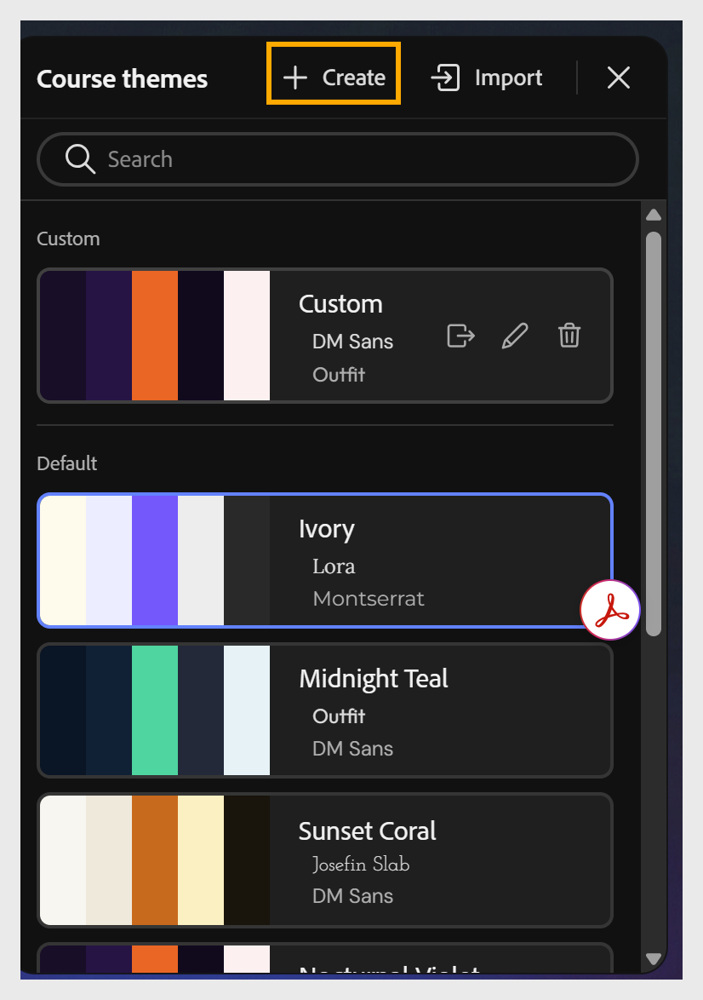

# 테마 만들기

사용자 지정 테마를 만드는 두 가지 방법, 두 가지 방법 모두 **사용자 지정** 테마 목록에 결과를 추가합니다.

- 도구 모음에서 **만들기** 옵션을 사용하여 **처음부터 작성** - 색상 팔레트, 글꼴 및 기타 속성을 구성한 다음 **새로 저장**&#x200B;합니다.

- **사용자 정의된 JSON 파일 가져오기** - 기존 테마를 JSON으로 내보내고, 텍스트 또는 코드 편집기에서 편집한 다음 다시 가져옵니다.

**더 제어해야 합니까?**

요소별 타이포그래피(레슨 이름, 주제 이름, 블록 머리글, 캡션), 색상 토큰 수준 사용자 지정 및 전체 JSON 스키마 액세스 - 플랫폼 또는 브랜드 팀에서 일반적으로 원하는 제어 종류에 대해서는 [고급 테마 사용자 지정](advanced-theme-customization.md)을 참조하십시오.

## 처음부터 테마 만들기

1. 도구 모음에서 **만들기**&#x200B;를 선택하여 **강의 테마** 패널을 엽니다.
   

2. 테마의 색상 팔레트, 글꼴 및 기타 속성을 필요에 따라 구성합니다.
   

3. **새로 저장**&#x200B;을 선택하여 **사용자 지정** 테마 목록에 테마를 추가합니다.
   

## JSON을 가져와 테마 만들기

1. 도구 모음에서 **테마**&#x200B;를 선택하여 **강의 테마** 패널을 엽니다.

2. 기본으로 사용할 테마에 마우스를 가져다 대고 **내보내기**&#x200B;를 선택하여 JSON 파일로 다운로드합니다.

3. 텍스트 또는 코드 편집기에서 JSON 파일을 열고 반경, 간격, 색상 팔레트 또는 글꼴 등의 속성을 업데이트합니다.

4. JSON 파일을 저장합니다.

5. 콘텐츠 컴포저의 **강의 테마** 패널에서 **가져오기**&#x200B;를 선택합니다.

6. 컴퓨터에서 업데이트된 JSON 파일을 선택합니다.

7. **새로 저장**&#x200B;을 선택하여 **사용자 지정** 테마 목록에 테마를 추가합니다.
