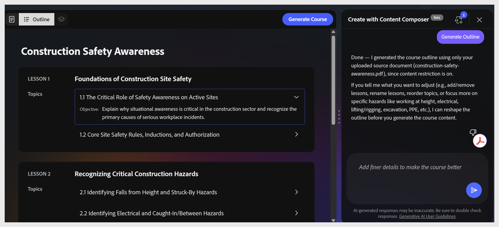

# 강의 개요 편집

Adobe Learning Manager Content Composer는 간략한 소스 파일에서 튜토리얼과 주제 구조를 생성합니다. 모든 강의와 해당 주제를 보여주는 윤곽선이 캔버스에 표시됩니다.

**참고:** 개요 편집은 현재 베타 릴리스에서 대화형으로 제공됩니다. 캔버스에서 강의나 주제를 선택하여 이름을 바꾸거나 순서를 변경할 수 없습니다. 채팅 패널에서 변경 내용을 일반 언어 요청으로 입력합니다.

그 조수는 대화로 일한다. 요청 구문은 직접 지정할 수 있습니다. 다음은 수행할 수 있는 작업의 몇 가지 예입니다.

| **작업** | **요청 예시** |
|--------------------------|---------------------------------------------------------------------------|
| 강의 또는 주제 이름 바꾸기 | &quot;1과의 이름을 &#39;피싱 작동 방식&#39;으로 바꾸기&quot; |
| 강의 또는 주제 추가 | &quot;2과에서 QR 코드 피싱에 대한 주제 추가&quot; |
| 강의 또는 주제 삭제 | &quot;항목 1.3 제거&quot; |
| 레슨 나누기 | 3과를 둘로 나누자 하나는 스팸 필터용이고 다른 하나는 패치 관리용입니다.&quot; |
| 레슨 병합 | &quot;3, 4 레슨을 하나의 레슨으로 병합&quot; |
| 아웃라인 재생성 | &quot;암호 위생에 더 집중하여 재생성&quot; |

채팅 패널에서 일반 언어 요청을 사용하여 강의, 주제 또는 전체 개요 구조를 수정할 수 있습니다.

개요 계층은 [강의] > [주제]로 수정되었습니다. 하위 항목 또는 세 수준 구조는 만들 수 없습니다.

개요가 제대로 표시되면 상단 도구 모음에서 **강의 생성**&#x200B;을 선택합니다.
