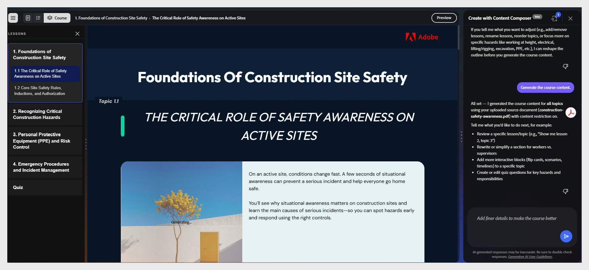

# 생성된 과정 검토

Adobe Learning Manager Content Composer는 텍스트, 이미지, 지식 점검 및 퀴즈가 포함된 전체 과정을 한 번에 생성합니다. 생성이 완료되면 **과정** 편집기가 자동으로 열립니다.

왼쪽 패널에는 레슨 및 주제 탐색이 표시됩니다. 캔버스에는 선택한 주제의 콘텐츠가 표시됩니다. 채팅 패널이 대화 편집을 위해 열린 상태로 유지됩니다.

>[!CAUTION]
>
>공유 또는 게시 전에 생성된 모든 콘텐츠를 검토합니다. AI 출력은 세대 간에 다를 수 있으며 부정확성을 포함할 수 있습니다. 배포하려면 작성자 검토가 필요합니다.

