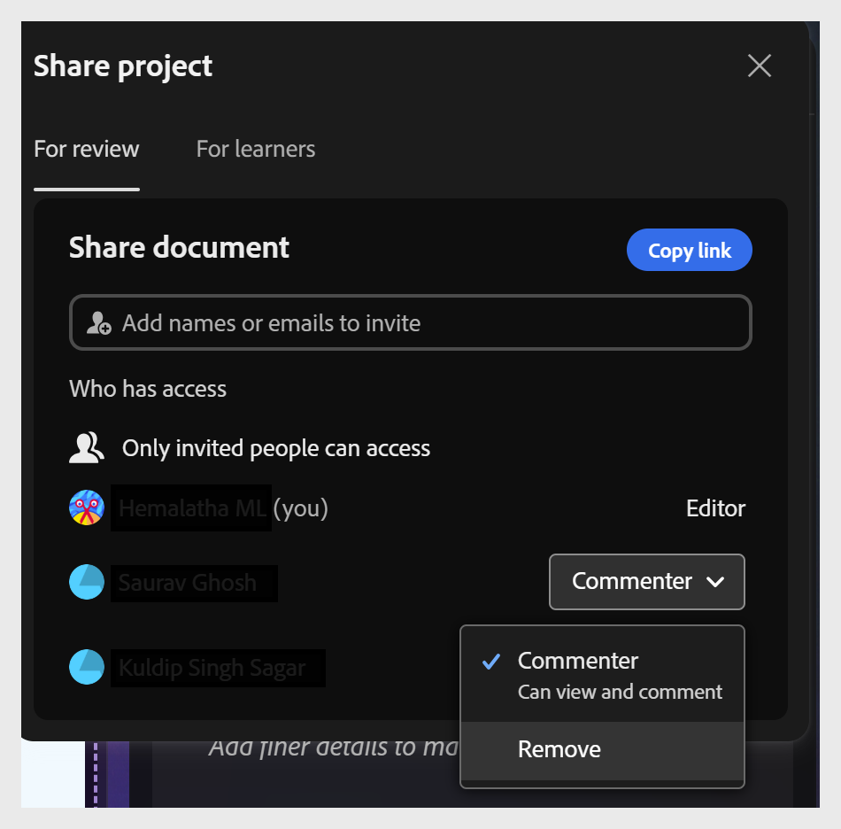

# 검토용으로 프로젝트 공유

Content Composer를 사용하면 검토자 또는 학습자가 응용 프로그램을 설치하지 않아도 프로젝트를 공유할 수 있으므로 게시하기 전에 피드백을 수집하고 승인을 받을 수 있는 빠르고 구조화된 방법을 제공합니다.

작성자는 이름이나 이메일로 검토자를 초대하고 액세스 권한이 있는 사용자를 정확하게 제어하며 언제든지 해당 액세스 권한을 철회할 수 있습니다. 검토자는 공유 링크를 열고, 강의 구성 요소에서 직접 주석을 추가하고, 기록된 점수에 영향을 주지 않고 최종 퀴즈를 시도할 수도 있으므로 전체 학습자 경험을 미리 볼 수 있습니다.

댓글은 체계적이고 실행 가능합니다. 검토자와 소유자는 외부적으로 검토하거나 프로젝트 내에서 작업하든 모두 동일한 패널에서 댓글에 회신, 해결, 필터링 및 서로 언급할 수 있습니다. 피드백을 해결하고 프로젝트를 업데이트하십시오.

검토할 프로젝트를 공유하려면 다음을 수행하십시오.

1. **검토용**&#x200B;을 선택합니다.

   

2. **초대하기** 필드에 검토자의 이름 또는 전자 메일 주소를 입력하십시오.

   
3. 액세스 권한이 있는 사용자를 검토하여 초대된 사용자만 프로젝트에 액세스할 수 있는지 확인합니다.

4. **댓글로 초대**&#x200B;를 선택하여 이름 또는 이메일로 검토자를 추가합니다. 필요한 만큼 검토자를 추가할 수 있습니다. 또는 **링크 복사**&#x200B;를 선택하여 검토 URL을 복사하고 이미 액세스 권한이 있는 검토자와 직접 공유합니다. 이 두 가지 방법으로 프로젝트를 공유할 수 있습니다.

   

## 검토자의 액세스 권한 제거

프로젝트에 대한 액세스 권한이 있는 사용자 목록에서 검토자를 제거할 수 있습니다. 검토자가 이전에 공유한 링크를 사용하여 프로젝트를 다시 열려고 하는 경우

선택한 댓글을 제거할 수 있는 옵션이 있습니다. 댓글 작성자가 문서에 액세스할 수 있는 사용자 목록에서 제거된 경우.

액세스 권한을 제거하려면:

* 검토자의 이름을 선택하고 표시된 옵션에서 제거 를 선택합니다.

* 검토자가 이전에 공유한 링크가 있는 문서에 액세스하려고 하는 경우 액세스 거부 메시지가 표시됩니다.

  

## 액세스 권한 요청

더 이상 액세스할 수 없는 공유 프로젝트를 열려고 하면 액세스 권한을 요청해야 볼 수 있습니다. 예를 들어 소유자가 사용자를 제거했거나 다른 Adobe ID에서 링크를 여는 경우 이러한 문제가 발생할 수 있습니다. 두 경우 모두 액세스 거부 화면이 표시됩니다.

* **액세스 권한 요청**&#x200B;을 선택하여 소유자에게 프로젝트를 검토하고 댓글을 추가할 수 있는 권한을 요청합니다.

  

* 프로젝트 소유자는 액세스 권한을 요청하는 검토자의 이름이 포함된 알림을 받습니다.