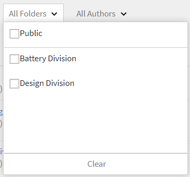
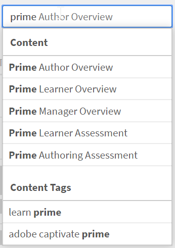

# 콘텐츠 라이브러리

자가 진행식 콘텐츠로 강의에 맞게 콘텐츠를 만드는 방법을 알아봅니다.

## 콘텐츠 라이브러리 {#contentlibrary}

콘텐츠는 강의 블록을 구성합니다. 작성자는 자가 진행식 콘텐츠 강의로 정렬할 수 있는 콘텐츠 라이브러리를 생성합니다. 작성자만 이 콘텐츠 라이브러리에 접속할 수 있습니다.

## 지원되는 콘텐츠 유형 {#supported}

대화형 및 정적 콘텐츠 모두를 라이브러리에 업로드할 수 있습니다.

아래 표에서 라이브러리에 업로드할 수 있는 대화형 유형 및 정적 파일을 확인할 수 있습니다.

<table>
 <tbody>
  <tr>
   <td>
    
<b>대화형 콘텐츠</b>
</td>
   <td>
    
<b>콘텐츠 유형</b>
</td>
   <td>
    
<b>확장</b>
</td>
  </tr>
  <tr>
   <td>
    
 
</td>
   <td>
    

    <ul>
     <li>SCORM 1.2</li>
     <li>SCORM 2004</li>
     <li>AICC</li>
     <li>TinCan</li>
    </ul>
    

</td>
   <td>
    
zip
</td>
  </tr>
  <tr>
   <td>
    
<b>정적 콘텐츠</b>
</td>
   <td>
    
<b>콘텐츠 유형</b>
</td>
   <td>
    
<b>확장</b>
</td>
  </tr>
  <tr>
   <td>
    
 
</td>
   <td>
    
비디오
</td>
   <td>
    
mp4, wmv, 3gp, 3g2, 3gp2, asf, avi, f4v h264, mpe, mpeg, mpg, mpg2, m4v, mov, wmv
</td>
  </tr>
  <tr>
   <td>
    
 
</td>
   <td>
    
오디오
</td>
   <td>
    
mp3, wav, aac, m4a, wma, vorbis, pcm, eac3, amr, ac3
</td>
  </tr>
  <tr>
   <td>
    
 
</td>
   <td>
    
PDF
</td>
   <td>
    
pdf
</td>
  </tr>
  <tr>
   <td>
    
 
</td>
   <td>
    
MS PowerPoint
</td>
   <td>
    
pptx, ppt
</td>
  </tr>
  <tr>
   <td>
    
 
</td>
   <td>
    
MS Word
</td>
   <td>
    
docx, doc
</td>
  </tr>
  <tr>
   <td>
    
 
</td>
   <td>
    
MS Excel
</td>
   <td>
    
xlsx, xls
</td>
  </tr>
  <tr>
   <td>
    
 
</td>
   <td>
    
HTML
</td>
   <td>
    
zip 파일
</td>
  </tr>
 </tbody>
</table>

## 라이브러리에 새 콘텐츠 추가 {#addnewcontentinthelibrary}

**작성자**&#x200B;는 ALM에서 콘텐츠를 추가할 수 있습니다. ALM에는 **[!UICONTROL 콘텐츠]** 및 **[!UICONTROL 퀴즈]**, 두 가지 유형의 콘텐츠가 있습니다. 콘텐츠를 추가하는 방법을 알아보려면 [정적 콘텐츠 추가](content-library.md#addstaticcontent) 및 [퀴즈 만들기](content-library.md##createaquiz)를 참조하세요.

## 정적 콘텐츠 추가 {#addstaticcontent}

1. **[!UICONTROL 작성자]**(으)로 로그인한 후 왼쪽 창에서 **콘텐츠 라이브러리**&#x200B;를 선택하고 **[!UICONTROL 추가]**&#x200B;를 선택합니다.

   또는 **[!UICONTROL 시작하기]** 페이지에서 **[!UICONTROL 콘텐츠 만들기]**&#x200B;를 선택할 수 있습니다.

1. **[!UICONTROL 이름]** 필드에 업로드할 콘텐츠의 이름을 입력합니다.
1. **[!UICONTROL 설명]** 필드에 콘텐츠에 대한 설명을 입력합니다. 의미 있는 설명을 입력해야 합니다. 글자수 제한은 400자입니다.
1. 콘텐츠를 추가하려면 **[!UICONTROL 콘텐츠 파일 추가]**&#x200B;를 선택하고 리소스 파일을 업로드하세요. 여러 언어로 된 콘텐츠를 추가할 때는 일방형 콘텐츠와 상호작용 콘텐츠를 하나로 묶을 수 없습니다. 모든 지역에서는 콘텐츠가 모두 일방형이거나 상호작용형이어야 합니다.

   콘텐츠를 변경하고 싶은 경우 정적 콘텐츠를 다른 정적 콘텐츠로 변경할 수 있습니다. 대화형 콘텐츠도 마찬가지입니다.

1. **[!UICONTROL 기간]** 필드에 학습자가 이 모듈에 소요할 예상 시간을 입력할 수 있습니다. 지속 시간은 분 단위 입니다.

   학습자가 강의를 완료로 표시하면 지정된 기간에 따라 학습 시간이 계산됩니다. 학습자가 플레이어에서 콘텐츠를 소비하면 플레이어에서 소요된 시간이 학습 소요 시간에 추가됩니다. 실제 콘텐츠 시간이 지정된 지속 시간보다 작으면 플레이어는 콘텐츠 시간을 그대로 표시한다. 이 경우에는 변경되지 않습니다.

1. **[!UICONTROL 태그]** 필드에 콘텐츠를 검색할 수 있도록 업로드된 콘텐츠의 태그를 입력합니다.

   작성자는 강의에 콘텐츠를 추가하는 동안 이러한 태그를 사용하여 콘텐츠를 검색할 수 있습니다.

### 컨텐츠 라이브러리에 HTML5 파일 유형 추가

작성자는 HTML5 콘텐츠를 .zip 파일로 자가 진행식 콘텐츠에 추가할 수 있습니다. .zip 폴더에 이름이 `index.html`인 HTML 파일이 있어야 합니다. HTML 파일이 여러 개 있는 경우 모두 기본 파일 이름 `index.html`과(와) 연결되어야 합니다. 학습자는 Fluidic Player에서 HTML5 콘텐트를 볼 수 있습니다. 작성자는 이 HTML5 콘텐츠를 강의 자가 진행식 모듈에 추가하고 완료 기준을 설정할 수 있습니다. 작성자는 다음 두 가지 방법 중 하나로 HTML 강의 완료 기준을 설정할 수 있습니다.

* 학습자가 스스로 완료로 표시할 수 있습니다.
* 과정을 시작하면 완료로 표시됩니다.

HTML 파일 유형(.zip)을 컨텐츠 라이브러리에 추가하려면 다음 단계를 따르십시오.

1. 작성자 앱에서 홈 페이지의 **[!UICONTROL 콘텐츠 만들기]**&#x200B;를 선택합니다.
1. **[!UICONTROL 콘텐츠 라이브러리]** 화면에서 **[!UICONTROL 추가]** > **[!UICONTROL 콘텐츠]**&#x200B;를 선택합니다.
1. 콘텐츠의 이름 및 설명을 입력합니다.
1. **[!UICONTROL 콘텐츠 파일 추가]** 옵션을 선택한 다음 HTML 파일(폴더로 압축)을 찾아 선택합니다.
1. 콘텐츠가 추가되면 **[!UICONTROL 콘텐츠 라이브러리]** 섹션에서 콘텐츠를 볼 수 있습니다.
1. HTML 콘텐츠를 선택한 다음 **[!UICONTROL 편집]**&#x200B;을 선택합니다.
1. **[!UICONTROL 완료 조건]** 옵션에서 다음 옵션 중 하나를 선택합니다.
   * **[!UICONTROL 콘텐츠 시작 시]**: 학습자가 강의를 시작하면 자동으로 완료로 표시됩니다.
   * **[!UICONTROL 학습자가 완료 표시]**: Fluidic Player에서 강의를 완료로 표시할 수 있는 옵션이 제공됩니다.

   
   _완료 조건_

1. **[!UICONTROL 저장]**&#x200B;을 선택합니다.
1. 이 콘텐츠를 추가하여 강의를 만드십시오.  자세한 내용은 [강의 생성, 수정 및 게시](/help/migrated/authors/feature-summary/courses.md)를 참조하세요.

학습자 앱에서 작성자가 **[!UICONTROL 콘텐츠 시작 시]**&#x200B;로 선택 조건을 선택하면 학습자가 강의를 시작할 때 강의가 완료로 표시됩니다. 작성자가 **[!UICONTROL 학습자 완료 표시]**&#x200B;를 선택하면 학습자는 과정을 완료로 표시할 수 있습니다.

_학습자 완료 표시_

### 버전 관리 {#versioning}

콘텐츠 라이브러리는 업로드된 콘텐츠의 버전 관리도 유지합니다. 콘텐츠(예: PowerPoint 프레젠테이션)에 변경 사항이 있는 경우 PPT를 라이브러리에 다시 업로드하면 버전 숫자가 1만큼 증가합니다. 이를 통해 콘텐츠의 변경 사항을 추적할 수 있습니다.

## 대화형 콘텐츠 추가 {#addinteractivecontent}

1. **[!UICONTROL 작성자]**(으)로 로그인한 후 왼쪽 창에서 **콘텐츠 라이브러리**&#x200B;를 선택하고 **[!UICONTROL 추가]**&#x200B;를 선택합니다.

   또는 **[!UICONTROL 시작하기]** 페이지에서 **[!UICONTROL 콘텐츠 만들기]**&#x200B;를 선택할 수 있습니다.

1. **[!UICONTROL 이름]** 필드에 업로드할 콘텐츠의 이름을 입력합니다.
1. **[!UICONTROL 설명]** 필드에 콘텐츠에 대한 설명을 입력합니다.

   >[!NOTE]
   >
   >의미 있는 설명을 입력해야 합니다. 글자수 제한은 245자입니다.

1. 콘텐츠를 추가하려면 **[!UICONTROL 콘텐츠 파일 추가]**&#x200B;를 선택하고 리소스 파일을 업로드하세요. 여러 언어로 된 콘텐츠를 추가할 때는 일방형 콘텐츠와 상호작용 콘텐츠를 하나로 묶을 수 없습니다. 모든 지역에서는 콘텐츠가 모두 일방형이거나 상호작용형이어야 합니다.

* [지원되는 파일 유형](content-library.md#supported)

  대화형 콘텐츠는 SCORM, AICC 또는 Captivate 게시된 프로젝트일 수 있습니다. 파일은 zip 파일이어야 합니다.

  Captivate, Presenter 또는 Presenter Video Express에서 생성된 HTML 콘텐츠를 추가할 수도 있습니다.

1. Adobe Learning Manager은 Adobe Learning Manager에 업로드된 비디오 콘텐츠에 대한 캡션을 지원합니다. 이제 작성자는 비디오 파일과 함께 캡션이 있는 파일을 업로드할 수 있습니다.

   그러면 학습자가 비디오 모듈을 재생하는 동안 캡션을 볼 수 있습니다.

   지원되는 형식은 [웹 비디오 텍스트 트랙(webVTT)](https://www.w3.org/TR/webvtt1/)입니다.

   캡션 지원은 Adobe Learning Manager의 콘텐츠 라이브러리에 업로드된 비디오 콘텐츠에 사용할 수 있습니다.

   작성자는 비디오 또는 오디오 콘텐츠를 업로드할 때 캡션이 포함된 VTT 파일을 업로드할 수도 있습니다.

   그러면 자막이 Fluidic Player에 나타납니다. 캡션도 [WCAG2.0 표준](https://www.w3.org/TR/WCAG20/)을 준수합니다.

   라이브러리에 비디오 콘텐츠를 추가할 때 VTT 파일을 추가할 수도 있습니다. **반드시** 올바른 파일이어야 합니다.

   

   *webvtt 파일 추가*

   업로드된 VTT 파일은 콘텐츠의 기존 버전에 해당합니다. 따라서 업로드된 webVTT 파일은 이전 버전의 콘텐츠에 연결되지 않습니다.

   다양한 언어로 콘텐츠를 만드는 경우 언어별 webVTT 파일을 업로드할 수 있습니다. 학습자는 재생하는 동안 선택된 언어의 캡션을 볼 수 있습니다.

   >[!NOTE]
   >
   >   하나의 VTT 파일이 하나의 언어를 지원합니다. 다국어를 지원하려면 각 콘텐츠 언어에 대해 여러 비디오 파일을 업로드한 다음 각 비디오 파일에 대한 해당 VTT 파일을 업로드합니다.

   작성자가 콘텐츠, 비디오 또는 오디오를 변경할 때마다 Adobe Learning Manager에서는 새 vtt 파일을 선택하라는 메시지를 표시합니다.

   강의에 이 콘텐츠를 추가한 후 학습자로 강의를 미리 보면 비디오에서 캡션을 볼 수 있습니다.

   플레이어에서는 Fluidic Player의 CC 단추를 전환하여 캡션을 표시하거나 숨깁니다.

   동일한 보기가 **학습자 앱**&#x200B;과 **학습자로 미리 보기**&#x200B;에 있습니다.

   vtt 파일을 **추가, 업데이트 또는 삭제**하면 알림을 받습니다.
WebVTT는 다음에 대해 지원되지 않습니다.

   1. 비디오 공지.
   1. eLearning 콘텐츠 내에서 재생되는 비디오입니다. 이는 콘텐츠에서 구동합니다.
   1. 소셜 학습에 업로드된 비디오.
   1. Adobe Learning Manager 데스크탑 앱에서 생성된 비디오.
   1. 마이그레이션 프로세스를 사용하여 생성된 비디오 콘텐츠.
   1. 오프라인 모드의 모바일 앱에서 비디오 재생.

1. **[!UICONTROL 기간]** 필드에 학습자가 이 모듈에 소요할 예상 시간을 입력할 수 있습니다. 지속 시간은 분 단위 입니다.
1. **[!UICONTROL 태그]** 필드에 콘텐츠를 검색할 수 있도록 업로드된 콘텐츠의 태그를 입력합니다.

### 공유 카탈로그 지원

판매자 계정에서 강의가 포함된 카탈로그를 공유하고 강의에 모듈, 오디오 또는 비디오가 자막과 함께 포함된 경우, 강의가 구매자 계정에서 동일하게 작동해야 합니다.

모듈 전달은 판매자에서 구매자 계정까지 올바르게 작동해야 합니다. 이것은 모듈에서 vtt 파일의 편집/삭제/추가를 포함할 수 있습니다.

콘텐츠를 업로드한 후 페이지 상단 오른쪽 모서리의 종 모양 아이콘을 클릭하면 알림을 확인할 수 있습니다. 콘텐츠를 수정 및 다시 업로드할 때마다 알림이 전송됩니다. 변경 사항이 있는 경우 귀하에게만 알림이 전송되며 다른 작성자에게는 전송되지 않습니다.

## 퀴즈 만들기 {#createaquiz}

콘텐츠 라이브러리 페이지의 새로운 퀴즈 생성 도구를 사용하여 Adobe Learning Manager 내에서 평가를 생성합니다. 생성된 평가는 콘텐츠 라이브러리의 일부가 되며 과정을 다시 사용할 수 있도록 &quot;공용&quot; 폴더에 추가할 수 있습니다.

1. 왼쪽 패널에서 콘텐츠 라이브러리 를 선택합니다.
1. 화면의 오른쪽 상단 모서리에서 **추가 > 퀴즈**&#x200B;를 선택합니다.
1. 퀴즈 만들기 페이지에서 퀴즈의 이름과 설명을 입력합니다.
1. 퀴즈 콘텐츠 섹션에서 **퀴즈 질문 추가**&#x200B;를 선택합니다.
1. [퀴즈 질문] 대화 상자에서 질문 유형을 선택합니다. 질문의 유형에는 세 가지가 있습니다.
   * 객관식 질문
   * 참 또는 거짓
   * 공백 채우기
1. 질문을 입력하고 정답을 선택합니다.
1. 퀴즈의 점수를 설정합니다.
1. 퀴즈에 통과하기 위해 질문에 대한 올바른 대답을 원하는 경우 **퀴즈에 통과하려면 반드시 올바르게 대답해야 함** 확인란을 선택합니다.
1. **저장 및 닫기**&#x200B;를 선택합니다.
1. **합격 기준** 필드에 퀴즈에 합격할 점수를 입력합니다.
1. 학습자가 정답을 보도록 하려면 퀴즈 후에 학습자에게 **정답 표시** 토글을 활성화합니다.
1. 질문과 대답이 임의로 표시되도록 하려면 다음 토글을 활성화합니다.
   * 질문 순서 임의화
   * 답변 옵션 순서 임의화
1. 모든 작성자가 퀴즈를 사용할 수 있도록 퀴즈를 추가할 폴더를 지정합니다.
1. **기간** 필드에서 학습자가 퀴즈에 참여해야 하는 시간을 지정합니다.
1. 이미 만든 태그 목록에서 태그를 지정합니다.
1. 퀴즈에 로고와 배경을 추가합니다.
1. 페이지의 오른쪽 상단 모서리에서 **Publish**&#x200B;을(를) 선택합니다.

다른 언어로 퀴즈를 추가하려면 다음 단계를 따르십시오.

1. 다른 언어에 대한 퀴즈를 추가하려면 **새 언어 추가** 탭을 선택하고 필요한 언어를 선택합니다. 이 접근법을 사용하면 콘텐츠에 대한 다중 언어 지원을 추가할 수 있습니다.

   

   *콘텐츠에 새 언어 추가*

1. 새 언어에 대해 콘텐츠 업로드 프로세스를 반복합니다.
1. 언어를 제거하려면 **[!UICONTROL 새 언어 추가]** 탭을 선택하고 선택을 취소합니다.

   변경한 후 **[!UICONTROL 저장]**&#x200B;을 클릭하세요. 라이브러리에서 이제 새로운 콘텐츠를 사용할 수 있습니다.

퀴즈가 **[!UICONTROL 콘텐츠 라이브러리]**&#x200B;에 추가되었습니다. 콘텐츠 라이브러리의 모든 콘텐츠와 마찬가지로 퀴즈를 중단한 다음 삭제할 수 있습니다.

## 폴더에 추가 {#add-folder}

책임자가 콘텐츠 폴더를 만든 후 작성자는 콘텐츠를 콘텐츠 폴더에 업로드하여 콘텐츠가 작성자 본인 또는 계정의 작성자 선택 그룹에게만 표시되게 할 수 있습니다. 콘텐츠를 공개로 설정하고 계정의 모든 작성자에게 표시되도록 설정할 수도 있습니다.

**예제 사용**

예를 들어, 기획사는 콘텐츠에 대한 전체 제어 권한을 유지하고자 하며 해당 콘텐츠를 간과하는 사용자는 모든 콘텐츠에 대한 액세스 권한을 보유해야 합니다. 동시에 에이전시의 콘텐츠 작성자는 자신의 콘텐츠에만 액세스할 수 있어야 하며, 경우에 따라 다른 사람의 콘텐츠에도 액세스할 수 있어야 합니다.

기존 콘텐츠(예: 콘텐츠 폴더를 구성하기 전에 업로드된 콘텐츠)가 있는 콘텐츠 라이브러리는 **공용 폴더**(으)로 정의됩니다. 이 폴더는 삭제하거나 삭제할 수 없습니다. 공용 폴더의 일부인 콘텐츠는 모든 유형의 작성자가 액세스할 수 있습니다. 콘텐츠 폴더가 구성되면 표준 작성자 및 사용자 정의 작성자는 새 콘텐츠를 업로드하면서 콘텐츠가 배치될 폴더를 선택해야 합니다.

>[!NOTE]
>
>공용 폴더와 개인 폴더는 함께 사용할 수 없습니다. 즉, **콘텐츠를 공용 폴더 및 개인 폴더와 동시에 연결할 수 없습니다**. 공용 폴더 **에 연결할 수도 있고**&#x200B;에 연결할 수도 있습니다. 언제든지 하나 이상의 개인 폴더에 연결할 수 있습니다.

콘텐츠를 추가할 때 해당 콘텐츠가 위치할 폴더를 선택할 수 있습니다.

*폴더에 콘텐츠 추가*

**공개**&#x200B;를 선택하면 모든 작성자가 콘텐츠를 볼 수 있습니다. 폴더에 포함되지 않은 계정에 있던 모든 콘텐츠는 기본적으로 공개 폴더에 저장됩니다.

콘텐츠 폴더는 콘텐츠를 연결할 단순한 가상 구획입니다. 하나의 콘텐츠가 두 개의 폴더에 배치된 경우 콘텐츠 파일은 항상 하나의 단일 파일이지만 여러 폴더에 링크되어 있음을 의미합니다. 따라서 사용자 정의 폴더-1에 대한 액세스 권한이 있는 사용자 정의 작성자-1에 의해 콘텐츠가 업데이트되는 경우 업데이트된 동일한 콘텐츠는 사용자 정의 작성자-2에 의해 액세스된 사용자 정의 폴더-2에도 반영됩니다.

콘텐츠 라이브러리에는 콘텐츠 폴더를 관리하는 두 가지 옵션이 있습니다.

**모든 폴더**

계정에서 생성된 모든 폴더가 표시되는 목록입니다.

*모든 폴더 보기*

**모든 작성자**

콘텐츠를 만들어 라이브러리에 업로드한 작성자가 표시되는 목록입니다.

*모든 작성자 보기*

이는 관리자가 새 폴더를 만들 때 **만** 사용할 수 있습니다.

## 폴더로 콘텐츠 이동 {#movecontenttofolder}

공개 폴더 콘텐츠를 비공개 폴더로 이동하려면 다음을 수행합니다.

1. **모든 폴더** 드롭다운 목록에서 **공용** 폴더를 선택합니다.

   

   *업로드된 모든 콘텐츠 보기*

1. 폴더로 이동하려는 콘텐츠를 선택합니다. 그런 다음 **[!UICONTROL 작업]** > **[!UICONTROL 콘텐츠 구성]** > **[!UICONTROL 콘텐츠를 폴더로 이동]**&#x200B;을 클릭합니다.

   

   *선택한 콘텐츠를 폴더로 이동*

1. 콘텐츠를 이동할 폴더를 선택합니다. **[!UICONTROL 이동]**&#x200B;을 클릭합니다.

## 폴더에 콘텐츠 복사 {#copycontenttofolder}

폴더를 복사하면 해당 폴더에 태그를 추가할 수 있습니다. 복사 작업은 콘텐츠의 복사본을 만들지 않고 지정된 폴더와의 연결만 추가합니다.

*폴더 복사*

## 폴더 링크 해제 {#unlinkfolder}

연결 해제는 선택한 폴더에서 콘텐츠를 제거하는 것을 의미합니다.

다른 폴더와도 연결된 경우 지정한 폴더 **ONLY**&#x200B;에서 콘텐츠를 연결 해제할 수 있습니다. 연결이 해제된 콘텐츠가 하나의 폴더에만 연결된 경우 MOVE 작업을 대신 사용하는 것이 좋습니다.

>[!NOTE]
>
>작업 아래에 있는 구성 메뉴는 초기에 비활성화됩니다. 이를 사용하려면 먼저 폴더 드롭다운 목록에서 폴더를 선택해야 합니다.

*폴더 연결 해제*

## 다른 언어의 콘텐츠 추가 {#addcontentfordifferentlanguages}

1. 다른 언어에 대한 콘텐츠를 추가하려면 **새 언어 추가** 탭을 클릭하고 필요한 언어를 선택합니다. 이 접근법을 사용하면 콘텐츠에 대한 다중 언어 지원을 추가할 수 있습니다.

   

   *콘텐츠에 새 언어 추가*

1. 새 언어에 대해 콘텐츠 업로드 프로세스를 반복합니다.
1. 언어를 제거하려면 새 언어 추가 탭을 클릭하고 선택한 사항을 삭제합니다.

   변경한 후 저장 을 클릭합니다. 라이브러리에서 이제 새로운 콘텐츠를 사용할 수 있습니다.

## 완료 조건 설정 {#setcompletioncriteria}

<table>
 <tbody>
  <tr>
   <td>
    
<b>정적 콘텐츠</b>
</td>
   <td>
    
<b>대화형 콘텐츠</b>
</td>
  </tr>
  <tr>
   <td>
    
다음 옵션에 대해 콘텐츠의 <b>완료</b> 조건만 설정할 수 있습니다.

    <ul>
     <li>콘텐츠 실행 시</li>
     <li>필요한 최소 백분율 기반</li>
    </ul></td>
   <td>
    
다음 옵션에 대해 콘텐츠의 <b>완료</b> 및 <b>성공</b> 조건을 모두 설정할 수 있습니다.

    <ul>
     <li>콘텐츠 실행 시</li>
     <li>필요한 최소 백분율 기반</li>
     <li>퀴즈 통과 및 시도 옵션</li>
    </ul>
    
<b>참고:</b> Captivate, Presenter Video Express 또는 Presenter의 HTML 콘텐츠만 편집할 수 있습니다.
</td>
  </tr>
 </tbody>
</table>

콘텐츠를 추가한 후 콘텐츠의 완료 기준을 수정할 수 있습니다.

Adobe Learning Manager에서는 성공 및 완료에 따라 배지와 스킬을 부여합니다. 학습자가 강의를 완료했으나 성공하지 못한 경우 학습자에게 LO에 해당하는 배지 및 스킬이 부여되지 않습니다.

예를 들어, Adobe Captivate을 사용하여 강의를 만들고 환경 설정 대화 상자의 학습 매개 변수를 설정한 경우 완료 조건 옵션에서 동일한 설정이 Adobe Learning Manager으로 마이그레이션됩니다.

완료 조건 섹션에서 아래 언급된 옵션을 설정할 수 있습니다.

**콘텐츠 실행 시:** 이 옵션을 사용하도록 설정한 경우 학습자가 콘텐츠를 열면 콘텐츠에 대한 완료 조건을 정의할 수 있습니다.

**필요한 최소 백분율 기반:** 학습자가 사용한 최소 백분율로 값을 설정합니다. 예를 들어, 백분율을 50으로 설정한 경우 학습자는 콘텐츠의 50%을 수료하면 완료 조건을 충족할 수 있습니다.

**퀴즈:** 다음 조건 중 하나를 선택합니다.

* **퀴즈 합격:** 학습자가 퀴즈를 합격한 경우에만 상태가 완료로 보고됩니다.
* **퀴즈 시도:** 학습자의 퀴즈 합격/불합격 여부에 상관 없이 퀴즈를 시도만 하면 상태가 완료로 보고됩니다.
* **퀴즈 합격 또는 시도 제한 도달:** 학습자가 퀴즈에 합격하거나 시도 제한에 도달한 경우 상태가 완료로 보고됩니다. 예를 들어 강의의 시도 횟수가 2로 설정되었다고 가정하면 다음의 경우가 가능합니다.

   * 학습자가 첫 번째 시도를 하여 통과하면 상태가 완료 및 통과로 보고됩니다.
   * 학습자가 첫 번째 시도를 했으나 실패하는 경우 시도 한도에 도달하지 못하여 상태가 미완료 및 실패로 보고됩니다.
   * 학습자가 퀴즈를 다시 풀었다가 실패하면 상태가 완료 및 실패로 보고됩니다.
   * 학습자가 퀴즈를 다시 시도하고 합격하면 상태가 완료 및 합격으로 보고됩니다.

## 성공 조건 설정 {#setsuccesscriteria}

마찬가지로 강의에 대한 성공 조건을 정의할 수 있습니다. 성공 조건은 학습자의 성과가 합격 또는 불합격임을 나타냅니다. Captivate에서 강의를 만든 경우 아래 표시된 것처럼 환경 설정 대화 상자에서 강의에 대한 성공 기준을 설정할 수 있습니다.

예를 들어, 퀴즈가 포함된 모듈을 업로드한 경우 콘텐츠 실행 시 해당 모듈에 대한 완료 기준 및 퀴즈 통과에 대한 성공 기준을 설정할 수 있습니다.

학습자가 강의를 실행하고 퀴즈에 불합격한 경우 강의는 완료됨으로 표시되지만 학습자가 퀴즈를 합격한 경우에만 성공 조건이 충족됩니다.

## 콘텐츠 필터 옵션 {#contentfilteroptions}

### 날짜에 따라 정렬 {#sortaccordingtodate}

콘텐츠가 마지막으로 수정된 시기에 따라 콘텐츠가 정렬됩니다. 콘텐츠를 오름차순 또는 내림차순으로 정렬할 수 있습니다.

*날짜별 콘텐츠 정렬*

### 사용에 따라 정렬 {#sortaccordingtousage}

콘텐츠가 강의에서 사용되고 있는지 여부에 따라 콘텐츠가 정렬됩니다. 유형 드롭다운에서 사용됨 또는 사용되지 않음을 선택합니다.

*용도별로 콘텐츠 정렬*

## 콘텐츠 고유 ID 및 만료 날짜 추가

### 콘텐츠 고유 ID란?

콘텐츠 고유 ID 는 Adobe Learning Manager의 각 콘텐츠 항목에 제공되는 고유 코드입니다. 이는 특히 시스템 간에 업데이트하거나 이동할 때 관리자와 작성자가 콘텐츠를 쉽게 찾아 관리할 수 있도록 도와줍니다. 이 컨텐츠 고유 ID는 컨텐츠를 HR 또는 규정 준수 시스템과 같은 다른 도구와 통합하는 데도 유용합니다. 모든 언어 버전에서 동일한 콘텐츠 고유 ID가 사용되므로 학습자는 일관성을 유지할 수 있습니다.

* 컨텐츠 고유 ID는 모든 컨텐츠에서 고유해야 합니다.
* 콘텐츠 고유 ID에는 공백 또는 특수 문자를 포함할 수 없습니다.
* 중복 컨텐츠 고유 ID를 입력하면 생성 중에 오류가 표시됩니다.

### 만료일은 언제입니까

만료 날짜는 오래되었거나 더 이상 필요하지 않은 콘텐츠를 표시합니다. 만료일이 지나도 콘텐츠는 계속 사용할 수 있지만 작성자와 관리자는 필요한 경우 콘텐츠를 확인하고 업데이트할 수 있습니다. 설정에 따라 만료된 콘텐츠를 새 등록에서 제거하거나 보관할 수 있습니다. 콘텐츠 고유 ID와 마찬가지로 만료 날짜는 모든 언어 버전에 대해 동일한 방식으로 작동하며 콘텐츠를 정리하고 모든 사용자에게 최신 상태로 유지하는 데 도움이 됩니다.

* 콘텐츠는 만료 후에도 계속 사용할 수 있습니다.
* 과거 날짜를 선택하면 경고가 표시됩니다.
* 만료 필드에는 1990년과 2037년 사이의 날짜를 사용할 수 있습니다.

이렇게 하면 조직이 게시된 항목을 실수로 제거하지 않고도 콘텐츠 관련성을 유지할 수 있습니다.

콘텐츠 고유 ID 및 만료 날짜는 콘텐츠 그룹의 모든 언어 버전에 적용되므로 언어에 관계없이 모든 사용자에게 일관된 환경을 보장합니다. 작성자는 콘텐츠 고유 ID를 사용하여 특정 콘텐츠를 빠르게 검색하고 찾을 수 있으므로 교육 자료를 보다 쉽게 관리하고 업데이트할 수 있습니다.

이제 **[!UICONTROL 교육 보고서]**&#x200B;에 콘텐츠 고유 ID와 만료 날짜를 추적하기 위한 두 개의 새 열 **[!UICONTROL 콘텐츠 만료 날짜(UTC 시간대)]** 및 **[!UICONTROL 콘텐츠 고유 ID]**&#x200B;가 포함됩니다. 이러한 필드는 UI 또는 마이그레이션을 통해 추가할 수 있으며 책임자는 교육 보고서를 통해 중앙에서 추적할 수 있습니다.

### 콘텐츠 고유 ID 및 만료 날짜 추가

작성자는 콘텐츠를 만들 때 콘텐츠 고유 ID를 추가하고 만료 날짜를 설정할 수 있습니다.

콘텐츠 고유 ID 및 만료 날짜를 추가하려면 다음을 수행하십시오.

1. 작성자로 로그인합니다.
2. **[!UICONTROL 콘텐츠 만들기]**&#x200B;를 선택하거나 왼쪽 패널에서 **[!UICONTROL 콘텐츠 라이브러리]**&#x200B;를 선택합니다.

   
   _홈 페이지에서 콘텐츠 만들기 선택_

3. **[!UICONTROL 추가]**&#x200B;를 선택한 다음 작성자 홈페이지에서 **[!UICONTROL 콘텐츠]**&#x200B;를 선택합니다.

   
   _콘텐츠 라이브러리에서 콘텐츠 추가 선택_

4. **[!UICONTROL 이름]** 및 **[!UICONTROL 설명]** 입력

5. **[!UICONTROL 콘텐츠 파일 추가]** 옵션에서 콘텐츠 선택
6. **[!UICONTROL 폴더에 추가]** 옵션에서 폴더를 선택하여 콘텐츠를 폴더에 추가합니다.

   
   _새 콘텐츠 추가_

7. **[!UICONTROL 콘텐츠 고유 ID]** 필드에 업로드된 콘텐츠의 ID를 입력합니다. ID는 고유해야 하며 올바른 이름 지정 지침을 따라야 합니다. ID에는 ASCII가 아닌 문자나 공백을 사용할 수 없습니다. 중복 ID를 입력하면 오류 메시지가 표시됩니다.

   
   _고유한 영숫자 콘텐츠 ID를 입력하기 위한 필드_

8. 콘텐츠의 만료 날짜를 선택합니다. 이 날짜는 콘텐츠 가용성 또는 학습자 액세스에 영향을 주지 않습니다. 1990년에서 2037년 사이의 날짜를 선택할 수 있습니다. 이전 날짜를 선택하면 경고가 표시되지만 콘텐츠는 게시할 수 있습니다.
9. **[!UICONTROL 저장]**을 선택합니다.
업로드된 콘텐츠가 이제 **[!UICONTROL 콘텐츠 라이브러리]**&#x200B;에 나타납니다.

### 언어에 대한 콘텐츠 고유 ID 및 만료 날짜 설정

콘텐츠 고유 ID 및 만료 날짜는 콘텐츠 그룹 수준에서 정의되며, 이는 콘텐츠 고유 ID가 한 번 설정되고 콘텐츠의 모든 언어 버전에 자동으로 적용됨을 의미합니다.

1. **[!UICONTROL 콘텐츠 라이브러리]**&#x200B;에서 콘텐츠를 선택하십시오.
2. **[!UICONTROL 편집]**&#x200B;을 선택합니다.
3. **[!UICONTROL 새 언어 추가]**&#x200B;를 선택합니다.
4. 목록에서 언어를 선택합니다.
5. **[!UICONTROL 저장]**을 선택합니다.
이제 콘텐츠의 고유 ID 및 만료 날짜가 콘텐츠의 언어별 버전(예: 이 예에서는 독일어)에 표시됩니다.

### 콘텐츠 고유 ID를 사용하여 검색

고유 콘텐츠 ID를 사용하면 모든 언어 버전에서 콘텐츠를 검색할 수 있으므로 특정 항목을 보다 쉽게 찾고 관리할 수 있습니다. 또한 콘텐츠 고유 ID와 만료 날짜는 일관된 추적 및 보고를 위해 교육 보고서에 포함됩니다.

1. **[!UICONTROL 콘텐츠 라이브러리]**&#x200B;를 시작합니다.
2. 검색 표시줄에 **[!UICONTROL 콘텐츠 고유 ID]**&#x200B;을(를) 입력하십시오.

   
   _콘텐츠 고유 ID를 사용하여 콘텐츠 검색_
3. 콘텐츠를 선택하여 보거나 편집합니다.

### 콘텐츠 마이그레이션 지원

콘텐츠를 마이그레이션할 때 module_version.csv 파일에 **expiryDate** 및 **uniqueContentId**&#x200B;를 포함할 수 있습니다. 이를 통해 시스템 간에 컨텐츠를 이동할 때 메타데이터의 연속성을 보장할 수 있습니다.

### 변경 사항 보고

이제 콘텐츠 고유 ID 및 콘텐츠 만료 날짜라는 두 개의 새로운 열을 교육 보고서에서 사용할 수 있습니다. 이러한 필드는 관리자가 콘텐츠 만료 날짜를 보다 효과적으로 모니터링하는 데 도움이 됩니다.

## 콘텐츠 중단 {#retirecontent}

콘텐츠를 게시한 후에는 삭제할 수 없습니다. 먼저 콘텐츠를 중단해야 합니다. 콘텐츠를 중단됨으로 표시하면 콘텐츠가 더 이상 학습자에게 표시되지 않습니다. 또한 콘텐츠가 **[!UICONTROL 중단됨]** 섹션으로 이동합니다.

콘텐츠를 중단하려면 다음 단계를 따르십시오.

* **[!UICONTROL 콘텐츠 라이브러리]**&#x200B;에서 사용 중지하려는 콘텐츠를 선택합니다.
* **[!UICONTROL 동작]**&#x200B;을 선택한 다음 **[!UICONTROL 사용 중지]**&#x200B;를 선택합니다.

학습 객체에서 사용 중인 모든 콘텐츠는 영향을 받지 않습니다. 학습자는 계속 콘텐츠에 액세스할 수 있습니다.

>[!NOTE]
>
>**[!UICONTROL 중단]** 섹션에서 콘텐츠를 추가하고 **[!UICONTROL 콘텐츠 라이브러리]**&#x200B;로 이동한 다음 **[!UICONTROL 중단]**&#x200B;을 선택할 수도 있습니다. **[!UICONTROL 콘텐츠 추가]**&#x200B;를 선택합니다. 자세한 내용은 [정적 콘텐츠 추가](content-library.md#addstaticcontent)를 참조하십시오.

## 콘텐츠 검색 {#searchforcontent}

콘텐츠 라이브러리에서 콘텐츠의 이름 또는 콘텐츠와 관련된 태그를 선택하여 콘텐츠를 검색할 수 있습니다.

검색 막대에서 강의의 이름 또는 태그를 입력하면 추천을 볼 수 있습니다.

<!---->

## 중단된 콘텐츠 다시 게시 {#republishretiredcontent}

콘텐츠를 중단한 후 콘텐츠를 다시 게시하고 콘텐츠가 게시된 목록에 표시되도록 할 수 있습니다. 예를 들어, 콘텐츠 버전 1을 중단하고 버전 2로 변경하려는 경우 version1.pptx를 게시된 목록으로 이동하고 해당 파일을 version2.pptx로 업데이트할 수 있습니다. 새 파일은 다양한 강의에서 사용할 수 있습니다.

중단된 콘텐츠를 다시 게시하려면

1. **중단됨** 탭으로 이동하여 다시 게시하려는 콘텐츠를 선택합니다.
1. **동작** > **게시**&#x200B;를 선택합니다.

이제 해당 콘텐츠가 게시됨 목록에 표시됩니다.

## 콘텐츠 업데이트

작성자는 게시된 강의의 콘텐츠를 업데이트할 수 있습니다.
콘텐츠를 업데이트하려면 다음을 수행하십시오.

1. 작성자로 로그인합니다.
2. **[!UICONTROL 콘텐츠 라이브러리]**&#x200B;를 선택합니다.
3. 콘텐츠를 검색하고 **[!UICONTROL 편집]**&#x200B;을 선택합니다.
4. 이전 콘텐츠를 제거하고 새 파일을 업로드하고 게시합니다.

그러면 학습자가 최신 버전의 콘텐츠를 다운로드하는 데 도움이 됩니다.

자세한 내용은 이 [블로그](https://elearning.adobe.com/2024/06/how-to-update-the-content-in-the-course/)를 확인하세요.

### 강의를 완료한 학습자를 위한 콘텐츠 버전 제어

이제 Adobe Learning Manager은 작성자에게 콘텐츠 업데이트를 관리하는 더 명확한 옵션을 제공합니다. 작성자는 강의에서 이미 사용할 수 있는 콘텐츠를 업데이트할 수 있습니다. 새 버전이 추가되면 콘텐츠 옆에 버전 번호가 표시됩니다.

책임자가 업데이트된 콘텐츠가 있는 강의를 방문하면 새 버전 옆에 업데이트 버튼이 표시됩니다. 또한 관리자에게는 새로운 콘텐츠 버전이 학습자에게 적용되는 방법을 선택하기 위한 명확한 업데이트 옵션이 표시됩니다.

| 학습자 상태 | 지금 업데이트 | 최종 업데이트 | 업데이트가 시작되지 않음 |
|---|---|---|---|
| 등록되지 않음 | V2 | V2 | V2 |
| 아직 시작하지 않음 | V2 | V2 | V2 |
| 진행 중 | V2 * | V1 → V2 * | V1 |
| 완료됨 | V2 * | V2 * | V1(유지됨) |

(*) 버전이 업데이트될 때 모듈이 재설정됨을 나타냅니다.

업데이트가 시작되지 않으면 이미 강의를 완료한 학습자에게 원래 콘텐츠 버전(V1)이 계속 표시됩니다. 이렇게 하면 예기치 않은 재생 문제가 발생하지 않으며 완료한 과정을 다시 방문하는 학습자에게 일관된 환경이 보장됩니다.

### 콘텐츠 업데이트 옵션

관리자가 **[!UICONTROL 업데이트]**&#x200B;를 클릭하면 다음 옵션 중에서 선택할 수 있습니다.

* **[!UICONTROL 지금 모든 학습자 업데이트]**: 모든 학습자에게 콘텐츠 업데이트를 즉시 적용합니다. 시작되지 않음, 진행 중 및 완료됨 학습자가 새 버전으로 즉시 이동합니다.
* **[!UICONTROL 모든 학습자 업데이트]**: 모든 학습자에 대한 업데이트를 단계적으로 적용합니다. 시작되지 않음 및 완료한 학습자는 이제 새로운 버전을 받습니다. 진행 중 학습자는 현재 버전을 완료하면 업데이트를 받습니다.
* **[!UICONTROL 시작되지 않은 학습자만 업데이트]**: 아직 강의를 시작하지 않은 학습자에게만 업데이트를 적용합니다. 진행 중 및 완료한 학습자는 원래 버전을 유지합니다.

_업데이트 설정에서 사용할 수 있는 콘텐츠 업데이트 옵션_

## 콘텐츠 삭제 {#deletecontent}

콘텐츠를 중단한 후 삭제할 수 있습니다.

* 중단됨 탭으로 이동하여 삭제하려는 콘텐츠를 선택합니다.
* &#39;동작&#39; > &#39;삭제&#39;를 선택합니다.

콘텐츠 라이브러리에서 삭제된 콘텐츠를 사용하는 기존 강의에서는 콘텐츠를 계속 사용할 수 있습니다.

## 자주 묻는 질문 {#frequentlyaskedquestions}

+++ Adobe Learning Manager에서 SCORM 콘텐츠를 업로드하는 방법은 무엇입니까?

Adobe Captivate와 같은 도구에서 SCORM 호환 eLearning 강의를 만들고 해당 콘텐츠를 zip 파일로 게시합니다. 그런 다음 Adobe Learning Manager의 카탈로그에서 zip 파일을 업로드하고 완료 및 성공 조건을 설정합니다.
+++

+++동일한 콘텐츠의 새로운 버전을 Adobe Learning Manager에 업로드하려면 어떻게 해야 합니까?

Adobe Learning Manager에서 콘텐츠 라이브러리는 업로드된 콘텐츠의 버전 관리도 유지합니다. PowerPoint 프레젠테이션과 같이 내용을 변경하고 라이브러리에 프레젠테이션을 다시 업로드하면 버전 번호가 1씩 증가합니다. 이를 통해 콘텐츠의 변경 사항을 추적할 수 있습니다. 새로운 버전의 콘텐츠를 모든 학습 객체에 동시에 적용하거나 각 강의마다 개별 업데이트를 적용할 수 있습니다.
+++

+++다른 언어로 된 강의 세부 정보를 편집하려면 어떻게 해야 합니까?
언어를 추가한 후 이전 섹션에 설명된 대로 각 언어 탭을 클릭한 다음 강의 정보를 추가/편집합니다.

&lt;!——>
+++
