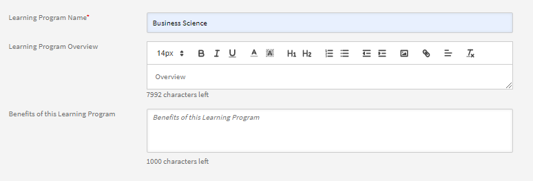
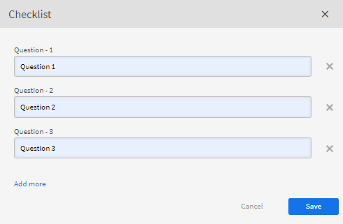

# 강의 생성, 수정 및 게시

Learning Manager 강의, 인증, 학습 프로그램을 생성하는 방법을 알아보려면 이 문서를 읽어 보십시오.

작성자는 강의, 인증 및 학습 계획과 같은 학습 객체를 생성할 수 있습니다. 학습자는 이러한 학습 객체를 수료하고 관리자는 학습자의 진행 상태를 추적할 수 있습니다.

## Learning Manager의 강의 {#coursesincaptivateprime}

Adobe Learning Manager를 사용하면 작성자는 가상 교육, 자가 진행식 교육, 강의실 교육 및 활동과 관련된 하나 이상의 모듈을 사용하여 강의를 생성할 수 있습니다. 책임자는 더 나아가 이러한 강의를 사용하여 강의 인스턴스를 생성하고, 학습자를 등록하고, 배지를 할당하고, 이들 강의에 대한 피드백을 활성화할 수 있습니다. 해당 강의로 학습 프로그램, 학습 계획 및 인증을 생성할 수도 있습니다.

작성자는 모든 e러닝 도구를 사용하여 만든 e러닝 콘텐츠를 사용할 수 있습니다. 지원되는 다른 강의 형식으로는 비디오 파일, PDF, doc, docx, PPT 및 PPTX가 있습니다.

## 강의 생성 - 기본 워크플로우 {#createacoursebasicworkflow}

강의를 생성하려면 아래 단계를 따르십시오.

1. 작성자로 Adobe Learning Manager에 로그인합니다. 작성자에게만 강의를 생성할 권한이 있습니다. 이제 시작 페이지에서 **[!UICONTROL 강의 생성]**.
1. 에 **강의 개요** 페이지에서 강의 이름을 입력합니다. 이제 강의 카드에 표시되는 이 강의에 대한 간단한 설명을 입력합니다. 이 설명은 140자를 초과할 수 없습니다. 그런 다음 강의 세부 정보 페이지에 표시되는 강의의 세부 개요를 입력합니다. 설명은 1500자를 초과할 수 없습니다.

   작성자는 강의에 모듈을 추가하는 동안 모듈의 설명을 볼 수 있습니다.

1. 다른 언어로 코스를 사용할 수 있게 하려면 페이지의 왼쪽 상단에서 새 언어 추가 를 클릭합니다. 강의를 사용할 수 있게 하려는 언어를 선택합니다. 다음을 수행합니다. **[!UICONTROL 저장]**. 자세한 내용은 다음을 참조하세요. [다른 언어용 콘텐츠 추가](/help/migrated/authors/feature-summary/content-library.md).
1. **강의 설정 수정**-

   1. 강의 설정 페이지에서 강의 스킬을 선택합니다. 스킬 드롭다운 목록에서 필요한 스킬을 선택합니다. 그런 다음 레벨 드롭다운 목록에서 필요한 레벨을 선택합니다.
   1. 강의 스킬, 레벨을 선택하고 스킬에 대한 점수를 설정합니다. 필요한 경우 더 많은 기술을 추가하세요.
   1. (으)로부터 **등록 유형** 드롭다운 목록에서 등록 유형을 선택합니다.

   등록 유형은 다음과 같습니다.

   * **관리자 지정:** 관리자만 이러한 강의를 지명할 수 있습니다. 학습자는 이러한 유형의 강의에 등록할 수 없습니다.
   * **관리자 승인됨:** 관리자는 이러한 강의를 승인합니다. 학습자는 해당 강의에 등록할 수 있지만 관리자의 승인 없이는 해당 유형의 강의에 직접 등록할 수 없습니다. 학습자가 이러한 유형의 강의에 등록하면 관리자에게 알림 요청이 전송됩니다. 관리자의 승인에 따라 학습자에게 해당 강의가 등록됨으로 나열됩니다.
   * **자가 등록:** 학습자는 해당 유형의 강의에 직접 등록할 수 있습니다.

1. 변경 사항을 저장하려면 를 클릭합니다. **[!UICONTROL 저장]**. 강의를 게시하려면 **[!UICONTROL 게시]**.

## 강의 생성 - 고급 워크플로우 {#createacourseadvancedworkflow}

1. 작성자로 Adobe Learning Manager에 로그인합니다. 작성자에게만 강의를 생성할 권한이 있습니다. 이제 시작 페이지에서 **[!UICONTROL 강의 생성]**.
1. 에 **강의 개요** 페이지에서 강의 이름을 입력합니다. 이제 강의 카드에 표시되는 이 강의에 대한 간단한 설명을 입력합니다. 이 설명은 140자를 초과할 수 없습니다. 그런 다음 강의 세부 정보 페이지에 표시되는 강의의 세부 개요를 입력합니다. 설명은 1500자를 초과할 수 없습니다.
1. 다른 언어로 코스를 사용할 수 있게 하려면 페이지의 왼쪽 상단에서 새 언어 추가 를 클릭합니다. 강의를 사용할 수 있게 하려는 언어를 선택합니다. 다음을 수행합니다. **[!UICONTROL 저장]**. 자세한 내용은 다음을 참조하세요. [다른 언어용 콘텐츠 추가](/help/migrated/authors/feature-summary/content-library.md).
1. **강의 설정 수정**-

   1. 강의 설정 페이지에서 강의 스킬을 선택합니다. 스킬 드롭다운 목록에서 필요한 스킬을 선택합니다. 그런 다음 레벨 드롭다운 목록에서 필요한 레벨을 선택합니다.
   1. 강의 스킬, 레벨을 선택하고 스킬에 대한 점수를 설정합니다. 필요한 경우 더 많은 기술을 추가하세요.
   1. (으)로부터 **등록 유형** 드롭다운 목록에서 등록 유형을 선택합니다.

   등록 유형은 다음과 같습니다.

   * **관리자 지정:** 관리자만 이러한 강의를 지명할 수 있습니다. 학습자는 이러한 유형의 강의에 등록할 수 없습니다.
   * **관리자 승인됨:** 관리자는 이러한 강의를 승인합니다. 학습자는 해당 강의에 등록할 수 있지만 관리자의 승인 없이는 해당 유형의 강의에 직접 등록할 수 없습니다. 학습자가 이러한 유형의 강의에 등록하면 관리자에게 알림 요청이 전송됩니다. 관리자의 승인에 따라 학습자에게 해당 강의가 등록됨으로 나열됩니다.
   * **자가 등록:** 학습자는 해당 유형의 강의에 직접 등록할 수 있습니다.

1. 강의의 가격을 설정할 것인지 무료로 제공할 것인지 선택합니다. 강의를 유료로 제공하려면 다음 옵션을 선택합니다. **[!UICONTROL 유료]**&#x200B;을 입력하고 가격을 지정합니다. 그러면 강의 카드와 학습자용 강의 개요 페이지에 가격이 표시됩니다.

   참고: 이 옵션은 Adobe Commerce 커넥터가 구성된 경우에만 사용할 수 있습니다.

1. 학습자가 강의에서 스스로 등록을 취소할 수 있는 기능을 제공하려면 확인란을 활성화합니다 **학습자는 직접 등록을 취소할 수 있습니다**.
1. **인스턴스 구성**

   이 옵션을 활성화하면 진행 중 상태의 학습자가 다른 인스턴스를 방문하여 등록할 수 있습니다. 그런 다음 학습자는 이전 인스턴스의 진행률을 유지할 수 있습니다.

   강의를 게시한 후 설정 페이지로 돌아오면 옵션을 더 이상 편집할 수 없습니다.

   다음 강의 유형에 대해 해당 옵션을 활성화할 수 있습니다.

   * 자기 주도
   * 강의실
   * 활동
   * 블렌드

   참고: 강의를 복제하는 동안 소스 강의에서 인스턴스 구성 옵션을 활성화한 경우, 대상 강의에서 옵션은 비활성화된 상태로 유지됩니다.

   **에 대한 인스턴스 전환이 지원되지 않습니다.**:

   * 유료 과정
   * 관리자가 지정한 등록 유형 강의입니다.

   카탈로그를 통해 공유할 경우 인스턴스 전환 구성이 피어 계정으로 전파되지 않으며, 대상 강의에서 옵션은 비활성화된 상태로 유지됩니다.

1. **복수 등록**

   이를 통해 한 기간 또는 다른 기간에 둘 이상의 강의 인스턴스에 학습자를 등록할 수 있습니다.

   토글 활성화 **복수 등록** 학습자의 다양한 강의 등록 간 전환 인스턴스 전환을 활성화한 경우 다중 등록을 사용할 수 없습니다.

1. 강의를 수강하기 전에 완료해야 하는 사전 필수 강의를 선택합니다. 강의 필드를 클릭하고 강의 목록에서 선택합니다.
1. 활성화 **활성화** **사전 요구 사항** 필수 강의를 필수 강의로 지정하려는 경우 확인란.
1. 강의와 관련된 태그로 키워드를 추가합니다. 이러한 태그는 학습자가 검색 중에 강의를 쉽게 찾는 데 도움이 됩니다. 추가한 모듈을 기반으로 이러한 태그가 자동으로 추가됩니다. 이 강의에 추가할 다른 태그가 있는 경우 계속해서 해당 태그를 입력할 수 있습니다.
1. 강의와 관련된 태그로 키워드를 추가합니다. 이러한 태그는 학습자가 검색 중에 강의를 쉽게 찾는 데 도움이 됩니다. 추가한 모듈을 기반으로 이러한 태그가 자동으로 추가됩니다. 이 강의에 추가할 다른 태그가 있는 경우 계속해서 해당 태그를 입력할 수 있습니다.
1. 자동 사용 중지 필드에서 강의를 중단할 날짜를 선택합니다. 책임자는 먼저 자동 사용 중지 옵션을 활성화해야 합니다.
1. 변경 사항을 저장하려면 를 클릭합니다. **[!UICONTROL 저장]**. 강의를 게시하려면 **[!UICONTROL 게시]**.

## 게임화 점수

강의 및 강의 인스턴스 레벨에서 게임화 점수를 할당할 수 있습니다. 이를 통해 다양한 강의 또는 인스턴스에 점수를 부여할 수 있습니다. 학습자는 특정 강의를 수강하거나 다른 강의보다 특정 강의 인스턴스를 선호할 수 있습니다.

1. 강의 인스턴스 레벨에서 **[!UICONTROL 게임화 점수]**.


*게임화 점수 설정*

1. 선택 **[!UICONTROL 편집]**.
1. 강의 레벨 설정 사용 을 선택하면 다음 옵션이 표시됩니다.

   * **[!UICONTROL 완료 시]**: 강의를 완료할 때 학습자가 100점을 획득하도록 하려면 이 토글을 선택합니다.
   * **추가 규칙**

      * **[!UICONTROL 조기 완료]**: 이 옵션을 선택하면 강의를 완료하면 처음 30명의 학습자에게 100점이 부여됩니다.
      * **[!UICONTROL 적시 완료]**: 이 옵션을 선택하면 학습자가 999일 이내에 강의를 완료하면 100점이 부여됩니다.

1. 다음을 선택하는 경우 **[!UICONTROL 사용자 정의 설정 사용]**&#x200B;다음과 같은 옵션이 표시됩니다.

   * **[!UICONTROL 완료 시]**: 강의를 완료할 때 학습자가 100점을 획득하도록 하려면 이 토글을 선택합니다.
   * **추가 규칙**

      * **[!UICONTROL 조기 완료]**: 이 옵션을 선택하면 특정 점수를 부여할 학습자 수를 결정할 수 있습니다.
      * **[!UICONTROL 적시 완료]**: 이 옵션을 선택하면 학습자가 지정된 시간 내에 강의를 완료했을 때 부여될 점수 수를 결정할 수 있습니다.

   

   *조기 및 적시 완료 설정*

1. 선택 **[!UICONTROL 저장]**.

## 학습 리소스 집계

작성자는 학습 계획 레벨에서 학습 리소스를 집계할 것인지 아니면 개별 강의 레벨로 유지할 것인지 결정할 수 있습니다.

작성자는 **[!UICONTROL 학습 경로]** > **[!UICONTROL 설정]**. 다음을 수행합니다. **[!UICONTROL 편집]**.

(으)로 **[!UICONTROL 리소스]** 섹션, &#39;학습 경로 레벨에서 집계된 구성 강의 리소스 표시&#39; 확인란이 활성화된 경우 강의 레벨에 있는 리소스를 학습 경로 레벨에 표시할지 여부를 표시합니다.

>[!NOTE]
>
>책임자는 학습 경로의 설정 페이지에서 이 옵션을 활성화할 수도 있습니다. 이 옵션은 학습 경로 레벨에 표시되는 강의 레벨에 있는 리소스를 표시합니다.

## 일정 도우미

강사 및 강의실 예약 충돌을 관리합니다. 강사를 강의에 할당하기 전에 강사가 이용할 수 있는 시간과 날짜를 알고 싶다면 일정 관리 도우미 를 사용합니다.

강의를 생성할 때 VC 또는 CR 강의의 경우 스케줄링 지원을 누릅니다.


*일정 도우미 시작*

스케줄링 도우미 창이 실행됩니다.


*일정 관리 대화 상자*

스케줄링 보조에서 다음을 수행할 수 있습니다.

* 강사의 이름을 검색합니다.
* 실력별로 강사를 검색합니다.

### 강사의 이름으로 검색

강사 필드에서 강사 이름을 입력하거나 일부 강사 이름을 검색합니다. 강사 목록이 표시되며 여기서 강사를 선택할 수 있습니다.


*강사 검색*

여러 강사를 선택할 수 있지만 한 번에 한 명의 강사만 할당할 수 있습니다. 선택한 시간이 시간 충돌 창에서 강조 표시됩니다. 강사 옆에 십자 아이콘이 나타나고 이를 클릭하여 강사를 제거합니다.


*여러 강사 검색*

### 스킬별로 강사 검색

단일 또는 다중 스킬을 보유한 강사를 검색합니다. 검색에는 AND 연산자가 사용됩니다.

스킬은 스킬 레벨이 아닌 부분 또는 전체 스킬 이름으로만 검색할 수 있습니다.

조교에 강사 이름, 위치 및 인원 제한을 입력합니다.

강사 검색 상자 오른쪽에 있는 필터 아이콘을 클릭하면 표시되는 스킬도 검색할 수 있습니다. 아래 스크린샷에는 버튼이 표시됩니다.


*스킬별로 강사 검색*

### 사용자 그룹 필터

강사 필드에서 필터를 선택합니다. 다음 항목이 있습니다. **[!UICONTROL 사용자 그룹]** 필터 작성자 또는 사용자 정의 작성자는 사용자 그룹의 값을 사용하여 적합한 강사를 찾을 수 있습니다.

두 필터가 모두 적용되는 경우 사용자 그룹에 속하고 선택한 스킬을 보유한 강사 목록이 표시됩니다.

이는 강의 또는 인스턴스 페이지의 일정 도우미Scheduling Assistant에 적용됩니다.


*사용자 그룹으로 필터링*

### 인스턴스 페이지

아래와 같이 인스턴스 페이지에서 스케줄링 도우미에 액세스할 수도 있습니다.

스케줄링 도우미는 인스턴스 페이지에서도 관리자와 사용자 정의 책임자/작성자도 사용할 수 있습니다.


*인스턴스 페이지에서 강사 예약*

### 위치 검색

강의실 이름과 위치 영역 이름을 모듈 및 일정 관리 페이지에서 모두 지정하여 위치를 검색할 수 있습니다.

## 서식 있는 텍스트 서식

강의, 학습 프로그램, 인증 또는 작업 지원을 만드는 동안 작성자는 텍스트, 이미지와 같은 다양한 유형의 콘텐츠를 입력하거나 다양한 텍스트 서식 옵션을 적용할 수 있습니다.

강의를 만들 때 강의 개요 필드에서 서식 있는 텍스트 편집기를 볼 수 있습니다. 콘텐츠 형식 지정, 이미지 추가, 하이퍼링크 추가 등을 할 수 있습니다.


*서식 있는 텍스트 편집기 실행*

마찬가지로 다음 내용을 작성할 때 서식 있는 텍스트 편집기를 사용하여 설명을 수정할 수 있습니다.

**학습 프로그램**



*학습 프로그램용 서식 있는 텍스트 편집기 사용*

**인증**


*인증에 서식 있는 텍스트 편집기 사용*

**작업 지원**


*작업 지원에 서식 있는 텍스트 편집기 사용*

또한 다른 언어에 대해 서식 있는 텍스트 편집기를 사용할 수 있습니다.

## 헤드리스 사용자 인터페이스를 위한 서식 있는 텍스트 설명 지원

### CSS가 필요한 이유는 무엇입니까?

서식 있는 텍스트는 HTML 태그로 구성됩니다. 태그를 그대로 렌더링하면 브라우저에서 기본 스타일을 적용합니다. 이것은 종종 회사의 스타일 지침과 맞지 않습니다. 지침을 충족하려면 CSS가 필요합니다.

### 기본 스타일

첨부된 CSS 스타일시트에는 Learning Manager에서 적용한 스타일이 포함되어 있습니다. 스타일은 대부분의 사용 사례를 고려하여 조정됩니다. 첨부된 CSS 파일을 다운로드하고 규칙 및 빌드 시스템에 따라 웹 앱으로 가져옵니다. 정의된 CSS 클래스는 ql-editor 클래스에서 네임스페이스 지정되어 있으며 기존 스타일을 방해하지 않습니다.

### 스타일 사용자 정의

기본 스타일은 모든 사용자의 요구를 충족시키지 못할 수도 있습니다. 사용자 정의는 제공된 CSS를 재정의하여 수행할 수 있습니다. 모든 스타일은 ql-editor에서 하위 항목 선택기로 래핑됩니다. 다음 클래스가 사용됩니다.

* 들여쓰기: **li.ql-indent-$number**. $number는 1-9사이의 숫자입니다.
* 크기: **ql-size-small**, **ql-size-large**, **ql-size-huge**

* 맞춤: **ql-align-center**, **ql-align-justify**, **ql-align-right**

* 색상: **ql-color-$color**. $color는 흰색, 빨간색, 주황색, 노란색, 녹색, 파란색, 자주색입니다
* 배경: **ql-bg-$color**. $color는 검은색, 빨간색, 주황색, 노란색, 녹색, 파란색, 자주색입니다
* html 태그: p, ol, ul, pre, blockquote, h1, h2, h3, h4, h5, h6

[사용자 정의에 사용할 CSS 파일입니다.](assets/ql-headless.css)

### 서식 있는 텍스트 개요 렌더링을 지원하도록 API 변경 사항

고객은 헤드리스 인터페이스를 개발할 때 현재 개발 중인 사용자 인터페이스에 학습 객체를 표시해야 합니다. 이를 위해 일반적으로 다음을 사용합니다 [GET /learningObjects](https://learningmanagereu.adobe.com/docs/primeapi/v2/#!/learning_object/get_learningObjects) 표시되는 API입니다. 이제 Learning Manager가 개요 필드에 &#39;서식 있는 텍스트&#39;가 표시되도록 지원하므로 API 응답 의 학습 객체 데이터 모델 역시 동일한 내용을 표시합니다. 아래 API 응답 모델 섹션의 &#39;richTextOverview&#39; 필드를 참조하십시오. 또한 이전에 표시된 필드(&quot;개요&quot;)는 이전 버전과의 호환성을 위해 변경되지 않습니다.

```
{ 
 "data": [ 
 { 
 "id": "string", 
 "type": "string", 
 "attributes": { 
 … 
 "localizedMetadata": [ 
 { 
 "description": "string", 
 "locale": "string", 
 "name": "string", 
 "overview": "string", 
 "richTextOverview": "string" 
 } 
 ], 
 … 
 }, 
 "relationships": { 
 … 
 } 
 } 
 } 
 ] 
} 
```

이미 개요 필드를 사용하고 있는 고객의 헤드리스 인터페이스는 영향을 받지 않으므로 이전과 마찬가지로 일반 텍스트가 표시됩니다. 서식 있는 텍스트의 개요를 활용하려면 작성자 UI에 서식 있는 형식의 학습 객체 개요를 만들어야 합니다. 그러면 Learning Manager가 API 응답 모델에 계속 표시되어 온 일반 텍스트와 별개로 서식 있는 텍스트 개요를 반환하기 시작합니다.

단, UI에서 서식 있는 텍스트를 렌더링하려면 CSS를 추가해야 합니다. 이 내용은 다음 섹션에서 자세히 설명합니다.

## 다중 시도 허용 {#allowmultipleattempts}

책임자가 다중 시도를 활성화한 경우 작성자는 강의 또는 모듈 수준에서 대화형 e러닝 모듈에 대한 다중 시도를 구성할 수 있습니다.


*대화형 e러닝 모듈에 대한 다중 시도 구성*

<table>
 <tbody>
  <tr>
   <td>
    <p><b>옵션</b></p></td>
   <td>
    <p><b>설명</b></p></td>
  </tr>
  <tr>
   <td>
    <p>시도 횟수 설정</p></td>
   <td>
    <p>모듈에 대한 시도 횟수를 무한으로 설정하거나 확실한 제한을 제공할 수 있습니다.<span style="font-size: 0.8125rem;">시도 정보는 활성화되면 학습자에게 표시됩니다. 학습자는 '재시도' 버튼을 클릭하여 모듈을 재시도하도록 선택할 수 있습니다.</span></p></td>
  </tr>
  <tr>
   <td>
    <p>모듈이 완료되거나 전달되면 새 시도 중지</p></td>
   <td>
    <p>학습자가 새 시도 옵션을 선택하지 못하도록 중지 시점을 구성하려면 "모듈이 완료되거나 전달되면 새 시도 중지" 확인란을 활성화합니다. '재시도' 옵션은 모듈을 성공적으로 완료하면 학습자 보기에서 제거됩니다.</p></td>
  </tr>
  <tr>
   <td>
    <p>시도 횟수 0 사이에 모듈 잠금:0:1 형식: 일/시간/분</p></td>
   <td>
    <p>" 확인란을 활성화하여 시도 간 특정 시간 동안 모듈을 잠글 수 있습니다<b>시도 횟수 0 사이에 모듈 잠금:0:1 형식: 일/시간/분</b>". 모듈이 잠겨 있으면 학습자는 제공된 잠금 시간이 경과할 때까지 모듈을 방문할 수 없습니다. </p>
    <p>' '을(를) 선택하여 시도의 종료 기준을 정의할 수 있습니다.<b>플레이어 닫기</b>' 또는 '<b>완료</b>' 확인란.</p></td>
  </tr>
  <tr>
   <td>
    <p>플레이어 닫기</p></td>
   <td>
    <p>조건을 '(으)로 선택하면 모든 모듈 실행이 새 시도로 처리됩니다.<b>플레이어 닫기</b>'. 학습자에게 모듈 잠금 세부 사항과 플레이어 종료 시도 세부 사항을 묻는 메시지가 표시됩니다.</p></td>
  </tr>
  <tr>
   <td>
    <p>완료</p></td>
   <td>
    <p>시도의 끝이 다음에 기반을 둔 경우 <b>완료</b>그런 다음 콘텐츠 성공 기준에 따라 계산됩니다. 학습자는 콘텐트에서 완료 정보를 보낼 때까지 모듈을 다시 시도할 수 없습니다. 시도가 완료되면 모듈 잠금 및 시도 세부 정보가 학습자에게 전달됩니다.</p></td>
  </tr>
  <tr>
   <td>
    <p>모듈 완료를 위한 시간 제한 설정</p></td>
   <td>
    <p>작성자는 확인란을 선택하여 모듈을 완료하는 데 필요한 시간 제한을 설정할 수 있습니다.<b>모듈 완료를 위한 시간 제한 설정</b>".</p>
    <p>모든 플레이어 실행은 새로운 시도로 간주되며 실행 중 학습자에게 시간 세부 정보를 묻는 메시지가 표시됩니다.</p>
    <p><b>참고:</b><span style="font-size: 0.8125rem;">이 시간이 경과하면 이 시도가 자동으로 종료됩니다. 플레이어를 닫아도 현재 시도가 종료됩니다.</span></p></td>
  </tr>
  <tr>
   <td>
    <p>모듈 수준에서 다중 시도</p></td>
   <td>
    <p>'시도 횟수 설정' 드롭다운 목록에서 '모듈 수준'에 대한 시도를 선택하면 개별 모듈 수준에서 옵션을 구성할 수 있습니다.</p></td>
  </tr>
 </tbody>
</table>

## 강의 모듈 {#coursemodules}

### 모듈 추가 {#addmodules}

이제 콘텐츠, 사전 작업 및 테스트 모듈을 추가할 수 있습니다. **내용** 모듈은 과정을 구성하는 주요 모듈입니다. **사전 작업** 모듈에는 학습자가 강의를 준비하는 데 도움을 주는 몇 가지 기본 정보가 포함되어 있습니다. 이러한 모듈은 학습자가 강의를 완료하는 필수 요소는 아닙니다. **테스트** 모듈은 학습자가 이미 해당 콘텐츠를 알고 있고 규정 준수 요구 사항을 충족하기 위해 테스트를 받고자 하는 경우, 해당 콘텐츠를 건너뛰고 테스트를 수행할 수 있도록 지원합니다.

콘텐츠 모듈을 추가하려면 다음 단계를 수행하십시오.

1. 다음을 수행합니다. **[!UICONTROL 모듈 추가]**. 모듈을 추가하는 네 가지 옵션을 볼 수 있습니다. 첫 번째 옵션은 자가 진행식 모듈을 추가하는 것입니다. 사용자가 만들어 Adobe Learning Manager의 모듈 라이브러리에 추가하는 모듈입니다. 두 번째 옵션은 가상 강의실을 설정하는 것입니다. 세 번째는 강의실 모듈을 설정하는 것이고, 네 번째는 활동 모듈이다.

   

   *강의 모듈 추가*

   **자가 진행식 모듈:** 이 모드에서는 원하는 속도로 강의 모듈을 시작 및 완료할 수 있습니다. 나만의 일정을 설정할 수 있습니다.

   이 옵션을 클릭하면 모듈 라이브러리에 이미 추가된 자가 진행식 모듈 목록이 표시됩니다. 여기에서 목록을 스크롤하여 추가할 모듈을 선택하거나 검색 필드에 모듈 이름 또는 모듈 태그를 입력하여 모듈을 검색할 수 있습니다.

   모듈을 선택한 후 **[!UICONTROL 추가]**. 이러한 모듈은 이제 콘텐츠 섹션 아래에 표시됩니다.

   모듈을 재정렬할 수도 있습니다. 모듈을 드래그하여 위 또는 아래로 이동하고 적절한 순서로 모듈을 정렬합니다.

   **가상 강의실 모듈:** 이 모드에서 학습자는 교육을 받은 강사가 제공하는 라이브 온라인 강의에 참석할 수 있습니다. 제목, 설명을 입력하고 세션 기간을 설정합니다. 전화 회의 URL 및 세션 진행을 위한 강사를 지정할 수도 있습니다. 변경 사항을 저장하려면 를 클릭합니다. **[!UICONTROL 완료]**.

   

   *VC 모듈 추가*

   가상 교실 구성 대화 상자를 사용하여 강의를 생성할 때 **컨퍼런스 시스템** 을(를) 생성합니다. 이벤트에 대한 회의 주최자를 원하는지 여부를 선택합니다.

   다음을 선택하는 경우 **예** 회의 주최자의 경우 주최자 이름을 입력해야 합니다. 이름을 입력하고 주최자를 선택합니다.

   **로비 우회**

   * 다음을 선택하는 경우 **예**, 모든 학습자는 회의에 참여할 수 있습니다.
   * 다음을 선택하는 경우 **아니요**, 주최자에게 학습자의 회의 참여를 허용하거나 차단하는 요청이 전송됩니다.

   **참고:** 학습자는 Microsoft Teams에서 사용할 수 있어야 합니다. 그러나 학습자는 Learning Manager에 게스트로 참여할 수 있습니다.

   **강의실 모듈:** 이 모드에서 학습자는 교육을 받은 강사가 진행하는 직접 강의에 참석합니다. 제목, 설명을 입력하고 세션 기간을 설정합니다. 수업 위치와 강사를 지정하여 세션을 진행할 수도 있습니다. 변경 사항을 저장하려면 를 클릭합니다. **[!UICONTROL 완료]**.

   

   *강의실 모듈 추가*

   가상 교실 구성 대화 상자에서 강의를 생성할 때 컨퍼런스 시스템을 생성한 Microsoft Teams 연결에 설정합니다. 이벤트에 대한 회의 주최자를 원하는지 여부를 선택합니다.

   회의 주최자에 대해 [예]를 선택한 경우 주최자 이름을 입력해야 합니다. 주최자의 이름을 입력하고 주최자를 선택합니다.

   **로비 우회**

   * [예]를 선택하면 모든 학습자가 회의에 참여할 수 있습니다.
   * [아니요]를 선택하면 주최자에게 학습자의 회의 참여를 허용하거나 차단하는 요청이 전송됩니다.

   **참고:** 학습자가 게스트로 Microsoft Teams에 가입하려면 이메일을 입력해야 합니다. 전자 메일이 Learning Manager에 있어야 합니다.

   **활동 모듈:** 이 모드에서 학습자는 워크샵, 연습, 질문 및 기타 학습 활동과 같은 일련의 활동을 완료해야 합니다. 제목, 설명 및 참조할 외부 URL을 입력합니다. 변경 사항을 저장하려면 를 클릭합니다. **[!UICONTROL 완료]**.

   

   *활동 모듈 추가*

   활동 유형 파일 제출 및 xAPI 기반 모듈에 대한 강의에서 활동 모듈을 추가하는 동안 지속 기간을 지정할 수 있습니다.

1. 마찬가지로, 사전 작업 및 테스트 모드에 대한 모듈을 추가합니다.
1. 원하는 대로 모듈의 순서 지정 유형을 &#39;정렬됨&#39; 또는 &#39;정렬되지 않음&#39;으로 선택합니다.

   다음을 선택할 경우 **순차**&#x200B;에서 모듈은 생성한 시퀀스와 동일한 시퀀스에 표시됩니다. 다음을 선택할 경우 **비순차**, 모듈이 순서대로 나열되지 않습니다. 학습자는 원하는 순서로 모듈을 완료할 수 있습니다.

1. 필수 모듈 드롭다운 목록에서 학습자가 강의를 완료하기 위해 거쳐야 하는 모듈의 수를 선택합니다.
1. 강의의 표지 이미지와 배너 이미지를 추가합니다. 카탈로그는 책임자가 만듭니다. 자세한 내용은 다음을 참조하세요. [카탈로그](/help/migrated/administrators/feature-summary/catalogs.md).

   **참고:** 권장 치수는 다음과 같습니다.

   * **표지 이미지:** 300px x 300px
   * **배너 이미지:** 1600px x 140px

1. 페이지의 오른쪽 상단 모서리에서 **[!UICONTROL 저장]**.

## 체크리스트 {#create-checklist}

평가는 모든 LMS의 중요한 요소입니다. 온라인 평가는 주제에 대한 학습자의 이해를 평가하는 가장 좋은 방법 중 하나입니다. 그러나 종종, 그 사람이 그 일을 하는 동안, 그가 필요한 일을 수행하는 것을 관찰함으로써 그 사람의 이해력을 평가하는 것이 필요합니다.

점포 직원이나 창고 근무자가 일상적으로 수행해야 하는 업무에 대해 평가를 받는 것을 고려한다. 이는 커피 머신을 수리하기 위해 수행되는 단계 또는 재료를 포장하는 데 포함되는 단계일 수 있다. 강사는 체크리스트를 기반으로 이러한 작업에 대한 직원을 평가하고 평가 활동에서 합격 또는 불합격으로 평가할 수 있습니다.

### 체크리스트 만들기 {#createachecklist}

작성자만 체크리스트를 만들 수 있습니다. 체크리스트는 활동 모듈의 유형입니다. 활동 모듈을 설정하는 동안 작성자는 다음과 같이 활동을 선택할 수 있습니다. **체크리스트**&#x200B;아래와 같이 표시됩니다.


*체크리스트 만들기*

이 옵션을 선택하면 **체크리스트**, 몇 가지 추가 옵션이 표시됩니다.

**체크리스트 유형:** 원하는 옵션을 선택합니다. **예/아니요** 또는 **1-5**. [예/아니요]를 선택하면 체크리스트에 [예] 또는 [아니요]로만 대답할 수 있는 질문이 포함됩니다. 1-5를 선택하면 리커트 체크리스트가 표시되며, 여기서 5점 척도로 질문의 등급을 매길 수 있습니다.

**합격 기준:**

<table>
 <tbody>
  <tr>
   <td>
    <p>만약 당신이 선택했다면 <b>예/아니요</b>그런 다음...</p></td>
   <td>
    <p>만약 당신이 선택했다면 <b>1-5</b>그런 다음...</p></td>
  </tr>
  <tr>
   <td>
    <p>합격 기준을 응답 수로 예로 설정합니다. 예를 들어 3을 입력하면 최소 3을 받은 학습자는 해당 강의에 합격합니다 <b>예 </b>강사가 평가한 응답</p></td>
   <td>
    <p>합격 조건을 1-5 사이의 임의의 숫자의 임계값으로 설정합니다. 예를 들어 2와 4를 입력하면 학습자가 최소 도달할 경우 과정을 통과합니다 <b>2 </b>점수가 다음보다 크거나 같은 평가 <b>4</b>.</p></td>
  </tr>
 </tbody>
</table>

학습자를 평가할 강사 또는 강사를 선택합니다.

또한 주석 또는 메모가 있는 경우 **강사 참고 사항** 텍스트 필드.

이제 체크리스트 질문을 추가합니다. 다음을 수행합니다. **[!UICONTROL 추가]**. 최대 150개의 질문만 추가할 수 있습니다.



*체크리스트 질문 추가*

질문을 더 추가하려면 **[!UICONTROL 더 추가하기]**.

변경 사항을 저장하고, 모듈을 추가하고, 강의를 게시합니다.

### 스킬 추가 {#addskills}

이 페이지에서 다음 세부 정보를 입력합니다.

1. 강의 스킬, 레벨을 선택하고 스킬에 대한 점수를 설정합니다. 필요한 경우 더 많은 기술을 추가하세요.

   

   *강의에 스킬 추가*

1. 등록 유형을 선택합니다. 옵션은 다음과 같습니다.

   * **관리자 지정:** 관리자만 이러한 강의를 지명할 수 있습니다. 학습자는 이러한 유형의 강의에 등록할 수 없습니다.
   * **관리자 승인됨:** 관리자는 이러한 강의를 승인합니다. 학습자는 해당 강의에 등록할 수 있지만 관리자의 승인 없이는 해당 유형의 강의에 직접 등록할 수 없습니다. 학습자가 이러한 유형의 강의에 등록하면 관리자에게 알림 요청이 전송됩니다. 관리자의 승인에 따라 학습자에게 해당 강의가 등록됨으로 나열됩니다.
   * **자가 등록:** 학습자는 해당 유형의 강의에 직접 등록할 수 있습니다.

1. 학습자가 강의에서 스스로 등록을 취소할 수 있는 기능을 제공하려면 확인란을 활성화합니다 **학습자는 직접 등록을 취소할 수 있습니다**.
1. 강의를 수강하기 전에 완료해야 하는 사전 필수 강의를 선택합니다. 강의 필드를 클릭하고 강의 목록에서 선택합니다.

   

   *필수 강의 추가*

1. 활성화 **사전 요구 사항** 필수 강의를 필수 강의로 지정하려는 경우 확인란.
1. 강의와 관련된 태그로 키워드를 추가합니다. 이러한 태그는 학습자가 검색 중에 강의를 쉽게 찾는 데 도움이 됩니다. 추가한 모듈을 기반으로 이러한 태그가 자동으로 추가됩니다. 이 강의에 추가할 다른 태그가 있는 경우 계속해서 해당 태그를 입력할 수 있습니다.
1. 텍스트 영역을 클릭하고 제안에서 프로필을 선택하여 이 강의의 대상 참가자의 프로필을 추가합니다.
1. 강의의 리소스 파일을 추가 자료로 추가합니다. 텍스트, 비디오 또는 오디오 파일과 같은 재질을 드래그합니다.
1. 이제 해당 프로필을 추천 강의로 보유한 학습자에게 이 강의를 사용할 수 있습니다. 이 섹션에서 학습자를 위한 추가 리소스를 첨부할 수도 있습니다. 학습자는 나중에 참조할 수 있도록 이 파일을 다운로드할 수 있습니다. 이러한 모든 변경 사항을 완료했으면 계속 진행하여 을 클릭합니다. **[!UICONTROL 저장]** 오른쪽 상단 그러면 강의가 초안으로 저장됩니다. 강의는 기본적으로 초안으로 저장됩니다.

## 모듈용 강사 할당 {#assigninstructorsformodules}

1. 강의 모듈을 만든 후 해당 모듈에 강사를 할당할 수 있습니다. 작성자 대시보드에서 **[!UICONTROL 강의 카탈로그]**.
1. 강사를 할당할 모듈이 있는 강의를 클릭합니다.
1. (으)로부터 **모듈 추가** 섹션에서 강사를 할당할 모듈을 클릭합니다.
1. (으)로 **강사** 필드에서 강사 역할을 할당할 사용자의 사용자 이름을 지정합니다.

   

   *사용자에게 강사 역할 할당*

1. 업데이트를 사용하여 강의를 다시 게시하려면 **[!UICONTROL 다시 게시]**.

## 관찰 체크리스트

이제 강사 외에도 관리자가 체크리스트 모듈을 검토할 수 있습니다. 사람 관리자는 물론 매장 관리자나 위치 관리자와 같은 비계층적 관리자도 체크리스트를 검토하고 완료할 수 있다.

강의 작성자는 체크리스트 모듈을 설정하는 동안 &quot;검토자&quot; 섹션에서 이러한 역할 옵션을 선택하여 인물 관리자와 비계층적 관리자(해당하는 경우)를 검토자로 추가할 수 있습니다. 강의 인스턴스 레벨에서 수행할 수 있습니다.


*활동 모듈에 검토자 추가*

&quot;**[!UICONTROL +관리자]**&quot; 옵션을 사용하면 조직 계층 구조에서 학습자의 관리자가 체크리스트를 자동으로 검토할 수 있습니다. 관리자 이름을 개별적으로 검색하여 추가할 필요는 없습니다.

계정 관리자가 활성 필드 옵션을 사용하여 위치 관리자 또는 사이트 관리자와 같은 비계층적 관리자 역할을 설정한 경우 해당 관리자 역할을 선택하여 체크리스트를 검토할 수 있도록 설정할 수 있습니다.

관리자 이름을 개별적으로 검색하여 추가할 필요는 없습니다. 학습자가 체크리스트 강의에 등록하면 선택한 강사와 함께 검토를 위해 관리자/스토어 관리자에게 자동으로 알림이 전송됩니다. 이 작업 과정을 통해 작성자는 개별 관리자의 이름을 언급하지 않아도 됩니다.

위에 제공된 샘플 스크린샷에서 &quot;**[!UICONTROL +스토어 관리자]**&quot; 옵션을 선택하면 학습자에게 연결된 비계층적 관리자가 자동으로 활성화되어 체크리스트를 검토합니다. 여기서 &quot;스토어&quot;는 관리자가 정의한 활성 필드로 대체됩니다.

체크리스트 모듈 업데이트에는 학습자가 체크리스트 모듈이 있는 강의에 등록하면 강사 및 관리자에게 알림이 제공됩니다. 리뷰어는 Learning Manager 알림 센터뿐만 아니라 강사/관리자 대시보드에서 체크리스트 작업 기한에 관한 알림을 받습니다.

<!---->

검토자는 강사/관리자로 로그인할 때 [알림] 메뉴뿐만 아니라 [체크리스트] 메뉴에서 보류 중인 모든 체크리스트 검토 항목에 대한 정보를 볼 수 있습니다.


*인증 승인*

[검토 체크리스트]를 클릭하면 검토자가 평가를 완료할 수 있습니다.


*보류 중인 체크리스트 검토 항목 검토*

학습자 평가, 검토자 이름, 역할, 전자 메일에 대한 자세한 정보가 포함된 확인란에 보고서를 다운로드할 수 있습니다.

체크리스트 보고서 csv에는 새로운 필드와 업데이트된 필드가 있습니다.

* 강사 이름 대신 검토자 이름
* 강사 이메일 대신 검토자 이메일
* 검토자 역할 - 가능한 값은 관리자, 저장소/위치 관리자, 강사입니다.

## 강의 미리 보기 {#previewacourse}

강의가 생성되어 초안으로 저장되면 학습자로 강의를 미리 본 다음, 게시하여 강의 카탈로그에서 사용할 수 있습니다.

강의를 미리 보려면 **[!UICONTROL 학습자로 미리 보기]**.


*학습자로 강의 미리 보기*

그러면 코스가 열립니다 **개요** 모듈, 순서 및 강의와 관련된 기타 세부 정보를 볼 수 있는 페이지입니다.


*모듈 및 기타 관련 세부 정보 보기*

학습자가 이 강의를 어떻게 경험할 수 있는지 알아보려면 이들 모듈을 각각 클릭하여 재생을 시작하십시오. 그러면 Fluidic Player에서 강의 재생이 시작됩니다.

## 강의 게시 {#publishacourse}

학습자로 강의를 미리 본 후 학습자가 사용할 수 있도록 강의를 게시할 수 있습니다. 강의가 아직 초안 모드에 있습니다.

일반적인 과정 수명 주기는 다음과 같습니다.

* **초안** - 작성자가 강의 생성 및 저장을 완료하면 이 상태에서는 학습자가 아직 강의를 수강할 수 없습니다.
* **게시됨** - 작성자가 강의 게시를 완료했을 때. 이 상태에서는 학습자가 강의를 등록할 수 있습니다. 이 상태에서 강의를 편집할 수도 있습니다.
* **중단됨** - 강의를 게시한 후 작성자가 학습자 카탈로그에 강의가 나타나는 것을 원하지 않으면 강의를 중단 상태로 변경할 수 있습니다.
* **삭제됨** - Adobe Learning Manager에서 완전히 제거된 상태의 강의입니다. 작성자만 초안 또는 중단됨 상태의 강의를 삭제할 수 있습니다.


*과정 수명 주기의 과정*

생성한 과정을 게시하려면 **[!UICONTROL 게시]** 를 클릭합니다.


*강의 게시*

나타나는 확인 팝업 메시지에서 **[!UICONTROL 확인]**.

이제 강의 카탈로그에서 강의를 사용할 수 있습니다.

## 강의 보기 {#viewacourse}

작성자로 사용할 수 있는 모든 강의 목록을 볼 수 있습니다. Learning Manager 계정에서 모든 강의를 보려면 &#39;강의 카탈로그&#39;를 클릭합니다. Learning Manager에서 작성한 모든 강의를 보려면 **[!UICONTROL 내 강의]**.

강의 카드에서 옵션에 마우스를 가져가 클릭합니다 **[!UICONTROL 강의 보기]**.


*강의 보기*

강의 정보 창이 표시됩니다. 강의가 읽기 전용 모드입니다. 강의를 수정하려면 다음을 클릭합니다. **[!UICONTROL 편집]**.

## 강의 취소 {#retireacourse}

강의를 중단하면 강의에 새로운 학습자를 등록할 수 없습니다. 이미 등록된 학습자는 강의를 수강할 수 있습니다.

강의를 종료하려면 강의 카드에서 옵션에 마우스를 가져가 강의 종료를 클릭합니다.


*강의 취소*

표시되는 확인 팝업에서 을 클릭합니다. **[!UICONTROL 예]**.

## 강의 복제 {#duplicateacourse}

강의 사본을 만든 다음 강의를 수정할 수 있습니다. 과정을 백업하려면 과정을 복제할 수 있습니다.

## 강의 검색 {#searchforcourses}

Adobe Learning Manager에서는 원하는 강의를 빠르고 쉽게 찾을 수 있습니다. 다음과 같은 방법으로 강의를 검색할 수 있습니다.

**검색 필드:** 오른쪽 상단에 있는 검색 창을 클릭합니다. **강의 카탈로그** 페이지. 강의 이름 또는 강의와 관련된 키워드를 입력합니다. 강의 생성 중에 추가된 태그를 사용하여 검색할 수도 있습니다. 태그는 강의 검색 필드 내에서 검색할 수 있습니다. 즉, 태그를 입력할 때 검색 필드에 표시됩니다.


*강의 검색*

**강의 목록 필터링:** 전체, 게시됨, 초안, 중단됨 등의 상태별로 강의를 필터링할 수 있습니다. 선택한 내용에 따라 필터링된 강의 목록을 보고 필요한 강의를 선택할 수 있습니다.

작성자는 필요한 강의를 더 잘 찾기 위해 강의를 정렬할 수도 있습니다. 다음을 수행합니다. **[!UICONTROL 정렬 기준]** 을 입력한 후, 알파벳 오름차순, 알파벳 내림차순, 강의 생성 날짜, 강의 업데이트 날짜 및 강의 효과를 선택합니다.


*강의 목록 필터링*

## 강의에 학습자 등록 {#enrolllearnersinacourse}

학습자를 강의에 등록하거나 관리자가 학습자를 강의에 지명할 수 있도록 하려면 관리자만 강의에 학습자를 등록할 수 있는 권한이 있으므로 관리자 모드로 전환해야 합니다.

관리 모드로 전환하려면 다음을 수행하십시오.

1. 프로필 사진을 클릭한 다음 관리자를 선택합니다.
1. 관리 모드에서 **[!UICONTROL 강의]** 왼쪽 창에. 이 페이지에서는 Learning Manager 계정의 모든 작성자가 만든 모든 강의를 볼 수 있습니다.
1. 학습자를 등록하려면 강의 카드에 마우스를 가져다 대면 옵션이 표시됩니다 **학습자 등록**. 이 옵션을 클릭합니다.

   

   *강의에 학습자 등록*

1. 학습자 등록 대화 상자의 오른쪽 상단에 옵션이 표시됩니다. **기본 인스턴스** 이(가) 선택되었습니다. 작성자가 강의를 생성하면 강의의 기본 인스턴스가 생성됩니다.

   

   *강의의 기본 인스턴스 보기*

1. 학습자 포함 필드에 학습자명을 입력하고 학습자를 선택합니다. 여기에 사용자 그룹을 추가할 수도 있습니다. Learning Manager 계정에 모든 학습자를 등록하려면 모두 입력을 시작합니다. 팀에 학습자를 등록할 수도 있습니다.

   

   *강의에 학습자 추가*

1. 강의에서 학습자를 제외하려면 **학습자 제외** 필드.
1. 학습자를 등록하고 나면 **[!UICONTROL 계속]**. 학습자 등록 대화 상자에서 등록 요약을 볼 수 있습니다.

   

   *강의 등록 요약 보기*

1. 강의에 모든 학습자를 등록하려면 **[!UICONTROL 등록]**. 이들 학습자는 이제 이 강의에 등록되었습니다. 학습자는 강의 진행을 위한 알림을 받습니다. 학습자를 더 등록하려면 등록 절차를 반복합니다.

## Connect VC 모듈에 대한 강의 인스턴스 페이지 변경 사항 {#connect-vc}

Connect 과정을 검색하는 동안 두 가지 유형의 회의실을 만들 수 있습니다.

* 동적
* 영구

영구 URL은 항상 고정됩니다. 그러나 Connect와 자신의 회의실이 없는 사용자의 경우 런타임에 동적 회의실을 사용해야 합니다. 그러면 사람들이 모임에 참가할 수 있습니다.


*동적 회의실 옵션*

이제 다음에서 지속 회의실의 URL을 변경할 수 있습니다. **강의 인스턴스** 페이지.

<!--|  |  |
|---|---|-->

## 강의에서 학습자 등록 취소 {#unenrolllearnersfromacourse}

강의를 생성하는 동안 작성자는 해당 옵션을 활성화할 수 있습니다 **학습자는 직접 등록을 취소할 수 있습니다**&#x200B;을 눌러 강의를 듣는 학습자가 강의에서 참여할 수 있도록 합니다.

책임자는 강의에서 학습자의 등록을 취소할 수도 있습니다.


*강의에서 학습자 등록 취소*

자세한 내용은 다음을 참조하십시오. [학습자 등록 취소](/help/migrated/administrators/feature-summary/courses.md).

## Captivate 및 발표자용 강의 모듈 추가 {#addcoursemodulesforcaptivateandpresenter}

게시 메뉴를 사용하여 Adobe Captivate 및 Adobe Presenter 소프트웨어에서 Learning Manager에 강의 모듈을 게시할 수도 있습니다.

1. Captivate에서 **[!UICONTROL 게시]** > **[!UICONTROL Learning Manager에 게시]**.
1. 하위 도메인 이름 또는 이메일 ID를 입력하고 **[!UICONTROL 제출]**. 계정이 여러 개인 경우 계정을 선택하라는 메시지가 표시됩니다.
1. Adobe 자격 증명으로 로그인합니다. Adobe ID가 없으면 **[!UICONTROL 계정 만들기]**. 인증 완료 후 모듈 게시 페이지로 이동하게 됩니다.
1. 모듈에 대한 모든 기본 정보를 제공하고 [게시]를 클릭합니다.

Learning Manager 모듈 페이지에 게시된 모듈이 표시됩니다. 자세한 내용은 다음을 참조하세요. [Adobe Learning Manager에 프로젝트 게시](https://helpx.adobe.com/captivate/classic/publish-project-to-captivate-prime.html).

## 강의 효과 {#courseeffectiveness}

강의 효과 점수는 작성자가 학습자의 요구에 따라 작동하지 않는 강의를 평가하고 적절하게 수정하는 데 도움이 됩니다. 강의 효과성은 학습자에게 강의의 유용성을 이해하기 위해 평가된다. 강의 콘텐츠에 대한 학습자 피드백 결과를 조합한 것입니다. 학습자에 대한 강의 퀴즈 결과와 강의 학습을 기반으로 학습자를 평가하는 관리자의 피드백.

위치 **내 강의**, 작성자는 아래 스냅샷과 같이 강의 축소판에서 강의 효과 등급을 볼 수 있습니다. 이 강의의 등급은 100으로 표시됩니다.

<!---->

L1, L2, L3 피드백 값을 고려하여 강의 효과 등급 값이 도착합니다. 각 피드백의 내용을 구분하려면 강의 효과 값을 클릭합니다. 팝업 메뉴가 아래와 같이 나타납니다.


*강의 효과 계산*

이 샘플 스냅샷에서는 1명 중 1명의 사용자가 세 가지 유형의 피드백을 모두 받았으므로 점수가 100/100입니다. 이 표에서 전체적인 효과를 높이기 위해 누락된 피드백을 이해할 수 있다. 강의 효과 계산 방법을 보려면 팝업 메뉴의 오른쪽 하단 모서리에 있는 아래쪽 화살표를 클릭합니다.

<!---->

위에 표시된 파이 차트에 따라 관리자의 L3 피드백에는 더 많은 가중치가 부여됩니다.

## 인증 및 학습 프로그램 {#certificationsandlearningprograms}

작성자와 책임자는 작성자 앱에서 학습자를 위한 인증과 학습 프로그램을 생성할 수 있습니다. 홈페이지에서 인증 또는 학습 프로그램 을 클릭하여 각 학습 객체를 생성합니다.

인증 및 학습 프로그램을 생성 및 관리하는 방법에 대한 자세한 내용은 다음을 참조하십시오.  [인증](/help/migrated/administrators/feature-summary/certifications.md) 및  [학습 프로그램](/help/migrated/administrators/feature-summary/learning-programs.md).

## 외부 인증을 위한 필수 강의 {#mandatorycoursesforexternalcertification}

Learning Manager 초기 릴리스에서는 외부 인증에서 학습자가 강의를 완료하는 것이 인증서를 완료하는 필수 요건이 아니었습니다.

이제 옵션을 활성화하여 강의를 필수 강의로 지정할 수 있습니다 **필수 강의를 인증서 완료를 위한 필수 요건으로 설정** 를 클릭합니다.


*인증서 완료를 위한 필수 강의 설정*

강의가 필수 항목으로 설정된 경우:

* 관리자의 제출 페이지에는 학습자가 강의를 완료한 후에만 학습자가 나열됩니다.
* 학습자는 강의를 완료한 후에만 파일을 업로드할 수 있습니다.

## 자주 묻는 질문 {#frequentlyaskedquestions}

+++강의의 &#39;관리자 지정 검색&#39;을 제거하려면 어떻게 해야 합니까?

다음 단계를 수행하십시오.

1. Learning Manager에 작성자로 로그인합니다.
1. 과정을 엽니다.
1. 왼쪽 창에서 **[!UICONTROL 설정]** > **[!UICONTROL 편집]**.
1. 에 **등록 유형** 드롭다운 목록에서 등록 유형을 다음으로 변경합니다. **관리자 지정** 받는 사람 **관리자 승인됨** 또는 **자가 등록**.

1. 등록 유형을 변경한 후 강의를 다시 게시합니다.

+++

+++과정을 결합하는 방법?

학습 프로그램을 통해 강의를 결합할 수 있습니다.

1. Learning Manager에 책임자로 로그인합니다.
1. 왼쪽 창에서 **[!UICONTROL 학습 프로그램]**.
1. 학습 프로그램을 추가하려면 다음을 클릭합니다. **[!UICONTROL 추가]**.
1. 학습 프로그램의 세부 정보를 입력하고 학습 프로그램을 저장하려면 를 클릭합니다. **[!UICONTROL 저장]**.
1. 학습 프로그램을 생성한 후 다음을 클릭합니다. **[!UICONTROL 카탈로그]**.
1. 강의 카드에서 **[!UICONTROL 추가]**&#x200B;아래와 같이 표시됩니다. 학습 프로그램에 추가하려는 강의 수만큼 이 과정을 반복합니다.


학습 프로그램에 필요한 모든 강의를 추가한 후 다음을 클릭합니다. **[!UICONTROL 게시]**.

학습 프로그램에서는 자가 등록 강의만 추가할 수 있으며 관리자 지정 또는 관리자 승인 강의는 추가할 수 없습니다. 이는 Learning Manager의 기본 동작입니다.

+++

+++모든 학습자가 모든 강의를 볼 수 없도록 하려면 어떻게 해야 합니까?

카탈로그를 통해 이를 수행할 수 있습니다. 기본 카탈로그에는 기본적으로 Learning Manager에 추가된 모든 강의가 포함됩니다.

기본 카탈로그를 비활성화하고 사용자 정의 카탈로그를 만들어야 합니다.

1. Learning Manager에 책임자로 로그인합니다.
1. 왼쪽 창에서 **[!UICONTROL 카탈로그]**.
1. 다음을 클릭하여 카탈로그 만들기 **[!UICONTROL 만들기]**. 세부 정보를 입력하고 을 클릭합니다. **[!UICONTROL 저장]**.

1. 새로 생성된 카탈로그 옵션에서 학습 프로그램, 인증 또는 강의와 같이 추가할 수 있는 다양한 유형의 학습을 선택할 수 있습니다.
1. 학습 프로그램 섹션에서 **[!UICONTROL 콘텐츠 추가]**.
1. 왼쪽 창에서 **[!UICONTROL 내부적으로 공유]** 또는 **[!UICONTROL 외부적으로 공유]** 당신이 목표로 삼고 싶은 관객에 따라.

1. 사용자 그룹을 추가하려면 **[!UICONTROL 사용자 그룹 추가]**.
1. 카탈로그 페이지에서 **D[!UICONTROL 기본 카탈로그]**&#x200B;을 선택하고 생성한 카탈로그를 활성화합니다.


+++

+++완료한 강의를 다시 등록하려면 어떻게 해야 합니까?

강의 완료는 되돌릴 수 없습니다. 학습자 **다시 등록할 수 없음** 을 누릅니다.

+++

+++학습자가 강의를 완료한 후 다시 보려면 어떻게 해야 합니까?

학습자는 강의 재방문 버튼을 클릭하면 완료 후 강의를 볼 수 있습니다.

다음 단계를 수행하십시오.

1. 학습자로 로그인합니다.
1. 완료한 과정을 엽니다.
1. 다음을 수행합니다. **[!UICONTROL 재방문]**.

+++

+++강의에 리소스 파일을 추가하는 방법은 무엇입니까?

과정을 만드는 동안 과정과 관련된 과정에 비디오, 오디오, pdf 또는 텍스트 파일을 추가하여 학습자가 추가 교육 자료에 액세스할 수 있도록 할 수 있습니다.


+++

+++모듈에서 여러 번 시도를 설정하는 방법

**필수 구성 요소:** 책임자는 다음 옵션을 활성화해야 합니다. **다중 시도** 아이콘을 **설정 > 일반** 있습니다.

작성자는 강의 개요 페이지에서 옵션을 활성화합니다 **다중 시도 허용**.

자세한 내용은 [여러 번 시도에 대한 섹션](courses.md#Allowmultipleattempts).

+++

+++Adobe Learning Manager에 업로드된 콘텐츠를 다운로드하고 해당 콘텐츠를 수정할 수 있습니까?

아니요. Learning Manager에 업로드된 콘텐츠는 게시된 zip 파일이며, 소스 파일이 아닙니다. 따라서, 콘텐츠를 다운로드하더라도, 해당 콘텐츠는 제작 도구로 편집할 수 없습니다. 콘텐츠를 수정하려면 소스 파일이 필요합니다.

+++

