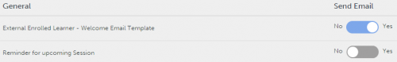

# 전자 메일 템플릿

이 문서에서 모든 학습 객체와 관련된 이벤트 전자 메일 템플릿을 구성하는 방법을 알아봅니다.

Learning Manager 응용 프로그램은 이벤트를 기반으로 하여 여러 역할의 사용자에게 전자 메일 알림을 보냅니다.

작성자는 콘텐트를 추가 또는 수정하고 학습자, 관리자 및 작성자가 참여한 다양한 이벤트에 대한 알림을 사용자에게 전송하여 전자 메일 템플릿을 사용자 정의할 수 있습니다. 예를 들어, 학습자가 강의에 등록할 때마다 사용자 정의한 전자 메일을 보낼 수 있습니다. 등록하면 학습자는 강의별 전자 메일을 자동으로 받습니다.

전자 메일 템플릿 옵션을 비활성화하여 특정 이벤트에 대해 전자 메일 알림을 보내지 않도록 선택할 수도 있습니다.

## 전자 메일 알림 설정 {#settingemailnotifications}

1. 작성자 앱에서 전자 메일 템플릿을 구성할 학습 객체를 클릭합니다. 예를 들면 강의가 있습니다.
1. 학습 객체 페이지에서 전자 메일 설정 구성을 원하는 강의, 인증, 학습 프로그램을 클릭합니다.
1. 학습 객체 세부 정보 페이지에서 전자 메일 템플릿을 클릭합니다.

   선택한 학습 객체에 사용할 수 있는 템플릿 목록을 볼 수 있습니다.

   
   *템플릿 목록*

1. 미리보기 모드에서 템플릿을 보려면 이벤트 이름을 클릭합니다.

   

   *템플릿 미리 보기 보기 보기*

   템플릿 본문에 있는 텍스트를 클릭하면 각 템플릿을 원하는 대로 변경할 수 있습니다. 스냅샷에 표시된 적절한 아이콘을 클릭하면 텍스트에 변수를 삽입할 수 있습니다. 마우스를 각 아이콘 위로 가져가면 이름이 표시됩니다.

   
   *변수 삽입*

   다음과 같은 변수를 사용할 수 있습니다.

   * LP 이름
   * LP 완료 기한
   * 학습자 이름
   * 학습자 전자 메일
   * 강의 이름
   * 강의 설명
   * 강의 완료 기한
   * 강의 스킬 세부 정보
   * 강의 배지

   템플릿 위에 있는 원래로 돌아가기 링크를 클릭하면 메시지를 기본 내용으로 재설정할 수 있습니다.

   템플릿 상단에서 보는 바와 같이 전자 메일 알림 유형에 따라 여러 역할(관리자, 학습자 등) 의 템플릿을 변경합니다.

1. 템플릿 페이지 하단에 있는 &#39;저장&#39;을 클릭합니다.
1. &#39;전자 메일&#39; 템플릿 페이지에서 &#39;예/아니오&#39; 전환 단추를 클릭하여 알림을 보내거나 사용하지 않도록 설정합니다.

*이메일 알림 활성화 또는 비활성화*

원 안에 있는 이벤트 이름 관련 알림 버튼이 &#39;예&#39;(파란색 음영으로 배경 표시)로 가면 알림이 활성화됩니다. 회색 음영이며 원이 &#39;아니오&#39;로 가 있으면 알림이 비활성화됩니다.

강의 레벨에서 전자 메일 템플릿을 구성할 때는 이 설정이 해당 강의의 책임자 레벨 설정보다 우선합니다.
