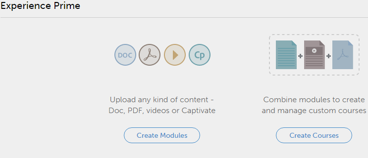

# 작성자로 시작하기

## 시작하기 {#gettingstarted}

시작 페이지를 통해 애플리케이션의 주요 기능을 탐색할 수 있습니다.

작성자로 로그인한 다음에는 비디오 목록이 있는 팝업 창을 볼 수 있습니다.

## 샘플 비디오 보기 {#viewsamplevideos}

샘플 비디오 튜토리얼을 시청하면 작성자로서 역할의 주요 특징을 이해할 수 있습니다. 로그인 중에 이 팝업 창이 나타나지 않도록 하려면 팝업 오른쪽 하단 모서리에 있는 &#39;로그인 시 표시하지 않음&#39; 옵션을 클릭하여 비활성화할 수 있습니다.

팝업을 닫으려면 [창 닫기]를 클릭합니다.

## 시작 페이지 {#gettingstartedpage}

시작 페이지에서 다음 작업을 수행할 수 있습니다.

* 모듈 만들기
* 강의 생성

또한 튜토리얼 비디오 시청, 도움말 콘텐츠 보기 및 다양한 역할 배우기를 선택하여 Learning Manager 응용 프로그램에 대해 자세히 알아볼 수 있습니다.

