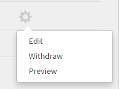

# 작업 지원

**작업 지원**&#x200B;은(는) 등록이나 완료 조건 없이 학습자가 액세스할 수 있는 교육 콘텐츠 저장소입니다. 학습자는 이러한 작업 지원을 참조하여 조직 내 활동이나 작업 수행을 지원받을 수 있습니다.

작업 지원을 단독으로 받거나 Learning Manager 강의 수료와 함께 받을 수 있습니다.

작성자는 학습자를 위한 작업 지원을 만들 수 있습니다. 작업 지원을 사용하여 학습자가 작업을 완료하기 위해 지속적으로 사용할 수 있는 팁, 체크리스트, 안내선과 같은 참조 자료를 제공합니다.

## 작업 지원 생성 {#createjobaid}

1. 작성자 로그인에서 왼쪽 창의 **[!UICONTROL 작업 지원]**&#x200B;을 선택합니다.
1. 표시되는 페이지의 오른쪽 상단 모서리에 있는 **[!UICONTROL 만들기]**&#x200B;를 선택합니다.
1. 이름, 설명 및 태그를 입력합니다. 스킬 및 관련 레벨을 선택합니다. 각 강의에 할당하는데 다른 작성자가 작업 지원에 접근하지 않게 하려면 콘텐츠를 비공개로 선택합니다.

   기존 스킬만 작업 지원에 사용할 수 있습니다. 스킬은 필수 사항이 아닙니다.

1. 콘텐츠 섹션에 작업 지원 콘텐츠를 업로드할 수 있습니다.

   업로드에 비디오, pdf, pptx 및 docx 파일 형식이 지원됩니다. 프로젝트 zip 파일 또는 대화형 콘텐츠는 업로드할 수 없습니다.

1. 작업 지원에 대한 지속 기간을 분 단위로 입력하십시오.
1. **[!UICONTROL 저장]**&#x200B;을 클릭합니다.

   작업 지원이 게시됩니다.

## 다른 언어로 작업 지원 추가 {#addcontentfordifferentlanguages}

1. 다른 언어로 작업 지원을 추가하려면 **새 언어 추가** 탭을 선택하고 필요한 언어를 선택합니다. 이 접근법을 사용하면 콘텐츠에 대한 다중 언어 지원을 추가할 수 있습니다.

   

   *콘텐츠에 새 언어 추가*

1. 새 언어에 대해 작업 지원 업로드 프로세스를 반복합니다.
1. 언어를 제거하려면 **[!UICONTROL 새 언어 추가]** 탭을 선택하고 선택을 취소합니다.

   변경한 후 저장 을 선택합니다.

## 지원되는 작업 지원 유형 {#typesofsupportedjobaids}

작업 지원에 지원되는 파일 형식은 다음과 같습니다.

* PDF
* PPT
* PPTX
* XLS
* XLSX
* DOC
* DOCX
* 모든 동영상 파일 형식

>[!NOTE]
>
>Zip 파일 및 이미지 파일은 지원되지 않습니다.

## 작업 지원 철회/재승인 {#withdrawrepublishjobaids}

작업 지원 옆에 있는 &#39;설정&#39; 아이콘을 클릭하고 &#39;철회&#39;를 선택하여 작업 지원 승인을 철회할 수 있습니다.

*게시된 작업 지원 편집, 철회 또는 미리 보기*

철회 탭을 클릭하면 철회된 작업 지원이 보입니다. &#39;설정&#39; 아이콘을 클릭하고 Publish을 선택하면 철회된 작업을 다시 게시할 수 있습니다.

## 작업 지원에서 HTML 패키지 지원

작업 지원에서는 이제 새로운 유형의 콘텐츠로 표준 HTML 패키지를 지원합니다. 이러한 향상된 성능을 통해 학습자가 작업 지원 플레이어에서 HTML 패키지 보기를 열거나 다운로드할 수 있습니다.

작업 지원을 만들 때 작성자는 지원되는 다른 파일 형식과 함께 표준 HTML 패키지를 업로드할 수 있습니다.

*HTML 패키지 지원*

HTML 패키지에는 다음 사항이 반드시 포함되어야 합니다.

* Index.html 파일.
* Index.html 파일은 zip 파일의 루트 폴더에 있어야 합니다.

Index.html 파일의 위치에서 zip 파일로 업로드할 콘텐츠를 지정합니다.

모든 콘텐츠, 리소스 및 자산은 HTML 패키지에서 참조되어야 하며 Index.html을 통해 액세스할 수 있어야 합니다.

## 자주 묻는 질문 {#frequentlyaskedquestions}

+++작업 지원을 생성하는 방법

작성자로서 작업 지원 페이지에서 **[!UICONTROL 만들기]**&#x200B;를 클릭합니다. 필수 세부 정보를 추가하고 작업 지원을 저장합니다.

작업 지원을 생성한 후 강의를 생성하는 동안 작업 지원을 강의에 추가할 수 있습니다.

+++

### 연관 검색

* [책임자용 작업 지원](../../administrators/feature-summary/job-aids.md)
* [학습자용 작업 지원](../../learners/feature-summary/job-aids.md)
