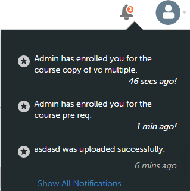

# 사용자 알림

알림 기능은 Adobe Learning Manager의 모든 사용자에게 적용됩니다. 그러나, 역할에 따라 각 사용자는 다양한 시나리오에 대한 각기 다른 알림을 받습니다. 사용자에게 온 모든 경보 및 알림은 알림 팝업 대화 상자를 통해 표시됩니다.

## 액세스 알림 {#accessnotifications}

사용자는 창의 오른쪽 상단 모서리에 있는 알림 아이콘을 클릭하여 알림을 볼 수 있습니다.

작성자 역할에 대한 샘플 알림 창을 다음 스크린샷에서 볼 수 있습니다.

이 팝업 창은 스크롤 바로 모든 알림 중 중요 알림과 발생 시점을 표시합니다.

알림 아이콘 위에 있는 강조 표시된 숫자를 통해 최신 알림의 수를 알 수 있습니다. 예를 들어 마지막으로 로그인한 후 5개의 알림이 왔다면, 알림 아이콘 위에 표시된 숫자 5를 볼 수 있습니다. 이 숫자는 최신 알림을 전부 읽으면 사라집니다.

다른 창에서 모든 알림을 보려면 알림 팝업 창의 맨 아래에 있는 **[!UICONTROL &#39;모든 알림 표시&#39;]** 링크를 클릭합니다.

## 작성자 알림 유형 {#typesofnotificationsforauthors}

작성자는 다음 이벤트가 일어나면 알림을 받습니다.

* 모듈 업로드 성공
* 모듈 버전 변경
