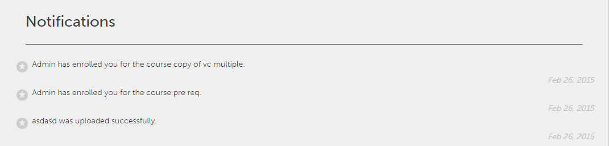

# 사용자 알림

알림 기능은 Adobe Learning Manager의 모든 사용자에게 적용됩니다. 그러나 각 사용자는 역할에 따라 다양한 시나리오에서 서로 다른 종류의 알림을 받습니다. 모든 경고 및 사용자에게 알림은 알림 팝업 대화 상자를 통해 표시됩니다.

## 액세스 알림 {#accessnotifications}

사용자는 창의 오른쪽 상단 모서리에 있는 알림 아이콘을 클릭하여 알림을 볼 수 있습니다.

작성자 역할에 대한 샘플 알림 창은 다음 스크린샷과 같이 표시됩니다.

이 팝업 창에는 모든 알림의 강조 표시와 함께 발생 시간 및 스크롤 막대가 표시됩니다.

알림 아이콘 상단에 강조 표시된 번호로 최신 알림 수를 알 수 있습니다. 예를 들어 이전 로그인 후 최근 5개의 알림이 있는 경우, 알림 아이콘 상단에 숫자 5가 표시되는 것을 볼 수 있습니다. 이러한 숫자는 모든 최신 알림을 읽으면 사라집니다.

다음을 수행합니다. **[!UICONTROL 모든 알림 표시]** 알림 팝업 창의 하단에 있는 링크를 통해 별도의 페이지에서 모든 알림을 확인할 수 있습니다.

## 작성자를 위한 알림 유형 {#typesofnotificationsforauthors}

작성자는 다음 이벤트가 트리거될 때 알림을 받습니다.

* 모듈 업로드가 성공한 경우
* 모듈 버전이 변경된 경우
