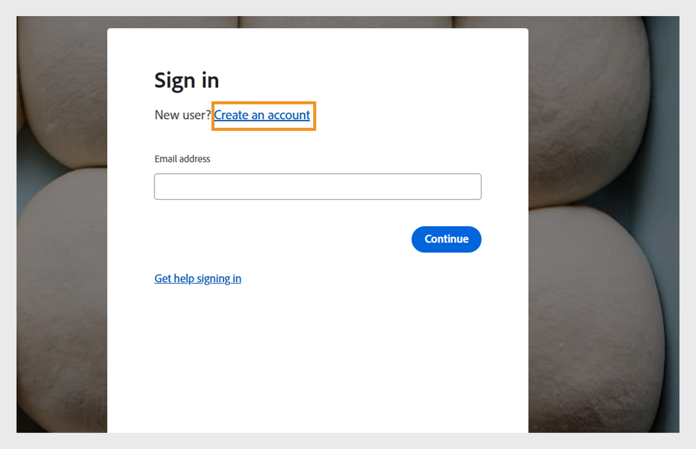

# Adobe Learning Manager에서 체험판 계정 만들기

Adobe Learning Manager에서 무료 30일 평가판 계정을 쉽게 설정하여 기능을 탐색하고 학습 워크플로우를 테스트할 수 있습니다. 이 안내서에서는 시작 위치, 등록 방법, 설정이 완료되면 계정 세부 사항을 찾는 방법에 대해 설명합니다.

체험판 계정을 만들려면 다음을 수행하십시오.

1. [Adobe Learning Manager](https://business.adobe.com/products/learning-manager/adobe-learning-manager.html)&#x200B;(으)로 이동합니다.
2. **[!UICONTROL 30일 무료 평가판]**&#x200B;을 선택합니다.

   

3. 로그인 페이지에서 **[!UICONTROL 계정 만들기]**&#x200B;를 선택합니다.

   

4. **[!UICONTROL 전자 메일 주소]** 및 **[!UICONTROL 암호]**&#x200B;를 입력하세요.

   

5. 다음 세부 정보를 입력하고 **[!UICONTROL 계정 만들기]**&#x200B;를 선택합니다.
   * 이름
   * 성
   * 생년월일

   

6. 체험판 계정을 설정하는 데 필요한 세부 정보가 포함된 양식을 입력하고 완료하십시오.
7. 설정 후 Adobe Learning Manager URL의 URL에서 계정 ID를 찾습니다.

   

