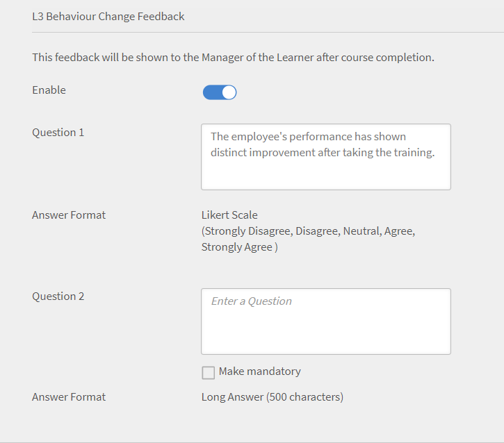
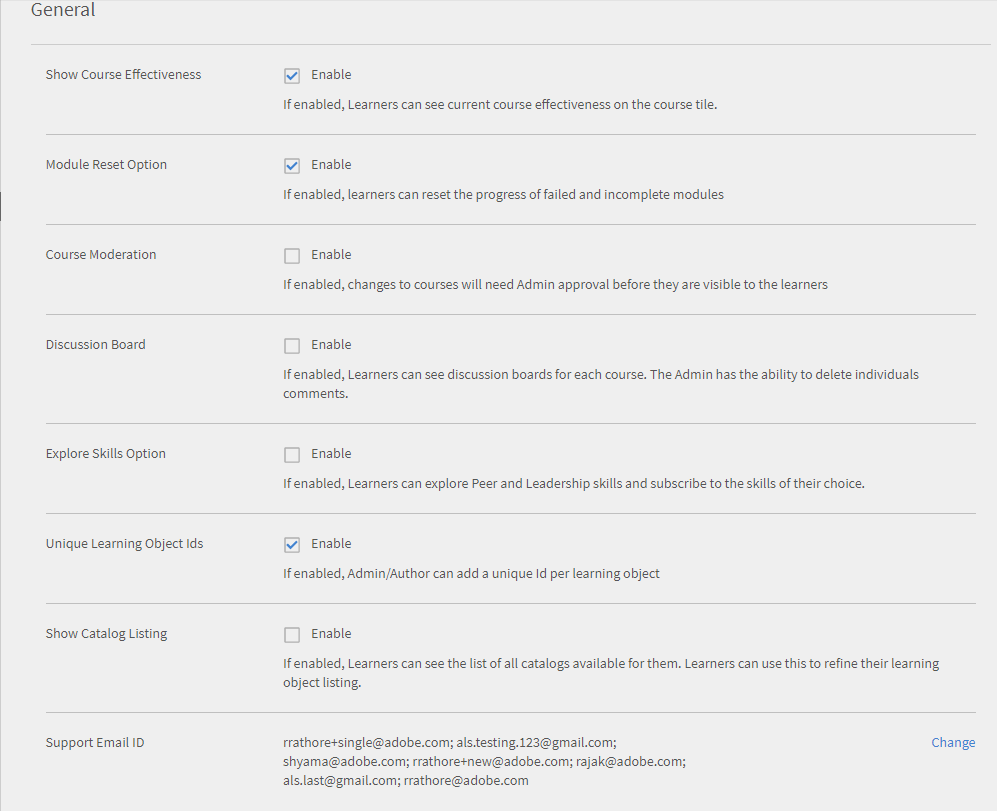

# Learning Manager 배포 가이드

## 소개 {#introduction}

Learning Manager는 교육 전문가가 조직의 요구 사항이나 목표에 기여할 수 있는 매력적이고 추적 가능한 학습 자료를 제공하도록 허용하는 LMS(교육 관리 시스템)입니다. Learning Manager는 주로 트레이너나 관리자가 학습자를 위해 강의 순서와 학습 개체를 필요한 순서에 맞게 할당하도록 도와줍니다. 또한 이 도구는 다양한 형식의 Fluidic Player, 게임화, 배지, 사용하기 쉬운 학습자 대시보드를 비롯한 여러 가지 유용한 기능도 제공합니다. 그러나 이러한 기능을 모두 활용하려면 먼저 Learning Manager를 구성하고 설정해야 합니다.

이 안내서에서는 Learning Manager를 시작하고 실행하는 방법에 대한 단계별 지침을 제공합니다. 이 문서에서는 구성 및 설정 정보도 자세히 제공합니다. Learning Manager를 시작하는 방법을 알아보려면 계속 읽어보십시오.

## 이 가이드의 용도는 무엇입니까? {#whoisthisguideintendedfor}

Learning Manager 사용자는 책임자, 작성자, 강사, 관리자 또는 학습자일 수 있습니다. 이 안내서는 조직이나 고객을 위해 LMS를 설정하고자 하는 사용자를 위해 제작되었습니다.

* **IT 관리자** - IT 관리자는 조직에서 Learning Manager를 활성화하거나 통합할 수 있습니다. IT 책임자는 단일 또는 여러 명의 사용자를 추가하고 통합 책임자나 책임자로서 Learning Manager를 타사 응용 프로그램과 통합할 수도 있습니다.
* **작성자** - Learning Manager 작성자는 조직의 학습 요구 사항에 필요한 학습 콘텐츠를 제작할 수 있습니다. 작성자는 Learning Manager에 업로드되는 기본 콘텐츠를 제작하는 데 관여합니다.

* **Lear닝 관리자** - Learning Manager 책임자는 응용 프로그램과 관련된 구성 및 설정 작업을 수행합니다. 일부 회사에서는 IT 책임자가 Learning Manager 책임자의 역할도 수행할 수 있습니다.

## Learning Manager 배포 시작하기 {#getstartedwithcaptivateprimedeployment}

Learning Manager를 구입한 후 받은 라이선스 키를 사용하여 Learning Manager 계정을 활성화합니다. 다음 그림에 표시된 대로 다음 구성을 계속 진행합니다.

## Learning Manager에서 사이트 구성 {#configureyoursiteincaptivateprime}

Learning Manager에서 학습 객체를 추가하고 구현하기 전에 필요한 몇 가지 주요 구성이 있습니다. 먼저, 조직에 맞게 사이트를 구성합니다. 사이트 구성은 다음 단계로 구성됩니다.

* 조직의 브랜딩 및 로고 설정
* 전자 메일 템플릿 구성
* 기본 계정 설정 구성
* 피드백 설정 구성
* 학습자 대시보드 설정 구성

### 브랜딩 및 로고 설정 {#setupbrandingandlogo}

관리자는 조직의 브랜딩 요구 사항에 맞게 브랜딩과 테마를 설정할 수 있습니다. 사이트의 브랜딩과 테마를 설정하려면 다음을 수행하십시오.

### 로고 및 배너 설정: {#settingthelogoandbanner}

로고 및 배너 설정을 사용하여 Learning Manager에 회사 로고를 표시합니다. 브랜딩 옵션을 구성하여 회사 도메인을 URL로 설정하고 조직 이름을 표시하며 조직 브랜드와 일치하는 색상 테마를 표시합니다. 브랜딩 설정을 구성하려면 다음을 수행합니다.

* Learning Manager 계정에 책임자 권한으로 로그인합니다.
* 왼쪽 창에서 **브랜딩**.
* 브랜딩 페이지에서 다음을 클릭하여 옵션을 구성할 수 있습니다. **편집** 수정할 옵션에 대해 다음을 수행합니다.

   * **조직 이름** : 여기에서 지정하는 값은 사이트의 각 페이지에 나타나는 배너의 이름입니다.
   * **하위 도메인**: 이 값은 사이트의 URL입니다.
   * **로고 스타일링**: 이 필드의 이미지가 각 페이지의 오른쪽 상단 모서리에 로고로 나타납니다. 여기에서 로고와 조직 이름 중 하나만 표시하도록 선택하거나 로고와 조직 이름 둘 다 표시하도록 선택할 수 있습니다.

>[!NOTE]
>
>브랜딩 옵션에서는 이름과 로고만 구성할 수 있습니다. 로고나 이미지의 위치는 변경할 수 없습니다.

***Learning Manager는 .png, .jpeg, .jpg, .gif, .bmp 파일 형식의 로고 이미지를 지원합니다***

### 사이트 테마 설정 {#settingthethemesforyoursite}

Learning Manager에서는 테마를 사용하여 사이트의 외형과 느낌을 변경할 수 있습니다. 응용 프로그램에서 선택할 수 있는 색상 테마는 다음과 같습니다.

* Prime 기본값
* 조약돌
* 카니발
* 가을
* 겨울 하늘

기업 브랜딩에 맞게 색상 테마를 선택할 수 있습니다.

1. Learning Manager 왼쪽 탐색 창에서 **[!UICONTROL 브랜딩]**.
1. (으)로 **테마** 섹션, **[!UICONTROL 편집]**. 응용 프로그램을 사용하여 새 테마를 선택할 수 있습니다. 테마를 선택하면 주요 인터페이스 요소에 사용되는 색상 테마를 즉시 확인할 수 있습니다.

   

1. 뿐만 아니라 **상단 바 색상**, **강조 색상**&#x200B;및 **사이드바 밝기**.  이러한 주요 인터페이스 요소에 고유 브랜드 색상을 사용할 수 있습니다.
1. 기본 색상 테마로 값을 재설정하려면 **[!UICONTROL 테마 재설정]**. 주요 UI 요소의 색상은 선택한 테마의 기본 옵션으로 설정됩니다.
1. 테마를 선택한 후 **[!UICONTROL 힌트 표시]** 미리 보기에서 레이블이나 힌트를 볼 수 있습니다.

   

   슬라이드 쇼에서 여러 개의 이미지가 **테마** 섹션으로 이동하십시오. 슬라이드쇼는 테마나 색상 테마를 즉시 미리 볼 수 있도록 도와줍니다. 홈 페이지, 학습자 대시보드 등 선택한 페이지를 즉시 미리 볼 수 있습니다.

1. 브라우저에 변경 사항이 적용된 모습을 미리 보려면 **[!UICONTROL 실시간 미리 보기]**. 색상 테마를 수정하거나 기본 옵션을 계속 사용할 수 있는 라이브 테마 미리 보기 팝업이 나타납니다. 브라우저에 변경 사항이 적용된 모습을 미리 보려면 **[!UICONTROL 미리 보기]** 아이콘을 클릭합니다.

   

1. 선택한 옵션이 사이트에 일시적으로 적용됩니다. 선택한 테마와 색상 설정을 저장하려면 **[!UICONTROL 적용]**.
1. 테마를 선택하고 적용한 다음 을 클릭합니다 ****[!UICONTROL 저장]**** 선택 사항을 저장합니다.

## 전자 메일 템플릿 구성 {#configureemailtemplates}

책임자가 진행해야 할 다음 작업은 다양한 이벤트용 전자 메일 템플릿을 구성하는 것입니다. 사용자에게 보낼 전자 메일 템플릿을 활성화, 비활성화 및 수정할 수 있습니다. 전자 메일 템플릿에는 세 가지 주요 범주가 있습니다.

* 일반 전자 메일 템플릿: 이 전자 메일은 일반 이벤트에 대해 트리거됩니다. 예를 들어, 사용자가 처음 로그인하면 환영 알림이 표시됩니다.
* 학습 개체나 학습 활동과 연결된 전자 메일 템플릿: 이 전자 메일은 학습 활동이 있을 때마다 학습자, 작성자 또는 관리자에게 발송됩니다. 예를 들어 강의 등록, 강의실 참여, 강의 완료 시점 등에 해당 전자 메일이 트리거됩니다.
* 알림 메시지 및 업데이트: 이 전자 메일은 이벤트와 관련된 업데이트나 알림 메시지가 필요한 경우 트리거됩니다. 예를 들어 강의 일정 알림 메시지가 학습자에게 발송되거나 공유된 보고서에 관한 전자 메일 알림이 책임자에게 발송됩니다.

책임자 대시보드에서는 이러한 전자 메일 알림을 활성화하고 구성할 수 있습니다. 전자 메일 템플릿을 설정하는 방법을 알아보려면 다음 단계를 수행합니다.

1. 왼쪽 탐색 창에서 **[!UICONTROL **&#x200B;전자 메일 템플릿&#x200B;**.]**
1. 다음 탭 중 하나를 클릭합니다.**[!UICONTROL **&#x200B;일반&#x200B;**/**&#x200B;학습 활동&#x200B;**/**&#x200B;알림 메시지 및 업데이트&#x200B;**.]** 예를 들어 다음을 클릭한다고 가정해 보겠습니다. **[!UICONTROL **&#x200B;학습 활동&#x200B;**.]**
1. 전자 메일을 트리거하려는 활동의 토글 버튼을 클릭합니다. 이 예제에서 다음을 클릭한다고 가정해 보겠습니다. **[!UICONTROL **&#x200B;학습 프로그램 - 책임자/관리자에 의해 등록됨&#x200B;**.]**

   

   시스템에 &quot;활성화되었습니다&quot; 팝업 메시지가 표시됩니다. 이제 관리자나 책임자가 학습자를 강의에 등록할 때마다 Learning Manager 계정에서 학습자에게 전자 메일을 발송합니다.

1. 기본 전자 메일 템플릿을 수정할 수 있습니다. 이렇게 하려면 이벤트를 클릭합니다. 이 예제에서는 **[!UICONTROL 학습 프로그램 - 책임자/관리자에 의해 등록되었습니다.]**
1. (으)로 **[!UICONTROL 템플릿 미리 보기]** 팝업 대화 상자에는 두 개의 탭이 있습니다. [!UICONTROL 학습자] 및 [!UICONTROL 관리자].

   

   내용을 수정하려면 각 탭에서 전자 메일 본문을 클릭합니다. 전자 메일 템플릿의 변경 사항을 저장하려면 **[!UICONTROL 저장]**.

   이제 관리자나 책임자가 학습자를 강의에 등록할 때마다 학습자와 담당 관리자에게 전자 메일 알림 메시지가 발송됩니다.

   ***참고: 수정 사항은 선택한 이벤트에 연결된 전자 메일 템플릿에만 적용됩니다.***

1. 전자 메일 템플릿의 계정 URL이나 서명은 수정할 수 없습니다. 를 수정하려면 **[!UICONTROL 계정 URL]** 또는 **[!UICONTROL 서명]**&#x200B;을 클릭하고 **[!UICONTROL 설정]** 탭. 이 탭에서 전자 메일 배너, 전자 메일 서명, 계정 URL을 수정할 수 있습니다.

   계정 URL 링크는 모든 전자 메일에서 서명 바로 앞에 표시됩니다. 원하는 URL을 입력하고 아이콘을 클릭합니다. **[!UICONTROL 저장]**. 이 URL은 내부 사용자에게만 표시됩니다.

   전자 메일 배너인 경우 다음을 선택하여 배너 색상을 변경할 수 있습니다.  **[!UICONTROL **&#x200B;배너 배경&#x200B;**.]** 사용자 정의 이미지를 배너로 사용하려면 **[!UICONTROL 사용자 정의 이미지]** 선택 사항입니다. 다음을 수행합니다.  **[!UICONTROL 저장]** 변경 후.

   ***참고: 전자 메일 배너에 들어가는 사용자 정의 이미지 크기는 1240x200px이어야 합니다. 이미지가 더 큰 경우 해당 크기에 맞게 잘린 상태로 표시됩니다.***

   ***Learning Manager는 전자 메일 배너에 .jpg, .jpeg, .png 파일 유형만 지원합니다.***

   

1. 선택적 관리자 이메일 을 활성화하도록 선택할 수도 있습니다. 다음을 선택하는 경우 **[!UICONTROL 활성화]** 확인란, 부하 직원이 Prime 계정으로 보낸 전자 메일을 받을 때마다 관리자도 같은 내용의 전자 메일을 수신합니다.

   ***참고: 이 탭의 설정은 모든 템플릿에 전역적으로 적용할 수 있습니다.***

### 학습 개체에 적용되는 전자 메일 템플릿 구성 {#configureemailtemplatesforalearningobject}

책임자는 전자 메일 템플릿을 전역적으로 설정할 수 있을 뿐만 아니라, 특정 학습 개체에 적용되는 전자 메일 템플릿을 구성할 수도 있습니다. 이 경우 전자 메일 템플릿의 변경 사항은 해당 학습 개체에만 적용됩니다.

작성자도 학습 개체를 설정할 때 이 옵션을 사용할 수 있습니다.

학습 개체에 적용되는 전자 메일 템플릿을 구성하는 방법:

1. 전자 메일 템플릿을 구성하려는 강의, 학습 프로그램 또는 인증을 클릭합니다.
1. 왼쪽 창에서 **[!UICONTROL **&#x200B;전자 메일 템플릿&#x200B;**.]** 시스템에 다음이 표시됩니다. ****[!UICONTROL 템플릿 미리 보기]**** 팝업 대화 상자.
1. 전자 메일 템플릿의 제목이나 본문을 수정한 다음 [확인]을 **[!UICONTROL **저장**]**변경 사항 적용
1. 변경 사항을 취소하려면 **[!UICONTROL **&#x200B;원본으로 되돌리기&#x200B;**.]**

### 사용자의 이메일 수신 제한 {#restrictusersfromreceivingemails}

책임자는 Learning Manager에서 전자 메일을 받을 사용자 및 받지 못할 사용자를 선택할 수 있습니다. 다음을 사용하여 이 작업을 수행할 수 있습니다. ****[!UICONTROL 제한된 사용자]**** 옵션 아래 ****[!UICONTROL 설정]** **tab 이름, 이메일 ID 또는 고유 사용자 ID를 사용하여 사용자를 이 목록에 추가할 수 있습니다. 이 옵션에 나열된 사용자는 Learning Manager로부터 전자 메일 커뮤니케이션을 수신하지 않습니다.

## 계정 설정 구성 {#configureyouraccountsettings}

Learning Manager에서는 기본 설정, 피드백 설정, 일반 설정, 학습자 대시보드 설정 등의 일부 계정 설정을 구성할 수 있습니다. 각 설정을 구성하는 방법은 다음 절차를 참조하십시오.

### 기본 설정 구성 {#configurebasicsettings}

1. Learning Manager 홈 페이지에서 ****[!UICONTROL 설정]****. 기본적으로 시스템은 기본 언어 및 위치 필드와 함께 [기본 정보] 페이지를 표시합니다.
1. 다음을 수행합니다. ****[!UICONTROL 변경]**** 기본 정보를 편집할 수 있도록 페이지 오른쪽 상단
1. 다음 옵션을 구성합니다.

   * **국가**: 드롭다운 필드에서 국가를 선택합니다.
   * **시간대**: 현재 위치의 시간대를 설정합니다.
   * **로케일**: 원하는 언어를 선택합니다. 이 필드에서 언어를 변경하면 이 응용 프로그램을 사용하는 모든 사용자에게 변경 사항이 적용됩니다. 그러나 각 사용자는 개별적으로 원하는 언어를 변경할 수 있습니다.
   * **회계 연도부터**: 조직의 회계 연도가 시작되는 월을 선택합니다.

   

## 피드백 설정 구성 {#configurefeedbacksettings}

Learning Manager를 사용하면 학습자로부터 강의에 대한 피드백을 수집할 수 있습니다. Learning Manager를 사용하여 학습자에 대한 피드백을 수집할 수도 있습니다. 피드백을 요청하려면 먼저 L1 및 L3 유형의 피드백을 구성해야 합니다.

L3 피드백은 학습자에 대한 관리자의 평가입니다. 이 유형의 피드백을 통해 추이에 따른 학습자의 학업 성취도를 추적할 수 있습니다. L1 피드백은 강의에 대한 학습자의 평가입니다. 이러한 유형의 피드백은 책임자가 강의에 대한 직접적인 피드백을 수집하는 데 도움이 됩니다.

책임자는 피드백 설정을 전역적으로 구성할 수 있습니다. 이렇게 하려면 다음 절차를 따르십시오.

1. Learning Manager 홈 페이지에서 **[!UICONTROL 설정]**.
1. 왼쪽 창에서 **[!UICONTROL 일반]**.
1. L1 피드백을 구성하려면 **[!UICONTROL L1 피드백]** 탭. 그러면 하나의 필수 질문과 여러 개의 선택적 질문을 구성할 수 있는 옵션이 표시됩니다. 이 질문들은 학습자가 강의를 완료한 후 피드백을 작성할 때 나타납니다. 질문은 학습자가 답변으로 1점부터 5점까지의 평가 점수를 선택할 수 있는 문장으로 제시됩니다.

   L1 피드백의 첫 번째 부분은 학습자가 친구나 동료에게 이 강의를 추천할 의향이 얼마나 있는지에 관한 질문입니다.

   ***참고: 필수 질문은 편집하거나 수정할 수 없습니다.***

   

1. 다른 피드백 질문을 구성하려면 아래의 질문을 클릭하십시오. ****[!UICONTROL 자가 진행식 과정]****&#x200B;또는 ****[!UICONTROL 강의실 강의]****. 질문을 클릭하면 기본 질문을 편집할 수 있습니다.

   

1. 기본 질문은 활성화하거나 비활성화할 수 있으며, 필요에 따라 전부 수정할 수도 있습니다. 예를 들어 기본 질문 항목인 &#39;교육 내용이 적절했습니다&#39;를 빼고 &#39;교육이 유익하고 적절했습니다&#39;라는 질문으로 대체할 수 있습니다.
1. 학습자를 위한 질문을 마무리한 후 알림 설정을 구성할 수 있습니다. 응용 프로그램에서 강의를 완료한 학습자에게 자동으로 알림을 보내도록 기본적으로 설정되어 있습니다. 또한 이 미리 알림은 학습자가 응답할 때까지 2주마다 반복적으로 전송됩니다. 알림을 클릭하여 기존의 알림을 수정하거나 새 알림을 추가할 수 있습니다.

   

1. 다음 옵션을 완료하여 알림 설정을 구성합니다.

   * **전송 시기**: 피드백 요청을 보낼 시기(강의 완료 즉시 또는 강의 완료 후)를 지정할 수 있습니다.
   * **완료 후 일**: 강의를 완료한 날로부터 며칠 후에 피드백 요청을 보낼지 지정할 수 있습니다. 이 필드는 선택된 경우에만 표시됩니다. ****[!UICONTROL 강의 완료 후]****.

   * **되풀이**: 피드백 알림을 매일, 매주 또는 매월 보내도록 지정할 수 있습니다. 몇 주 동안 알림을 보낼지도 지정할 수도 있습니다.

1. 체크 표시를 클릭하여 알림 설정을 저장합니다.
1. 모든 피드백 설정을 완료한 후 [확인]을 **[!UICONTROL **저장**]**페이지의 오른쪽 상단 모서리.

## L3 피드백 구성: {#configurel3feedback}

L3 피드백 질문은 학습자가 강의를 마치면 학습자의 관리자에게 발송되는 질문으로 구성되어 있습니다. 책임자는 L3 피드백을 통해 추이에 따른 학습자의 행동이나 스킬 변화를 추적할 수 있습니다. 이 피드백을 구성하려면 피드백 페이지에서 ****[!UICONTROL L3 피드백]**** 탭. 기본 질문 하나가 표시됩니다. 관리자는 5점 만점을 기준으로 이 질문에 답해야 합니다.

L1 피드백과 마찬가지로 L3 피드백의 알림을 구성할 수 있습니다. 기존의 알림을 수정하거나 새 피드백 알림을 추가할 수 있습니다.

피드백 질문 및 알림 설정을 완료한 후 다음을 클릭합니다. ****[!UICONTROL 저장]**** 을 클릭하여 설정을 적용합니다.

## 인스턴스 레벨에서 피드백 구성 {#configurefeedbackataninstancelevel}

앞에서는 피드백 설정을 전역적으로 구성하는 방법을 단계적으로 설명했습니다. 즉, 설정이 모든 강의에 적용됩니다. 이러한 전역적 질문 외에도 책임자나 작성자는 인스턴스 레벨에서 L1 및 L3 피드백 질문을 추가로 구성할 수 있습니다.

인스턴스 레벨에서 피드백 설정을 구성하는 방법:

1. Learning Manager 홈 페이지에서 **[!UICONTROL 강의]**.
1. 피드백 설정을 구성하려는 강의 위에 마우스 포인터를 갖다 댑니다. 다음을 수행합니다. [!UICONTROL **강의 보기**.]

   

1. 강의 세부 정보 페이지에서 **[!UICONTROL 인스턴스 기본값]** 구성 섹션에 추가했습니다.
1. (으)로 [!UICONTROL **언어**] 드롭다운 목록에서 피드백 질문을 표시하는 데 사용할 언어를 선택합니다.
1. 학습자에게 피드백을 요청하려면 L1 반응 피드백을 활성화합니다. 이 섹션에서 최대 2개의 질문을 추가할 수 있습니다. 학습자는 이러한 질문에 서술적으로 답변할 수 있습니다.
1. 선택 **[!UICONTROL 필수 항목으로 지정]** 두 질문 중 하나 또는 모두를 필수적으로 답해야 하는 질문으로 지정하려면 확인란
1. 선택 **[!UICONTROL 강의 완료 후 즉시 질문 표시]** 학습자가 강의를 완료한 즉시 피드백 질문이 나타나게 하려면 다음을 수행하십시오.

   

1. 인스턴스 레벨에서 L3 동작 변경 피드백을 구성하려면 ****[!UICONTROL 활성화]**** L3 피드백. 사전 정의된 필수 질문과 원하는 질문을 입력할 수 있는 빈 질문이 표시됩니다.
1. 강의를 마친 학습자의 학업 성취도에 관한 질문에는 리커트 척도 형식으로 답변이 미리 정의되어 있습니다. 즉, 관리자는 &#39;강력하게 동의&#39;부터 &#39;강력하게 반대&#39;에 이르는 5개의 척도 중 하나로 답변해야 합니다.
1. 관리자에게 묻는 두 번째 질문을 지정합니다. 관리자는 이 질문에 서술형으로 답변할 수 있습니다.
1. 선택 ****[!UICONTROL 필수 항목으로 지정]**** 두 번째 질문을 필수적으로 답해야 하는 질문으로 지정하려면 확인란

   

1. 필요한 경우 인스턴스 레벨에서 알림 설정을 구성합니다. 여기에서 알림 설정을 구성하지 않으면 전역적 알림 설정이 자동으로 할당됩니다.
1. 피드백 질문 및 알림 설정을 완료한 후 [확인]을 **[!UICONTROL **저장**]**을 적용합니다.

   ***참고: 인증에는 피드백 설정을 적용할 수 없습니다.***

## 일반 설정 구성 {#configuregeneralsettings}

책임자는 Learning Manager의 일반 설정을 사용하여 응용 프로그램의 다른 기능에 영향을 미치는 일반 설정을 구성할 수 있습니다. 예를 들어 일반 설정에서 학습자의 대시보드에 강의 효과가 표시되도록 지정할 수 있습니다. 일반 설정을 구성하려면 다음을 수행합니다.

1. Learning Manager 홈 페이지에서 ****[!UICONTROL 설정]****.
1. 왼쪽 창에서 ****[!UICONTROL 일반]****.
1. 일반 설정 페이지에서 구성할 수 있는 옵션은 다음과 같습니다.

   이러한 옵션은 각기 다양한 기능에 영향을 미칩니다. 필요한 경우 각 세부 기능에 대한 교차 링크를 제공할 수 있습니다.

   * **강의 효과 표시**: 강의 제목에 학습자의 수강 효과를 표시하려면 이 옵션을 활성화합니다.
   * **모듈 재설정 옵션**: 학습자에게 모듈을 재설정할 수 있는 권한을 부여하려면 이 옵션을 활성화합니다. 이 옵션을 활성화하면 학습자가 모듈을 재설정하여 완료하지 못하거나 부분적으로만 완료한 모듈을 다시 시작할 수 있습니다.
   * **강의 조정**: 책임자가 강의 변경 사항을 승인한 경우에만 학습자의 대시보드에 변경 사항이 표시되게 하려면 이 옵션을 활성화합니다.
   * **토론 게시판**: 학습자가 강의 토론 게시판을 보고 참여할 수 있게 하려면 이 옵션을 활성화합니다. 이 옵션을 활성화하면 **토론 게시판** 확인란, 학습자와 강사가 강의에 대한 의견을 게시할 수 있습니다. 그러나 강의 레벨 설정에 이 기능을 선택하지 않았다고 표시된 경우 강의 레벨 설정이 관리자 설정에 우선합니다.

   * **스킬 옵션 탐색**: 학습자가 동료와 지도부의 스킬을 탐색할 수 있게 하려면 이 옵션을 활성화합니다.
   * **고유 학습 개체 ID**: 작성자에게 학습 개체에 고유 ID를 추가할 수 있는 권한을 부여하려면 이 옵션을 활성화합니다.
   * **카탈로그 목록 표시**: 학습자의 대시보드에 사용 가능한 카탈로그가 모두 보이게 하려면 이 옵션을 활성화합니다. 이 옵션은 학습자가 학습 개체 목록을 정리하는 데 유용합니다.

   

## 학습자 대시보드 설정 구성 {#configurelearnerdashboardsettings}

학습자는 Learning Manager의 학습자 대시보드를 통해 자신의 성취도, 스킬, 공지 외에도 필수 강의와 추천 강의를 확인할 수 있습니다. 책임자는 학습자 대시보드 설정을 구성하여 이 학습자 대시보드가 표시되는 방식을 정할 수 있습니다. 책임자는 이 설정에서 학습자 페이지에 표시되는 위젯을 지정할 수 있습니다. 또한 이 설정은 위젯이 학습자 대시보드에 배치되는 방식과 위치도 지정합니다. 책임자는 설정을 적용하기 전에 학습자 대시보드의 레이아웃을 미리 볼 수 있습니다.

1. Learning Manager 홈 페이지에서 **[!UICONTROL 설정]**.
1. 왼쪽 탐색 창에서 **[!UICONTROL **&#x200B;학습자 대시보드&#x200B;**.]**
1. 활성화하려는 위젯을 선택합니다. 위젯을 선택 해제하면 위젯이 미리 보기에서 즉시 제거됩니다. 학습자의 대시보드에는 이 위젯이 표시되지 않습니다.
1. 다음을 수행합니다. ****[!UICONTROL 저장]**** 을 눌러 설정을 적용합니다.

   

1. 기본 설정을 적용하려면 **[!UICONTROL 기본값으로 복원합니다.]** 이 경우 다음을 제외한 모든 위젯이 **[!UICONTROL 환영 및 스티커 공지]** 표시됩니다.

   ***학습자 대시보드 설정을 활성화해도 학습자가 본인의 대시보드에서 위젯을 수정하고 옮길 수 있습니다.***

