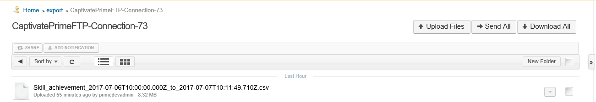
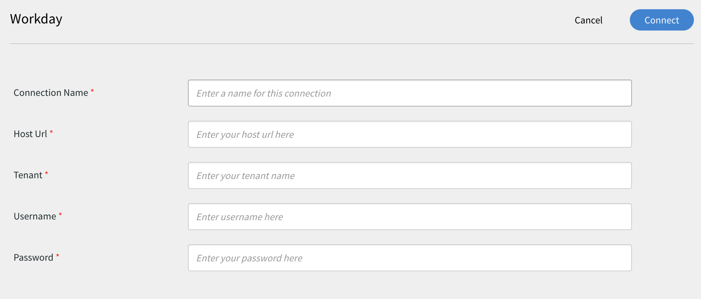
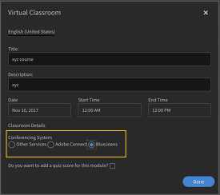

# Learning Manager 커넥터

커넥터를 사용하여 Salesforce와 Learning Manager를 통합하는 방법과 FTP를 Learning Manager와 통합하고 FTP 커넥터를 이용하여 자동으로 CSV를 업로드하는 방법을 알아봅니다.

기업에는 Learning Manager와 통합해야 할 수도 있는 다른 응용 프로그램과 시스템이 있습니다. 커넥터는 외부 시스템에서 Learning Manager로 데이터를 가져오거나 Learning Manager에서 외부 시스템으로 데이터를 내보내는 것과 같은 데이터 기반 통합을 수행하는 데 도움이 되는 유틸리티입니다. 2016년 7월 릴리스에서는 커넥터가 외부 시스템에서 Learning Manager에 사용자 다수를 가져오는 기능만 있었습니다.

Learning Manager에서는 Salesforce와 FTP 커넥터를 제공합니다. 조직 통합 책임자는 Salesforce 커넥터를 사용하여 Salesforce 응용 프로그램과 Learning Manager를 통합할 수 있습니다. 통합업체는 FTP 커넥터를 사용하여 사용자 설정을 기업 응용 프로그램에 자동으로 불러올 수 있습니다.

또한 Learning Manager에서는 Lynda.com, getAbstract, Harvard ManageMentor에서 학습자의 액세스를 활성화하고 강의를 이용할 수 있도록 하는 Lynda, getAbstract, Harvard Management 시스템 커넥터도 제공합니다.

계속해서 Learning Manager에서 각 커넥터를 구성하고 사용하는 방법에 대해 알아봅시다.

## Salesforce 커넥터 {#sfconnector}

Salesforce 커넥터는 Learning Manager와 Salesforce 계정을 연결하여 자동으로 데이터를 동기화합니다. Salesforce 커넥터의 기능은 다음과 같습니다.

### 맵 속성

통합 책임자는 Salesforce 열을 선택하고 이를 해당 Learning Manager의 그룹화 가능 속성에 매핑할 수 있습니다. 한 번만 작업하면 됩니다. 매핑을 완료하면 다음 사용자가 가져와도 동일한 매핑이 사용됩니다. 책임자가 사용자를 가져오기 위해 다른 매핑을 사용하려는 경우 이 매핑을 재구성할 수 있습니다.

### 자동으로 사용자 가져오기

사용자 가져오기 프로세스를 통해 Learning Manager 책임자는 Salesforce에서 직원 세부 정보를 불러와 자동으로 Learning Manager에 가져올 수 있습니다. 이러한 자동화를 통해 CSV를 생성하고 Learning Manager로 업로드할 때 필요한 수작업을 피할 수 있습니다.

### 자동 일정

자동 예약 기능과 함께 자동 사용자 가져오기 기능을 사용하면 효과적일 수 있습니다. Learning Manager 책임자는 조직 필요에 따라 일정을 설정할 수 있습니다. Learning Manager 응용 프로그램 사용자는 일정에 따라 최신 상태를 유지할 수 있습니다. Learning Manager 응용 프로그램에서 매일 동기화를 수행할 수 있습니다.

### 사용자 필터링

Learning Manager 책임자는 사용자를 가져오기 전에 필터링을 적용할 수 있습니다. 예를 들면, Learning Manager 책임자는 하나 이상의 특정 관리자 아래에 있는 모든 등급의 사용자를 가져올 수 있습니다.

## Salesforce 커넥터 구성 {#configuresalesforceconnector}

Learning Manager를 Salesforce와 통합하는 프로세스에 대해 학습합니다.

### 필수 구성 요소 {#prerequisites}

Salesforce 조직 URL이 있는지 확인하십시오. 예를 들어, 내가 속한 조직의 이름이 **myorg** 라면, Salesforce URL은 [https://myorg.salesforce.com](https://myorg.salesforce.com/) 이 되어야 합니다. Salesforce 계정과 Learning Manager 계정 연결은 URL만 있으면 가능합니다.

계정에 로그인하기 위한 적절한 자격을 갖추고 있는지 확인하십시오.

## 연결 생성 {#createaconnection}

1. Learning Manager 홈 페이지에서 Salesforce 카드/썸네일 위로 마우스를 가져갑니다. 그러면 메뉴가 나타납니다. 메뉴에 있는 **[!UICONTROL 연결]**&#x200B;항목을 클릭합니다.

   

1. Org-url을 입력하라는 대화 상자가 나타납니다. URL을 제공한 후 **[!UICONTROL 연결]**&#x200B;을 클릭하세요.
1. 연결이 되면 개요 페이지가 나타납니다.

## 맵 속성 {#mapattributes}

한 번 연결이 성공하면, Salesforce 열을 Learning Manager 해당 속성에 매핑할 수 있습니다. 이 과정은 꼭 필요합니다.

1. 매핑 페이지의 왼쪽에는 Learning Manager의 열이 표시되고 오른쪽에는 Salesforce 열이 표시됩니다. Learning Manager의 열 이름에 매핑할 적절한 열 이름을 선택합니다.

   

   왼쪽에 표시된 Learning Manager의 열 데이터를 활성 필드에서 가져옵니다. **관리자** 필드는 반드시 전자 메일 주소 유형의 필드에 매핑되어야 합니다. 커넥터를 사용하기 전에 모든 열을 매핑하는 것은 필수입니다.

1. 매핑을 완료한 후 **[!UICONTROL 저장]**&#x200B;을 클릭합니다.
1. 커넥터를 사용할 준비가 되었습니다. 현재 구성된 계정은 책임자의 가져오기 예약 또는 주문형 동기화를 위해 책임자 앱 내에서 데이터 소스로 나타납니다.

## Salesforce 커넥터 사용 {#usingsalesforceconnector}

Salesforce 커넥터는 Salesforce.com에 연결되어 있으며, 그를 통해 구성된 대로 사용자를 불러와 Learning Manager에 추가합니다.

## Learning Manager FTP 커넥터 {#ftpconnector}

Learning Manager와 임시 외부 시스템을 통합하는 FTP 커넥터를 사용하여 데이터를 자동으로 동기화할 수 있습니다. 외부 시스템에서 CSV 형식으로 데이터를 내보낼 수 있으며, Learning Manager FTP 계정의 적절한 폴더에 배치할 수 있습니다. FTP 커넥터의 기능은 다음과 같습니다.

데이터 마이그레이션, 사용자 가져오기 및 데이터 내보내기에 Box 커넥터를 사용할 수도 있습니다. 자세한 내용은 [Box 커넥터](third-party-connectors.md#main-pars_header_302653946)를 참조하십시오.

## 데이터 가져오기 {#dataimport}

사용자 가져오기 프로세스를 통해 Learning Manager 책임자는 Learning Manager FTP 서비스에서 직원 세부 정보를 불러와 자동으로 Learning Manager에 가져올 수 있습니다. 이 기능을 사용하면 이러한 시스템에서 생성된 CSV를 FTP 계정 폴더에 적절하게 배치하여 여러 시스템을 통합할 수 있습니다. Learning Manager는 CSV 파일을 가져와 병합한 다음 일정에 따라 데이터를 가져옵니다. 자세한 내용은 스케줄링 기능을 참조하십시오.

**맵 속성**

통합 책임자는 CSV 열을 선택하고 이를 Learning Manager의 그룹화 가능 속성에 매핑할 수 있습니다. 매핑은 한 번만 작업하면 됩니다. 한번 매핑을 완료하면 다음 사용자를 가져와도 동일한 매핑을 사용할 수 있습니다. 책임자가 사용자를 가져오기 위해 다른 매핑을 사용하려는 경우 매핑을 재구성할 수 있습니다.

## 데이터 내보내기 {#exportdata}

데이터 내보내기를 사용하면 사용자 스킬을 FTP 위치로 내보내 타사 시스템과 통합할 수 있습니다.

## 스케줄링 {#scheduling}

책임자는 조직 요구에 따라 스케줄링 작업을 설정할 수 있으며, 일정에 따라 Learning Manager 응용 프로그램의 사용자는 최신 상태를 유지합니다. 마찬가지로, 통합 책임자는 외부 시스템과 통합되도록 적시에 스킬 내보내기를 예약할 수 있습니다. Learning Manager 응용 프로그램에서 매일 동기화를 수행할 수 있습니다.

## Learning Manager FTP 커넥터 구성 {#configurecaptivateprimeftpconnector}

Learning Manager를 FTP 커넥터와 통합하는 프로세스에 대해 학습합니다.

### 연결 생성 {#Createaconnection-1}

1. Learning Manager 홈 페이지에서 FTP 카드/썸네일 위에 마우스를 올립니다. 그러면 메뉴가 나타납니다. 메뉴에 있는 **[!UICONTROL 연결]**&#x200B;항목을 클릭합니다.

   

1. 이메일 아이디를 입력하라는 대화 상자가 나타납니다. 조직의 Learning Manager FTP 계정을 관리하는 담당자의 이메일 아이디를 입력합니다. 전자 메일 ID를 입력한 후 **[!UICONTROL 연결]**&#x200B;을 클릭하세요.
1. Learning Manager에서 사용자에게 FTP 첫 액세스 전에 암호를 재설정하라는 이메일을 전송합니다. 사용자는 Learning Manager FTP 계정에 액세스하기 위해 암호를 재설정해야 합니다.

   지정된 Learning Manager 계정에 대해 하나의 Learning Manager FTP 계정만 생성할 수 있습니다.

   개요 페이지에서 통합에 대한 연결 이름을 지정할 수 있습니다. 다음 옵션에서 원하는 활동을 선택하십시오.

   * 내부 사용자 가져오기
   * 사용자 스킬 내보내기 - 일정 구성
   * 사용자 스킬 내보내기 - 온디맨드

   

## 내부 사용자

+++내부 사용자

내부 사용자 가져오기 옵션을 사용하면 사용자 가져오기 보고서 생성을 자동으로 예약할 수 있습니다. 생성된 보고서는 CSV 파일 형식으로 전송됩니다.

+++

+++Map 속성

한 번 연결이 되면 FTP 폴더에 배치할 CSV 파일의 열을 Learning Manager의 해당 속성에 매핑할 수 있습니다. 이 과정은 꼭 필요합니다.

1. 맵 속성 페이지의 왼쪽에는 Learning Manager의 예상 열을 볼 수 있으며, 오른쪽에는 CSV 파일의 열 이름이 표시됩니다. 처음에 오른쪽에는 빈 선택 상자가 표시됩니다. **파일 선택**&#x200B;을 클릭하여 CSV 템플릿을 가져옵니다.
1. 위의 단계에서는 모든 CSV 열 이름으로 오른쪽 선택 드롭다운 목록을 채웁니다. Learning Manager의 열 이름에 매핑할 적절한 열 이름을 선택합니다.

   *관리자 필드는 반드시 전자 메일 주소 유형의 필드에 매핑되어야 합니다. 커넥터를 사용하기 전에 모든 열을 매핑하는 것은 필수입니다.*

1. 매핑을 완료한 후 **[!UICONTROL 저장]**&#x200B;을 클릭합니다.

   커넥터를 사용할 준비가 되었습니다. 구성된 계정은 이제 책임자의 가져오기 예약 또는 주문형 동기화를 위해 책임자 앱 내에서 데이터 소스로 나타납니다.

+++

+++Learning Manager FTP 커넥터 사용

1. 외부 시스템의 CSV 파일은 다음 경로에 배치되어야 합니다.

   `code $OPERATION$/$OBJECT_TYPE$/$SUB_OBJECT_TYPE$/data.csv`

   **참고:** 2016년 7월 릴리스에서는 사용자 가져오기만 가능합니다. 따라서 FTP 커넥터를 사용하려면 CSV 파일이 다음 폴더에 있는지 확인해야 합니다.

   `code Home/import/user/internal/*.csv`

1. FTP 커넥터는 CSV 파일의 모든 행을 사용하므로 하나의 CSV 사용자에 해당하는 행이 다른 CSV에 나타나지 않는 것이 중요합니다.
1. 모든 CSV에는 매핑에 지정된 열이 포함되어야 합니다.
1. 프로세스를 시작하기 전에 필요한 모든 CSV가 폴더에 있어야 합니다.

사용자를 Learning Manager로 가져오는 동안 책임자는 사용자가 Learning Manager에서 어떻게 관리되는지 알아야 합니다. 자세한 내용은 [사용자 관리 도움말](../integration-admin/feature-summary/migration-manual.md#usermanagement)을 참조하십시오.

+++

## 내보내기

+++스킬

사용자 스킬 보고서를 내보낼 수 있는 방법은 두 가지가 있습니다.

**[!UICONTROL 사용자 스킬 - 온디맨드]**: 이 옵션을 사용하여 시작 날짜를 지정하고 보고서를 내보낼 수 있습니다. 보고서는 입력한 날짜로부터 현재 날짜까지 추출됩니다.

**[!UICONTROL 사용자 스킬 - 구성]**: 이 옵션을 사용하면 보고서 추출을 예약할 수 있습니다. 예약 사용 확인란을 선택하고 시작 날짜와 시간을 지정합니다. 보고서를 생성하고 전송하는 시간 간격을 지정할 수도 있습니다.

+++

FTP 위치에서 내보낸 파일이 있는 내보내기 폴더를 열기 위해서는 아래 보이는 사용자 스킬 페이지에 제공된 FTP 폴더에 대한 링크를 열어야 합니다.

자동으로 내보낸 파일은 **Home/export/&#42;FTP_location&#42;** 위치에 있습니다.

자동으로 내보낸 파일은 **skill_achievements_&#42;날짜:&#42;_부터_&#42;날짜:&#42;.csv**&#x200B;까지 사용할 수 있습니다.

## Lynda 커넥터 {#lyndaconnector}

Lynda 커넥터는 학습자가 Learning Manager 내의 Lynda 강의를 발견하고 이용하길 원하는 Lynda.com 기업용 고객이 사용할 수 있습니다. API 키를 사용하면 Lynda.com에서 과정을 정기적으로 가져오도록 커넥터를 구성할 수 있습니다. Learning Manager에서 과정을 한 번 생성하고 나면 사용자는 생성한 과정을 찾거나 수료할 수 있습니다. 그런 다음 Learning Manager에서 학습자 진행 상황을 확인할 수 있습니다.

### Lynda 커넥터 구성 {#configurethelyndaconnector}

1. 통합 책임자 대시보드에서 Lynda를 클릭합니다.

   시작하기, 연결하기, 연결 관리. 이렇게 세 가지 옵션을 확인할 수 있습니다.

1. Lynda 커넥터를 처음 구성한다면, &#39;연결&#39;을 클릭합니다.

   커넥터를 구성하기 전에 Exavault FTP 계정을 먼저 구성해야 합니다.

1. 연결 페이지에서 커넥터 이름을 입력합니다. 연결을 위해 Appkey와 Secret Key를 입력합니다.

   Appkey와 Secret Key를 받으려면 벤더로 연락하셔야 합니다.

1. &#39;저장&#39;을 클릭합니다.

   구성이 완료되었으며 내 계정에 Lynda가 추가되었습니다. 이제 홈 페이지에서 연결 관리 를 클릭하고 언제든지 구성을 편집할 수 있습니다.

1. 이미 연결을 완료하였다면, &#39;연결 관리&#39;를 클릭하여 모든 연결을 확인합니다.

   커넥터를 구성하기 전에 계정에서 마이그레이션 기능을 사용할 수 있도록 먼저 설정하여 주십시오.

1. 수정하길 원하는 연결을 클릭하십시오.
1. 왼쪽 창에서 &#39;구성&#39;을 클릭합니다. 다음 중 하나를 실행합니다.

   * 이 창에서 계정의 세부 정보 및 동기화 예약을 보거나 편집합니다. 이 계정을 활성화하려면 연결 사용 확인란을 선택해야 합니다.
   * &#39;편집&#39;을 클릭하고 인증서를 수정합니다. 재설정을 클릭하여 이 영역에 대한 업데이트를 취소합니다.
   * 동기화를 예약하려면 &#39;예약 사용&#39;을 클릭합니다. 시작 시간과 날짜를 입력한 다음 동기화 예약 빈도를 일 단위로 입력할 수 있습니다. 예를 들면, 3일마다 동기화가 되도록 설정할 수 있습니다.

   변경 사항을 저장하려면 &#39;저장&#39;을 클릭합니다.

   

1. 왼쪽 창에서 &#39;온디맨드 실행&#39;을 클릭합니다. 이 옵션을 사용하면 Lynda에서 사용자 피드 및 기타 관련 데이터를 가져올 수 있습니다. 온디맨드 실행 시작일을 입력하고 &#39;실행&#39;을 클릭하여 동기화를 시작합니다. 시작일부터 현재까지의 모든 데이터를 가져옵니다.

   * 동기화 도중 응용 프로그램에 다운타임이 발생할 경우 실행 중 Learning Manager에 대한 &#39;액세스 사용 안 함&#39;을 클릭할 수 있습니다.
   * 실행 중 Learning Manager에 대한 액세스 사용을 클릭하면 동기화 중에 서비스가 중단되지 않습니다.

   

1. 또한 언제든지 왼쪽 창에서 실행 상태를 눌러 이 커넥터에 대한 모든 실행의 요약을 시간 순서대로 볼 수도 있습니다. 동기화 시작 날짜 및 기간, 동기화 유형(온디맨드 동기화인지 여부) 및 동기화 상태(동기화가 진행 중인지 완료되었는지 여부)를 볼 수 있습니다.

   연결을 삭제하고 다시 생성하면 커넥터에 대한 이전 실행이 다시 나타납니다. 연결을 삭제하기 전에는 모든 실행을 볼 수 있습니다.

   최신 동기화에 대해서만 재실행을 수행할 수 있습니다.

   

## getAbstract 커넥터 {#getabstractconnector}

getAbstract 커넥터는 학습자가 getAbstract의 내용을 확인하고 사용하길 원하는 getAbstract.com 기업용 고객이 사용합니다. 이 커넥터는 Learning Manager 내에서 생성되는 학습자 완료 레코드를 기준으로 사용 데이터를 정기적으로 가져오도록 구성할 수 있습니다. 계속해서 Learning Manager에서 어떻게 이 커넥터를 구성하는지 알아봅니다.

### getAbstract 커넥터 구성 {#configurethegetabstractconnector}

1. 통합 책임자 대시보드에서 getAbstract를 클릭합니다.

   타일에서 시작하기, 연결하기, 연결 관리. 이렇게 세 가지 옵션을 확인할 수 있습니다.

1. getAbstract 커넥터를 처음 구성한다면, &#39;연결&#39;을 클릭합니다.

   커넥터를 구성하기 전에 Exavault FTP 계정을 먼저 구성해야 합니다.

   피드에 액세스하려면 이 FTP 자격 증명을 콘텐츠 공급자와 공유해야 합니다.

1. 커넥션 네임 필드에 연결 이름을 입력합니다.

   고객 ID와 고객 비밀번호 칸에 알맞은 키를 입력합니다. 커넥터용 키를 받으려면 벤더로 연락하셔야 합니다.

   키는 클라이언트가 사용하는 과정에 대한 과정 메타데이터를 가져오는 데 필요합니다.

1. 연결이 이미 설정된 경우 홈 페이지에서 getAbstract > 연결 관리를 클릭하여 기존 구성을 보고 편집합니다.

   커넥터를 구성하기 전에 계정에서 마이그레이션 기능을 사용할 수 있도록 먼저 설정하여 주십시오.

1. 구성을 보거나 편집할 연결을 클릭합니다.

   

1. 왼쪽 창에서 &#39;구성&#39;을 클릭합니다. 다음 중 하나를 실행합니다.

   * 이 창에서 계정의 세부 정보 및 동기화 예약을 보거나 편집합니다. 이 계정을 활성화하려면 연결 사용 확인란을 선택해야 합니다.
   * &#39;편집&#39;을 클릭하고 인증서를 수정합니다. 재설정을 클릭하여 이 영역에 대한 업데이트를 취소합니다.
   * 동기화를 예약하려면 &#39;예약 사용&#39;을 클릭합니다. 시작 시간과 날짜를 입력한 다음 동기화 예약 빈도를 일 단위로 입력할 수 있습니다. 예를 들면, 3일마다 동기화가 되도록 설정할 수 있습니다.

1. &#39;저장&#39;을 클릭합니다.

   구성이 완료되었으며 내 계정에 getAbstract 연결이 추가되었습니다.

1. 왼쪽 창에서 &#39;온디맨드 실행&#39;을 클릭합니다. 이 옵션을 사용하면 getAbstract에서 사용자 피드 및 기타 관련 데이터를 가져올 수 있습니다. 온디맨드 실행 시작일을 입력하고 &#39;실행&#39;을 클릭하여 동기화를 시작합니다. 시작일부터 현재까지의 모든 데이터를 가져옵니다.

   * 동기화 도중 응용 프로그램에 다운타임이 발생할 경우 실행 중 Learning Manager에 대한 &#39;액세스 사용 안 함&#39;을 클릭할 수 있습니다.
   * 실행 중 Learning Manager에 대한 액세스 사용을 클릭하면 동기화 중에 서비스가 중단되지 않습니다.

1. 또한 언제든지 왼쪽 창에서 실행 상태를 눌러 이 커넥터에 대한 모든 실행의 요약을 시간 순서대로 볼 수도 있습니다. 동기화 시작 날짜 및 기간, 동기화 유형(온디맨드 동기화인지 여부) 및 동기화 상태(동기화가 진행 중인지 완료되었는지 여부)를 볼 수 있습니다.

   연결을 삭제하고 다시 생성하면 커넥터에 대한 이전 실행이 다시 나타납니다. 연결을 삭제하기 전에는 모든 실행을 볼 수 있습니다.

   최신 동기화에 대해서만 재실행을 수행할 수 있습니다.

   모든 유형의 동기화가 작동하려면 동기화에 지정된 날짜에 대한 사용자 피드가 getAbstract FTP 폴더에 있어야 합니다.

   getAbstract의 샘플 사용자 피드 파일인 다음 엑셀 시트를 참조합니다. 파일 이름은 다음 형식을 따라야 합니다:**&#x200B; report_export_yyyy_MM_dd_HHmmss.xlsx** 또는 **report_export_yyyy_MM_dd.xlsx**.
   [getAbstract 사용자 피드 샘플 Excel 시트](assets/report-export-20170401175342.xlsx)

## Harvard ManageMentor 커넥터 {#hmmconnector}

Harvard ManageMentor 커넥터는 학습자가 Harvard ManageMentor 강의를 확인하고 이용하길 원하는 Harvard ManageMentor 기업용 고객이 사용할 수 있습니다. 이 커넥터는 Learning Manager에서 과정을 만드는 데 도움이 되며 학습자 진행률 데이터를 정기적으로 가져오도록 구성할 수 있습니다. 이 커넥터를 구성하기 위해서 다음 과정을 따라 주십시오.

### Harvard ManageMentor 커넥터 구성 {#configuretheharvardmanagermentorconnector}

1. 통합 책임자 대시보드에서 &#39;Harvard ManageMentor&#39;를 클릭하십시오.

   타일에서 시작하기, 연결하기, 연결 관리. 이렇게 세 가지 옵션을 확인할 수 있습니다.

1. Harvard ManageMentor 커넥터를 처음 구성한다면, &#39;연결&#39;을 클릭합니다.

   커넥터를 구성하기 전에 Exavault FTP 계정을 먼저 구성해야 합니다.

   피드에 액세스하려면 이 FTP 자격 증명을 콘텐츠 공급자와 공유해야 합니다.

1. 커넥션 네임 필드에 연결 이름을 입력합니다. 연결을 클릭하여 이 연결을 저장합니다.
1. 이미 연결이 설정된 경우 홈 페이지에서 Harvard ManageMentor > 연결 관리를 클릭합니다. 기존 구성을 수정하려면 수정할 연결을 클릭합니다.

   커넥터를 구성하기 전에 계정에서 마이그레이션 기능을 사용할 수 있도록 먼저 설정하여 주십시오.

   

1. 왼쪽 창에서 &#39;구성&#39;을 클릭합니다. 다음 중 하나를 실행합니다.

   * 이 창에서 계정의 세부 정보 및 동기화 예약을 보거나 편집합니다. 이 계정을 활성화하려면 연결 사용 확인란을 선택해야 합니다.
   * 동기화를 예약하려면 &#39;예약 사용&#39;을 클릭합니다. 시작 시간과 날짜를 입력한 다음 동기화 예약 빈도를 일 단위로 입력할 수 있습니다. 예를 들면, 3일마다 동기화가 되도록 설정할 수 있습니다.

1. 왼쪽 창에서 &#39;온디맨드 실행&#39;을 클릭합니다. 이 옵션을 사용하면 Harvard ManageMentor에서 사용자 피드 및 기타 관련 데이터를 가져올 수 있습니다. 온디맨드 실행 시작일을 입력하고 &#39;실행&#39;을 클릭하여 동기화를 시작합니다. 시작 날짜부터 현재까지의 모든 데이터를 가져옵니다.

   * 동기화 도중 응용 프로그램에 다운타임이 발생할 경우 실행 중 Learning Manager에 대한 &#39;액세스 사용 안 함&#39;을 클릭할 수 있습니다.
   * 실행 중 Learning Manager에 대한 액세스 사용을 클릭하면 동기화 중에 서비스가 중단되지 않습니다.

   며칠마다 동기화를 자동화하려면 반복 기간 필드에 일수를 지정합니다. 동기화를 통해 계정이 Harvard ManageMentor의 최신 추상화 및 요약 버전으로 업데이트됩니다.

1. 또한 언제든지 왼쪽 창에서 실행 상태를 눌러 이 커넥터에 대한 모든 실행의 요약을 시간 순서대로 볼 수도 있습니다. 동기화 시작 날짜 및 기간, 동기화 유형(온디맨드 동기화인지 여부) 및 동기화 상태(동기화가 진행 중인지 완료되었는지 여부)를 볼 수 있습니다.

   연결을 삭제하고 다시 생성하면 커넥터에 대한 이전 실행이 다시 나타납니다. 연결을 삭제하기 전에는 모든 실행을 볼 수 있습니다.

   최신 동기화에 대해서만 재실행을 수행할 수 있습니다.

   동기화를 성공적으로 진행하려면 다음 파일 중 하나 이상이 Harvard ManageMentor FTP 폴더에 있는지 확인해야 합니다.

   hmm12_metadata.xlsx: 이 파일은 Harvard ManageMentor 커넥터의 과정 메타데이터를 제공합니다. 파일을 업로드할 때 명명 규칙을 따라야 합니다.

   client_hmm12_20150125.xlsx: Harvard ManageMentor 커넥터의 사용자 피드입니다. 파일 이름 형식은 **client_hmm12_yyyyMMdd.xlsx**&#x200B;입니다.

   이 커넥터에 대한 다음 두 가지 샘플 사용자 피드 및 과정 피드 파일을 참조합니다.
   [Harvard ManageMentor 커넥터의 과정 메타데이터 파일](assets/hmm12-metadata.xlsx) [Harvard ManageMentor 커넥터의 사용자 피드](assets/client-hmm12-20170304.xlsx)

## Workday 커넥터 {#workdayconnector}

Learning Manager와 임시 외부 시스템을 통합하는 Box 커넥터를 사용하여 데이터를 자동으로 동기화할 수 있습니다.

### 가져오기

#### 맵 속성

통합 책임자는 Workday 열을 선택하고 이를 해당 Learning Manager의 그룹화 가능 속성에 매핑할 수 있습니다. 한 번만 진행하면 됩니다. 매핑을 완료하면 다음 사용자가 가져와도 동일한 매핑이 사용됩니다. 책임자가 사용자를 가져오기 위해 다른 매핑을 사용하려는 경우 이 매핑을 재구성할 수 있습니다.

#### 자동으로 사용자 가져오기

사용자 가져오기 프로세스를 통해 Learning Manager 책임자는 Workday에서 직원 세부 정보를 불러와 자동으로 Learning Manager에 가져올 수 있습니다.

#### 사용자 필터링

Learning Manager 책임자는 사용자를 가져오기 전에 필터링을 적용할 수 있습니다. 예를 들면, Learning Manager 책임자는 하나 이상의 특정 관리자 아래에 있는 모든 등급의 사용자를 가져올 수 있습니다.

## 내보내기

사용자 스킬 내보내기를 사용하면 사용자 스킬을 Workday로 자동으로 내보낼 수 있습니다.

여러 Learning Manager 계정의 스킬은 동일한 Workday 계정을 사용하여 동시에 내보낼 수 없습니다.

## 스케줄링 {#Scheduling-1}

책임자는 조직 요구에 따라 스케줄링 작업을 설정할 수 있으며, 일정에 따라 Learning Manager 응용 프로그램의 사용자는 최신 상태를 유지합니다. 마찬가지로, 통합 책임자는 외부 시스템과 통합되도록 적시에 스킬 내보내기를 예약할 수 있습니다. Learning Manager 응용 프로그램에서 매일 동기화를 수행할 수 있습니다.

## Workday 커넥터 구성 {#configureworkdayconnector}

**전제 조건**: 조직의 Workday 책임자에게 ISU_Permissions 문서에 정의된 권한을 갖는 ISU(Integration System User)를 생성해 달라고 요청하십시오. 아래 링크에서 복사본을 다운로드합니다.
[ISU(Integration System User) 보안 복사본을 다운로드합니다.](assets/isu-permissions-v1.pdf) Learning Manager를 Workday 커넥터와 통합하는 방법을 알아봅니다.

1. Learning Manager 홈 페이지에서 Workday 타일 위로 마우스를 가져갑니다. 그러면 메뉴가 나타납니다. 메뉴에 있는 **[!UICONTROL 연결]**&#x200B;항목을 클릭합니다.

   

1. 새 연결에 대한 자격 증명을 입력하라는 대화 상자가 나타납니다. 다음은 연결 전에 입력해야 하는 필드입니다.

   * 연결 이름: 원하는 연결의 이름을 지정합니다.
   * 호스트 URL: 통합 책임자는 해당 Workday 책임자로부터 호스트 URL 세부 정보를 가져올 수 있습니다.
   * 테넌트: 테넌트는 귀사 내부입니다. Workday 책임자가 테넌트 세부 정보를 제공합니다.
   * 사용자 이름 및 암호: Workday 관리자는 필요한 보안 권한을 가진 ISU(통합 시스템 사용자)를 생성하고 통합 책임자와 공유합니다.

   참고: Learning Manager는 Workday API의 버전 28.1을 사용합니다.

   

1. 모든 관련 필드에 정보를 입력한 후 연결을 클릭합니다.

   또한 여러 Workday 연결을 Learning Manager 계정에 동기화할 수도 있습니다.

개요 페이지에서 통합에 대한 연결 이름을 지정할 수 있습니다. 다음 옵션에서 원하는 활동을 선택하십시오.

* 내부 사용자 가져오기
* 사용자 스킬 내보내기 - 일정 구성
* 사용자 스킬 내보내기 - 온디맨드

## 가져오기

### 맵 속성 {#MapAttributes-1}

Learning Manager와 Workday를 통합하는 Workday 커넥터를 사용하여 데이터를 자동으로 동기화할 수 있습니다. 모든 활성 사용자를 Workday에서 Learning Manager로 가져올 수 있습니다. FTP 및 Salesforce를 비롯한 다양한 데이터 원본에서 사용자를 가져올 수 있습니다.

사용자를 가져오기 전에 Learning Manager 및 Workday의 사용자 특성을 매핑해야 합니다. 개요 페이지의 가져오기 아래의 내부 사용자 옵션을 사용하여 지도 속성을 제공합니다.

Adobe Learning Manager 열 아래에 Adobe Learning Manager 자격 증명을 입력합니다. 드롭다운을 사용하여 Workday 아래의 열에 대한 올바른 자격 증명을 선택합니다.

현재 Learning Manager는 Workday에서 44개의 사용자 속성 가져오기를 지원합니다. Learning Manager의 활성 필드를 사용하여 속성을 추가합니다.

Workday에는 4개의 계층 레벨이 있는 반면 Learning Manager에는 2개의 레벨이 있습니다. Workday의 네 가지 수준은 스킬 프로필 범주, 스킬 프로필, 스킬 항목 범주 및 스킬 항목입니다. 스킬 이름과 함께 Learning Manager의 레벨이 스킬 항목 아래에 Workday으로 매핑됩니다.

+++지원되는 Workday 속성 목록

wd:User_ID\
wd:Worker_ID\
wd:Personal_Data.wd:Name_Data.wd:Preferred_Name_Data.wd:Name_Detail_Data.@wd:Formatted_Name\
wd:Personal_Data.wd:Name_Data.wd:Legal_Name_Data.wd:Name_Detail_Data.@wd:Formatted_Name\
wd:Personal_Data.wd:Name_Data.wd:Legal_Name_Data.wd:Name_Detail_Data.wd:Prefix_Data.wd:Title_Descriptor\
wd:Personal_Data.wd:Name_Data.wd:Preferred_Name_Data.wd:Name_Detail_Data.wd:Prefix_Data.wd:Title_Descriptor\
wd:Personal_Data.wd:Name_Data.wd:Preferred_Name_Data.wd:Name_Detail_Data.wd:First_Name\
wd:Personal_Data.wd:Name_Data.wd:Preferred_Name_Data.wd:Name_Detail_Data.wd:Last_Name\
wd:Personal_Data.wd:Name_Data.wd:Legal_Name_Data.wd:Name_Detail_Data.wd:First_Name\
wd:Personal_Data.wd:Name_Data.wd:Legal_Name_Data.wd:Name_Detail_Data.wd:Last_Name\
wd:Personal_Data.wd:Contact_Data.wd:Address_Data.0.@wd:Formatted_Address\
wd:Personal_Data.wd:Contact_Data.wd:Address_Data.0.wd:Postal_Code\
wd:Personal_Data.wd:Contact_Data.wd:Address_Data.0.wd:Country_Region_Descriptor\
wd:Personal_Data.wd:Contact_Data.wd:Phone_Data.0.@wd:Formatted_Phone\
wd:Personal_Data.wd:Contact_Data.wd:Phone_Data.0.wd:Country_ISO_Code\
wd:Personal_Data.wd:Contact_Data.wd:Phone_Data.0.wd:International_Phone_Code\
wd:Personal_Data.wd:Contact_Data.wd:Phone_Data.0.wd:Phone_Number\
wd:Personal_Data.wd:Primary_Nationality_Reference.wd:ID.1.$\
wd:Personal_Data.wd:Gender_Reference.wd:ID.1.$\
wd:Personal_Data.wd:Identification_Data.wd:National_ID.0.wd:National_ID_Data.wd:ID\
wd:Personal_Data.wd:Identification_Data.wd:Custom_ID.0.wd:Custom_ID_Data.wd:ID\
wd:User_Account_Data.wd:Default_Display_Language_Reference.wd:ID.1.$\
wd:Role_Data.wd:Organization_Role_Data.wd:Organization_Role.0.wd:Organization_Role_Reference.wd:ID.1.$\
wd:Employment_Data.wd:Worker_Job_Data.0.wd:Position_Data.wd:Position_Title\
wd:Employment_Data.wd:Worker_Job_Data.0.wd:Position_Data.wd:Business_Title\
wd:Employment_Data.wd:Worker_Job_Data.0.wd:Position_Data.wd:Business_Site_Summary_Data.wd:Name\
wd:Employment_Data.wd:Worker_Job_Data.0.wd:Position_Data.wd:Business_Site_Summary_Data.wd:Address_Data.@wd:Formatted_Address\
wd:Job_Data.wd:Worker_Job_Data.0.wd:Position_Data.wd:Job_Classification_Summary_Data.0.wd:Job_Classification_Reference.wd:ID.1.$\
wd:Job_Data.wd:Worker_Job_Data.0.wd:Position_Data.wd:Job_Classification_Summary_Data.0.wd:Job_Group_Reference.wd:ID.1.$\
wd:Employment_Data.wd:Worker_Job_Data.0.wd:Position_Data.wd:Work_Space__Reference.wd:ID.1.$\
wd:Employment_Data.wd:Worker_Status_Data.wd:Active\
wd:Employment_Data.wd:Worker_Status_Data.wd:Active_Status_Date\
wd:Employment_Data.wd:Worker_Status_Data.wd:Hire_Date\
wd:Employment_Data.wd:Worker_Status_Data.wd:Original_Hire_Date\
wd:Employment_Data.wd:Worker_Status_Data.wd:Retired\
wd:Employment_Data.wd:Worker_Status_Data.wd:Retival_Date\
wd:Employment_Data.wd:Worker_Status_Data.wd:Terminated\
wd:Employment_Data.wd:Worker_Status_Data.wd:Termination_Date\
wd:Employment_Data.wd:Worker_Status_Data.wd:Termination_Last_Day_of_Work\
wd:Organization_Data.wd:Worker_Organization_Data.0.wd:Organization_Data.wd:Organization_Code\
wd:Organization_Data.wd:Worker_Organization_Data.0.wd:Organization_Data.wd:Organization_Name\
wd:Organization_Data.wd:Worker_Organization_Data.0.wd:Organization_Data.wd:Organization_Type_Reference.wd:ID.1.$\
wd:Organization_Data.wd:Worker_Organization_Data.0.wd:Organization_Data.wd:Organization_Subtype_Reference.wd:ID.1.$\
wd:Qualification_Data.wd:Education.0.wd:School_Name\
wd:Qualification_Data.wd:External_Job_History.0.wd:Job_History_Data.wd:Job_Title\
wd:Qualification_Data.wd:External_Job_History.0.wd:Job_History_Data.wd:Company\
wd:Management_Chain_Data.wd:Worker_Supervisory_Management_Chain_Data.wd:Management_Chain_Data.0.wd:Manager.Employee_ID

+++

## 내보내기

사용자가 달성한 모든 스킬을 Learning Manager에서 Workday로 내보낼 수 있습니다. 참고: 모든 활성 사용자 스킬만 내보내고 Learning Manager는 비활성화된 스킬을 내보내지 않습니다. 또한 여러 Learning Manager 계정을 동일한 Workday 커넥터에 연결할 수도 있습니다. 두 Learning Manager 계정에서 스킬 이름이 동일한 경우, Workday에서 동일한 스킬에 매핑됩니다. 두 Learning Manager 계정이 동일한 Workday 계정을 사용하는 경우 Workday에서 스킬을 업데이트하기 전에 모든 Learning Manager 계정의 스킬 이름을 업데이트하는 것이 좋습니다.

+++사용자 스킬 - 구성

이 옵션을 사용하면 보고서 추출 스케줄을 지정할 수 있습니다. 이 연결을 사용하여 사용자 스킬 내보내기 확인란이 활성화되어 있는지 확인합니다. 예약 사용 확인란을 선택하고 시작 날짜와 시간을 지정합니다. 보고서를 생성하고 전송하는 시간 간격을 지정할 수도 있습니다. 예약 사용 확인란을 선택하고 시작 날짜와 시간을 지정하십시오. &#39;저장&#39;을 클릭합니다.

+++

+++사용자 스킬 - 주문형

온디맨드: 이 옵션을 사용하면 시작 날짜를 지정하고 보고서를 내보낼 수 있습니다. 보고서는 입력된 날짜로부터 현재 날짜까지 추출됩니다. 보고서 생성을 시작할 날짜를 입력하고 실행을 클릭합니다.

+++

+++사용자 스킬 - 실행 상태

여기서 모든 태스크의 요약을 보고 해당 상태 보고서를 가져올 수 있습니다. 오류 보고서 링크를 클릭하여 오류 보고서를 다운로드할 수 있습니다.

+++

## miniOrange 커넥터 {#miniorangeconnector}

Learning Manager와 miniOrange 테넌트를 통합하는 miniOrange 커넥터를 사용하여 데이터를 자동으로 동기화할 수 있습니다.

### 가져오기

#### 맵 속성

통합 책임자는 miniOrange 속성을 선택하고, 이를 해당 Learning Manager 그룹화 가능 속성에 매핑할 수 있습니다. 한 번만 진행하면 됩니다. 매핑을 완료하면 다음 사용자가 가져와도 동일한 매핑이 사용됩니다. 책임자가 사용자를 가져오기 위해 다른 매핑을 사용하려는 경우 이 매핑을 재구성할 수 있습니다.

#### 자동으로 사용자 가져오기

사용자 가져오기 프로세스를 통해 Learning Manager 책임자는 miniOrange에서 직원 세부 정보를 불러와 자동으로 Learning Manager에 가져올 수 있습니다.

#### 사용자 필터링

Learning Manager 책임자는 사용자를 가져오기 전에 필터링을 적용할 수 있습니다. 예를 들면, Learning Manager 책임자는 하나 이상의 특정 관리자 아래에 있는 모든 등급의 사용자를 가져올 수 있습니다.

설정하려면   미니오렌지   Learning Manager CSM 팀으로 문의해 주십시오.

## miniOrange 커넥터 구성 {#configureminiorangeconnector}

1. Learning Manager 홈 페이지에서 miniOrange 카드/썸네일 위로 마우스를 가져갑니다. 그러면 메뉴가 나타납니다. 메뉴에서 **[!UICONTROL 연결]** 옵션을 클릭합니다.

   

1. &#39;연결&#39;을 클릭하여 새 연결을 설정합니다. miniOrange 커넥터 페이지가 나타납니다. 매핑할 계정의 세부 정보를 입력합니다.

   

1. miniOrange 사용자를 Learning Manager 내부 사용자로 직접 가져오려면 **[!UICONTROL 내부 사용자 가져오기]** 옵션을 사용합니다.

   

1. 매핑 페이지의 왼쪽   옆에는 Learning Manager 열이 표시되고 오른쪽에는   옆에는 miniOrnage 열이 있습니다. Learning Manager의 열 이름에 매핑할 적절한 열 이름을 선택합니다.

   

1. 데이터 소스를 보고 편집하려면 책임자 권한으로 **[!UICONTROL 설정 > 데이터 소스]**&#x200B;를 클릭합니다.

   설정된 miniOrange 소스가 나열됩니다. 필터 편집이 필요한 경우 **[!UICONTROL 편집]**&#x200B;을 클릭하세요.

   

1. 가져오기가 완료되면 알림을 수신합니다. 가져오기 로그를 보거나 편집하려면 **[!UICONTROL &#39;사용자&#39; > &#39;로그 가져오기&#39;]**&#x200B;를 클릭합니다.

### 연결 삭제 {#deleteaconnection}

설정된 miniOrange 연결을 삭제하려면 다음 단계를 따르십시오.

## BlueJeans 커넥터 {#bluejeansconnector}

이제 Learning Manager를 BlueJeans 커넥터와 통합하고 BlueJeans를 사용하여 클래스를 호스트할 수 있습니다. BlueJeans를 사용하여 오디오 및 비디오 회의, 화상 채팅, 웨비나를 시작할 수 있습니다.

커넥터를 설정하고 사용하려면 다음 단계를 수행합니다.

1. Learning Manager 홈 페이지에서 BlueJeans 카드/썸네일 위에 마우스를 놓습니다. 그러면 메뉴가 나타납니다. 메뉴에서 **[!UICONTROL 연결]** 옵션을 클릭합니다.

   

1. BlueJeans 커넥터 페이지에 들어갑니다. 사용자 피드의 동기화를 위해 Learning Manager와 BlueJeans를 통합하기 위해 각 필드에 계정의 세부 정보를 입력합니다. 자세한 내용은 BlueJeans 계정 책임자에게 문의하십시오.

   

   학습자는 커넥터를 활성화하는 동안 Learning Manager 계정에 사용된 것과 동일한 전자 메일 ID를 사용하여 사용자가 다시 Learning Manager로 피드를 보낼 수 있도록 합니다.

1. 연결이 설정되면 작성자로 Blue Jeans을 회의 시스템으로 사용하여 VC 강의를 작성합니다.

   

1. 책임자, 관리자 및 학습자는 학습자를 생성된 과정에 등록할 수 있습니다. 등록 후에 학습자는 이메일을 받습니다. 학습자는 Learning Manager 계정에 로그인하여 프로그램 세부 정보를 보고 과정을 수강할 수 있습니다.
1. 과정을 마치면 완료 보고서가 Learning Manager로 전송됩니다. 책임자는 완료 보고서를 보고 학습자의 출석 및 점수를 확인할 수 있습니다.

   

## Box 커넥터 {#boxconnector}

Learning Manager와 임시 외부 시스템을 통합하는 BOX 커넥터를 사용하여 데이터를 자동으로 동기화할 수 있습니다. 외부 시스템에서 CSV 형식으로 데이터를 내보낼 수 있고, Learning Manager Box 계정의 적절한 폴더에 배치할 수 있어야 합니다. Box 커넥터의 기능은 다음과 같습니다.

데이터 마이그레이션, 사용자 가져오기 및 데이터 내보내기에 FTP 커넥터를 사용할 수도 있습니다. 자세한 내용은 [Learning Manager FTP 커넥터](third-party-connectors.md#main-pars_header_1427405935)를 참조하십시오.

## 데이터 가져오기 {#DataImport-1}

사용자 가져오기 프로세스를 통해 Learning Manager 책임자는 Learning Manager Box 서비스에서 직원 세부 정보를 불러와 자동으로 Learning Manager에 가져올 수 있습니다. 이 기능을 사용하면 이러한 시스템에서 생성된 CSV를 Box 계정 폴더에 적절하게 배치하여 여러 시스템을 통합할 수 있습니다. Learning Manager는 CSV 파일을 가져와 병합한 다음 일정에 따라 데이터를 가져옵니다. 자세한 내용은 스케줄링 기능을 참조하십시오.

**맵 속성**

통합 책임자는 CSV 열을 선택하고 이를 Learning Manager의 그룹화 가능 속성에 매핑할 수 있습니다. 매핑은 한 번만 작업하면 됩니다. 한번 매핑을 완료하면 다음 사용자를 가져와도 동일한 매핑을 사용할 수 있습니다. 책임자가 사용자를 가져오기 위해 다른 매핑을 사용하려는 경우 매핑을 재구성할 수 있습니다.

## 데이터 내보내기 {#dataexport}

데이터 내보내기를 사용하면 사용자 스킬을 Box 위치로 내보내 타사 시스템과 통합할 수 있습니다.

## 일정 보고 {#schedulereports}

책임자는 조직 요구에 따라 스케줄링 작업을 설정할 수 있으며, 일정에 따라 Learning Manager 응용 프로그램의 사용자는 최신 상태를 유지합니다. 마찬가지로, 통합 책임자는 외부 시스템과 통합되도록 적시에 스킬 내보내기를 예약할 수 있습니다. Learning Manager 응용 프로그램에서 매일 동기화를 수행할 수 있습니다.

## Box 커넥터 구성 {#configureboxconnector}

Learning Manager를 Box 커넥터와 통합하는 프로세스에 대해 학습합니다.

1. Learning Manager 홈 페이지에서 상자 카드/썸네일 위로 마우스를 가져갑니다. 그러면 메뉴가 나타납니다. 메뉴에 있는 &#39;연결&#39; 항목을 클릭합니다.

   

1. 이메일 아이디를 입력하라는 대화 상자가 나타납니다. 조직의 Learning Manager Box 계정 관리 담당자의 이메일 아이디를 제공합니다. 이메일 아이디를 입력하고 &#39;연결&#39; 을 클릭합니다.

1. Learning Manager에서 사용자에게 Box 첫 액세스 전, 암호를 재설정하라는 메시지가 있는 이메일을 전송합니다. 사용자는 Learning Manager Box 계정에 액세스하기 위해 암호를 재설정해야 합니다.

   지정된 Learning Manager 계정에 대해 하나의 Learning Manager Box 계정만 생성할 수 있습니다.

   개요 페이지에서 통합에 대한 연결 이름을 지정할 수 있습니다. 다음 옵션에서 원하는 활동을 선택하십시오.

   * 내부 사용자 가져오기
   * 사용자 스킬 내보내기 - 일정 구성
   * 사용자 스킬 내보내기 - 온디맨드

## 내부 사용자

+++내부 사용자

내부 사용자 가져오기 옵션을 사용하면 사용자 가져오기 보고서 생성을 자동으로 예약할 수 있습니다. 생성된 보고서는 CSV 파일 형식으로 전송됩니다.

+++

+++Map 특성

한 번 연결이 되면 Box 폴더에 위치한 CSV 파일의 열을 Learning Manager의 해당 속성에 매핑할 수 있습니다. 이 과정은 꼭 필요합니다.

1. 맵 속성 페이지의 왼쪽에서   옆에는 Learning Manager의 예상 열이 표시되고 오른쪽에는   옆에는 CSV 열 이름이 표시됩니다. 처음에 오른쪽에는 빈 선택 상자가 표시됩니다. &#39;파일 선택&#39;을 클릭하여 CSV 템플릿을 가져옵니다.

1. 위의 단계에서는 모든 CSV 열 이름으로 오른쪽 선택 드롭다운 목록을 채웁니다. Learning Manager의 열 이름에 매핑할 적절한 열 이름을 선택합니다.

   *관리자 필드는 반드시 전자 메일 주소 유형의 필드에 매핑되어야 합니다. 커넥터를 사용하기 전에 모든 열을 매핑하는 것은 필수입니다.*

1. 매핑을 완료한 후 저장 을 클릭합니다.

   커넥터를 사용할 준비가 되었습니다. 구성된 계정은 이제 책임자의 가져오기 예약 또는 주문형 동기화를 위해 책임자 앱 내에서 데이터 소스로 나타납니다.

+++

+++Learning Manager Box 커넥터 사용

1. 외부 시스템의 CSV 파일은 다음 경로에 배치되어야 합니다.

   `code $OPERATION$/$OBJECT_TYPE$/$SUB_OBJECT_TYPE$/data.csv`

   **참고:** 2016년 7월 릴리스에서는 사용자 가져오기만 가능합니다. 따라서 Box 커넥터를 사용하려면 CSV 파일이 다음 폴더에 있는지 확인해야 합니다.\
   `code Home/import/user/internal/*.csv`

1. Box 커넥터는 CSV 파일의 모든 행을 사용하므로 하나의 CSV 사용자에 해당하는 행이 다른 CSV에 나타나지 않는 것이 중요합니다.
1. 모든 CSV에는 매핑에 지정된 열이 포함되어야 합니다.
1. 프로세스를 시작하기 전에 필요한 모든 CSV가 폴더에 있어야 합니다.

사용자를 Learning Manager로 가져오는 동안 책임자는 사용자가 Learning Manager에서 어떻게 관리되는지 알아야 합니다. 자세한 내용은 [사용자 관리 도움말](../integration-admin/feature-summary/migration-manual.md#usermanagement)을 참조하십시오.

+++

## 내보내기

+++스킬

사용자 스킬 보고서를 내보낼 수 있는 방법은 두 가지가 있습니다.

사용자 스킬 - 온디맨드: 이 옵션을 사용하여 시작 날짜를 지정하고 보고서를 내보낼 수 있습니다. 보고서는 입력된 날짜부터 현재까지의 추출됩니다

**[!UICONTROL 사용자 스킬 - 구성]**: 이 옵션을 사용하면 보고서 추출을 예약할 수 있습니다. 예약 사용 확인란을 선택하고 시작 날짜와 시간을 지정합니다. 보고서를 생성하고 전송하는 시간 간격을 지정할 수도 있습니다.

+++

Box 위치에서 내보낸 파일이 있는 내보내기 폴더를 열기 위해서는 아래 보이는 사용자 스킬 페이지에 제공된 Box 폴더에 대한 링크를 열어야 합니다.

자동으로 내보낸 파일은 **Home/export/&#42;Box_location&#42;** 위치에 있습니다.

자동으로 내보낸 파일은 **skill_achievements_&#42;날짜:&#42;_부터_&#42;날짜:&#42;.csv**&#x200B;까지 사용할 수 있습니다.

Learning Manager 팀이 공유하는 Box 폴더의 액세스 권한 및 콘텐츠는 고객이 관리해야 합니다.  또한 폴더의 콘텐츠는 프랑크푸르트 지역에 물리적으로 저장됩니다.

## LinkedInLearning 커넥터 {#linkedinlearningconnector}

LinkedInLearning 커넥터는 학습자가 Learning Manager에서 과정을 확인하고 이용하길 원하는 LinkedIn 기업용 고객이 사용할 수 있습니다. API 키를 사용하면 과정을 정기적으로 가져오도록 커넥터를 구성할 수 있습니다. Learning Manager에서 강의를 한 번 생성하고 나면 사용자는 생성한 강의를 찾거나 수료할 수 있습니다. 그런 다음 Learning Manager에서 학습자 진행 상황을 확인할 수 있습니다.

### LinkedIn 커넥터 구성 {#configurelinkedinconnector}

1. 통합 책임자 대시보드에서 LinkedInLearning을 클릭합니다.

   시작하기, 연결하기, 연결 관리. 이렇게 세 가지 옵션을 확인할 수 있습니다.

1. LinkedInLearning 커넥터를 처음 구성한다면, &#39;연결&#39;을 클릭합니다.

   커넥터를 구성하기 전에 Exavault FTP 계정을 먼저 구성해야 합니다.

1. 연결 페이지에서 커넥터 이름을 입력합니다. 연결을 위해 Appkey와 Secret Key를 입력합니다.

   Appkey와 Secret Key를 받으려면 공급업체에 문의해야 합니다.

1. &#39;저장&#39;을 클릭합니다.

   구성이 완료되었으며 내 계정에 LinkedInLearning 연결이 추가되었습니다. 이제 홈 페이지에서 연결 관리 를 클릭하고 언제든지 구성을 편집할 수 있습니다.

1. 이미 연결을 완료하였다면, &#39;연결 관리&#39;를 클릭하여 모든 연결을 확인합니다.

   커넥터를 구성하기 전에 계정에서 마이그레이션 기능을 사용할 수 있도록 먼저 설정하여 주십시오.

1. 수정하길 원하는 연결을 클릭하십시오.
1. 왼쪽 창에서 &#39;구성&#39;을 클릭합니다. 다음 중 하나를 실행합니다.

   * 이 창에서 계정의 세부 정보 및 동기화 예약을 보거나 편집합니다. 이 계정을 활성화하려면 연결 사용 확인란을 선택해야 합니다.
   * &#39;편집&#39;을 클릭하고 인증서를 수정합니다. 재설정을 클릭하여 이 영역에 대한 업데이트를 취소합니다.
   * 동기화를 예약하려면 &#39;예약 사용&#39;을 클릭합니다. 시작 시간과 날짜를 입력한 다음 동기화 예약 빈도를 일 단위로 입력할 수 있습니다. 예를 들면, 3일마다 동기화가 되도록 설정할 수 있습니다.

   변경 사항을 저장하려면 &#39;저장&#39;을 클릭합니다.

1. 왼쪽 창에서 &#39;온디맨드 실행&#39;을 클릭합니다. 이 옵션을 사용하면 LinkedIn Learning에서 사용자 피드 및 기타 관련 데이터를 가져올 수 있습니다. 온디맨드 실행 시작일을 입력하고 실행을 눌러 동기화를 실행합니다. 시작일부터 현재까지의 모든 데이터를 가져옵니다.

   * 동기화 도중 응용 프로그램에 다운타임이 발생할 경우 실행 중 Learning Manager에 대한 &#39;액세스 사용 안 함&#39;을 클릭할 수 있습니다.
   * 실행 중 Learning Manager에 대한 액세스 사용을 클릭하면 동기화 중에 서비스가 중단되지 않습니다.

1. 또한 언제든지 왼쪽 창에서 실행 상태를 눌러 이 커넥터에 대한 모든 실행의 요약을 시간 순서대로 볼 수도 있습니다. 동기화 시작 날짜 및 기간, 동기화 유형(온디맨드 동기화인지 여부) 및 동기화 상태(동기화가 진행 중인지 완료되었는지 여부)를 볼 수 있습니다.

   연결을 삭제하고 다시 생성하면 커넥터에 대한 이전 실행이 다시 나타납니다. 연결을 삭제하기 전에는 모든 실행을 볼 수 있습니다.

   최신 동기화에 대해서만 재실행을 수행할 수 있습니다.

