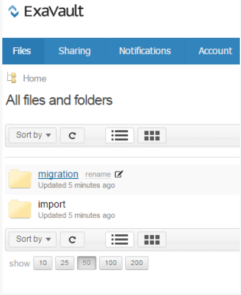
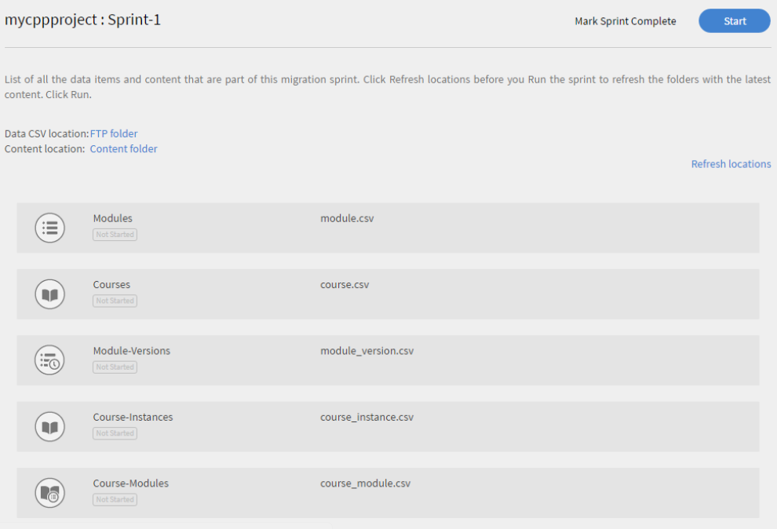

# Learning Manager 배포 안내서 - 섹션 2

## 기술적 설정 {#technicalsetup}

Learning Manager 계정의 기술적 설정은 주로 기업 사용자에게 필요합니다. 이 문서에서는 조직에 대한 SSO(Single Sign-On) 구성 및 Learning Manager와 타사 커넥터 통합에 대해 설명합니다.

### 단일 인증 구성 {#configuresinglesignon}

Admin Console의 시스템 책임자가 가장 먼저 해야 할 일은 최종 사용자 인증용 식별 시스템을 규정하고 설정하는 것입니다. 조직에서 Learning Manager 라이선스를 구매하므로 최종 사용자에게 해당 라이선스를 프로비저닝해야 합니다. 이를 위해 사용자 인증 방식이 필요합니다. 사용자에게 SSO를 구성하려면 다음 절차를 따릅니다.

1. Learning Manager 홈 페이지에서 **[!UICONTROL **&#x200B;설정&#x200B;**>**&#x200B;로그인 방법&#x200B;**]**&#x200B;을 클릭합니다.

   

1. 사용자 유형에 따라 **[!UICONTROL **&#x200B;내부 사용자&#x200B;**&#x200B;또는&#x200B;**&#x200B;외부 사용자&#x200B;**&#x200B;중 하나를 선택합니다.]**

1. **[!UICONTROL **로그인**]**&#x200B;드롭다운 필드에서 **[!UICONTROL **&#x200B; SSO(Single Sign-On)**&#x200B;을 선택합니다.]**

   

1. SSO(Single Sign-On) 설정을 구성하려면 **[!UICONTROL **&#x200B;변경&#x200B;**.]**&#x200B;을 클릭하세요.

   

1. **&#x200B;**&#x200B;[!UICONTROL IDP 시작 인증 URL]&#x200B;**&#x200B;** 필드에 서비스 공급자가 제공한 인증 URL을 입력합니다.

   

1. **[!UICONTROL ** IDP 메타데이터 XML 파일&#x200B;**]**&#x200B;** **필드 옆에 있는 **[!UICONTROL **업로드&#x200B;**]**&#x200B;를 클릭하고 XML 파일을 업로드합니다.
1. **[!UICONTROL **&#x200B;저장&#x200B;**.]**&#x200B;을 클릭합니다.
1. 이렇게 해서 계정의 SSO 인증이 성공적으로 구성되었다면 SSO를 사용하여 Learning Manager 계정에 로그인할 수 있습니다.

   ***Learning Manager에서 구성한 SSO는 SAML 2.0을 지원해야 합니다.***

## 사용자 데이터 마이그레이션 {#migrationofuserdata}

관리자가 기업에서 Learning Manager를 구매할 때 수행해야 하는 중요한 단계 중 하나는 마이그레이션입니다. 기존의 교육 콘텐츠와 사용자 데이터를 Learning Manager로 옮겨야 합니다. 아래의 마이그레이션 작업 과정은 기업이 레거시 데이터를 보존하면서 현대적이고 직관적인 LMS의 이점을 활용하는 데 도움을 줍니다.

Learning Manager를 사용하면 마법사의 단계적 안내에 따라 스프린트를 반복하여 기존의 LMS에서 새로운 LMS로 마이그레이션할 수 있습니다. 레거시 데이터를 Adobe Learning Manager으로 마이그레이션하는 동안 학습자가 다운타임을 전혀 겪지 않도록 각 스프린트의 상태를 완벽하게 파악할 수 있습니다.

마이그레이션 작업 과정을 진행하려면 통합 책임자 권한이 필요합니다. 책임자는 통합 책임자의 역할을 직접 맡거나 책임자 역할을 다른 사용자에게 배정할 수 있습니다.

**Shaleen의 도움을 받아 시각적 개체를 만들 수 있습니다.**

1. 선행 작업
1. 기존 콘텐츠 및 사용자 데이터 평가
1. 기존 LMS 데이터 내보내기 및 매핑
1. 마이그레이션용 FTP 및 BOX 폴더 생성
1. 학습자를 Learning Manager로 이전
1. Learning Manager에 학습 콘텐츠 이전
1. 나머지 데이터를 Learning Manager로 전송

### 선행 작업 {#prerequisite}

마이그레이션 프로세스를 시작하기 전에 다음 선행 작업을 수행해야 합니다.

* 기존 LMS에서 데이터와 콘텐츠를 추출하고 Learning Manager에서 정의된 파일 형식으로 데이터를 변환합니다.
* FTP 및 BOX 커넥터를 사용하여 사용자를 가져옵니다. 통합 책임자는 마이그레이션 프로세스를 시작하기 전에 커넥터가 구성되었는지 확인해야 합니다.

***책임자가 데이터와 콘텐츠를 Learning Manager 제작 환경으로 마이그레이션하기 전에 평가판 계정에서 마이그레이션 프로세스를 시도해보는 것이 좋습니다. &#x200B;***

### 데이터 평가 및 내보내기 {#evaluatingandexportingdata}

통합 책임자는 먼저 현재 LMS에 존재하는 데이터를 확인해야 합니다. 통합 책임자는 다음과 같은 학습 개체만 마이그레이션할 수 있습니다.

* 모듈
* 강의
* 모듈 버전
* 강의 인스턴스
* 강의 모듈
* 스킬
* 스킬 레벨
* 스킬 강의
* 인증
* 인증 강의
* 인증 커밋
* 학습 프로그램
* 학습 프로그램 강의
* 학습 프로그램 인스턴스
* 학습 프로그램 강의 인스턴스
* 등록
* 인증 등록
* 학습 프로그램 등록
* 사용자 강의 등급

기존 데이터를 평가하고 나면 이 데이터를 Learning Manager의 표준 CSV 사양과 매핑해야 합니다. 이 마이그레이션에 필요한 7개의 Excel 시프레드시트가 압축된 아래의 ***csvspecifications.zip*** 샘플 파일을 다운로드하십시오. 이 Excel 시프레드시트에는 기존의 데이터를 .csv 파일의 필드와 매핑하는 방법에 대한 이해를 돕는 설명과 함께 사양이 기술되어 있습니다.

<!--
<Download link to the zip file>
-->

각 .csv 파일에 지정된 형식의 필드 데이터가 빠짐없이 있는지 확인하십시오.

<table> 
 <tbody> 
  <tr> 
   <th width="7%" valign="top">
<strong>번호</strong>
</th> 
   <th width="29%" valign="top">
<strong>Excel 스프레드시트 이름</strong>
</th> 
   <th width="31%" valign="top">
<strong>콘텐츠 설명</strong>
</th> 
   <th width="31%" valign="top">
<strong>비고</strong>
</th> 
  </tr> 
  <tr> 
   <td>
1
</td> 
   <td>
module.xlsx
</td> 
   <td>
Metadata for module.csv
</td> 
   <td>
 
</td> 
  </tr> 
  <tr> 
   <td>
2
</td> 
   <td>
course.xlsx
</td> 
   <td>
Metadata for course.csv
</td> 
   <td>
강의마다 하나의 작성자 이름을 입력합니다. 마이그레이션 후 작성자 이름이 정확하게 표시되지 않는 경우가 있습니다. 
</td> 
  </tr> 
  <tr> 
   <td>
3
</td> 
   <td>
module_version.xlsx 
</td> 
   <td>
module_version.csv용 메타데이터
</td> 
   <td>
콘텐츠를 업로드한 Box 계정 폴더의 URL 경로가 입력되어 있는지 확인합니다. 
</td> 
  </tr> 
  <tr> 
   <td>
4
</td> 
   <td>
course_instance.xlsx
</td> 
   <td>
course_instance.csv용 메타데이터 
</td> 
   <td> </td> 
  </tr> 
  <tr> 
   <td>
5
</td> 
   <td>
course_module.xlsx
</td> 
   <td>
course_module.csv용 메타데이터
</td> 
   <td> </td> 
  </tr> 
  <tr> 
   <td>
6
</td> 
   <td>
skill.xlsx
</td> 
   <td>
Metadata for skill.csv
</td> 
   <td> </td> 
  </tr> 
  <tr> 
   <td>
7
</td> 
   <td>
skill_level.xlsx
</td> 
   <td>
skill_level.csv용 메타데이터
</td> 
   <td> </td> 
  </tr> 
  <tr> 
   <td>
8
</td> 
   <td>
skill_course.xlsx
</td> 
   <td>
skill_course.csv용 메타데이터
</td> 
   <td> </td> 
  </tr> 
  <tr> 
   <td>
9
</td> 
   <td>
Certification.xlsx
</td> 
   <td>
Certification.csv용 메타데이터
</td> 
   <td> </td> 
  </tr> 
  <tr> 
   <td>
10
</td> 
   <td>
certification_course.xlsx
</td> 
   <td>
certification_course.csv용 메타데이터
</td> 
   <td> </td> 
  </tr> 
  <tr> 
   <td>
11
</td> 
   <td>
certification_commit.xlsx
</td> 
   <td>
certification_commit.csv용 메타데이터
</td> 
   <td> </td> 
  </tr> 
  <tr> 
   <td>
12
</td> 
   <td>
learning_program.xlsx
</td> 
   <td>
learning_program.csv용 메타데이터
</td> 
   <td> </td> 
  </tr> 
  <tr> 
   <td>
13
</td> 
   <td>
learning_program_course.xml 
</td> 
   <td>
learning_program_course.csv용 메타데이터 
</td> 
   <td> </td> 
  </tr> 
  <tr> 
   <td>
14
</td> 
   <td>
learning_program_instance.xlsx 
</td> 
   <td>
Metadata for learning_program_instance.csv
</td> 
   <td> </td> 
  </tr> 
  <tr> 
   <td>
15
</td> 
   <td>
learning_program_instance_course_instance.xlsx 
</td> 
   <td>
Metadata for learning_program_instance_course_instance.csv
</td> 
   <td> </td> 
  </tr> 
  <tr> 
   <td>
16
</td> 
   <td>
enrollments.xlsx
</td> 
   <td>
Metadata for enrollments.csv
</td> 
   <td> </td> 
  </tr> 
  <tr> 
   <td>
17
</td> 
   <td>
certification_enrollment.xlsx
</td> 
   <td>
certification_enrollment.csv용 메타데이터
</td> 
   <td> </td> 
  </tr> 
  <tr> 
   <td>
18
</td> 
   <td>
learning_program_enrollment.xlsx
</td> 
   <td>
Metadata for learning_program_enrollment.csv
</td> 
   <td> </td> 
  </tr> 
  <tr> 
   <td>
19
</td> 
   <td>
User_course_grade.xlsx
</td> 
   <td>
user_course_grade.csv용 메타데이터
</td> 
   <td>
필수 항목이 아니더라도 필요한 학습자 기록 데이터를 .csv 파일에 입력합니다. 해당 정보가 없는 경우 .csv의 마이그레이션이 처리된 후에도 Learning Manager 응용 프로그램이 데이터를 반영하지 못할 수 있습니다. 
</td> 
  </tr> 
 </tbody> 
</table>

***Learning Manager는 UTF 8 및 32비트 형식으로만 날짜 및 시간 값을 지원합니다. CSV 파일에 2038-07-17T08:53:21.000Z 또는 1980-04-17T08:13:25.322Z***&#x200B;처럼 범위를 벗어난 날짜를 지정한 경우 마이그레이션 중 오류가 발생할 수 있습니다.

### 데이터를 csv 파일로 가져오는 동안의 종속성 {#dependencieswhileimportingdatatocsvfiles}

기존의 데이터를 표준 csv 형식으로 가져올 때 다음과 같은 종속성에 유의해야 합니다.

* module_version.csv는 module.csv에 종속됩니다.
* course_instance.csv는 course.csv에 종속됩니다.
* course_instance.csv는 course.csv, module.csv 및 module_version.csv에 종속됩니다.
* course_instance.csv는 course.csv에 종속됩니다.
* enrollment.csv는 course.csv에 종속됩니다.
* user_course_grade.csv는 course.csv 및 module.csv에 종속됩니다.
* skill_course.csv는 course.csv에 종속됩니다.
* skill_level.csv는 skill.csv에 종속됩니다.
* learning_program_instance.csv는 learning_program 및 learning_program_course.csv에 종속됩니다.
* learning_program_course.csv는 learning_program.csv에 종속됩니다.
* learning_program_enrollment.csv는 learning_program 및 learning_program_instance.csv에 종속됩니다.
* learning_program_instance_course_instance.csv는 learning_program.csv, learning_program_instance.csv 및 course_instance.csv에 종속됩니다.
* certification_course.csv는 certification.csv 및 course.csv에 종속됩니다.
* certification_commit.csv는 certification.csv 및 certification_course.csv에 종속됩니다.
* certification_enrollment.csv는 certification.csv, certification_course.csv 및 certification_enrollment.csv에 종속됩니다.

데이터를 내보낸 후 로컬 컴퓨터에 .csv 파일을 저장합니다. 이제 파일을 FTP 또는 BOX 폴더에 저장할 준비가 되었습니다.

## 마이그레이션용 FTP 및 BOX 폴더 생성 {#setupftpandboxfoldersforthemigration}

모든 콘텐츠를 실제로 마이그레이션하는 과정을 계획하고 시작하기에 앞서 FTP 폴더와 BOX 폴더부터 만들어야 합니다. 이 두 개의 폴더는 .csv 파일을 저장하는 데 필요합니다. FTP 폴더와 BOX 폴더에 .csv 파일 형식의 레거시 콘텐츠가 준비되면 Learning Manager에서 해당 데이터를 사용할 수 있습니다.

### FTP 계정 개설 {#setupanftpaccount}

통합 책임자 홈 페이지에서 **[!UICONTROL **&#x200B; CSV FTP 폴더 요청&#x200B;**&#x200B;을 클릭합니다.]** 팝업 대화 상자가 나타나면 전자 메일 ID를 입력합니다. 온라인 마법사의 안내에 따라 Exavault FTP 계정을 만듭니다. 계정을 만들면 즉시 Exavault FTP에 마이그레이션 프로젝트 폴더와 스프린트 프로젝트 폴더가 생성됩니다.

아래에 있는 ExaVault의 프로젝트 파일 및 폴더 스냅샷 예시를 참조하십시오.

FTP 폴더를 생성하는 데 성공하면 &quot;FTP 폴더 생성이 완료되었습니다&quot;라는 메시지가 표시됩니다.

## BOX 계정 개설 {#setupaboxaccount}

다음 단계에 따라 BOX 계정을 만들고 BOX 폴더를 생성할 수 있습니다.

통합 책임자 홈 페이지에서 &#39;마이그레이션&#39;을 선택합니다.

설정 섹션에서 &#39;Box 폴더 요청&#39;을 클릭합니다.

**&#x200B;**&#x200B;[!UICONTROL 전자 메일 입력]&#x200B;**&#x200B;** 필드에 Box에 접속하는 데 필요한 로그인 지침을 받아볼 전자 메일 ID를 입력합니다.

**[!UICONTROL **&#x200B;연결&#x200B;**.]**&#x200B;을 클릭합니다.

그러면 Box에서 공유 폴더 링크가 포함된 전자 메일을 전송합니다. Box 계정이 없는 경우 &#39;가입&#39;을 클릭하여 계정을 만듭니다. 그러면 로그인 지침이 통합 책임자 전자 메일 ID로 전송됩니다.

연결을 저장하면 마이그레이션 페이지에 &#39;Box 폴더 생성이 완료되었습니다&#39;라는 메시지가 표시됩니다.

## 콘텐츠를 Learning Manager로 마이그레이션 {#migratingthecontenttocaptivateprime}

마이그레이션을 시작하기 전에 다음 사항에 유의해야 합니다.

* 한 시점에 하나의 계정으로 오직 하나의 마이그레이션 프로젝트만 진행할 수 있습니다. 한 시점에 하나의 마이그레이션 프로젝트에서 오직 하나의 스프린트만 진행할 수 있습니다.
* 일단 실행을 시작하면 취소할 수 없습니다. 다만, Learning Manager의 각 기능에서 지원하는 기존의 삭제 옵션을 사용하여 데이터 또는 콘텐츠 마이그레이션을 취소할 수 있습니다.

마이그레이션 프로젝트를 시작하는 즉시 프로젝트의 상태가 &#39;마이그레이션 중&#39;으로 변경됩니다. 이 상태에서는 통합 책임자를 제외한 나머지 사용자가 Learning Manager에 로그인할 수 없습니다.

Content 폴더에 교육 콘텐츠 업로드:

통합 책임자 홈 페이지에서 **[!UICONTROL 마이그레이션]**&#x200B;을 선택합니다.

이미 자사에 생성된 마이그레이션 프로젝트가 마이그레이션 홈 페이지에 표시됩니다.

페이지 오른쪽 상단 모서리에 있는 **[!UICONTROL **새로 만들기**]**&#x200B;를 클릭하여 마이그레이션 프로젝트를 만듭니다.

***FTP 폴더를 생성하지 않은 경우 Exavault 계정용 FTP 폴더를 생성하라는 메시지가 표시됩니다. 이는 마이그레이션 프로젝트 생성을 시작하기 전에 반드시 수행해야 하는 작업입니다. &#x200B;***

**&#x200B;**&#x200B;[!UICONTROL 새 마이그레이션 프로젝트 생성]&#x200B;**&#x200B;** 페이지에서 프로젝트 이름을 지정합니다.

프로젝트 태그와 강의 카탈로그를 지정하고 마이그레이션 프로젝트 정보를 입력합니다. 마이그레이션 데이터 항목은 마이그레이션 프로젝트 태그를 사용하여 식별됩니다. 구체적으로 원하는 강의 카탈로그가 없는 경우 드롭다운 메뉴에서 기본 카탈로그를 선택합니다. 마이그레이션 프로젝트를 통해 마이그레이션하는 모든 강의는 이 단계에서 선택한 카탈로그에 추가됩니다. 카탈로그를 선택하지 않으면 마이그레이션된 모든 강의는 기본 카탈로그에 추가됩니다.

**[!UICONTROL 생성]**&#x200B;을 클릭합니다.

스프린트 구성 페이지에서 마이그레이션 프로젝트용 스프린트를 생성합니다. Learning Manager 마이그레이션 프로젝트에서 스프린트는 기존 LMS에서 마이그레이션하기로 선택한 마이그레이션 항목 세트로 정의됩니다.

스프린트의 이름을 지정하고 스프린트 정보를 입력합니다.

Learning Manager 응용 프로그램과 사용자 목록을 동기화하려면 **&#x200B;**&#x200B;[!UICONTROL 마지막 실행 이후 사용자가 추가 또는 수정되었습니다]&#x200B;**&#x200B;** 확인란을 선택합니다. Learning Manager 응용 프로그램으로 콘텐츠와 데이터를 마이그레이션하는 경우, 해당 단계는 필수가 아닐 수 있습니다. 그러나 이전 스프린트 마이그레이션과 가장 최근의 스프린트 마이그레이션 사이에 시차가 있는 경우 사용자 목록을 동기화하는 것이 좋습니다. 이 단계를 거치면 Learning Manager 데이터베이스가 LMS 사용자와 동기화됩니다.

***이 동기화 단계는 enrollment.csv 및 user_course_grade.csv 파일을 마이그레이션할 때 시행하는 것이 좋습니다. 이 단계를 통해 Learning Manager 데이터베이스를 마이그레이션 데이터베이스와 동기화하며 스프린트에 기록이 마이그레이션된 모든 사용자를 마이그레이션 데이터베이스에서 사용할 수 있게 합니다.***

**[!UICONTROL **&#x200B;다음&#x200B;**.]**&#x200B;을 클릭합니다.

**[!UICONTROL **시작**]&#x200B;**을 클릭하여 업로드된 데이터 및 콘텐츠로 스프린트 마이그레이션을 시작합니다. FTP 및 콘텐츠 폴더를 Learning Manager와 동기화하려면 스프린트 실행을 시작하기 전에 &#x200B;**&#x200B;**[!UICONTROL 새로 고침]**&#x200B;**&#x200B;을 클릭하십시오.

스프린트 마이그레이션을 중단하려면 스프린트 마이그레이션 프로세스 중 언제든지 **&#x200B;**&#x200B;[!UICONTROL 중지]&#x200B;**&#x200B;**&#x200B;을 클릭할 수 있습니다.

각 스프린트 데이터 항목 및 콘텐츠에 마이그레이션 상태가 표시됩니다. 마이그레이션 스프린트 실행의 일부로 성공 및 실패 항목을 확인합니다.

모듈 콘텐츠를 업로드하는 경우 콘텐츠 폴더의 경로가 *module_version.csv *파일에 입력되어 있는지 확인합니다. 이 단계를 빠트린 경우, 마이그레이션 중 에러가 발생할 수 있습니다. 예를 들어 비디오와 같은 자가 진행식 모듈 콘텐츠를 업로드하는 경우 *module_version.csv *파일에 상대 Box URL 경로를 지정해야 합니다.

아래에 있는 마이그레이션 프로세스 스냅샷 예시를 참조하십시오. 아래의 스냅샷에 보이는 것처럼 각 마이그레이션 데이터 항목에 대하여 처리된 기록의 개수와 각 항목의 성공 및 실패 상태를 확인할 수 있습니다. 오류 로그를 다운로드해서 보려면 실패 항목에 대한 &#39;오류 기록 다운로드&#39;를 클릭합니다. CSV에서 오류를 해결하여 FTP에 다시 업로드할 수 있습니다.

마이그레이션 프로젝트의 전체 스프린트 목록을 보려면 왼쪽 탐색 창에서 **[!UICONTROL **스프린트**]**&#x200B;를 클릭합니다. 아래의 스냅샷에 보이는 것처럼 전체 스프린트 목록, 각 스프린트에서 실행한 횟수, 시작 날짜, 지속 기간 및 완료 상태를 확인할 수 있습니다.

마이그레이션 프로젝트의 전체 스프린트 목록을 보려면 왼쪽 탐색 창에서 **[!UICONTROL **스프린트**]**&#x200B;를 클릭합니다. 아래의 스냅샷에 보이는 것처럼 전체 스프린트 목록, 각 스프린트에서 실행한 횟수, 시작 날짜, 지속 기간 및 완료 상태를 확인할 수 있습니다.

마이그레이션 프로젝트의 전체 스프린트 목록을 보려면 왼쪽 탐색 창에서 **[!UICONTROL **스프린트**]**&#x200B;를 클릭합니다. 아래의 스냅샷에 보이는 것처럼 전체 스프린트 목록, 각 스프린트에서 실행한 횟수, 시작 날짜, 지속 기간 및 완료 상태를 확인할 수 있습니다.

***마이그레이션 프로젝트를 완료로 표시하기 전에 프로젝트의 모든 스프린트가 완료되었는지 확인합니다. 일단 마이그레이션을 완료로 표시하면 뒤로 돌아가서 해당 프로젝트에서 스프린트를 생성할 수 없습니다. 그 프로젝트는 수정할 수 없습니다. 다른 마이그레이션 프로젝트를 만들고 스프린트를 추가할 수만 있습니다.***

레거시 LMS의 학습 데이터와 콘텐츠를 마이그레이션한 후 데이터와 콘텐츠를 제대로 가져왔는지 확인합니다. 책임자로 로그인하여 가져온 모듈 및 강의 데이터와 콘텐츠가 정상인지 확인합니다.

유용한 마이그레이션 정보는 다음을 참조하십시오.

* 마이그레이션 문제 해결
* CSV 업로드 관련 자주 묻는 질문

