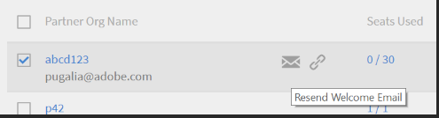

# Learning Manager에서 사용자 설정

## 내부 및 외부 사용자 {#internalandexternalusers}

사용자 관리는 Learning Manager를 포함한 모든 LMS의 중요한 측면입니다. Learning Manager에서는 사용자를 내부 및 외부 사용자로 분류할 수 있습니다. 내부 사용자는 특정 조직 또는 그룹에 속한 사용자입니다. 일반적으로 기업 내의 사용자는 내부 사용자입니다. 이러한 사용자에게는 관리자 또는 책임자가 지정한 대로 특정 마감일이 지정된 특정 학습 객체가 있습니다.

반대로 외부 사용자는 일반적으로 특정 Learning Manager 계정의 임시 사용자입니다. 이러한 사용자는 전자 메일을 통해 수신한 임시 외부 링크를 클릭하여 특정 학습 객체에 액세스할 수 있습니다. 외부 사용자 프로필에는 일반적으로 만료 날짜가 있습니다. 예를 들어 Java 인증을 수행하는 조직에는 관련 강의를 완료하기 위해 일시적으로 로그인한 다음 인증을 시도하는 사용자가 있을 수 있습니다. 일반적으로 강의실 교육 및 외부 사용자용 강의 인원 수가 제한되어 있습니다.

계속해서 Learning Manager에서 내부 사용자 및 외부 사용자를 추가하는 방법을 알아봅니다.

## 외부 사용자 설정 {#setupexternalusers}

책임자는 파트너 조직의 직원과 같은 외부 사용자를 Learning Manager 계정에 추가할 수 있습니다. 외부 사용자를 추가하려면 다음을 수행합니다.

1. **[!UICONTROL **책임자**]**로그인 페이지, ** 클릭&#x200B;[!UICONTROL **사용자**]**왼쪽 탐색 창.
1. **[!UICONTROL **사용자**]**page, ** 클릭&#x200B;[!UICONTROL **외부**]**왼쪽 탐색 창. 시스템에서 외부 사용자 목록(해당하는 경우)과 함께 외부 사용자 페이지를 표시합니다.
1. 확인 을 **[!UICONTROL **추가**]**페이지의 오른쪽 상단 모서리에 있습니다.

   

1. **[!UICONTROL **사용자 추가**]**팝업 대화 상자, 다음 필드는 필수입니다.

   * **[!UICONTROL **프로필 이름**:]**생성 중인 외부 프로필의 이름을 지정합니다.
   * **[!UICONTROL **&#x200B;관리자 이메일&#x200B;**:]** 외부 사용자에 대한 관리자의 전자 메일 주소를 지정합니다.
   * **[!UICONTROL **&#x200B;할당된 시트&#x200B;**:]** 강의에 등록할 수 있는 학습자 수를 지정합니다.
   * **[!UICONTROL **&#x200B;만료&#x200B;**:]** 외부 사용자가 강의를 등록하거나 수료할 수 없는 만료 날짜를 지정하십시오.

1. 다음을 수행합니다. **[!UICONTROL **&#x200B;고급 설정&#x200B;**.]**
1. 외부 프로필을 만들 때 다음 옵션을 선택적으로 설정합니다.

   * **[!UICONTROL **&#x200B;이미지 추가&#x200B;**:]** 원하는 이미지를 드래그 앤 드롭합니다. 이 이미지는 사용자의 학습자 페이지에 표시됩니다.
   * **[!UICONTROL **&#x200B;로그인 요구 사항&#x200B;**:]** 사용자가 로그인해야 하는 일 수를 지정합니다. 외부 사용자가 이 로그인 기간을 초과하는 경우 학습자는 학습 객체에 액세스하거나 수료할 수 없습니다.
   * **[!UICONTROL **&#x200B;허용된 도메인&#x200B;**:]** 도메인을 쉼표로 구분하여 지정합니다. 특정 도메인이 있는 사용자만 계정에 등록할 수 있습니다.
   * **[!UICONTROL **&#x200B;이메일 확인 필요&#x200B;**:]** 사용자에게 확인 이메일을 보내려면 이 확인란을 선택합니다

1. **[!UICONTROL 저장]**&#x200B;을 클릭합니다.

   

   URL이 포함된 팝업 대화 상자가 표시됩니다. 이 URL을 복사하여 외부 사용자에게 보낼 수 있습니다. 기본적으로 이 URL이 포함된 전자 메일이 사용자에게 전송됩니다.

1. 외부 프로필을 추가하면 **[!UICONTROL **&#x200B;외부 사용자 페이지&#x200B;**(**&#x200B;책임자&#x200B;**>**&#x200B;사용자&#x200B;**>**&#x200B;외부&#x200B;**).]** 이러한 사용자에게는 인원 제한, 만료 날짜 및 로그인 요구 사항도 표시됩니다.
1. 외부 사용자 설정을 언제든지 편집하려면 해당 사용자 이름을 클릭합니다. **[!UICONTROL 외부 등록 편집]** 대화 상자가 표시됩니다. 설정을 수정하고 을 클릭합니다. **[!UICONTROL **&#x200B;저장&#x200B;**.]**
1. 외부 프로필 옆에 있는 전자 메일/URL 복사 아이콘을 클릭하여 언제든지 환영 전자 메일을 다시 보내거나 URL을 복사할 수 있습니다.

   

## 외부 사용자 프로필 일시 중지 {#pausetheexternaluserprofile}

Learning Manager에 외부 사용자 그룹을 추가한 후, 외부 사용자 등록 프로세스를 일시 중지할 수도 있습니다. 일시 중지하면 외부 사용자 등록 절차가 차단됩니다. 그러나 이 절차는 사용자가 초대를 수락했지만 등록하지 않았을 때만 작동합니다.

외부 사용자 그룹을 일시 중지하려면 [일시 중지]를 **[!UICONTROL **액션**]**페이지의 오른쪽 상단에서 **[!UICONTROL 일시 중지]**.

## 외부 사용자 프로필 다시 시작 {#resumeexternaluserprofile}

언제든지 &#39;다시 시작&#39; 옵션을 사용하여 차단(일시 중지)을 취소할 수 있습니다. 확인 을 **[!UICONTROL **액션**]**페이지의 오른쪽 상단 모서리에 있는 **[!UICONTROL 다시 시작]**.

**[!UICONTROL 외부 사용자 상태]**

Learning Manager에서는 다음 상태가 외부 사용자에게 적용됩니다.

* **비활성 상태** - 이 상태에서는 외부 사용자 등록이 만료됩니다. 책임자는 사용자 추가 작업 과정에서 외부 사용자를 등록할 때 만료 날짜를 설정할 수 있습니다.
* **활성 상태** - 이 상태의 외부 사용자는 Learning Manager 응용 프로그램에 등록할 수 있으며 로그인할 수도 있습니다.
* **일시 중지** - 이 상태에서는 외부 사용자의 등록 절차가 차단됩니다. 하지만 기존 사용자는 계속 로그인할 수 있습니다.

## 내부 사용자 설정 {#setupinternalusers}

책임자는 기업 또는 조직의 사용자를 설정할 수 있습니다. 이러한 사용자를 내부 사용자라고도 합니다. 내부 사용자는 SSO(단일 인증) 또는 Adobe ID을 사용하여 응용 프로그램에 로그인할 수 있습니다. 그러면 이러한 사용자는 요구 사항에 따라 학습 객체에 액세스하고 수료할 수 있습니다. 조직의 내부 사용자를 설정하는 방법에는 다음과 같은 세 가지 방법이 있습니다.

* CSV를 사용하여 사용자 일괄 추가
* 자가 등록을 통해 사용자 추가
* 단일 내부 사용자 추가

## CSV 파일을 사용하여 사용자 추가 {#addingusersusingacsvfile}

사용자 수가 많은 경우 이 방법을 선택하여 내부 사용자를 추가할 수 있습니다. CSV를 사용하여 처음으로 사용자를 추가할 때는 csv 데이터 콘텐츠를 응용 프로그램 레이블에 매핑해야 합니다. 이후 새 사용자를 추가하거나 사용자 데이터를 업데이트해도 동일한 매핑이 유지됩니다. 내부 사용자를 일괄 추가하려면 다음을 수행합니다.

1. 에 **[!UICONTROL 관리자 홈]** 페이지에서 [확인]을 **[!UICONTROL **사용자**]**왼쪽 탐색 창.
1. 다음을 수행합니다. **[!UICONTROL **&#x200B;추가&#x200B;**>** CSV 업로드&#x200B;**.]**
1. 팝업 대화 상자에서 **[!UICONTROL **&#x200B;가져오기&#x200B;**.]**
1. CSV 파일을 저장한 위치를 찾습니다. **[!UICONTROL 열기]**&#x200B;를 클릭합니다.
1. CSV 파일을 가져오고 CSV 파일의 콘텐츠를 응용 프로그램 레이블과 매핑합니다. 이 단계는 CSV 파일을 처음 업로드하는 경우에만 적용됩니다.
1. 확인 을 **[!UICONTROL **저장**]**를 클릭하여 매핑을 저장합니다.
1. 확인 을 **[!UICONTROL **추가**]**응용 프로그램 데이터에 이미 매핑된 CSV 파일을 업로드합니다.

### 업로드를 위해 CSV 파일을 만들 때 고려해야 할 사항: {#considerationswhencreatingthecsvfileforupload}

내부 사용자 업로드를 위해 CSV 파일을 생성할 때 데이터를 입력해야 하는 필수 필드에는 직원의 이름, 직원의 이메일, 직원의 프로필 또는 지정, 관리자 계층 등이 있습니다.

각 직원의 이름과 전자 메일을 응용 프로그램 데이터에 직접 매핑할 수 있습니다. 참고: CSV 파일에 지정된 전자 메일을 관리자 전자 메일로 지정해야 합니다. CSV 파일을 만들 때 관리자 ID를 정의하거나 CSV 파일을 업로드할 때 관리자 ID에 해당하는 전자 메일 ID를 지정할 수 있습니다.

***ID를 직원의 관리자 ID로 추가하기 전에 관리자가 CSV 파일에 사원으로 추가되어 있는지 확인하십시오.***

***CSV 파일을 성공적으로 업로드하기 위한 항목 사이에 추가 공백이 없는지 확인합니다.***

CSV 파일의 샘플 스냅샷은 여기에서 확인할 수 있습니다.

샘플 CSV 파일을 다운로드하려면 `<give link to zip file>`.

<!--Zip file reference, no source file-->

### 루트 사용자 설정 {#settinguprootuser}

일괄 사용자 가져오기를 자동화합니다.

## 자가 등록을 통해 사용자 추가 {#addingusersthroughselfregistration}

내부 사용자를 일괄 추가하는 것 외에도 자가 등록을 통해 사용자를 추가할 수도 있습니다. 자가 등록을 사용하면 직원이 직접 Learning Manager 계정에 학습자로 등록할 수 있습니다. 자가 등록 프로필을 만들면 고유한 URL이 생성됩니다. 이 URL을 직원과 공유하여 Learning Manager에 등록할 수 있도록 합니다.

1. **[!UICONTROL 책임자 홈]** 페이지의 왼쪽 탐색 창에서 **[!UICONTROL 사용자]**&#x200B;를 클릭합니다.
1. 다음을 수행합니다. **[!UICONTROL **&#x200B;추가&#x200B;**>**&#x200B;자가 등록&#x200B;**.]**

   

1. **[!UICONTROL 사용자 추가]** 팝업 대화 상자에서 **[!UICONTROL 프로필 이름]** 필드의 직원 이름을 지정합니다.
1. (으)로 **[!UICONTROL 관리자 이름]** 필드에서 사원의 관리자명을 입력합니다.
1. **[!UICONTROL 이미지 추가]** 필드를 사용하여 직원의 프로필 사진을 추가할 수도 있습니다.
1. **[!UICONTROL 저장]**&#x200B;을 클릭합니다.

   

   프로필이 성공적으로 만들어졌다는 메시지가 포함된 다른 팝업 대화 상자가 표시됩니다. 이 대화 상자에서도 고유 URL이 생성됩니다.

1. 이 URL을 직원과 공유하여 직원이 학습자로 자가 등록할 수 있도록 합니다.

   

## Learning Manager에서 단일 사용자 추가 {#addsingleusersincaptivateprime}

단일 사용자 추가는 계정에 내부 사용자를 추가할 수 있는 세 번째 방법입니다. 일부 사용자를 추가하려는 경우 이 절차가 이상적입니다. 단일 사용자를 추가하려면 다음을 수행합니다.

1. **[!UICONTROL 책임자 홈]** 페이지의 왼쪽 탐색 창에서 **[!UICONTROL 사용자]**&#x200B;를 클릭합니다.
1. 다음을 수행합니다. **[!UICONTROL **&#x200B;추가&#x200B;**>**&#x200B;단일 사용자&#x200B;**.]**

1. 사용자 추가 팝업 대화 상자에서 사용자에 대한 다음의 세부 정보를 추가합니다.

   * **[!UICONTROL 이름]** **[!UICONTROL :]** 사원 또는 내부 사용자명을 지정합니다. 이 필드는 필수 항목입니다.

   * **[!UICONTROL 이메일]** **[!UICONTROL :]** 직원의 전자 메일 ID를 지정합니다. 이 필드는 필수 항목입니다.

   * **[!UICONTROL 프로필]** **[!UICONTROL :]** 사원의 직책 또는 지정을 지정합니다.

   * **[!UICONTROL **&#x200B;관리자 이름&#x200B;**:]** 관리자의 이름을 지정합니다. 여기서 지정할 관리자는 데이터베이스에 이미 추가되어 있어야 합니다.
   * **[!UICONTROL ** DOJ **:]** 사원의 가입 일자를 지정합니다.
   * **[!UICONTROL **위치**:]**직원 위치 지정. 예를 들어 조직이 여러 지리적 위치에 있는 경우 직원이 있는 위치를 지정합니다.

   

1. **[!UICONTROL 추가]**&#x200B;를 클릭합니다.
1. 사용자가 성공적으로 추가되었다는 메시지가 시스템에 표시됩니다. 사용자는 지정된 전자 메일 ID로 확인 링크를 수신합니다. 사용자는 이 링크를 클릭하여 계정을 활성화하고 Learning Manager에 액세스할 수 있습니다.

   

## Learning Manager에서 사용자 그룹 관리 {#managingusergroupsincaptivateprime}

사용자 그룹은 정의된 범주와 관련된 사용자 집합에 불과합니다. 책임자는 사용자 그룹을 사용하여 속성을 기준으로 학습자를 빠르게 선택할 수 있습니다. 또한 사용자 그룹에 로고 또는 카탈로그를 빠르게 할당하고 진행 상황에 대한 사용자 정의 보고서를 생성할 수 있습니다.

Learning Manager에는 사용자 정의 및 자동 생성의 두 가지 유형의 사용자 그룹이 있습니다. 계정에 학습자를 추가하면 계정에 있는 사용자의 역할과 속성에 따라 일부 기본 그룹이 자동으로 생성됩니다. 이러한 그룹은 자동으로 생성됩니다. 예를 들어, 모든 학습자 또는 모든 작성자가 포함된 그룹이 이에 해당합니다.

***자동 생성된 그룹의 이름과 설명은 편집할 수 없습니다.***

Learning Manager에서 자동 생성된 사용자 그룹을 보려면 왼쪽 창에서 **[!UICONTROL 자동 생성]**&#x200B;을 클릭합니다. 응용 프로그램은 계정에 대해 사용 가능한 모든 자동 생성된 사용자 그룹의 목록을 표시합니다.

Learning Manager에서 선택한 사용자 목록으로 사용자 정의 그룹을 만들 수도 있습니다. 사용자 정의 그룹을 사용하여 사용자 그룹의 이름, 설명 및 속성을 지정할 수 있습니다. Learning Manager에서 만든 사용자 정의 그룹은 기본적으로 동적입니다. 즉, 유사한 속성을 가진 신규 사용자를 추가하면 이들 사용자 그룹에 자동으로 추가됩니다.

## 사용자 정의 사용자 그룹 만들기 {#createcustomusergroups}

1. Learning Manager 책임자 홈 페이지에서 **[!UICONTROL 사용자]**&#x200B;를 클릭합니다.
1. 사용자 정의 사용자 그룹 페이지에서 다음을 **[!UICONTROL **추가**]**페이지 오른쪽 상단 모서리 사용.

   시스템에 **[!UICONTROL 사용자 그룹 추가]** 대화 상자가 표시됩니다.

   

1. 사용자 그룹의 이름과 설명을 지정합니다. 예: 제품 개발 팀의 사용자가 포함된 Dev-Users
1. 사용자 이름 또는 사용자의 프로필을 **[!UICONTROL **&#x200B;사용자 추가&#x200B;**필드.]**
1. 사용자 정의 그룹에 사용자를 더 추가하려면 **[!UICONTROL **&#x200B;사용자 추가&#x200B;**.]**
1. 모든 사용자를 추가한 후 저장 을 클릭합니다**[!UICONTROL 저장]**사용자 정의 사용자 그룹을 저장하려면

