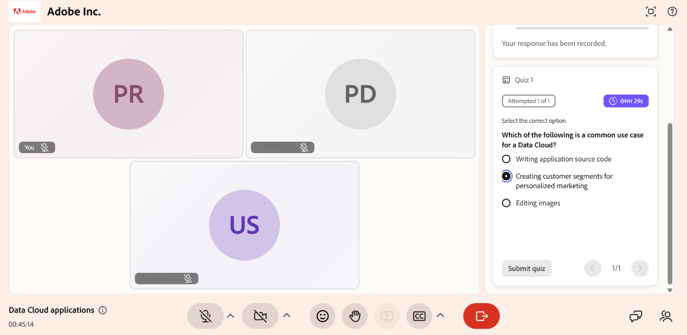

# 퀴즈 시도

퀴즈는 세션 내용에 대한 이해를 평가하는 데 도움이 됩니다. 강사가 퀴즈를 시작하면 세션 인터페이스에 나타나며 질문에 답하고 답변을 제출할 수 있습니다.

퀴즈를 진행하면 응답이 자동으로 저장됩니다. 강사가 시간 제한을 설정하면 타이머에 남은 시간이 표시됩니다. 퀴즈를 제출한 후에는 호스트의 설정에 따라 점수를 보고 정답 및 오답을 검토할 수 있습니다.

이 문서에서는 퀴즈를 풀고, 답변을 제출하고, 결과를 검토하는 방법에 대해 설명합니다.

## 퀴즈 실시

퀴즈를 즉시 시작하고 세션이 진행되는 동안 질문에 응답할 수 있습니다.

퀴즈를 풀려면 다음을 수행하십시오.

1. 퀴즈가 나타나면 **퀴즈 시작**&#x200B;을 선택합니다.

1. 대답을 선택합니다.

1. **제출**&#x200B;을 선택합니다. 귀하의 답변이 평가를 위해 제출됩니다.

시간 제한이 설정되어 있으면 퀴즈를 진행한 동안 남은 시간이 표시됩니다. 제출하기 전에 필요에 따라 질문 사이를 이동할 수 있습니다.

*퀴즈를 시작하기 전에 지침을 표시하는 퀴즈 탭 인터페이스*

## 퀴즈 시도 검토

제출한 후 시도에 대한 요약을 검토할 수 있습니다. 요약에는 시도한 질문 수와 퀴즈 완료 상태가 표시됩니다.

강사가 활성화한 경우 제출 후 응답을 검토할 수도 있습니다. 이를 통해 점수, 선택한 답변을 보고, 정답 및 오답을 파악할 수 있습니다.

*정답과 오답을 보려면 점수 보기를 선택하십시오.*
