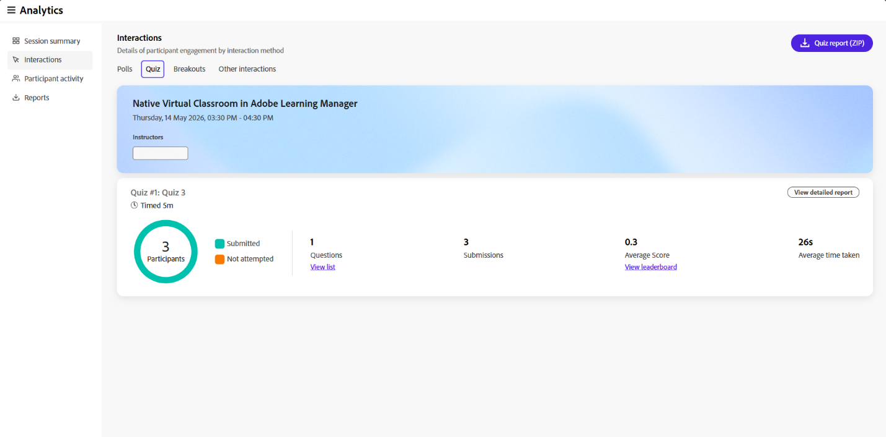
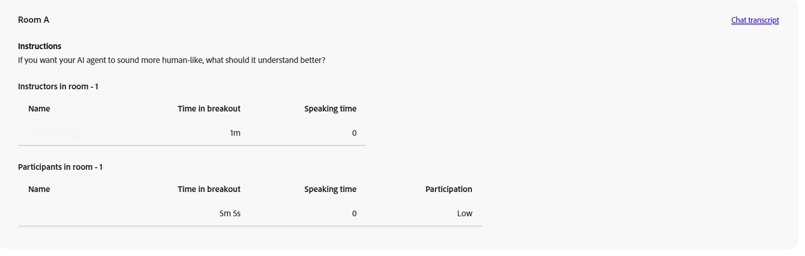

# 세션 대시보드의 구성 요소

## 개요

Live Hub의 세션 대시보드는 세션 성능 및 학습자 참여에 대한 자세한 인사이트를 제공하는 여러 섹션으로 구성됩니다.

각 구성 요소는 강사가 참여를 분석하고, 학습자 동작을 이해하고, 라이브 허브 세션의 효과를 평가하는 데 도움을 줍니다.

## 세션 요약

세션 요약은 세션 기록을 포함하여 라이브 세션 및 기록된 세션의 개요를 제공합니다. 여기에는 등록 및 가입한 학습자의 수, 세션 기간, 시간 경과에 따른 출석, 참가자 참여 및 기록 보기 등의 세부 정보가 포함됩니다.

**세션 요약(PDF)**&#x200B;을 선택하여 요약을 다운로드합니다.

*세션 요약(PDF)을 선택하여 요약을 다운로드합니다.*

다음 세부 정보를 볼 수 있습니다.

* **세션 기간**: 전체 실시간 세션 기간 및 전체 학습자의 평균 참석 기간을 봅니다.

* **출석**: 등록된 학습자 수, 가입한 학습자 및 가입하지 않은 학습자 수를 확인합니다.

* **시간 경과에 따른 출석**: 최대 출석 수와 총 참가자 수를 포함하여 세션 전체에서 출석이 어떻게 변경되었는지 확인합니다.

* **참가자 참여**: 답변한 설문, 채팅 상호 작용, 질문, 제출한 퀴즈 및 보낸 반응 수를 포함하여 세션 동안 학습자가 어떻게 참여했는지 봅니다.

### 녹화본

세션 레코딩과 관련된 인사이트를 봅니다. 이러한 통찰력을 통해 학습자의 참여 및 기록 소비량을 이해하는 데 도움이 됩니다. 또한 레코딩을 다운로드하고 추가 분석을 위해 보고서에 액세스할 수 있습니다.

* **총 조회수**: 녹화를 본 총 횟수와 고유한 조회수.

* **라이브 세션에도 참석한 뷰어**: 라이브 세션에 참석했다가 나중에 녹화를 본 학습자 수. 학습자 목록을 보려면 **다운로드 목록**&#x200B;을 선택하세요.

* **평균 보기 지속 시간**: 학습자가 녹화를 시청하는 데 걸린 평균 시간입니다.

*기록 인사이트를 보여 주는 세션 대시보드 보기*

기록 옵션에서 다음 작업을 수행할 수 있습니다.

* **다운로드**&#x200B;를 선택하여 녹음을 다운로드합니다.

* **녹음 편집**&#x200B;을 선택하여 녹음을 수정합니다. 이렇게 하면 레코딩 플레이어에서 레코딩이 열립니다.

## 인터랙션

상호 작용에서 학습자가 어떻게 상호 작용하고 세션에 참여하는지 확인합니다. 설문 조사, Q&amp;A 메트릭 및 참여 도구 전체에서 참석자 반응에 대한 응답을 추적합니다.

왼쪽 패널에서 **상호 작용**&#x200B;을 선택하여 참석자가 참여하는 방식을 확인합니다.

인터랙션 대시보드는 다음 탭으로 구성되어 있습니다.

### 투표

[투표] 탭에서는 투표에 추가된 질문과 응답을 볼 수 있습니다. **투표** 탭에서 모든 투표 상호 작용에 대한 보고서를 다운로드할 수도 있습니다. 보고서에는 다음이 포함됩니다.

* 이름, 성, 이메일 주소 등 참가자 세부 정보.

* 투표 번호, 투표 유형 및 투표 질문입니다.

* 투표에 대한 각 참가자의 응답.

*설문 상호 작용을 표시하는 세션 대시보드 보기*

### 퀴즈

이 탭에서는 라이브 세션 중에 퀴즈 메트릭을 볼 수 있습니다. 여기에는 다음 패널이 포함됩니다.

* ZIP 형식의 퀴즈 상호 작용 보고서를 다운로드합니다.

* 퀴즈를 제출하거나, 퀴즈를 풀지 않았거나, 퀴즈를 풀지 않은 학습자를 보여주는 그림을 봅니다.

* 퀴즈의 질문 수입니다. 모든 질문을 보려면 **목록 보기**&#x200B;를 선택하세요.

* 질문 목록, 질문, 순위표 및 개별 응답별로 참가자 보고서를 보려면 **자세한 보고서 보기**&#x200B;를 선택하세요.

* 대답의 평균 정확도입니다. 점수를 보려면 **순위표 보기**&#x200B;를 선택하세요.

* 퀴즈를 시도하는 데 걸린 평균 시간입니다.

*퀴즈 상호 작용을 보여 주는 세션 대시보드 보기*

## 브레이크아웃

학습자가 라이브 수업 중에 브레이크아웃 세션에 참여했던 방식을 확인합니다. 이 섹션에서는 브레이크아웃 활동의 요약과 각 브레이크아웃 세션에 대한 자세한 정보를 제공합니다.

* **브레이크아웃 세션**: 세션 중에 수행된 총 브레이크아웃 세션 수입니다.

* **브레이크아웃 기간**: 모든 브레이크아웃 세션의 기간을 결합했습니다.

* **브레이크아웃 참가자**: 브레이크아웃 세션에 참가한 참가자 수.

**중단 보고서(PDF)**&#x200B;를 선택하여 보고서를 다운로드합니다.

*세션 인사이트를 보여 주는 세션 대시보드 보기*

각 브레이크아웃 세션에 대해 세션 이름, 지속 기간 및 시작 시간을 볼 수 있습니다. 다음을 볼 수도 있습니다.

* **참가자**: 브레이크아웃 세션의 총 참가자 수.

* **참가 분포**: 참가 수준별 참가자 분석. 사용 가능한 수준은 높음, 보통 및 낮음입니다.

* **방**: 만들어진 소회의실 수.

**세부 정보 보기**&#x200B;를 선택하여 브레이크아웃 세션을 확장하고 회의실 수준 인사이트를 봅니다. **세부 정보 숨기기**&#x200B;를 선택하여 다시 축소합니다.

### 소회의실 세부 정보

확장된 보기에서 각 룸은 다음을 표시합니다.

* **지침**: 회의실의 참가자에게 제공되는 프롬프트 또는 활동입니다.

* **채팅 기록**: **채팅 기록**&#x200B;을 선택하여 채팅방에서 주고받은 채팅을 봅니다.

* **강의실 강사**: 각 강사의 이름, 강의실 휴식 시간 및 대화 시간이 나열된 표입니다.

* **회의실의 참가자**: 각 참가자의 이름, 모임 시작 시간, 대화 시간 및 참가 수준을 나열하는 표입니다.

*소규모 회의실의 강사 및 참가자 세부 정보를 나열하는 테이블*

## 기타 인터랙션

오른쪽 상단 드롭다운에서 **상호 작용 보고서 다운로드**&#x200B;를 선택하여 **Q&amp;A** 및 **반응** 보고서를 다운로드합니다.

*상호 작용 보고서를 다운로드하는 옵션을 보여 주는 세션 대시보드 보기*

### Q&amp;A 메트릭

Q&amp;A 측정 단위의 다음 속성을 봅니다.

* 총 질문입니다.

* 답변하지 않은 질문 수입니다.

* 질문을 한 참석자의 수입니다.

* 두 가지 이상의 질문을 한 참석자 수, 누가 유력한 잠재 후보자들이다.

* 질문에 대답하는 데 걸린 평균 시간입니다.

### 반응

동의, 의견 불일치, 박수, 웃음 등 세션 중 학습자의 반응을 봅니다.

그래프에서 다음 세부 정보를 확인합니다.

* 완전 반응이야

* 한 번 이상 반응한 참석자 수입니다.

* 총 클릭 수입니다.

* 고유한 참석자.

* 고유한 참석자가 수행한 모든 반응에 대한 총 클릭 수를 그래픽으로 표시합니다.

## 참가자 활동

**참가자 활동** 섹션은 세션 중 개별 학습자 참여의 통합 보기를 제공합니다. 교수자가 참여 수준을 분석하고 다양한 활동 전반에서 학습자 상호 작용을 추적하는 데 도움이 됩니다.

왼쪽 패널에서 **참가자 활동**&#x200B;을 선택하여 자세한 학습자 수준 인사이트를 봅니다. **참가자 활동 보고서(CSV)**&#x200B;를 선택하여 전체 보고서를 다운로드합니다.

*참가자 활동 보고서 세부 정보를 보여 주는 표.*

테이블에는 학습자 활동에 대한 다음과 같은 정보가 표시됩니다.

* **참가자 세부 정보**: 참가자의 이름 및 전자 메일 ID.

* **참석한 기간**: 참가자가 참석한 세션의 백분율입니다.

* **응답한 설문 조사**: 참가자가 응답한 설문 조사 수입니다.

* **퀴즈 제출됨**: 참가자가 제출한 퀴즈 수입니다.

* **전체 퀴즈 점수**: 퀴즈 참가자가 얻은 점수입니다.

* **발표자 시간**: 참가자가 세션 중에 발언한 기간입니다.

* **카메라 시간**: 학습자의 카메라가 활성화된 기간입니다.

* **질문한 질문**: 참가자가 질문한 질문 수입니다.

* **반응**: 참가자가 공유한 반응 수입니다.

* **의심스러운 반응**: 참가자가 세션 중에 의심의 뜻을 표시한 횟수입니다.

## 보고서

강사로 중앙 집중식 허브에서 다양한 활동에 대한 보고서를 다운로드합니다. 이 보고서는 라이브 및 녹화된 공연 중 참석자 상호 작용과 참여를 캡처합니다.

보고서를 다운로드하려면 다음을 수행하십시오.

1. 왼쪽 패널에서 **보고서 다운로드**&#x200B;를 선택합니다.

1. **모두 다운로드(.zip)**&#x200B;를 선택하여 모든 활동에 대한 결합된 보고서를 다운로드합니다.

   
   *모두 다운로드(.zip)를 선택하여 결합된 보고서를 다운로드합니다.*

1. 각 보고서 옆에 있는 다운로드 아이콘을 선택하여 개별적으로 다운로드합니다.
