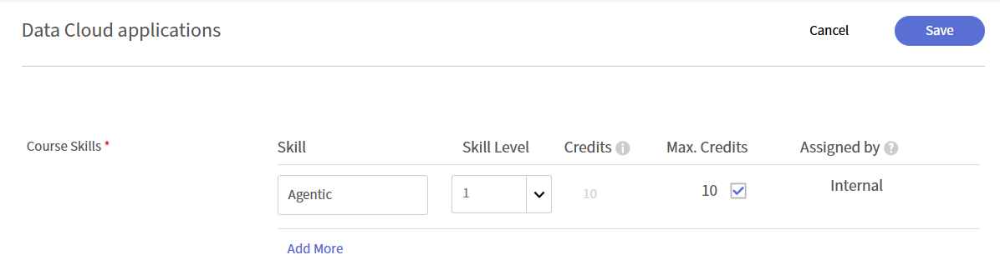
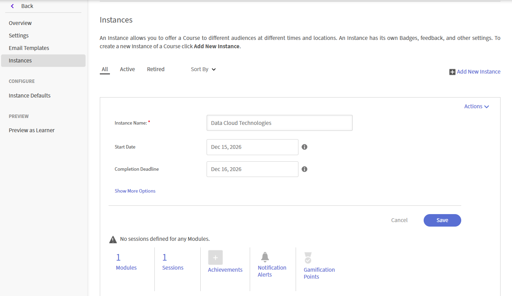

# 라이브 허브 세션 만들기

라이브 허브를 사용하여 Adobe Learning Manager 과정 내에서 강사 주도 라이브 교육을 제공합니다. 라이브 허브 세션과 자가 진행식 콘텐츠를 결합하여 혼합 학습 경험을 만들 수 있습니다.

강의에 가상 강의실 모듈을 추가하면 라이브 세션을 호스팅할 가상 교육 도구를 선택합니다. Adobe의 내장 AI 기반 가상 교육 솔루션인 **Live Hub**&#x200B;를 선택하거나 **Adobe Connect**&#x200B;과 같은 외부 공급자를 사용할 수 있습니다.

>[!NOTE]
>
> 책임자가 라이브 허브 설정에서 라이브 허브를 활성화한 경우에만 라이브 허브가 라이브 가상 교육 도구 옵션으로 나타납니다. 활성화되지 않은 경우에는 Adobe Connect과 같은 외부 공급자를 대신 사용하십시오. 자세한 내용은 [Live Hub 사용](../administrators/feature-summary/enable-live-hub.md)을 참조하세요.

라이브 허브 과정을 만들 때 다음을 수행할 수 있습니다.

* 강의에 하나 이상의 라이브 허브 세션을 추가합니다.

* 수동으로 강사를 선택하거나 AI 지원 강사 권장 사항을 사용합니다.

* 단일 기본 인스턴스로 강의를 구성하거나 다른 일정 또는 대상자에 대한 여러 인스턴스를 만듭니다.

이 문서에서는 라이브 허브 강의를 만들고, 강사를 할당하고 강의 인스턴스를 구성하는 방법에 대해 설명합니다.

## 라이브 허브 과정 만들기

가상 강의실 모듈을 추가하면 기본 인스턴스가 자동으로 생성됩니다. 이 기능은 모든 학습자에게 단일 세션이나 표준 일정을 제공하려는 경우에 유용합니다.

라이브 허브 과정을 생성하려면:

1. 작성자로 Adobe Learning Manager에 로그인합니다.

1. **강의 만들기**&#x200B;를 선택합니다.

1. **강의 카탈로그** 페이지에서 **추가**&#x200B;를 선택한 후 다음 세부 정보를 입력하십시오.

   1. 강의 이름

   1. 간단한 설명

   
   *강의에 모듈을 추가하기 전에 강의 이름과 간략한 설명을 입력하십시오.*

1. **모듈** 섹션에서 **콘텐츠** > **모듈 추가**&#x200B;를 선택합니다.   **모듈 유형 선택** 팝업 창이 나타납니다.

1. **가상 교실**&#x200B;을 선택하고 제목, 설명, 시간대, 시작 및 종료 날짜, 시작 및 종료 시간을 포함한 강의 세부 정보를 입력합니다.

1. **라이브 가상 교육 도구**&#x200B;에서 **라이브 허브**&#x200B;를 선택합니다.

   
   *세션에 대해 AI 기반 강사 추천을 활성화하려면 Live Hub를 선택합니다.*

1. 다음 옵션 중 하나를 사용하여 강사를 추가합니다.

   1. **강사** 필드에 강사 이름을 입력합니다.

   1. **AI를 사용하는 강사 찾기**&#x200B;를 선택하여 AI 추천 강사를 봅니다. 자세한 내용은 [강사 찾기 도구를 사용하여 강사 추가](#add-instructors-using-instructor-finder)를 참조하십시오.

1. **추가** > **저장**&#x200B;을 선택합니다.

1. **강의 스킬** 섹션에서 필요한 스킬을 선택합니다.

1. **스킬 레벨**&#x200B;을 선택한 다음 **최대 크레딧**&#x200B;을 검토하거나 업데이트하세요.

   
   *스킬과 스킬 레벨을 할당하여 학습자가 강의를 완료하여 획득한 점수를 정의합니다.*

1. **저장** > **Publish**&#x200B;을 선택합니다. Adobe Learning Manager에서 강의가 정상적으로 생성됩니다.

## 강의 인스턴스 만들기

책임자는 하나 이상의 강의 인스턴스를 만들어 다양한 대상, 일정 또는 위치에 제공할 수 있습니다. 각 인스턴스에는 자체 세션 세부 정보가 있으므로 동일한 강의의 각 인스턴스에 서로 다른 강사, 강사 찾기 권장 사항 및 시간을 할당할 수 있습니다.

강의 인스턴스를 생성하려면

1. 작성자로 Adobe Learning Manager에 로그인합니다.

1. 강의를 연 다음 왼쪽 패널에서 **인스턴스**&#x200B;를 선택합니다.

   
   *가상 강의실 모듈을 추가하면 기본 인스턴스가 자동으로 만들어집니다.*

1. **새 인스턴스 추가**&#x200B;를 선택합니다.

1. **인스턴스 이름**, **시작 날짜** 및 **완료 기한**&#x200B;을 입력하십시오. **추가 옵션 표시**&#x200B;를 선택하여 추가 설정을 구성합니다.

   
   *인스턴스 이름, 시작 날짜 및 완료 기한을 입력하여 새 강의 인스턴스를 만듭니다.*

1. **저장**&#x200B;을 선택합니다.   새 인스턴스가 **인스턴스** 목록에 추가됩니다.

   
   *새 인스턴스가 인스턴스 목록에서 기본 인스턴스와 함께 나타납니다.*

1. **세션** 아래의 번호를 선택하여 **세션 세부 정보**&#x200B;를 확인합니다.

   
   *세션 세부 정보는 구성해야 하는 시간 배치, 강사 및 위치 필드를 표시합니다.*

1. 세션 세부 정보 옆의 편집(연필) 아이콘을 선택하여 세션 구성 패널을 엽니다.

   
   *특정 세션 인스턴스에 대한 일정, 강사 및 위치를 구성하십시오.*

1. **강사** 필드에 이름을 수동으로 입력하거나 AI 추천 강사를 위해 **AI를 사용하는 강사 찾기**&#x200B;를 선택합니다. 자세한 내용은 [강사 찾기 도구를 사용하여 강사 추가](#add-instructors-using-instructor-finder)를 참조하십시오.

1. **위치** 세부 정보를 입력한 다음 **저장**&#x200B;을 선택합니다. 구성된 시간, 강사 및 위치 세부 정보로 세션이 업데이트됩니다.

## 강사 찾기 도구를 사용하여 강사 추가

강사를 수동으로 검색하고 추가하는 대신 **강사 찾기 도구**&#x200B;를 사용하여 세션에 대한 AI 기반 강사 권장 사항을 받습니다. 강사 찾기 도구 - 강의 세부 정보와 필요한 스킬을 기준으로 강사를 일치시키는 동시에 조직의 휴일 달력, 강사 가용성 및 강사 활용도를 고려하여 가장 적합한 강사를 제안합니다. 자세한 내용은 [강사 추가 및 관리](./instructor-management.md)를 참조하세요.

>[!NOTE]
>
> 강사 찾기는 관리자가 라이브 허브 설정에서 강사 찾기 도우미를 활성화한 경우에만 나타납니다. 자세한 내용은 [Live Hub 사용](../administrators/feature-summary/enable-live-hub.md)을 참조하세요.

강사 찾기 도구를 사용하여 강사를 추가하려면 다음을 수행하십시오.

1. **가상 교실** 모듈의 **강사** 섹션으로 이동합니다.

1. **AI를 사용하여 강사 찾기**&#x200B;를 선택합니다.   **AI 도우미** 패널이 오른쪽에 열립니다.

   
   *AI Assistant 패널을 사용하여 세션 세부 정보를 기반으로 강사 및 시간 슬롯 권장 사항을 가져옵니다.*

1. 추천 강사 목록을 검토합니다. 강사 찾기 기능에서는 강의 스킬과 세션 요구 사항을 기준으로 강사를 추천합니다. Recommendations에서는 강사 가용성, 활용도 및 조직의 휴일 달력도 고려합니다. 자세한 내용은 **강사 관리**&#x200B;를 참조하세요.

1. 할당할 강사로 이동한 다음 **추가**&#x200B;를 선택합니다.   선택한 강사가 **강사** 필드에 태그로 추가됩니다.

## 강의에 학습자 등록

학습자는 다음 두 가지 방법으로 라이브 허브 강의에 등록할 수 있습니다.

1. **관리자**&#x200B;는 조직 요구 사항에 따라 학습자를 강의에 등록합니다. 자세한 내용은 [강의 인스턴스 및 학습 경로 만들기](https://experienceleague.adobe.com/ko/docs/learning-manager/using/admin/courses)를 참조하세요.

1. 학습자는 **카탈로그** 페이지에서 직접 강의에 등록할 수 있습니다. 강의가 자가 등록으로 구성된 경우 학습자는 즉시 등록되며 **내 학습**&#x200B;에서 강의에 액세스할 수 있습니다. 자세한 내용은 [내 학습](https://experienceleague.adobe.com/ko/docs/learning-manager/using/learner/courses)을 참조하세요.

등록 후 학습자는 강의에 추가되고 Adobe Learning Manager 계정으로 알림을 받습니다. 계정의 전자 메일 알림 설정에 따라 학습자는 전자 메일을 통해 강의에 참여하라는 초대를 받을 수도 있습니다.

## Live Hub 회의실 브랜딩 사용자 정의

관리자는 조직의 브랜딩에 맞게 라이브 허브 회의실의 모양을 사용자 정의할 수 있습니다. Adobe Learning Manager의 **테마** 설정을 사용하여 Live Hub 세션에 브랜드 색상, 로고 및 시각적 스타일을 적용합니다.

사용자 정의된 브랜딩은 일관된 학습 경험을 만드는 데 도움이 되며 라이브 교육 세션이 조직의 ID를 반영하도록 합니다.

테마 구성에 대한 자세한 내용은 [색상 테마](../administrators/feature-summary/themes.md#color-themes) 문서를 참조하세요.
