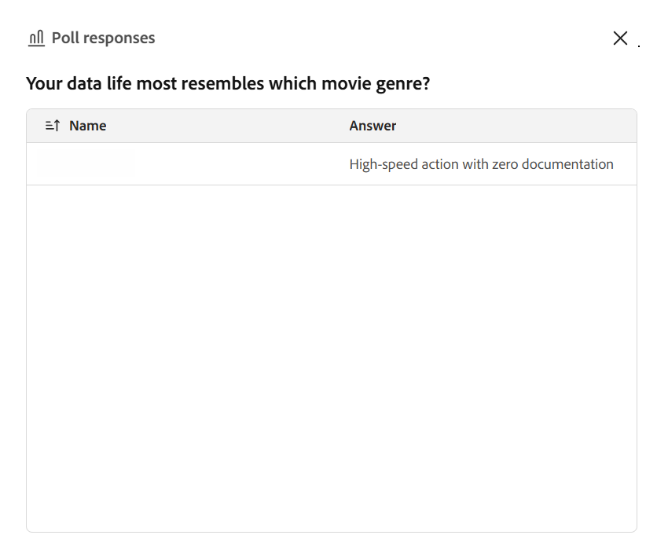

# 투표 생성 및 실행

설문 조사를 사용하여 Live Hub 세션이 더욱 대화형으로 구성되고 참여하게 만들 수 있습니다. **설문 및 퀴즈** 패널에서 객관식이나 단답과 같은 질문 유형을 선택하여 수동으로 설문 조사를 만들거나 **Icebreaker** 및 **지식 검사** 옵션이 있는 AI를 사용하여 설문 조사를 생성할 수 있습니다.

라이브 세션 중에 투표를 실행하고 닫고, 실시간으로 응답을 모니터링하고, 참여자 답변을 검토하고, 결과를 학습자와 공유할지 여부를 선택할 수 있습니다. 이 문서에서는 Live Hub 세션 중에 폴링을 생성, 관리 및 공유하는 방법에 대해 설명합니다.

## 수동으로 투표 만들기

라이브 세션 중에 질문을 하고 학습자의 응답을 수집하기 위한 투표를 만듭니다. 사전 또는 즉석에서 여론조사를 만들어 이해도를 확인하고, 피드백을 수집하고, 참여를 독려할 수 있다.

폴링을 수동으로 생성하려면

1. 컨트롤 막대에서 을 선택합니다.

1. **투표** 탭을 선택한 다음 **직접 만들기**&#x200B;를 선택합니다.

   
   *투표 탭에서 직접 작성을 선택하여 투표를 수동으로 만듭니다.*

1. **설문 조사** 탭의 드롭다운에서 다음 질문 유형 중 하나를 선택합니다.

   1. 객관식

   1. 단답형

1. 선택한 질문 유형에 따라 설문을 구성합니다.

   1. **객관식**: 각 답변 옵션을 별도의 줄에 입력하십시오. 기본적으로 세 개의 옵션 필드를 사용할 수 있습니다. 다음을 수행할 수 있습니다.

      1. 옵션을 추가하려면 **옵션 추가**&#x200B;를 선택하세요.

      1. 여러 항목을 선택하려면 **복수 정답**&#x200B;을 사용하도록 설정하십시오.

   1. **단답형**: 답변 옵션은 필요하지 않습니다. 학습자는 텍스트 필드에 응답을 입력합니다.

1. **저장**&#x200B;을 선택합니다.

## AI를 사용하여 투표 만들기

**설문 및 퀴즈** 패널의 AI 지원 옵션을 사용하여 수동으로 질문을 만들지 않고도 설문 질문을 생성할 수 있습니다. 두 가지 AI 폴링 유형을 사용할 수 있습니다.

* **Icebreaker 설문**: 세션 시작 시 또는 휴식 후 다시 시작할 때 참여를 독려하는 소개 또는 대화 질문을 생성합니다.

* **지식 검사 설문 조사**: 지식 검사 질문을 생성하여 강사가 학습자가 주제를 얼마나 잘 따르고 있는지 이해하고 필요한 경우 접근법을 조정할 수 있도록 지원합니다.

### Icebreaker 설문 만들기

세션 시작 시 학습자의 참여를 유도하기 위해 Icebreaker 폴링을 생성합니다. 빙하 파열 조사는 강사가 학습자의 선호도, 기대 또는 사전 지식을 이해하고 세션 초반에 참여를 독려하는 데 도움을 줍니다.

Icebreaker 설문 조사를 만들려면 다음을 수행하십시오.

1. 컨트롤 막대에서 을 선택합니다.

1. **투표** 탭을 선택한 다음 **쇄빙선 투표**&#x200B;를 선택합니다.

1. 생성된 질의 응답 옵션을 검토하고 필요한 경우 수정합니다. 다음을 수행할 수 있습니다.

   * 질문을 편집합니다.

   * 기존 대답 옵션을 업데이트하거나 제거합니다.

   * 질문 유형을 **단답형**(으)로 변경합니다.

   * 추가 선택 항목을 포함하려면 **옵션 추가**&#x200B;를 선택하세요.

   * 객관식 질문의 경우 **복수 정답**&#x200B;을 활성화합니다.

   
   *설문 조사 탭에서 AI로 Icebreaker 설문 조사를 생성하고 사용자 지정합니다.*

1. (선택 사항) **투표 다시 생성**&#x200B;을 선택하여 새 질문을 생성합니다.

1. (선택 사항) 축소판 또는 축소판 옵션을 사용하여 생성된 콘텐츠에 대한 피드백을 제공합니다.

1. **저장**&#x200B;을 선택합니다.

### 지식 검사 설문 만들기

지식 검사 설문을 생성하여 세션 중 학습자의 이해도를 평가하고 학습자가 주제를 얼마나 잘 이해했는지 평가합니다. 이러한 설문 조사는 강사가 지식 격차를 식별하고, 주요 개념을 검증하며, 학습자 응답을 기반으로 세션 속도 또는 초점을 조정하는 데 도움이 됩니다.

지식 검사 설문을 생성하려면 다음을 수행합니다.

1. 컨트롤 막대에서 을 선택합니다.

1. **투표** 탭을 선택한 다음 **지식 확인**&#x200B;을 선택합니다.

1. 생성된 질의 응답 옵션을 검토하고 필요한 경우 수정합니다. 다음을 수정할 수 있습니다.

   * 질문을 편집합니다.

   * 기존 대답 옵션을 업데이트하거나 제거합니다.

   * 질문 유형을 변경합니다.

   * 추가 선택 항목을 포함하려면 **옵션 추가**&#x200B;를 선택하세요.

   * 객관식 질문의 경우 **복수 답변**&#x200B;을 사용합니다.

   
   *설문 조사 탭에서 AI로 지식 검사 설문 조사를 생성하고 사용자 지정합니다.*

1. (선택 사항) 현재 질문을 새 질문으로 바꾸려면 **투표 다시 생성**&#x200B;을 선택합니다.

1. (선택 사항) 축소판 또는 축소판 옵션을 사용하여 생성된 콘텐츠에 대한 피드백을 제공합니다.

1. **저장**&#x200B;을 선택합니다.

## 설문 조사 시작

투표가 작성 및 저장되면 **투표** 탭 아래의 **투표 및 퀴즈** 패널에 표시됩니다. 세션 중 언제든지 저장된 투표에 액세스하고 실행하여 학습자의 참여를 유도하고 실시간으로 응답을 수집할 수 있습니다.

설문을 시작하려면:

1. 컨트롤 막대에서 을 선택합니다.

1. **투표** 탭을 선택합니다.

1. 목록에서 저장된 설문을 선택합니다.

1. **투표 시작**&#x200B;을 선택합니다.

>[!NOTE]
>
> 투표가 학습자에게 표시되며 강사는 투표 결과를 실시간으로 볼 수 있습니다. 학습자는 설문 조사가 진행되는 동안 응답을 업데이트할 수 있습니다.

*세션 중에 응답 수집을 시작하려면 투표 시작을 선택합니다.*

## 참가자와 투표 결과 공유

세션 중에 언제든지 참여자와 투표 결과를 공유할 수 있습니다. 실시간으로 결과를 표시하려면 **모든 참가자에게 결과 공유**&#x200B;를 선택합니다. 결과가 공유되면 설문 조사에 **결과 라이브** 태그가 표시되어 학습자가 설문 조사 결과를 볼 수 있음을 나타냅니다.

*실시간으로 투표 결과를 표시하려면 모든 참가자에게 결과 공유를 선택합니다.*

## 투표 닫기

참가자가 더 이상 응답하지 않도록 하려면 설문을 닫을 수 있습니다.

설문을 닫으려면:

1. 컨트롤 막대에서 을 선택합니다.

1. **투표** 탭에서 활성 투표로 이동합니다.

1. **투표 종료**&#x200B;를 선택합니다.

*응답 수집을 중지하고 설문 조사를 종료하려면 설문 조사 종료를 선택합니다.*

설문 조사가 끝나면 **닫힘** 상태가 설문 조사 질문 위에 표시됩니다.

## 설문 조사 결과 보기

강사는 세션 중에 설문 결과를 볼 수 있습니다. 이러한 결과는 학습자가 응답을 제출하거나 업데이트하면 실시간으로 업데이트됩니다. 기본적으로 폴링 보기에는 각 옵션에 대한 응답의 전체 분포가 표시됩니다.

자세한 응답을 보려면 다음을 수행합니다.

1. **투표** 탭을 엽니다.

1. 활성 또는 닫힌 폴을 선택합니다.

1. **응답 보기**&#x200B;를 선택합니다.

참여자명, 선택된 답변, 복수 응답을 허용하는 질문에 대한 복수 항목이 표시된 팝업 창이 열립니다.

*설문 응답 창에서 참가자 이름 및 선택한 답변을 봅니다.*

학습자는 응답이 제출되거나 업데이트될 때 설문 결과를 실시간으로 볼 수 있습니다.

## 종료된 투표 관리

투표를 마감한 후에는 투표의 옵션 메뉴(세 개 점)에서 관리할 수 있습니다. 이러한 옵션을 사용하여 폴링을 재사용하거나, 복사본을 만들거나, 세션에서 제거할 수 있습니다.

마감된 투표를 관리하려면:

1. 에서 **Poll** 탭을 선택합니다.

1. 종료된 설문 조사로 이동하고 옵션(**...**)을 선택합니다. 메뉴를 클릭합니다.

   
   *옵션 메뉴를 사용하여 닫힌 설문을 다시 설정하거나 복제하거나 삭제합니다.*

1. 다음 옵션 중 하나를 선택합니다.

| **옵션** | **설명** |
|----|----|
| **다시 설정** | 투표 자체는 그대로 유지하면서 투표에 대한 모든 응답을 영구적으로 삭제합니다. 동일한 설문을 다시 실행하고 새로운 응답 집합을 수집하려면 이 옵션을 사용하십시오. |
| **복제** | 질문과 대답 옵션을 포함하여 투표 사본을 만드므로 처음부터 다시 작성하지 않고도 재사용하거나 조정할 수 있습니다. |
| **삭제** | 세션에서 투표 및 투표의 모든 응답을 영구적으로 제거합니다. 이 작업은 실행 취소할 수 없습니다. |

>[!NOTE]
>설문을 복제, 삭제 또는 재설정하는 동안 오류가 발생하면 [라이브 허브 문제 해결 가이드](../kb/troubleshooting-guide-for-live-hub.md#poll-tab-issues)에서 일반적인 오류 메시지 목록과 해결 방법을 참조하십시오.
