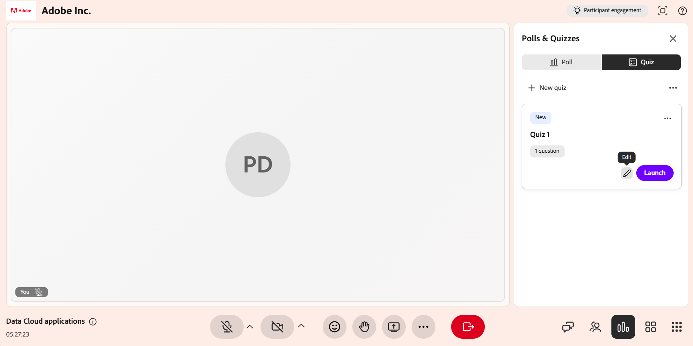
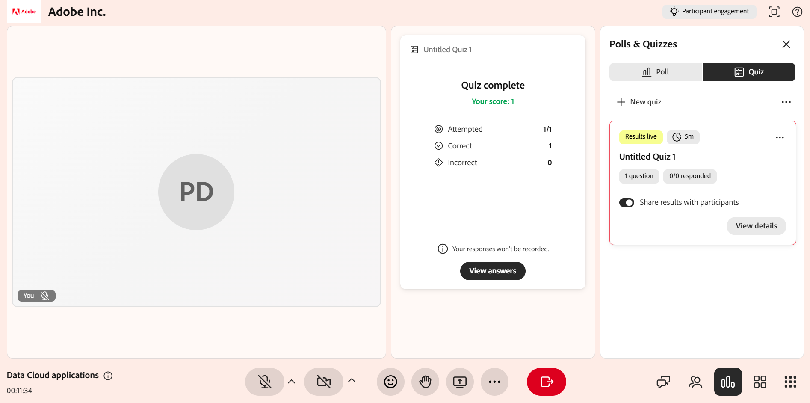

# 퀴즈 만들기 및 관리

강사는 퀴즈 기능을 통해 라이브 허브 세션 중에 학습자가 주제를 얼마나 잘 파악했는지 측정할 수 있습니다. 빠른 단일 질문 폴링과 달리 퀴즈는 객관식 및 복수 답변 질문, 점수 및 시간 제한, 무작위 질문 또는 옵션 순서와 같은 설정을 사용하여 구조화된 복수 질문 평가를 구축할 수 있습니다.

이 문서는 퀴즈 생성에서 결과 공유에 이르기까지 강사가 사용할 수 있는 모든 퀴즈 작업을 안내합니다.

## 퀴즈 만들기

퀴즈를 만들어 세션 중에 학습자의 이해도를 평가할 수 있습니다. 퀴즈는 성과를 추적하기 위해 다양한 질문 유형 및 지원 점수를 포함할 수 있습니다. 사용할 수 있는 퀴즈가 없으면 **퀴즈** 탭에서 새 퀴즈를 만들 수 있습니다.

퀴즈를 생성하려면 다음을 수행하십시오.

1. **설문 및 퀴즈** 패널에서 **퀴즈** 탭을 선택합니다.

   
   *설문 및 퀴즈 패널에서 퀴즈 탭을 선택합니다.*

1. **새 퀴즈 만들기**&#x200B;를 선택합니다. **제목 없는 퀴즈 1**&#x200B;라는 이름의 새 퀴즈가 열립니다.

1. 질문 필드에 질문을 입력합니다.

1. [옵션] 필드에 대답 옵션을 입력합니다. 기본적으로 세 가지 옵션이 제공됩니다. 다음을 수행할 수 있습니다.

   1. **+ 옵션 추가**&#x200B;를 선택하여 다른 옵션을 추가합니다.

   1. 옵션 옆의 **X**&#x200B;을(를) 선택하여 제거합니다.

   1. 옵션 옆의 핸들을 드래그하여 순서를 변경합니다.

1. 정답 표시:

   1. 정답 하나를 설정하려면 [정답] 옵션 옆의 라디오 버튼을 선택합니다.

   1. 두 개 이상의 정답을 허용하려면 **복수 정답** 토글을 활성화한 다음 각 정답 옵션에 대해 라디오 단추를 선택합니다.

1. 질문을 추가하려면 **개 이상의 질문 추가**&#x200B;를 선택하세요.

   
   *퀴즈를 만드는 옵션을 보여주는 퀴즈 탭 인터페이스*

1. **완료**&#x200B;를 선택합니다.

1. **저장**&#x200B;을 선택합니다. 이제 퀴즈를 시작할 수 있습니다.

## 퀴즈에 대한 시간 제한 설정

학습자가 정해진 기간 내에 퀴즈를 풀어야 하도록 시간 제한(선택 사항)을 설정할 수 있습니다. 시간 제한은 퀴즈 맨 위의 타이머에서 설정됩니다.

시간 제한을 설정하려면 다음을 수행합니다.

1. 퀴즈 상단의 타이머 아이콘을 선택합니다.

1. **시간 제한 설정**&#x200B;을 사용하도록 설정하십시오.

1. 지속 시간을 분 단위로 설정합니다.

*퀴즈 시간 제한을 설정하는 옵션을 보여주는 퀴즈 탭 인터페이스*

## 퀴즈 편집

퀴즈를 시작하기 전에 질문을 업데이트하거나, 대답 옵션을 수정하거나, 질문 순서를 변경합니다. 퀴즈가 실행되면 퀴즈를 편집할 수 없습니다.

퀴즈를 편집하려면

1. **퀴즈** 탭을 선택합니다.

1. 편집할 퀴즈로 이동합니다.

1. 편집(연필) 아이콘을 선택합니다.

1. 다음 중 원하는 작업을 수행합니다.

   1. 질문 텍스트를 편집합니다.

   1. 대답 옵션을 업데이트하거나 제거합니다.

   1. 정답을 선택합니다.

   1. **질문 추가**&#x200B;를 사용하여 새 질문을 추가합니다.

   1. 더 이상 필요하지 않은 질문은 삭제하십시오.

   
   *퀴즈를 편집하는 옵션을 보여주는 퀴즈 탭 인터페이스*

1. **저장**&#x200B;을 선택하여 변경 내용을 적용합니다.

## 퀴즈 시작

퀴즈를 만들고 저장하면 **퀴즈** 탭에 **새로 만들기** 레이블과 함께 나타납니다. 퀴즈를 시작하면 학습자가 퀴즈를 볼 수 있고 실시간으로 질문을 시도할 수 있습니다.

퀴즈를 시작하려면:

1. **퀴즈** 탭을 선택합니다.

1. 저장된 퀴즈 목록에서 **퀴즈 시작**&#x200B;을 선택합니다.

퀴즈를 시작하면 학습자가 응답할 수 있도록 **설문 조사 및 퀴즈** 패널에 표시됩니다. 시간 제한이 설정된 경우 실시간 퀴즈 중에 **+1분**&#x200B;을 선택하여 퀴즈 기간을 연장할 수도 있습니다.

*참가자에게 시작된 퀴즈를 보여주는 퀴즈 탭 인터페이스*

>[!NOTE]
>퀴즈를 만들거나 시작할 때 오류가 발생하는 경우 일반적인 오류 메시지 목록과 해결 방법은 [라이브 허브 문제 해결 가이드](../kb/troubleshooting-guide-for-live-hub.md#quiz-tab-issues)를 참조하십시오.

## 퀴즈 결과 보기

세션 중 및 후에 퀴즈 결과를 보고 학습자의 성능과 참여를 모니터링합니다. 학습자가 퀴즈를 시도하고 완료하면 결과가 실시간으로 업데이트됩니다.

퀴즈 결과를 보려면 다음을 수행합니다.

1. 에서 **퀴즈** 탭을 선택합니다.

1. 활성 또는 완료된 퀴즈로 이동합니다.

1. **결과 보기**&#x200B;를 선택합니다.

*퀴즈 탭 인터페이스에는 퀴즈 결과에 액세스하고 볼 수 있는 [세부 정보 보기] 옵션이 표시됩니다.*

**퀴즈** 패널에 다음 세부 정보와 함께 결과가 표시됩니다.

* 학습자 프로필

* 시도한 질문 수

* 점수

* 퀴즈를 완료하는 데 걸린 시간

## 참가자에 대한 자세한 응답 보기

결과 목록에서 개별 참가자를 선택하여 자세한 응답을 봅니다. 학습자가 각 질문에 어떻게 대답했는지 확인할 수 있습니다.

*학습자에 대한 자세한 결과를 보여주는 퀴즈 응답 팝업 창*

## 퀴즈 닫기

학습자가 응답을 완료하거나 제출을 중지하고자 할 때 활성 퀴즈를 종료하려면 이 옵션을 사용합니다.

퀴즈를 종료하려면:

1. **퀴즈 닫기**&#x200B;를 선택합니다. 모든 학습자에 대해 퀴즈가 즉시 중지됩니다.

1. 퀴즈 상태가 **닫힘**(으)로 업데이트됩니다.

*닫힌 퀴즈 상태를 표시하는 퀴즈 탭 인터페이스*

## 참가자와 퀴즈 결과 공유

퀴즈를 종료하거나 닫은 후 참가자와 퀴즈 결과를 공유할 수 있습니다. 결과를 모든 사용자에게 표시하려면 **참가자와 결과 공유** 토글을 활성화합니다.

결과 공유가 활성화되면 퀴즈에 **결과 라이브** 태그로 레이블이 지정됩니다. 즉, 결과가 학습자에게 표시됩니다.

*결과를 학습자와 공유하려면 참가자와 결과 공유를 활성화하십시오.*

## 퀴즈 관리

해당 옵션(**...**)에서 저장되거나 닫힌 퀴즈를 관리할 수 있습니다. **설문 및 퀴즈** 패널의 메뉴. 이러한 옵션을 사용하면 응답을 지우고, 퀴즈를 다시 사용하거나, 세션에서 제거할 수 있습니다.

퀴즈를 관리하려면:

1. 에서 **퀴즈** 탭을 선택합니다.

1. 퀴즈로 이동하여 옵션(**..**)을 선택합니다. 메뉴를 클릭합니다.

   
   *퀴즈를 재설정, 복제 및 삭제하는 옵션이 표시된 퀴즈 탭 인터페이스*

1. 다음 옵션 중 하나를 선택합니다.

| **옵션** | **설명** |
|----|----|
| **다시 설정** | 퀴즈 자체는 그대로 유지하면서 퀴즈에 대한 모든 응답을 영구적으로 삭제합니다. 이 기능을 사용하여 동일한 퀴즈를 다시 실행하고 새로운 응답 세트를 수집합니다. |
| **복제** | 질문과 대답 옵션을 포함하여 퀴즈 사본을 만들기 때문에 처음부터 다시 작성하지 않고도 재사용하거나 조정할 수 있습니다. |
| **삭제** | 세션에서 퀴즈와 퀴즈의 모든 응답을 영구적으로 제거합니다. 이 작업은 실행 취소할 수 없습니다. |
