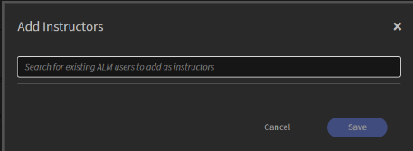
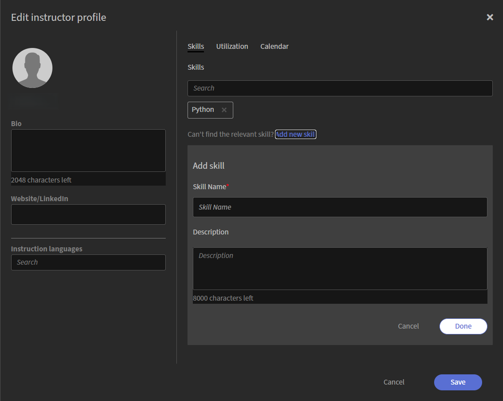

# 강사 추가 및 관리

강사는 라이브 세션을 제공하고 학습자의 참여를 유도합니다. 정확한 일정 예약과 효과적인 강의 제공을 지원하기 위해 책임자는 강사를 추가하고, 프로필을 작성하고, 강의 스킬과 언어를 정의하고, 가용성을 구성할 수 있습니다.

강사 탭에서는 조직 전체에서 이 정보를 관리할 수 있는 단일 위치를 제공합니다. 여기에서 기존 Adobe Learning Manager 사용자를 강사로 추가하고, 프로필을 검토 및 업데이트하고, 강의 요구 사항이 증가함에 따라 기술, 언어 및 가용성을 최신 상태로 유지할 수 있습니다.

## 강사 탭에 액세스

강사를 조회하고 관리하려면 다음 단계를 따르십시오.

1. Adobe Learning Manager에 로그인합니다.

1. **관리자** > **사용자**&#x200B;로 이동합니다.

1. **사용자 그룹**&#x200B;에서 **강사**&#x200B;를 선택합니다.

   
   *사용자 그룹에서 강사를 선택하여 강사를 보고 관리합니다.*

## 강사 추가

강사는 기존 Adobe Learning Manager 사용자로부터 생성됩니다. 사용자에게 아직 강사 권한이 없는 경우 강사로 추가합니다.

강사를 추가하려면 다음을 수행하십시오.

1. **사용자 그룹**&#x200B;에서 **강사** 탭을 선택합니다.

1. **강사 추가**&#x200B;를 선택합니다.   **강사 추가**&#x200B;의 팝업 창이 나타납니다.

   
   *이름으로 사용자를 검색한 다음 선택하여 강사 역할을 할당합니다.*

1. 이름으로 사용자를 검색한 다음 검색 결과에서 해당 사용자를 선택하여 강사 역할을 할당합니다.

1. **저장**&#x200B;을 선택합니다.   이제 사용자에게 강사 역할이 할당되고 강사 목록에 표시됩니다.

## 강사 프로필 설정

강사 프로필은 강사의 강의 정보, 언어, 스킬, 활용도 및 가용성을 정의합니다. 프로필을 작성하면 정확한 강사 일치, 효율적인 일정 계획 및 강의 요구사항에 맞출 수 있습니다.

강사 프로필을 설정하려면

1. 강사 탭에서 강사 이름을 검색합니다.

1. **스킬 및 기타 세부 정보 추가**&#x200B;를 선택합니다.   **강사 프로필 편집** 팝업 창이 나타납니다.

   
   *강사 프로필 편집 창에는 기본 세부 정보, 스킬, 사용률 및 가용성에 대한 탭이 포함되어 있습니다.*

### 기본 세부 사항 추가

기본 세부 정보는 대화 상자의 왼쪽 패널에 표시되며 열려 있는 탭에 관계없이 항상 표시됩니다.

기본 세부 정보를 추가하려면 다음을 수행하십시오.

1. 프로필 섹션으로 이동합니다.

1. 다음 세부 사항을 입력합니다.

   | **필드** | **작업** |
   |----|----|
   | **약력** | 강사에 대한 간단한 설명(최대 2,048자)을 입력합니다. |
   | **웹 사이트/LinkedIn** | 외부 프로필 또는 참조 링크를 입력하십시오. |
   | **지침 언어** | 강사가 가르칠 수 있는 언어를 검색합니다. 선택한 언어가 태그로 표시됩니다. |

## 프로필에 강사 스킬 추가

스킬은 강사가 가르칠 수 있는 주제 영역과 전문 지식을 정의합니다. 이는 강사를 관련 강의에 일치시키고 강의 요구 사항에 따라 적합한 강사가 할당되도록 하는 데 중요한 역할을 합니다.

강사 스킬을 추가하려면 다음을 수행합니다.

1. **스킬** 탭으로 이동합니다.

1. **검색** 필드에 스킬 이름을 입력합니다. 이렇게 하면 목록이 스킬로 채워집니다.

1. 목록에서 스킬을 선택합니다.   선택한 스킬이 태그로 표시됩니다.

1. **저장**&#x200B;을 선택합니다.

### 새 스킬 만들기

필요한 스킬을 사용할 수 없는 경우 프로필에서 직접 만들 수 있습니다.

새 스킬을 추가하려면 다음을 수행하십시오.

1. **스킬** 탭에서 **새 스킬 추가**&#x200B;를 선택합니다. **스킬 추가** 패널이 열립니다.

    *스킬 이름과 설명을 입력한 다음 완료를 선택하여 새 스킬을 추가합니다.*

1. **스킬 추가** 패널에서 다음 세부 사항을 입력합니다.

   1. 스킬 이름

   1. 설명

1. **완료**&#x200B;를 선택합니다.   새 스킬이 추가되고 태그로 표시됩니다.

1. **저장**&#x200B;을 선택합니다.   스킬이 강사 프로필에 추가됩니다.

## 강사 활용률 구성

**활용률** 탭을 사용하여 강사의 교수 능력과 선호하는 근무 시간을 정의합니다. 강사가 세션을 수행할 수 있는 시간을 나타내기 위해 활용 제한을 설정하여 강의 목표 및 제한을 설정하고 선호하는 작업 시간을 지정할 수 있습니다. 표시된 시간대는 강사의 사용자 프로필에서 상속됩니다.

강사 활용률을 구성하려면 다음을 수행하십시오.

1. **사용률** 탭으로 이동합니다.

1. **월간** 기간에 대한 **최소 목표** 및 **최대 제한**(시간)을 입력하십시오.

1. 선호하는 시간대에 대해 **시작 시간** 및 **종료 시간**&#x200B;을 입력하십시오.

   
   *강사가 선호하는 작업 시간에 대한 시작 시간과 종료 시간을 입력하십시오.*

1. (선택 사항) 가용성을 추가하려면 **다른 시간 슬롯 추가**&#x200B;를 선택합니다.

1. **저장**&#x200B;을 선택합니다. 강사의 활용률 제한과 선호하는 작업 시간이 업데이트됩니다.

## 강사 가용성 관리

**일정** 탭을 사용하여 강사의 일정을 추가하고 강사를 사용할 수 없을 때 기간을 표시합니다. 캘린더는 색상 코딩을 사용하여 **예약**, **휴일** 및 **사용할 수 없음** 날짜를 식별합니다.

이 일정에 표시된 **휴일**&#x200B;은 휴일 설정을 통해 구성됩니다. 자세한 내용은 [휴일 관리](./manage-holidays.md)를 참조하세요.

사용할 수 없는 일을 표시하려면 다음을 수행합니다.

1. **일정** 탭으로 이동합니다.

1. **사용할 수 없는 일 추가** 섹션에서 시작 날짜와 종료 날짜를 선택하십시오.

   
   *강사 달력에서 범위를 사용할 수 없는 것으로 표시하려면 시작 날짜와 종료 날짜를 선택하십시오.*

1. **추가**&#x200B;를 선택합니다.   선택한 날짜 범위가 캘린더에서 사용할 수 없음으로 표시됩니다.

1. **저장**&#x200B;을 선택합니다. 강사의 가용성 설정이 업데이트됩니다.
