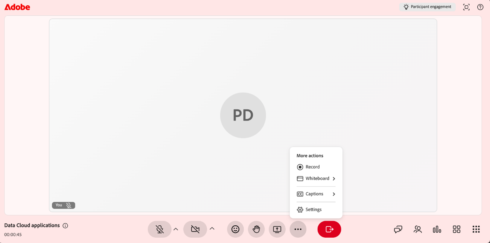

# 세션 기록

강사는 세션 캡처, 조정 및 공유 방법에 대한 모든 권한을 가집니다. 라이브 세션 중에 녹화를 시작하고 실행되는 동안 관리하며, 세션이 종료되면 자동으로 생성된 주제, 요약 및 대본을 검토할 수 있습니다.

세션 캡처 외에도 기록을 편집하여 불필요한 섹션을 제거하고 폐쇄 캡션 및 대본을 활성화할 수 있습니다. 다음 섹션에서는 이러한 각 작업에 대해 자세히 설명합니다.

>[!NOTE]
>
>세션을 기록할 때는 기본 세션만 기록에 포함됩니다. 참가자가 소회의실로 이동하면 기록이 자동으로 일시 중지되고 모두가 메인 세션으로 돌아가면 다시 시작됩니다. 그 결과, 소회의실 활동은 기록되지 않습니다.

## 세션 기록

1. **추가 작업** 메뉴로 이동합니다.

1. **녹음 시작**&#x200B;을 선택합니다.   &quot;**세션이 지금 기록되고 있습니다**&quot;을(를) 나타내는 확인 팝업이 나타납니다.

   
   *추가 작업 메뉴에서 기록을 선택하여 세션 캡처를 시작합니다.*

## 기록 정지, 일시 정지 및 다시 시작

세션이 레코딩 중일 때 가상 강의실의 상단 모서리에 레코딩 표시기가 나타납니다. 기록을 시작, 중지 및 다시 시작할 수 있습니다.

### 기록 정지

1. 기록 표시기를 선택합니다.   기록 동작이 있는 팝업 창이 열립니다.

   
   *기록하는 동안 진행 중인 기록 옵션을 사용하여 세션을 일시 중지하거나 중지하세요.*

1. **녹화 중지**&#x200B;를 선택합니다.   세션이 더 이상 기록되지 않는다는 확인 메시지가 나타납니다.

### 기록 일시 정지

기록을 일시 중지하려면 다음을 수행하십시오.

1. 기록 표시기를 선택합니다.

1. **녹화 일시 중지**&#x200B;를 선택합니다.   **녹음 및 받아쓰기 일시 중지**&#x200B;를 표시하는 확인 메시지가 나타납니다.

### 기록 다시 시작

기록을 일시 중지하면 기록 다시 시작 옵션이 나타납니다. **녹음 다시 시작**&#x200B;을 선택하여 일시 중지된 녹음을 계속합니다.

*일시 중지된 경우 [기록 일시 중지] 옵션을 사용하면 기록을 다시 시작하거나 중지할 수 있습니다.*

## 레코딩에 액세스

녹화된 세션은 각 세션의 **세션 개요** 페이지에서 사용할 수 있습니다. 여기에서 기록을 재생하거나 편집 모드에서 열어 타임라인과 대본을 세밀하게 조정할 수 있습니다.

레코딩에 액세스하려면 다음을 수행합니다.

1. 필요한 과정으로 이동하여 세션을 엽니다.

1. **세션 개요** 페이지의 **라이브 허브** 섹션으로 스크롤합니다.

1. **녹음 보기** 카드에서 다음 중 하나를 수행합니다.

   * **녹화 보기**&#x200B;를 선택하여 재생 모드에서 녹화를 엽니다.

   * **편집**&#x200B;을 선택하여 편집 모드에서 레코딩을 엽니다.

   
   *Live Hub 섹션에서 기록 카드를 보고 기록을 재생하거나 편집할 수 있습니다.*

## 녹화 재생

기록 보기를 선택하면 기록 플레이어에서 기록이 열립니다. 플레이어는 세션 비디오, 참가자 축소판 및 대본을 표시합니다.

레코딩을 재생하려면 다음을 수행하십시오.

1. **세션 개요** 페이지로 이동합니다.

1. **라이브 허브** 섹션에서 **녹화 보기**&#x200B;를 선택합니다.   기록이 재생 모드로 열립니다.

   
   *녹음 플레이어가 재생 모드에 있으며 세션 비디오와 대본 패널이 표시됩니다.*

1. 다음 재생 컨트롤을 사용하여 보기 환경을 조정합니다.

| **제어** | **설명** |
|----|----|
| 재생 또는 일시 중지 | 재생을 시작하거나 일시 정지합니다. |
| 볼륨 | 오디오 레벨을 조정합니다. |
| 진행률 표시줄 | 드래그하여 기록의 특정 지점으로 이동합니다. 경과된 시간 및 총 시간이 컨트롤 옆에 표시됩니다. |
| 재생 속도 | 재생 속도를 느리게 하거나 빠르게 합니다. 사용 가능한 옵션은 **0.25x**, **0.5x**, **0.75x**, **1x**, **1.25x**, **1.5x** 및 **2x**&#x200B;입니다. |
| CC (폐쇄 자막) | 재생 중에 폐쇄 자막을 켜거나 끕니다. CC 버튼 옆의 화살표를 선택하여 캡션을 사용자 정의합니다. **작게**, **중간** 또는 **크게**&#x200B;에서 글꼴 크기를 선택하고 **흰색 검정**, **검은색 노랑**, **검은색 흰색**, **노란색 어두운 영역** 또는 **파란색 노랑 영역**&#x200B;에서 캡션 스타일을 선택합니다. |
| 전체 화면 | 녹음 플레이어를 확장합니다. |

## 기록에 주제 생성

주제는 세션 토론의 흐름에 따라 레코딩을 의미 있는 섹션으로 자동으로 나눕니다. 긴 레코딩을 구성하고 탐색을 개선하는 데 도움이 됩니다. 키워드를 사용하여 항목을 검색하여 기록의 관련 섹션으로 빠르게 이동할 수도 있습니다.

## 기록에서 주제 보기

주제가 생성되면 주제를 탐색하고 탐색할 수 있습니다. 항목이 **AI를 사용하여 생성됨**(으)로 표시됩니다. AI 생성 응답을 다시 확인해야 하므로 내용을 검토합니다.

항목을 보고 탐색하려면 다음을 수행합니다.

1. **주제** 패널에서 주제 목록을 찾아보거나 **검색** 상자를 사용하여 키워드를 사용하는 주제를 찾습니다.

1. 항목을 선택하여 확장하고 요약, 세부 정보 및 총 기간을 봅니다.

1. **항목 재생**&#x200B;을 선택합니다.   선택한 주제 섹션에서 기록이 재생됩니다.

   
   *AI 생성 항목이 기록을 탐색하는 데 도움이 되는 항목 패널*

## 대본 보기

대본은 녹음과 함께 읽을 수 있는 세션의 타임스탬프가 있는 텍스트 버전을 제공합니다. 각 항목에는 발표자의 이름과 텍스트 음성 시간이 포함됩니다.

대본을 보려면 다음을 수행하십시오.

1. 플레이어 오른쪽에 있는 패널에서 **대본** 아이콘을 선택합니다.   **대본** 패널이 열리고 타임스탬프가 적용된 대본이 표시됩니다.

1. (선택 사항) **검색** 상자를 사용하여 대본 내에서 특정 단어나 구를 찾습니다.

기록의 특정 부분으로 이동하려면 대본 항목을 선택합니다. 기록이 해당 타임스탬프로 이동하여 해당 시점부터 재생을 시작합니다.

*대본 패널. 각 항목은 기록의 해당 지점에 연결됩니다.*

### 대본 텍스트 크기 변경

대본 텍스트의 크기를 조정하여 쉽게 읽을 수 있습니다.

텍스트 크기를 변경하려면 다음을 수행하십시오.

1. **대본** 패널에서 **대본** 머리글 옆의 **텍스트 크기** 아이콘을 선택합니다.

1. 목록에서 텍스트 크기를 선택합니다. 사용 가능한 크기는 12, 14, 16, 18, 20, 24, 30 및 36입니다. 기본 크기는 14입니다. 대본 텍스트가 선택한 크기로 업데이트됩니다.

   
   *항목을 읽기 쉽게 만들려면 대본 텍스트 크기를 선택하세요.*

## 레코딩 편집

Live Hub에서 기록을 편집하면 학습자와 공유하기 전에 콘텐츠를 세밀하게 조정할 수 있습니다. 타임라인을 트리밍하여 불필요한 부분을 제거하고 선명도를 향상시킬 수 있습니다. 편집 내용을 저장하기 전까지는 원래 기록이 변경되지 않습니다.

레코딩을 편집하려면 다음을 수행하십시오.

1. **세션 개요** > **라이브 허브** > **녹화 보기**&#x200B;로 이동하고 **편집**&#x200B;을 선택합니다.   레코딩이 편집 모드로 열립니다.

1. (선택 사항) 녹음 파일의 이름을 바꾸려면 녹음 제목 옆의 **편집(연필)** 아이콘을 선택하고 새 이름을 입력합니다.

1. 녹음 플레이어 맨 아래에서 **타임라인 편집**&#x200B;을 선택합니다.   기록 타임라인에 드래그 가능 진행률 막대가 나타납니다.

1. 진행률 막대에 마커를 배치하여 제거할 세그먼트를 선택합니다.

1. 마커를 드래그하거나 왼쪽 및 오른쪽 화살표 키를 사용하여 정밀하게 이동합니다. 미리보기 축소판과 타임스탬프를 사용하면 정확한 지점을 찾을 수 있습니다.

   
   *마커를 배치하여 제거할 타임라인 세그먼트를 선택합니다.*

1. **선택 영역 잘라내기**&#x200B;를 선택합니다. 선택한 녹음/녹화 섹션이 제거됩니다.

1. (선택 사항) **실행 취소** 또는 **다시 실행**&#x200B;을 사용하여 동작을 되돌리거나 다시 적용하거나 **취소**&#x200B;를 선택하여 현재 선택을 취소합니다.

1. **편집 내용 저장**&#x200B;을 선택합니다.   변경 사항이 기록에 적용됩니다.

   
   *선택 영역을 잘라내면 변경 내용을 적용할 수 있도록 편집 내용 저장이 활성화됩니다.*

**세션 대시보드**&#x200B;에서 기록을 편집할 수도 있습니다. 자세한 내용은 [세션 대시보드의 구성 요소](../getting-started-with-live-hub/components-of-the-session-dashboard.md#recordings)를 참조하십시오.

## 주제 다시 생성

기록 타임라인을 편집하면 기존 주제가 업데이트된 기록과 더 이상 일치하지 않습니다. 항목을 다시 생성하여 새 타임라인과 동기화된 상태로 유지할 수 있습니다.

주제를 재생성하려면 다음을 수행합니다.

1. 플레이어 오른쪽에 있는 패널에서 **주제** 아이콘을 선택합니다.   [항목] 패널이 표시됩니다.

1. **다시 생성**&#x200B;을 선택합니다.   주제를 식별하는 동안 **주제 생성** 메시지가 나타납니다. 주제를 확인하는 데 시간이 걸릴 수 있습니다.

   
   *타임라인을 편집한 후 메시지를 사용하여 레코딩과 동기화하여 주제를 다시 생성합니다.*

## 원본으로 되돌리기

모든 편집 내용을 취소하고 기록을 원래 상태로 복원하려면 [원래로 돌아가기] 옵션을 사용합니다.

원래 기록으로 되돌리려면 다음을 수행하십시오.

1. 플레이어 상단의 **원래로 돌아가기** 아이콘을 선택합니다.   **원래로 돌아가기** 확인 팝업이 나타납니다.

   
   *확인 팝업에서 원본으로 되돌리는 작업은 실행 취소할 수 없다고 경고합니다.*

1. **되돌리기**&#x200B;를 선택합니다. 그러면 기록 및 대본에 적용한 모든 변경 내용이 취소됩니다. 이 작업은 되돌릴 수 없으며 실행 취소할 수 없습니다.

1. (선택 사항) 되돌리지 않으려면 **취소**&#x200B;를 선택합니다.

## 레코딩 다운로드

레코딩을 다운로드하여 오프라인에서 액세스하거나 플랫폼 외부에서 공유할 수 있습니다.

레코딩 다운로드는 세션 대시보드에서 관리됩니다. 자세한 내용은 [세션 대시보드의 구성 요소](./components-of-the-session-dashboard.md)를 참조하십시오.
