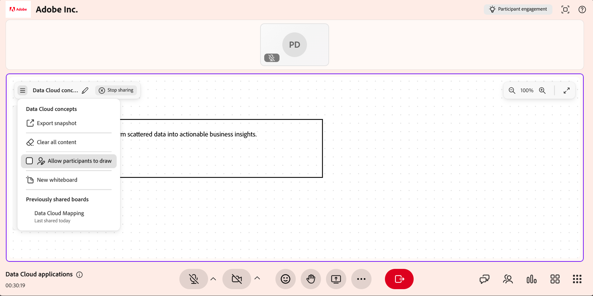

# 화이트보드 공유

Live Hub 세션에서 화이트보드를 사용하여 개념을 시각적으로 설명하고, 콘텐츠에 주석을 달고, 학습자와 실시간으로 공동 작업할 수 있습니다. 강사는 새 화이트보드를 만들거나 기존 화이트보드를 다시 열고 드로잉, 모양 및 텍스트를 추가하고 세션 중에 여러 화이트보드를 관리할 수 있습니다.

보드 이름을 바꾸고, 화이트보드를 이미지로 내보내고, 학습자가 보드에서 공동 작업할 수 있도록 하고, Miro와 같은 외부 화이트보드를 열 수도 있습니다.

이 문서에서는 Live Hub 세션에서 화이트보드를 생성, 관리, 공유 및 내보내는 방법에 대해 설명합니다.

## 새 화이트보드 공유

라이브 세션 중에 새로운 캔버스가 아이디어, 설명 또는 다이어그램을 표시하게 하려면 새 화이트보드를 시작합니다.

새 화이트보드를 공유하려면:

1. 세션 컨트롤 막대에서 **기타 옵션**&#x200B;을 선택합니다.

1. **화이트보드 공유**&#x200B;를 선택합니다.

1. **새 화이트보드**&#x200B;를 선택합니다. 새 화이트보드가 열리고 세션의 모든 참가자가 볼 수 있습니다.

   
   *화이트보드를 공유하는 옵션을 보여 주는 라이브 허브 인터페이스*

## 화이트보드 다시 열기

기존 화이트보드를 열어 세션 중에 이전에 공유한 콘텐츠에 액세스할 수 있습니다. 이렇게 하면 토론을 계속하거나 처음부터 다시 시작하지 않고 이전 설명을 기반으로 할 수 있습니다.

화이트보드를 다시 열려면 다음을 수행하십시오.

1. **기타 옵션**&#x200B;을 선택합니다.

1. **화이트보드 공유**&#x200B;를 선택합니다.

1. 사용 가능한 화이트보드 목록에서 화이트보드를 선택합니다. 선택한 화이트보드가 열리고 모든 학습자가 볼 수 있습니다.

   
   *사용 가능한 기존 화이트보드 목록을 표시하는 화이트보드 옵션을 공유합니다.*

>[!NOTE]
>
> 화이트보드 내 **자세히** 메뉴에서 이전에 공유한 화이트보드를 열 수도 있습니다.

## 화이트보드 도구 사용

화이트보드 도구를 사용하면 라이브 세션 중에 시각적 설명을 만들고, 드로잉하고, 모양을 추가하고, 텍스트를 삽입하고, 콘텐츠에 주석을 달 수 있습니다.

*화이트보드 도구를 보여 주는 화이트보드 인터페이스.*

다음 화이트보드 도구를 사용하여 세션 중에 콘텐츠를 만들고 주석을 달 수 있습니다.

| **도구 참조** | **설명** |
|----|----|
| **선택** | 화이트보드에서 모양 또는 텍스트를 선택합니다. 오브젝트를 선택한 다음 이동, 크기 조정, 회전, 복제 또는 삭제할 수 있습니다. |
| **이동** | 캔버스를 드래그하여 화이트보드의 다른 영역을 탐색하고 봅니다. |
| **마커** | 화이트보드 캔버스에 자유롭게 선을 그립니다. 색상 피커 및 획 Thickness 옵션을 사용하여 드로잉을 사용자 정의합니다. |
| **모양** | 사각형, 원, 화살표, 선과 같은 기하학적 모양을 추가합니다. 캔버스를 드래그하여 모양을 그립니다. 채우기 색상, 테두리 및 Thickness을 조정합니다. |
| **텍스트** | 화이트보드에 텍스트 레이블, 메모 또는 설명을 추가합니다. 텍스트를 삽입할 캔버스를 선택합니다. 글꼴 크기, 스타일 및 색상과 같은 서식 옵션을 사용합니다. |
| **지우개** | 화이트보드에서 획 또는 개체를 제거합니다. 드로잉의 경우 지우개를 사용하면 부분적으로 제거할 수 있습니다. 모양이나 텍스트의 경우 전체 오브젝트가 제거됩니다. |
| **실행 취소** | 그리기, 텍스트 추가, 모양 삽입 또는 개체 삭제와 같이 화이트보드에서 수행한 최근 작업을 되돌립니다. **실행 취소**&#x200B;를 여러 번 선택하여 여러 동작을 차례로 되돌립니다. |
| **다시 실행** | 화이트보드에서 실행 취소한 가장 최근 작업을 복원합니다. **실행 취소**&#x200B;를 사용하여 이전에 되돌린 작업을 다시 적용하려면 **다시 실행**&#x200B;을 선택하세요. |

## 화이트보드 내용 모두 지우기

화이트보드를 지우면 모든 드로잉, 모양 및 텍스트를 제거하고 빈 캔버스로 시작할 수 있습니다.

화이트보드를 지우려면:

1. 화이트보드의 왼쪽 위 모서리로 이동합니다.

1. **기타 옵션**&#x200B;을 선택합니다.

1. **모든 콘텐츠 지우기**&#x200B;를 선택합니다. 화이트보드의 모든 콘텐츠가 제거됩니다.

   
   *모든 화이트보드 내용을 지우는 옵션을 보여 주는 추가 메뉴.*

**실행 취소**&#x200B;를 사용하여 지운 콘텐츠를 복원할 수 있습니다.

## 기존 화이트보드 관리

강사는 **화이트보드** 패널을 사용하여 라이브 허브 세션 중에 여러 화이트보드를 만들고, 구성하고, 제어할 수 있습니다. 이 패널은 사용 가능한 화이트보드를 검토하고 보드 지우기 또는 삭제와 같은 일괄 작업을 수행하는 데 유용합니다.

기존 보드를 관리하려면 다음을 수행하십시오.

1. 컨트롤 막대에서 **기타 옵션**&#x200B;을 선택합니다.

1. **화이트보드 공유**&#x200B;를 선택합니다.

1. **게시판 보기**&#x200B;를 선택합니다. **화이트보드** 패널이 열리고 세션에서 만든 모든 화이트보드가 표시됩니다.

   
   *기존 보드를 관리하는 옵션을 보여주는 화이트보드 패널*

### 화이트보드 패널에서 사용 가능한 작업

강사는 **화이트보드** 패널에서 다음 작업을 수행할 수 있습니다.

| **작업** | **설명** |
|----|----|
| **공유** | 선택한 화이트보드를 공유합니다. |
| **삭제** | **화이트보드** 패널에서 현재 화이트보드를 영구적으로 삭제합니다. |
| **모두 삭제** | **화이트보드** 패널에 나열된 모든 화이트보드를 영구적으로 삭제합니다. |

## 화이트보드 이름 바꾸기

화이트보드 인터페이스에서 화이트보드의 이름을 직접 변경하여 세션 중에 화이트보드의 내용을 더 잘 식별할 수 있습니다.

화이트보드의 이름을 바꾸려면:

1. **화이트보드** 패널에서 **공유**&#x200B;를 선택합니다.

1. 화이트보드 도구 모음에서 화이트보드 이름 옆의 **편집**(연필) 아이콘을 선택합니다.

1. 새 이름을 입력하고 확인 표시 아이콘을 선택합니다. 화이트보드의 이름이 업데이트된 이름으로 변경됩니다.

   
   *화이트보드 인터페이스에서 화이트보드 옵션의 이름을 바꿉니다.*

## 화이트보드 스냅샷을 이미지로 내보내기

강사는 화이트보드 콘텐츠를 이미지로 내보내 세션 중에 생성된 주요 토론, 다이어그램 또는 주석을 캡처할 수 있습니다.

화이트보드 스냅샷을 내보내려면 다음을 수행하십시오.

1. 화이트보드의 왼쪽 위 모서리로 이동합니다.

1. **기타 옵션**&#x200B;을 선택합니다.

1. **스냅숏 내보내기**&#x200B;를 선택합니다. 화이트보드 콘텐츠를 **PNG** 이미지로 내보내고 로컬 시스템에 다운로드합니다.

   
   *화이트보드를 이미지로 내보내는 옵션을 보여 주는 추가 메뉴.*

## 참가자가 화이트보드를 편집하도록 허용

또한 세션 중에 참가자가 화이트보드를 그리고 상호 작용할 수 있습니다. 참여자가 화이트보드에 액세스할 수 있도록 허용하면 공동 작업, 브레인스토밍 및 능동적인 참여가 지원됩니다.

편집 화이트보드에 대한 액세스 권한을 부여하려면 다음을 수행하십시오.

1. 화이트보드의 왼쪽 위 모서리로 이동합니다.

1. **기타 옵션**&#x200B;을 선택합니다.

1. **참가자가 그릴 수 있도록 허용**&#x200B;을 활성화합니다. 참가자는 이제 화이트보드에 그림을 그리고, 모양을 추가하고, 텍스트를 삽입하고, 사용 가능한 모든 주석 도구를 사용할 수 있습니다.

   
   *학습자가 화이트보드를 편집할 수 있는 컨트롤을 표시하는 기타 옵션 메뉴*

## Miro 및 기타 외부 화이트보드 공유

강사는 라이브 허브 세션에서 Miro와 같은 서드파티 화이트보드를 공유할 수 있습니다.

Miro 게시판을 공유하려면:

1. 컨트롤 막대에서 **추가 앱**&#x200B;을 선택합니다.

1. **Miro**&#x200B;을(를) 선택합니다.

1. Miro 계정에 로그인합니다.

   
   *Miro 보드를 공유하는 옵션을 보여 주는 기타 앱 메뉴*

1. Miro 프로젝트 페이지에서 공유하려는 보드를 선택합니다.

학습자는 세션 구성을 기반으로 공유된 Miro 보드를 볼 수 있지만, Miro 보드를 열거나 공유할 수는 없습니다.
