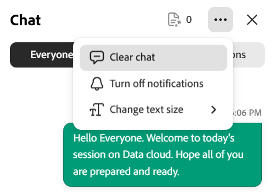

# 채팅 패널을 강사로 사용

강사는 채팅 패널을 라이브 허브 세션 중 통신을 관리하는 허브입니다. 단일 패널에서 공개 토론에 따르고, 비공개 대화를 열고, AI가 채팅에서 감지한 질문을 검토할 수 있습니다. 대화를 중재하고 AI 지원을 통해 응답할 수도 있습니다.

이 문서에서는 채팅 패널의 강사가 패널에 액세스하는 것부터 메시지 및 설정 관리에 이르기까지 수행할 수 있는 작업을 다룹니다.

## 채팅 패널에 액세스

채팅 패널을 사용하여 세션 중에 대화를 관리하고, 학습자에 응답하고, 질문을 모니터링합니다. 패널은 한 곳에서 공개, 비공개 및 질문 기반 토론에 대한 액세스를 제공합니다.

채팅 패널에 액세스하려면 다음 단계를 따르십시오.

1. Live Hub 세션에 참여합니다.

1. 컨트롤 막대에서 을 선택합니다. 기본적으로 **모두** 탭이 선택된 상태로 채팅 패널이 열리고 진행 중인 대화를 시작하거나 참여할 수 있습니다.

1. 필요에 따라 다음 중 하나를 선택합니다.

   1. 모두

   1. 비공개

   1. 질문

   
   *채팅 패널이 모든 사용자 탭에 열립니다. 여기에서 공개 대화를 팔로우하고 개인 및 질문 탭으로 전환할 수 있습니다.*

1. 메시지를 입력하고 **보내기**&#x200B;를 선택합니다.

## 채팅 패널 설정

채팅 패널은 대화를 관리하고 세션 중에 채팅 경험을 사용자 정의하는 옵션을 제공합니다. 필요에 따라 메시지를 지우고, 알림을 제어하고, 텍스트 크기를 조정할 수 있습니다.

*채팅 패널 설정 메뉴.*

채팅 패널 설정에서 사용할 수 있는 옵션은 다음과 같습니다.

| **옵션** | **설명** |
|----|----|
| **모든 채팅 지우기** | 채팅 패널에서 모든 메시지를 제거합니다. |
| **채팅 알림 비활성화** | 세션에 대한 채팅 알림을 끕니다. |
| **텍스트 크기** | 가독성을 높이기 위해 채팅 메시지의 크기를 조정합니다. 사용 가능한 옵션은 **작게**, **보통** 및 **크게**&#x200B;입니다. |

## 채팅 메시지에 응답

회신 기능을 사용하면 특정 메시지에 직접 응답할 수 있으므로 토론 중에 컨텍스트를 유지하고 대화를 더 쉽게 수행할 수 있습니다.

채팅에서 메시지에 회신하려면:

1. 응답하려는 메시지에 마우스를 가져다 댑니다.

1. **응답**&#x200B;을 선택합니다.

   
   *메시지에 직접 회신하고 대화를 컨텍스트에 유지하려면 메시지에 회신을 선택하세요.*

1. 메시지 입력 필드에 응답을 입력합니다.

1. **보내기**&#x200B;를 선택합니다.

답변에는 답변과 함께 원래 메시지 스니펫이 표시되어 참가자가 대화의 맥락을 이해하는 데 도움이 됩니다.

### 메시지에 응답

또한 메시지에 응답하여 응답을 입력하지 않고도 신속하게 확인 또는 응답할 수 있습니다. 메시지 위에 마우스를 놓고 반응을 선택합니다. 선택한 반응은 메시지 아래에 나타나고 채팅의 다른 참가자에게 표시됩니다.

*반응 메시지가 메시지 아래에 나타나고 채팅의 모든 사용자가 볼 수 있습니다.*

## 채팅 메시지 편집

메시지 편집 기능을 사용하면 메시지를 보낸 후 메시지를 업데이트하여 응답을 수정하거나 수정할 수 있습니다.

채팅에서 메시지를 편집하려면 다음을 수행합니다.

1. 편집할 메시지에 마우스를 가져다 댑니다.

1. **편집**&#x200B;을 선택합니다.

   
   *이미 보낸 메시지를 업데이트하려면 편집을 선택하세요.*

1. 입력 필드에서 메시지를 업데이트합니다.

1. **저장**&#x200B;을 선택하여 변경 내용을 적용하거나 **취소**&#x200B;를 선택하여 취소합니다.

업데이트된 메시지가 채팅의 원본 메시지를 대체하며 **편집됨**(으)로 표시됩니다.

## 채팅 메시지의 참가자 언급

채팅 패널의 태그 지정 기능을 사용하면 세션 중에 특정 학습자의 주소를 직접 지정할 수 있습니다. 태그를 사용하면 특히 활발하게 토론하는 동안 사용자가 언급한 학습자의 메시지를 주의 깊게 받아들이고 가시성을 높일 수 있습니다.

채팅에서 학습자를 언급하려면:

1. 메시지 입력 필드에 **@**&#x200B;을(를) 입력합니다.

1. 목록에서 참여자의 이름을 선택합니다.

   
   *참가자 목록을 채우고 목록에서 이름을 선택하려면 @을 입력하십시오.*

1. 메시지를 입력합니다.

1. **보내기**&#x200B;를 선택합니다.

태그가 지정된 학습자는 알림을 받고 더 잘 볼 수 있도록 메시지에서 해당 이름이 강조 표시됩니다.

## 개인 채팅 시작

채팅 패널의 **비공개** 탭을 사용하면 공개 토론을 방해하지 않고 비공개 메시지를 보낼 수 있습니다. 새로운 채팅을 시작하거나, 기존 대화를 계속하거나, 특정 학습자와 소통할 수 있습니다.

개인 채팅을 시작하려면:

1. **개인** 탭을 선택합니다. 참가자 목록이 나타납니다.

   
   *개인 탭에는 강사나 개별 학습자에게 메시지를 보낼 수 있도록 참가자가 나열됩니다.*

1. 다음을 수행할 수 있습니다.

   1. 다른 강사에게 메시지를 보내려면 목록의 맨 위에서 **강사만**&#x200B;을 선택합니다. 메시지는 강사에게만 표시됩니다.

   1. 개인 대화를 시작할 개별 학습자를 선택합니다.

1. 메시지를 입력하고 **보내기**&#x200B;를 선택합니다. 메시지는 사용자와 선택한 참가자에게만 표시됩니다.

### 학습자의 비공개 채팅 비활성화

기본적으로 학습자는 다른 참가자와 비공개로 채팅할 수 있습니다. 강사는 세션 중에 학습자가 개인 채팅을 사용할 수 있는지 여부를 제어할 수 있습니다.

학습자의 개인 채팅을 비활성화하려면:

1. **회의실 설정**&#x200B;을 엽니다.

1. **참가자 권한**&#x200B;을 선택합니다.

   
   *학습자가 개인적으로 채팅하지 못하도록 참가자 권한에서 개인 메시지 보내기 기능을 끕니다.*

1. **개인 메시지 보내기**&#x200B;를 사용하지 않도록 설정합니다.

1. **완료**&#x200B;를 선택합니다.

비활성화되면 학습자는 더 이상 비공개 대화를 시작하거나 참여할 수 없습니다.

## AI를 사용하여 참가자 질문에 대한 응답 초안 작성

**질문** 탭을 통해 강사는 학습자 질문을 더 효율적으로 관리하고 응답할 수 있습니다. AI가 채팅에서 질문을 자동으로 감지하고 제안된 응답을 제공하여 세션 중 강사를 지원합니다.

AI 지원 답변을 생성하려면

1. **질문** 탭으로 이동합니다.

1. 감지된 질문 위로 마우스를 가져갑니다.

1. **AI를 사용한 회신 초안**&#x200B;을 선택합니다.

   
   *AI를 사용한 회신 초안을 선택하여 감지된 질문에 대한 제안된 응답을 생성합니다.*

1. (선택 사항) 제안된 응답을 검토하고 편집합니다.

1. **보내기**&#x200B;를 선택합니다.

AI가 생성한 답변이 채팅에 추가되고 정확성과 관련성을 보장하기 위해 보내기 전에 수정할 수 있습니다.

>[!NOTE]
>업로드된 참조 콘텐츠로 질문을 다루지 않는 경우, AI 어시스턴트는 답변을 생성하는 대신 오류 메시지를 표시할 수 있다. 자세한 내용은 [Live Hub 문제 해결 가이드](../kb/troubleshooting-guide-for-live-hub.md#answer-generation-toast-issues)를 참조하세요.

### 더 나은 응답을 위해 파일 업로드

참조 파일을 업로드하여 AI 생성 응답의 정확도와 관련성을 향상시킬 수도 있습니다.

파일을 업로드하려면:

1. 채팅 패널의 오른쪽 상단으로 이동합니다.

   
   *업로드 콘텐츠 참조를 열어 AI가 더 정확한 응답을 생성하는 데 도움이 되는 파일을 추가하십시오.*

1. **콘텐츠 참조 업로드**&#x200B;를 선택합니다. **QnA 참조 콘텐츠**&#x200B;의 팝업 창이 나타납니다.

1. **파일 찾아보기**&#x200B;를 선택합니다.

   
   *QnA 참조 콘텐츠 창에서 [파일 찾아보기]를 선택하여 시스템에서 참조 파일을 업로드합니다.*

1. 시스템에서 파일을 업로드합니다.

AI는 업로드된 콘텐츠를 사용하여 **모두** 탭의 질문에 대한 보다 정확하고 관련 있는 응답을 생성합니다.

>[!NOTE]
>업로드가 실패하거나 파일이 거부되면 [Live Hub 문제 해결 가이드](../kb/troubleshooting-guide-for-live-hub.md#upload-content-issues)에서 일반적인 오류 메시지 목록과 해결 방법을 참조하십시오.

## 메시지 삭제

메시지 삭제 옵션을 사용하면 채팅에서 메시지를 제거하여 토론이 집중되고 관련성 있게 유지되도록 할 수 있습니다. 주제와 관련이 없거나 토론에 방해가 되는 자신의 메시지를 삭제할 수 있습니다.

*자신의 메시지를 삭제하여 토론에 집중하고 관련성을 유지하세요.*
