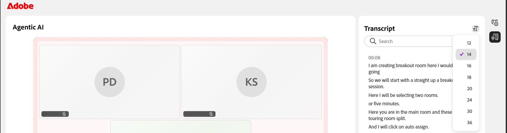

# 학습자로 세션 레코딩 보기

Live Hub 세션이 종료되면 강의 페이지에서 녹음을 사용할 수 있습니다. 학습자는 녹화를 보고, AI 생성 주제를 검색하여 특정 섹션으로 이동하고, 타임스탬프가 찍힌 성적 증명서를 비디오와 함께 검토할 수 있습니다.

## 세션 기록에 액세스

세션 레코딩은 강의 페이지의 **세션 레코딩** 섹션에서 사용할 수 있습니다. 녹음 링크는 일반적으로 예약된 세션 종료 시간 이후 **4**&#x200B;분 후에 사용할 수 있습니다. 처리가 완료되기 전에 강의 페이지에 액세스하면 기록 링크가 표시되지 않습니다.

>[!NOTE]
>
>강사가 세션을 기록할 때 기본 세션만 기록에 포함됩니다. 참가자가 소회의실로 이동하면 기록이 자동으로 일시 중지되고 모두가 메인 세션으로 돌아가면 다시 시작됩니다. 그 결과, 소회의실 활동은 기록되지 않습니다.

레코딩에 액세스하려면 다음을 수행합니다.

1. 세션에 대한 강의 페이지를 엽니다.

1. **모듈** 탭을 선택합니다. 강의 세부 정보 페이지가 나타납니다.

   
   *강의 페이지의 세션 녹음*.

1. **세션 녹음** 섹션으로 이동합니다.

1. 녹음 링크를 선택합니다. 기록이 새 브라우저 탭에서 열립니다.

   
   *녹음 플레이어가 재생 모드에 있으며 세션 비디오와 대본 패널이 표시됩니다.*

1. 다음 재생 컨트롤을 사용하여 보기 환경을 조정합니다.

| **제어** | **설명** |
|----|----|
| **재생/일시 중지** | 재생을 시작하거나 일시 정지합니다. |
| **볼륨** | 오디오 레벨을 조정합니다. |
| **진행률 표시줄** | 기록의 특정 지점으로 이동합니다. 경과된 기간 및 전체 기간이 컨트롤 옆에 표시됩니다. |
| **재생 속도** | 재생 속도를 변경합니다. 사용 가능한 옵션은 **0.25x**, **0.5x**, **0.75x**, **1x**, **1.25x**, **1.5x** 및 **2x**&#x200B;입니다. |
| **폐쇄 캡션(CC)** | 캡션을 설정하거나 해제합니다. **CC** 옆의 화살표를 선택하여 캡션 스타일과 글꼴 크기를 선택합니다. |
| **전체 화면** | 전체 화면 모드에서 기록을 봅니다. |

## 기록에서 주제 보기

AI 생성 주제를 사용하면 주요 토론 영역을 강조하고 관련 섹션으로 바로 이동할 수 있어 녹음을 더 쉽게 검토할 수 있습니다.

**30분**&#x200B;분 이상의 녹화 파일의 경우 Live Hub에서 자동으로 AI 기반 주제를 생성하여 세션을 의미 있는 섹션으로 나눕니다.

>[!NOTE]
>
> 주제는 계정에 AI 생성 주제가 활성화되어 있고 강사가 세션에 대해 비활성화하지 않은 경우에만 사용할 수 있습니다.

항목을 보고 탐색하려면 다음을 수행합니다.

1. **주제** 패널에서 주제 목록을 찾아보거나 **검색** 상자를 사용하여 키워드를 사용하는 주제를 찾습니다.

1. 항목을 선택하여 확장하고 요약, 세부 정보 및 총 기간을 봅니다.

1. **항목 재생**&#x200B;을 선택합니다. 선택한 주제 섹션에서 기록이 재생됩니다.

   
   *AI 생성 항목이 기록을 탐색하는 데 도움이 되는 항목 패널*

## 대본 보기

대본은 녹음과 함께 읽을 수 있는 세션의 타임스탬프가 있는 텍스트 버전을 제공합니다. 각 항목에는 발표자의 이름과 텍스트 음성 시간이 포함됩니다.

대본을 보려면 다음을 수행하십시오.

1. 플레이어 오른쪽에 있는 패널에서 **대본** 아이콘을 선택합니다. **대본** 패널이 열리고 타임스탬프가 적용된 대본이 표시됩니다.

1. (선택 사항) **검색** 상자를 사용하여 대본 내에서 특정 단어나 구를 찾습니다.

기록의 특정 부분으로 이동하려면 대본 항목을 선택합니다. 기록이 해당 타임스탬프로 이동하여 해당 시점부터 재생을 시작합니다.

*대본 패널. 각 항목은 기록의 해당 지점에 연결됩니다.*

### 대본 텍스트 크기 변경

대본 텍스트의 크기를 조정하여 쉽게 읽을 수 있습니다.

텍스트 크기를 변경하려면 다음을 수행하십시오.

1. **대본** 패널에서 **대본** 머리글 옆의 **텍스트 크기** 아이콘을 선택합니다.

1. 목록에서 텍스트 크기를 선택합니다. 사용 가능한 크기는 12, 14, 16, 18, 20, 24, 30 및 36입니다. 기본 크기는 14입니다. 대본 텍스트가 선택한 크기로 업데이트됩니다.

   
   *항목을 읽기 쉽게 만들려면 대본 텍스트 크기를 선택하세요.*
