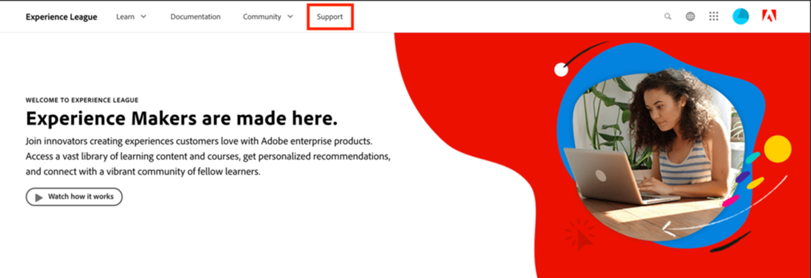

# Experience League에서 지원 티켓을 제출하는 방법

이제 Adobe Learning Manager 지원 티켓을 제출하는 프로세스가 Experience League 지원 플랫폼과 직접 통합됩니다. 이 셀프서비스 포털은 최근에 권한이 부여된 고객을 위해 더 많은 개인화와 사용 편의성을 제공하도록 새롭게 디자인되었습니다. Experience League 지원 포털에 액세스하고 티켓을 로깅하는 방법에 대한 자세한 내용은 아래 안내서를 참조하십시오.

지원 티켓을 제출하려면 승인된 지원 담당자만 사용할 수 있습니다. 지원 문의는 2025년 5월 11일까지 이메일을 통해 Adobe Learning Manager에 지원 티켓을 계속 제출하십시오. 이 날짜 이후에는 기존 이메일 채널 외에도 아래 설명된 Experience League 지원 포털을 통해 지원 티켓을 제출할 수 있습니다.

1. 지원 포털에 액세스하려면 **[!UICONTROL Experience League]** 웹 사이트를 방문하여 페이지 상단에 있는 **[!UICONTROL 지원]** 탭을 선택하십시오. 또는 [직접 링크](https://experienceleague.adobe.com/home?lang=ko#support)를 방문할 수 있습니다.

   
   _지원 홈페이지_

2. **[!UICONTROL 지원]** 홈페이지에서 진행 중인 사례로 쉽게 이동하거나, 새 사례를 기록하거나, 주요 지원 문서를 보거나, 추가 학습 리소스를 탐색할 수 있습니다.

   
   _티켓 열기_

3. 사례를 제출하려면 **[!UICONTROL 지원 사례 열기]** 옵션을 선택하십시오. 사이드바 메뉴에서 **[!UICONTROL 티켓 열기]** 옵션을 선택할 수도 있습니다. 사례 만들기 페이지가 표시됩니다. 여기에서 제품 이름(Adobe Learning Manager, Audience Manager, 캠페인, 대상 등), **[!UICONTROL 사례 제목]** 및 **[!UICONTROL 사례 설명]**&#x200B;을 입력할 수 있습니다. 문제 해결 프로세스를 신속하게 진행하려면 발생한 문제를 설명할 때 가능한 한 자세히 설명하십시오.

   양식 끝에 있는 다음 필드를 작성하여 문제 해결에 도움이 되는 보다 구체적인 정보를 제공하십시오.

   * 문제 사유(문제 유형에 해당하는 드롭다운 선택)
   * 계정 ID
   * 역할(관리자, 작성자, 학습자, 통합 책임자 등)
   * 사례 우선 순위(낮음, 중간, 높음, 치명적)
   * 비즈니스 영향
   * 표준 시간대
   * 원하는 사용자를 복사하는 옵션입니다.

   마지막으로 **[!UICONTROL 제출]**&#x200B;을 클릭하기 전에 관련 파일을 업로드해야 합니다. (첨부 파일의 크기는 24MB 이하)

   
   _티켓 양식_

4. **[!UICONTROL 사례 제출]**&#x200B;을 클릭하면 **[!UICONTROL 내 사례]** 페이지로 리디렉션되며 조직에서 제출한 모든 사례를 볼 수 있습니다. 사이드바 메뉴에서 **[!UICONTROL 내 사례]** 단추를 클릭하여 이 페이지로 이동할 수도 있습니다. 이 페이지에서는 진행 중이거나 마감된 모든 지원 사례를 볼 수 있습니다. 페이지 상단의 옵션을 사용하여 사례 상태(열림 또는 닫힘) 또는 Experience Cloud 솔루션별로 필터링할 수 있습니다. 검색 막대를 사용하여 지원 문제와 관련된 키워드를 검색할 수도 있습니다.

   
   _진행 중인 사례_

5. 사례에 대한 세부 정보를 조회하려면 사례를 클릭하여 사례 조회에 액세스합니다. 사례 보기 내에서 할당된 사례 소유자와 최신 댓글을 보고 원하는 추가 첨부 파일 또는 응답을 추가할 수 있습니다.

사례 세부 사항 아래 페이지 오른쪽에 있는 &quot;관리로 에스컬레이션&quot; 옵션을 선택하여 사례를 에스컬레이션할 수 있습니다. 인접한 &quot;사례 닫기&quot; 버튼을 선택하여 사례를 종료할 수도 있습니다.

## 추가 정보

지원 리더십 팀이 가장 효율적인 방식으로 에스컬레이션을 처리하기 위해 조직, 파트너 또는 고객에게 심각한 영향을 미치는 경우에만 사례 에스컬레이션을 제출하십시오.

**[!UICONTROL Experience League 지원]** 포털을 사용하는 방법에 대한 추가 질문이 있는 경우 아래 댓글 섹션에서 알려주거나 이 이메일 주소 [almdynsupp@adobe.com](mailto:almdynsupp@adobe.com)을(를) 통해 지원 팀에 직접 문의하세요.

Experience League(EXL)을 통해 지원 티켓을 열 수 있는 공인 연락처를 추가하려면 [http://licensing.adobe.com](http://licensing.adobe.com)을 방문하세요.
