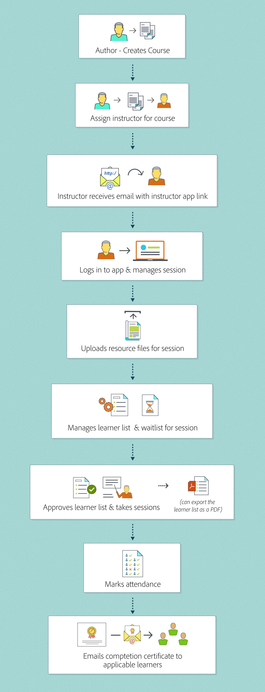

# 강사로 Learning Manager 시작하기

이 문서에서 강사로 Learning Manager를 시작하는 방법을 알아보십시오.

## 강사로 로그인 {#loginasaninstructor}

작성자가 강의에 있는 모듈에 귀하를 강사로 추가하면, 등록된 전자 메일 주소로 전자 메일이 전송됩니다. 전자 메일에는 강사 앱으로 연결되는 링크가 포함되어 있습니다. 링크를 클릭하면 Learning Manager 로그인 페이지로 이동합니다.

1. Learning Manager에 로그인합니다.

   화면에 강사 앱 홈페이지가 표시됩니다. 예정된 세션의 세부 정보가 표시됩니다.

   

   *강사 앱 홈 페이지 보기*

책임자는 강의 인스턴스에 세션 데이터를 추가하면서 사용자를 모듈에 작성자로 추가할 수도 있습니다.

## 강사의 모듈 관리 {#managingmodulesasaninstructor}

Learning Manager의 강사 워크플로를 파악하려면 다음 이미지를 참조하십시오.

*강사의 워크플로우*
