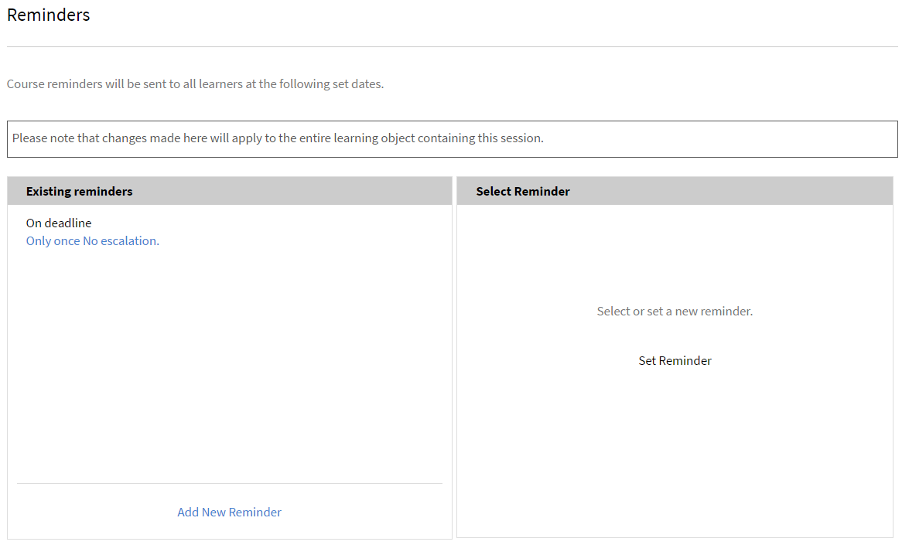

# 세션 학습자 관리

이 문서에서 출석자 관리, 강의 관련 전자 메일 및 세션 알림 메시지 전송 방법을 알아보십시오.

## 검토 보류 중인 세션 또는 모듈 보기 {#pending}

강사는 검토 보류 중인 세션 또는 모듈을 볼 수 있습니다.

세션/모듈 페이지에서 **보류 중인 검토** 열에서 해당 세션/활동의 보류 중인 검토 개수가 표시됩니다.

## 세션 대기자 명단 관리 {#managewaitlistforyoursession}

학습자가 귀하의 모듈에 등록하면, &#39;대기자 명단&#39; 페이지에서 최신 등록 상태 및 대기자 명단을 볼 수 있습니다.

1. 강사 앱의 왼쪽 탐색 창에서 &#39;예정된 세션&#39; > &#39;대기자 명단&#39;을 선택합니다.

   시트 제한, 현재 채워진 시트의 수 및 빈 시트의 수를 볼 수 있습니다. 표에서 대기자 명단에 등록된 학습자 목록 또한 볼 수 있습니다. 대기자 명단 대기열이 없는 경우 비어 있습니다.

   
   *대기자 명단에 등록된 학습자 보기*

1. &#39;대기자 명단&#39; 표에서 학습자 또는 확인할 학습자를 선택합니다.
1. &#39;동작&#39; > &#39;학습자 확인&#39;을 선택합니다.

   귀하가 확인한 학습자가 확인된 학습자 목록에 추가됩니다.

강사는 세션에서 학습자를 등록 취소할 수 있는 권한이 있습니다. 이는 해당 학습에서도 학습자를 등록 취소합니다. **[!UICONTROL &#39;대기자 명단&#39;]** 탭을 선택합니다. 확인란을 사용하여 등록 취소할 학습자를 선택합니다. 등록을 취소하려면 **[!UICONTROL 작업]** > **[!UICONTROL 학습자 등록 취소]**&#x200B;를 선택합니다.

*학습자 등록 취소*

### 대기자 명단 보고서

Adobe Learning Manager의 새로운 **[!UICONTROL 대기자 명단 보고서]**&#x200B;를 통해 강사는 모든 강의 인스턴스에 대해 대기자 명단에 등록된 학습자 목록을 다운로드할 수 있습니다. 강사는 **[!UICONTROL 세션 개요]** 페이지의 **[!UICONTROL 대기자 명단]** 섹션에서 이 보고서에 액세스할 수 있습니다.

대기자 명단 보고서에서 사용할 수 있는 열을 따릅니다.

* 강의 이름
* 인스턴스 이름
* 인스턴스 ID
* 인스턴스 상태
* 사용자 이름
* 이메일
* 고유 사용자 ID
* 등록 날짜(UTC 시간대)
* 상태
* 대기자 명단 수
* 대기자 명단 제한
* 시트 제한

강사 섹션에서 보고서를 다운로드하려면 다음을 수행하십시오.

1. **[!UICONTROL 강사]**(으)로 로그인합니다.
2. 홈 페이지에서 세션을 선택합니다.
3. **[!UICONTROL 세션 개요]** 페이지에서 **[!UICONTROL 대기자 명단]** 옵션을 선택합니다.
4. **[!UICONTROL 작업]** > **[!UICONTROL 보고서 내보내기]**&#x200B;를 선택하여 **[!UICONTROL 대기자 명단]** 보고서를 다운로드합니다.

## 세션 출석 표시 {#markattendanceforyoursession}

&#39;학습자&#39; 페이지에서 세션에 참여하는 확인된 학습자의 수, 학습자의 이름, 학습자의 출석 상태 및 기타 세부 사항을 볼 수 있습니다.

1. 왼쪽 탐색 창에서 &#39;예정된 세션&#39; > &#39;학습자&#39;를 선택합니다.
1. 출석자 명단에서 학습자를 선택하여 다음 중 하나를 수행합니다.

   * 출석을 표시하려면 &#39;동작&#39; > &#39;출석 표시&#39;를 클릭합니다. 상태를 출석함으로 표시한 후에는 변경할 수 없습니다.
   * 결석을 표시하려면 &#39;동작&#39; > &#39;결석&#39;을 클릭합니다.
   * 취소 또는 기타 이유로 학습자를 삭제하려면 동작 > 학습자 삭제 를 클릭합니다.

   학습자는 출석 상태가 출석됨으로 표시되기 전에는 모듈을 완료할 수 없습니다.

   
   *학습자 출석 표시*

## 학습자에게 전자 메일 전송 {#sendemailstolearners}

세션의 특정 또는 전체 출석자에게 전자 메일을 전송할 수 있습니다. &#39;전자 메일 전송&#39; 기능은 학습자의 출석 확인 또는 세션과 관련된 커뮤니케이션 전송에 매우 유용합니다. &#39;모두에게 전자 메일 전송&#39; 옵션을 이용하여 모든 학습자에게 과제 또는 세션 자료를 전송하거나 일반적인 커뮤니케이션 메시지를 보낼 수 있습니다.

학습자에게 전자 메일을 보내려면 강사 앱의 학습자 페이지에서 다음 중 하나를 수행합니다.

* 특정 출석자에게 전자 메일을 보내려면 출석자를 선택한 다음 &#39;동작&#39; > &#39;선택한 사용자에게 전자 메일 전송&#39;을 클릭합니다.
* 모든 참석자에게 강의 자료 또는 과제를 전송하려면 &#39;동작&#39; > &#39;모두에게 전자 메일 전송&#39;을 클릭합니다.

## 초대 응답 캡처

학습자 섹션에서 초대 응답을 볼 수 있습니다. 아무 세션으로 이동하여 **[!UICONTROL 학습자]**&#x200B;를 선택한 다음 드롭다운 메뉴에서 초대 응답을 선택합니다.

## 학습자 목록 내보내기 {#exportinglearnerslist}

강사는 pdf로 출석자 목록을 내보내 모든 학습자의 출석을 쉽게 표시할 수 있습니다. 출석자 목록을 내보내려면, 왼쪽 창의 &#39;학습자&#39;를 클릭합니다. &#39;동작&#39; > &#39;학습자 목록 내보내기(PDF)&#39;를 클릭합니다.

세션의 출석자 목록이 확정되면 PDF로 목록을 내보낼 수 있습니다. 간편하게 인쇄할 수 있는 pdf에서 표로 학습자를 표시합니다. 그리고 같은 PDF에 출석, 점수를 표시하거나 학습자에 대한 노트를 사용 및 제공할 수 있습니다.

PDF의 오른쪽 상단 모서리에는 QR 코드가 있습니다. 이 기능을 통해 개별 학습자는 Learning Manager 모바일 앱에서 코드를 스캔하고 본인의 출석을 표시할 수 있습니다.

*QR 코드를 스캔하여 주의 표시*

## 제출 승인 또는 거부 {#approveorrejectsubmissions}

학습자가 과제, 보고서, 귀하의 세션에 대한 평가서 등을 업로드하면, &#39;제출&#39; 페이지에서 확인할 수 있습니다. 해당 자료를 사용하여 학습자의 점수를 매길 수 있으며 제출한 것을 승인 또는 거부할 수도 있습니다.

1. 왼쪽 창에서 세션의 일정에 따라 &#39;예정된 세션&#39; 또는 &#39;지난 세션&#39;을 클릭합니다.
1. 제출 파일을 볼 강의를 클릭합니다.

   왼쪽 창에서 &#39;제출&#39;을 클릭합니다.

1. 선택한 세션의 학습자가 제출한 사항을 볼 수 있습니다. 승인 또는 거부할 제출 내용을 선택하고 &#39;승인&#39; 또는 &#39;거부&#39;를 클릭합니다.

   귀하의 동작에 따라 제출 상태가 &#39;승인됨&#39; 또는 &#39;거부됨&#39;으로 변경됩니다.

## 세션 알림 메시지 구성 {#configureremindersforyoursession}

1. 왼쪽 창에서 &#39;예정된 세션&#39;을 클릭합니다.
1. 알림 메시지를 설정할 강의를 클릭합니다. 왼쪽 창에서 &#39;알림 메시지&#39;를 클릭합니다.
1. &#39;알림 메시지 선택&#39; 타일에서 &#39;알림 메시지 설정&#39;을 클릭합니다.

   
   *세션에 대한 미리 알림 구성*

1. 다음 작업을 수행하십시오.

   * 알림 메시지 설정 대화 상자에서 기한 이전, 기한, 기한 이후 중 알림 메시지를 보낼 시점 옵션을 설정합니다.
   * 기한 이전 일 필드에 학습자에게 알림 메시지를 기한 며칠 전에 전송할지 설정합니다.
   * 미리 알림에 대한 되풀이를 설정합니다.

   
   *미리 알림 설정 보기*

1. 다음 중 하나를 실행합니다.

   * 체크 표시를 클릭하여 알림 메시지를 저장합니다.
   * 십자 표시를 클릭하여 알림 메시지를 취소합니다.

   알림 메시지 설정에 표시된 대로 자동 강의 알림 메시지가 모든 학습자에게 전송됩니다.

   이미 세션에 알림 메시지를 설정한 경우, &#39;기존 알림 메시지&#39; 세션에서 확인할 수 있습니다. 또한 기존 알림 메시지에 추가적인 알림 메시지를 더할 수도 있습니다.

   기존 알림 메시지를 삭제하려면 알림 메시지를 클릭합니다. 나타나는 팝업에서 삭제 아이콘(휴지통 아이콘)을 클릭하여 알림 메시지를 삭제합니다.
