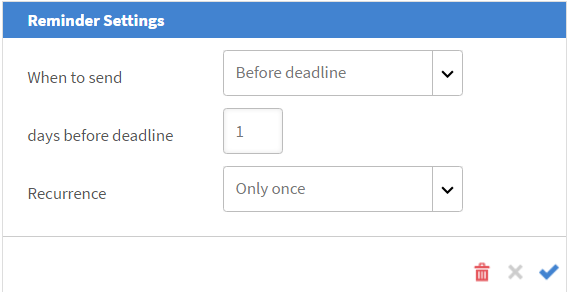

# 세션 학습자 관리

이 문서에서 출석자 관리, 강의 관련 전자 메일 및 세션 알림 메시지 전송 방법을 알아보십시오.

## 검토 보류 중인 세션 또는 모듈 보기 {#pending}

강사는 검토 보류 중인 세션 또는 모듈을 볼 수 있습니다.

세션/모듈 페이지에서 열을 볼 수 있습니다 **검토 보류 중** 해당 세션/활동의 보류 중인 검토 수를 표시합니다.

## 세션의 대기자 명단 관리 {#managewaitlistforyoursession}

학습자가 모듈에 등록하면 대기자 명단 페이지에서 등록 및 대기자 명단의 최신 상태를 확인할 수 있습니다.

1. 강사 앱에서 왼쪽 탐색 창의 예정된 세션 > 대기자 목록을 선택합니다.

   인원 제한, 현재 채워진 인원 수 및 비어 있는 인원 수를 조회할 수 있습니다. 대기자 명단에 등록된 학습자도 표에 표시됩니다. 대기자 명단 대기열이 없는 경우 비어 있습니다.

   
   *대기자 명단에 등록된 학습자 보기*

1. 대기자 명단 테이블에서 확인할 학습자를 선택합니다.
1. 동작 > 학습자 확인 을 선택합니다.

   확인한 학습자가 확인된 학습자 목록에 추가됩니다.

강사는 세션에서 학습자 등록을 취소할 수 있습니다. 그러면 해당 학습에서도 등록 취소됩니다. 선택 **[!UICONTROL 대기자 명단]** 탭. 확인란을 사용하여 등록 취소할 학습자를 선택합니다. 등록을 취소하려면 다음을 선택합니다. **[!UICONTROL 액션]** > **[!UICONTROL 학습자 등록 취소]**.

*학습자 등록 취소*

## 세션의 출석 표시 {#markattendanceforyoursession}

학습자 페이지에서 세션에 참석하는 확인된 학습자의 수, 이름, 학습자의 참석 상태 및 기타 세부 정보를 볼 수 있습니다.

1. 왼쪽 탐색 창에서 예정된 세션 > 학습자를 클릭합니다.
1. 참석자 목록에서 학습자를 선택하고 다음 중 하나를 수행합니다.

   * 출석 표시를 하려면 조치 > 출석 표시를 클릭합니다. 상태가 참석됨으로 표시된 후에는 상태를 변경할 수 없습니다.
   * 불출석을 표시하려면 조치 > 불출석을 클릭합니다.
   * 취소 또는 기타 이유로 학습자를 삭제하려면 동작 > 학습자 삭제 를 클릭합니다.

   학습자는 출석 상태가 출석으로 바뀔 때까지 모듈을 완료할 수 없습니다.

   
   *학습자 출석 표시*

## 학습자에게 전자 메일 보내기 {#sendemailstolearners}

세션 중 특정 참석자 또는 모든 참석자에게 전자 메일을 보낼 수 있습니다. 전자 메일 보내기 기능은 학습자의 출석을 확인하거나 세션과 관련된 커뮤니케이션을 전송하려는 경우 매우 유용합니다. 또한 [모든 학습자에게 전자 메일 보내기] 옵션을 사용하여 할당 및 세션 자료에 전자 메일을 보내거나 모든 학습자에게 일반적인 커뮤니케이션을 보낼 수 있습니다.

학습자에게 전자 메일을 보내려면 강사 앱의 학습자 페이지에서 다음 중 하나를 수행합니다.

* 특정 참석자에게 전자 메일을 보내려면 참석자를 선택하고 [동작] > [선택한 참석자에게 전자 메일 보내기]를 클릭합니다.
* 모든 참석자에게 전자 메일을 보내 강의 자료나 과제를 보내려면 액션 > 모든 참석자에게 전자 메일 보내기 를 클릭합니다.

## 학습자 목록 내보내기 {#exportinglearnerslist}

강사는 출석자 목록을 pdf로 내보내서 모든 학습자의 출석을 손쉽게 표시할 수 있습니다. 참석자 목록을 내보내려면 왼쪽 창의 학습자에서 동작 > 학습자 목록 내보내기(PDF)를 클릭합니다.

세션에 대한 참석자 목록이 확인되면 목록을 PDF으로 내보낼 수 있습니다. 인쇄하기 쉬운 이 pdf는 학습자를 표로 표시합니다. 그런 다음 동일한 PDF에서 출석을 표시하거나 점수를 제공하고 학습자에게 메모를 작성하거나 제공할 수 있습니다.

이 PDF의 오른쪽 상단 모서리에 QR 코드가 있습니다. 이 기능을 통해 개별 학습자는 Learning Manager 모바일 앱에서 코드를 스캔하고 본인의 출석을 표시할 수 있습니다.

*QR 코드를 스캔하여 주의 표시*

## 제출 승인 또는 거부 {#approveorrejectsubmissions}

학습자가 세션에 대한 할당, 보고서 또는 평가와 같은 문서를 업로드한 경우 제출 페이지에서 문서를 볼 수 있습니다. 학습자 성적 증명서로 자료를 사용하여 제출을 승인 또는 거부할 수 있습니다.

1. 세션 일정에 따라 왼쪽 창에서 &#39;예정된 세션&#39; 또는 &#39;지난 세션&#39;을 클릭합니다.
1. 제출을 보려는 강의를 클릭합니다.

   왼쪽 창에서 &#39;제출&#39;을 클릭합니다.

1. 선택한 세션에 대해 학습자가 제출한 내용을 볼 수 있습니다. 승인하거나 거부할 제출을 선택하고 승인 또는 거부를 클릭합니다.

   제출 상태가 작업에 따라 승인됨 또는 거부됨으로 변경됩니다.

## 세션에 대한 미리 알림 구성 {#configureremindersforyoursession}

1. 왼쪽 창에서 &#39;예정된 세션&#39;을 클릭합니다.
1. 알림 메시지를 설정할 과정을 클릭합니다. 왼쪽 창에서 &#39;미리 알림&#39;을 클릭합니다.
1. 알림 메시지 선택 타일에서 알림 메시지 설정 을 클릭합니다.

   
   *세션에 대한 미리 알림 구성*

1. 다음 작업을 수행하십시오.

   * [미리 알림 설정] 대화 상자에서 학습자에게 미리 알림을 보낼 시기(기한 이전, 기한 내 또는 기한 이후)를 설정합니다.
   * 기한 이전 일 수 필드에서 학습자에게 미리 알림을 보낼 기한 이전 일 수를 설정합니다.
   * 미리 알림에 대한 되풀이를 설정합니다.

   
   *알림 메시지 설정 보기*

1. 다음 중 하나를 수행합니다.

   * 확인 표시를 클릭하여 미리 알림을 저장합니다.
   * 십자 표시를 클릭하여 미리 알림을 취소합니다.

   미리 알림 설정에 지정한 날짜에 모든 학습자에게 자동화된 강의 미리 알림이 전송됩니다.

   세션에 대한 미리 알림을 이미 설정한 경우에는 기존 미리 알림 타일 아래에서 확인할 수 있습니다. 또한 기존 미리 알림에 추가 미리 알림을 추가할 수도 있습니다.

   기존 알림 메시지를 삭제하려면 알림 메시지를 클릭합니다. 팝업이 나타나면 삭제 아이콘(휴지통 아이콘)을 클릭하여 알림 메시지를 삭제합니다.
