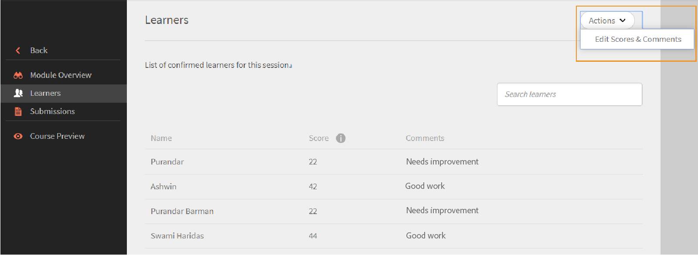

# 모듈

이 문서에서 강사가 Learning Manager의 세션 세부 정보를 보고 구성하는 방법을 알아보십시오.

## 세션 개요 보기 {#viewsessionoverview}

1. 왼쪽 창에서 &#39;예정된 세션&#39;을 클릭합니다.
1. 예정된 세션 목록에서 세부 정보를 보려는 세션을 선택합니다.

   앱은 세션 이름, 장소, 시간, 등록 제한, 대기자 명단 제한 등의 세부 정보와 함께 세션 개요를 표시합니다.

   
   *예정된 세션 보기*

## 세션 세부 정보 구성 {#configuresessiondetails}

1. 왼쪽 창에서 &#39;예정된 세션&#39;을 클릭합니다.
1. 업데이트할 세션을 선택합니다.
1. 오른쪽 상단의 편집 을 클릭합니다.

   
   *세션 세부 정보 구성*

1. 세션 개요 페이지에서 세션 시간, 날짜, 장소 등을 편집할 수 있습니다. 다음 세션 세부 정보를 편집하거나 추가할 수도 있습니다.

   * 등록 제한을 지정하여 세션에 허용되는 최대 학습자 수를 설정합니다.
   * 세션의 대기자 명단에 허용된 최대 학습자 수를 설정하려면 대기자 명단 제한을 지정합니다.
   * 제출 허용 필드에서 예를 선택하여 학습자가 과제를 제출할 수 있도록 합니다. [아니오]를 선택하면 학습자가 세션에 대한 할당 제출을 업로드할 수 없습니다.

   
   *세션 세부 정보 편집*

1. [저장]을 클릭합니다.

   이 페이지에서 강사 필드를 편집할 수 없습니다.

## 세션에 대한 리소스 파일 업로드 {#uploadresourcefilesforyoursession}

강사는 모듈에 대한 할당 파일이나 프레젠테이션, 모듈에 대한 활동 파일 등의 리소스 파일을 업로드할 수 있습니다. 리소스 메뉴를 사용하여 모듈 또는 세션에 대한 리소스 파일을 추가합니다.

1. 강사 앱에서 예정된 세션 > 리소스를 클릭합니다.

   작성자가 모듈과 관련된 강의에 대해 업로드했을 수 있는 리소스에 대한 링크가 이미 있는 리소스 페이지를 볼 수 있습니다. 또한 강사는 모듈에 대한 리소스 파일을 업로드할 수도 있습니다.

1. [추가]를 클릭합니다.

   
   *세션에 리소스 추가*

1. 컴퓨터에서 적절한 파일을 찾습니다. 파일을 선택하고 [열기]를 클릭합니다.
1. 파일이 업로드되면 추가된 날짜와 함께 파일을 볼 수 있습니다.

   이 모듈에 등록한 학습자는 업로드된 파일을 강의 리소스 섹션에서 볼 수 있습니다.

   리소스 파일을 삭제하려면 삭제할 파일을 선택합니다. 리소스 페이지에서 작업 > 파일 삭제를 클릭합니다.

## 활동 모듈에 대한 파일 제출 {#filesubmissionforactivitymodules}

활동 모듈은 파일 제출 워크플로우를 지원합니다. 작성자는 활동 모듈을 만들고  **[!UICONTROL 파일 제출]** 선택 사항입니다. 그러면 학습자가 파일을 제출할 수 있습니다.

이러한 파일은 모듈 강사가 승인/거부할 수 있습니다. 강사가 제출을 승인해야 모듈이 완료됩니다.

 
*파일 승인 또는 거부*

## 체크리스트 모듈 평가 {#evaluate-checklist-module}

학습자가 강의를 수강하면 강사는 의 제출/체크리스트 페이지에서 체크리스트 모듈을 확인합니다. **모듈**&#x200B;섹션으로 이동하십시오. 이 페이지에는 검토가 예정된 활동 제출 모듈 과 함께 활동 체크리스트 모듈이 포함되어 있습니다. 각 모듈에 대해 평가 예정 학습자 수가 표시됩니다.

아래 페이지에서 다음 유형의 모듈을 볼 수 있습니다 **제출** 및 **체크리스트**. 이 예제에서는 체크리스트 모듈을 사용합니다.

*모듈 목록 보기*

체크리스트 모듈을 클릭합니다. 에 **체크리스트** 이 페이지에서 다음을 볼 수 있습니다.

* 모듈의 이름
* 강의 이름
* 강의가 속한 인스턴스
* 작성자가 설정한 조건 통과
* 체크리스트 질문 수

*체크리스트 페이지 보기*

학습자를 평가하려면 **[!UICONTROL 평가]** 이미지를 **[!UICONTROL 체크리스트]** 열이 표시됩니다. 검토 상태가 다음과 같음도 확인할 수 있습니다. **보류 중**.

학습자를 평가하고 **[!UICONTROL 제출]**. 교수자로서 모든 평가 질문에 반드시 응답해야 한다.

*평가를 위한 체크리스트*

합격 기준에 따라 Status 는 Failed 또는 Pass 입니다.

일단 평가된 체크리스트는 다시 평가할 수 없습니다.

강사는 모듈의 다른 강사가 제출한 응답을 볼 수도 있습니다.

적용된 검색 필터를 기반으로 학습자를 csv로 내보낼 수 있습니다.

강사가 체크리스트를 사용하여 강의를 평가하면 학습자는 모듈 상태를 **통과** 및 강의 상태: **완료됨**&#x200B;또는 모듈 상태를 **실패**&#x200B;및 강의 상태: **완료됨**.

## 활동 거절에 대한 강사 의견 {#rejection-comments}

학습자는 전송된 거절 알림에서 강사의 의견을 볼 수 있습니다. 학습자는 댓글 형식으로 더 많은 정보를 제공하여 다시 제출할 수 있습니다.

다음은 워크플로우입니다.

1. 작성자는 활동 모듈이 있는 강의를 만들고 강사를 할당한 다음 강의를 게시합니다.

1. 학습자는 강의를 수료한 후 완료 증명서를 제출합니다.

   
   *완료 증명 제출*

1. 그러면 강사가 자신에게 할당된 활동 모듈을 선택합니다. 모듈의 제출 페이지에서 강사가 을 클릭합니다 **편집**. 그런 다음 거부 댓글을 입력하고 댓글 표시 옵션을 활성화하면 학습자가 알림에서 댓글을 볼 수 있습니다.

   
   *완료 주석 입력*

1. 강사가 클릭 **거부**. 제출 상태가 다음으로 변경됩니다. **거부 표시됨**.

   
   *제출 거부*

1. 제출 후 상태가 다음으로 변경됩니다. **거부됨**.

   
   *거부 상태 보기*

1. 이제 학습자는 제출이 거부된 알림을 확인할 수 있습니다. 강사의 의견이 알림에도 표시됩니다.

   
   *거부 알림 수신*

변경 사항을 적용하기 위해 Adobe에서 전자 메일 템플릿을 업데이트했습니다. **제출 거부됨**.

## 활동 모듈에 대한 점수 및 의견 추가 {#addscoresandcommentsforactivitymodules}

제출을 위해 전송된 활동 모듈에 대한 점수와 주석을 추가하려면 다음 단계를 따르십시오.

1. 왼쪽 창에서 **[!UICONTROL 학습자]**.

   
   *학습자 선택*

1. 학습자 페이지에서 **[!UICONTROL 액션]** > **[!UICONTROL 점수 및 주석 편집]**.

   
   *주석 추가*

   강의를 완료하지 않은 학습자의 경우 점수 및 주석 입력 필드가 나타나지 않습니다.

   
   *점수 및 주석 편집*

1. 다음을 수행합니다. **[!UICONTROL 저장]**.
