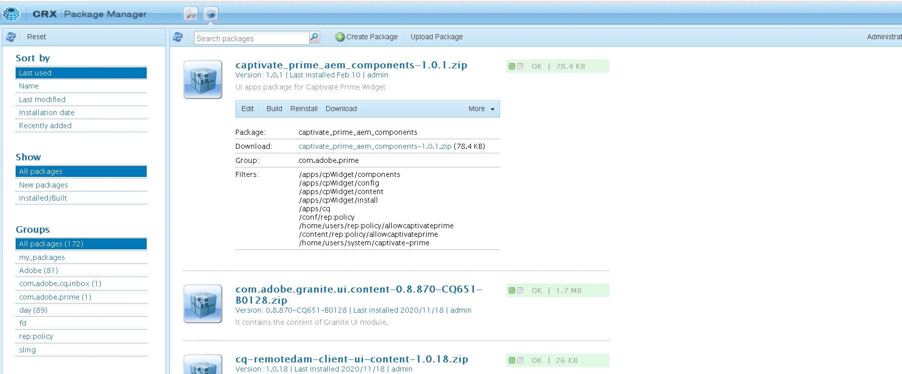
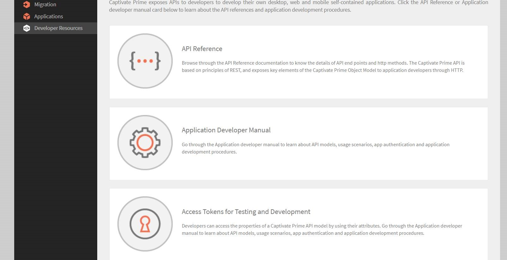

# AEM과 Learning Manager 통합

Learning Manager는 학습 콘텐츠 관리 시스템이 내장된 학습 관리 시스템입니다. 사용자는 Learning Manager에 업로드하여 학습 콘텐츠를 관리하므로 Learning Manager는 버전 관리, 과정 할당, 학습자 가시성 정의, 소비 추적 및 관리자에게 보고 작업을 수행합니다.

그러나 에셋 관리 시스템에서 자신의 콘텐츠를 저장하고 관리하는 사용자가 있습니다. 이렇게 만든 컨텐츠는 다양한 다른 기능에 맞게 용도로 재사용됩니다.

학습자 앱에 있는 다양한 스트립을 AEM 사이트에 임베드할 수 있습니다. AEM 사이트에 로그인한 학습자는 이러한 스트립에서 특정 교육 데이터를 볼 수 있습니다.

## 콘텐츠 패키지 다운로드 {#downloadthecontentpackage}

설치 프로그램은 AEM 콘텐츠 패키지로 제공됩니다. [***패키지 다운로드***](https://github.com/adobe/adobe-learning-manager-reference-site).

콘텐츠 패키지는 zip 파일로 다운로드할 수 있으며, AEM 6.4 및 AEM 6.5와 호환됩니다.

## Learning Manager 구성 요소 설치 {#installcaptivateprimecomponent}

AEM 패키지 관리자를 사용하여 Learning Manager 콘텐츠 패키지를 설치합니다.

>[!NOTE]
>
>패키지 설치에 대한 자세한 내용은 다음을 참조하십시오  [***패키지를 사용하여 작업하는 방법***](https://experienceleague.adobe.com/docs/experience-manager-65/administering/contentmanagement/package-manager.html?lang=en#how-to-work-with-packages).

1. AEM 작성자는 AEM 패키지 관리자를 엽니다.
1. 단추를 클릭합니다. **[!UICONTROL 패키지 업로드]**.
1. 다음을 수행합니다. **[!UICONTROL 찾아보기]** 콘텐츠 패키지를 업로드합니다.
1. 다음을 수행합니다. **[!UICONTROL 업로드]**.
1. 패키지를 업로드한 후 콘텐츠 패키지를 선택하고 클릭 하여 설치합니다 **[!UICONTROL 설치]**.

   

   *콘텐츠 패키지 설치*

## 새로 고침 토큰 생성 {#generatetherefreshtoken}

AEM 관리자에게는 Learning Manager 계정의 새로 고침 토큰이 필요합니다. Learning Manager 통합 책임자는 새로 고침 토큰을 생성합니다.

1. AEM Sites 추천 앱을 승인합니다.

   다음을 수행합니다. **[!UICONTROL 응용 프로그램]** > **[!UICONTROL 추천 앱]** > **[!UICONTROL Adobe Experience Manager - 사이트]**.

   

   *앱 승인*

1. 다음을 수행합니다. **[!UICONTROL 응용 프로그램]** > **[!UICONTROL 추천 앱]**&#x200B;을 입력한 다음 AEM 사이트 응용 프로그램을 엽니다.

   응용 프로그램 ID 및 설명을 복사합니다.

1. 다음을 수행합니다. **[!UICONTROL 개발자 리소스]** > **[!UICONTROL 액세스 토큰]**.

   

   *액세스 토큰 생성*

1. 다음 세부 사항을 입력합니다.

   * 클라이언트 ID - 응용 프로그램 ID입니다.
   * 클라이언트 암호로, 설명에 있습니다.

1. OAuth 코드를 가져옵니다. 리디렉션 URI에서는 v2 API를 사용해야 합니다.
1. 다음을 수행합니다. **[!UICONTROL 제출]** 새로 고침 토큰을 가져옵니다.

## AEM에서 위젯 구성 {#configurethewidgetinaem}

위젯 구성의 경우 AEM 작성자에게는 Learning Manager 통합 관리자가 제공한 새로 고침 토큰만 필요합니다.

여러 페이지에서 여러 계정 구성을 설정할 수도 있습니다.

1. 다음을 수행합니다. **[!UICONTROL 도구]** > **[!UICONTROL Cloud Service]** > **[!UICONTROL Learning Manager 위젯 구성]**.
1. 다음을 수행합니다. **[!UICONTROL 만들기]**.
1. 여기에 새로 고침 토큰을 입력합니다. 다른 설정을 지정합니다.
1. 호스트 이름은 EU 지역에 대해 &quot;learningmanagereu&quot;로 변경해야 합니다.
1. 구성을 저장하고 닫습니다.
1. 구성을 선택하고 해당 구성을 게시합니다.

## AEM 작성자 {#aemauthor}

AEM 작성자는 먼저 AEM 템플릿에 구성 요소를 추가해야 합니다

그러면 AEM 작성자는 Adobe Learning Manager 구성 요소를 끌어 놓고 이에 따라 구성할 수 있습니다.

Learning Manager 구성 요소를 사용하려면 위 단계에서 생성된 구성을 페이지에 매핑해야 합니다.  작성자는 아래의 페이지 속성을 편집하여 구성을 매핑할 수 있습니다. **[!UICONTROL 고급]** > **[!UICONTROL 구성]** > **[!UICONTROL 클라우드 구성]** 구성 경로를 제공합니다. 작성자는 이러한 방식으로 여러 Learning Manager 계정의 구성을 생성하고 각 계정을 서로 다른 사이트 페이지에 매핑할 수 있습니다. 구성이 페이지에 매핑되지 않은 경우 구성 요소는 필요할 구성을 찾을 때까지 반복적으로 상위 페이지의 구성을 읽습니다.

## 학습자 {#learner}

학습자는 페이지에서 강의를 수강할 수 있습니다.

Learning Manager 위젯에 액세스하려면 학습자가 AEM 사용자로 로그인해야 합니다. 또한 재산권 **email** 학습자의 rep:User 노드에 속한 &#39;/profile&#39; 노드에 있어야 합니다. 이 전자 메일은 Learning Manager 계정에 있는 전자 메일과 정확히 동일해야 합니다.

학습자는 페이지에서 강의를 수강할 수 있습니다.

강의 진행률도 저장됩니다.

다음 위젯이 제공됩니다.

1. 게임화
1. 학습 일정
1. 소셜 위젯
1. 카탈로그 위젯
1. 내 학습
1. 동료 학습 기반 추천
1. 관리자별 Recommendations
1. 학습자 관심사에 따른 추천

권장 사항이 없는 경우 위젯이 공백으로 표시됩니다.

## Skyline 지원

Skyline은 클라우드 버전의 AEM입니다. 패키지 관리자에서 Skyline을 먼저 설치해야 합니다. AEM에서 Skyline 구성 요소를 사용하려면 사용자가 Learning Manager 계정에 등록되어 있어야 합니다. 즉, 사용자의 이메일 주소가 계정에 존재해야 합니다.

### Skyline 배포

Skyline의 단계적 구성 방법은  [GitHub 리포지토리](https://github.com/adobe/captivate-prime-aem-components).

## 카탈로그 위젯

카탈로그 위젯은 특정 카탈로그나 일련의 카탈로그에서 가져온 교육 과정을 사용자에게 표시합니다. 페이지 속성의 &#39;속성&#39; 섹션에 나열된 옵션에서 &#39;카탈로그&#39;를 선택합니다.

<!---->

카탈로그 위젯에는 다음과 같은 옵션이 있습니다.

* **[!UICONTROL 카탈로그 ID]:** 쉼표로 구분된 ID로서 교육 과정을 확인하는 데 필요합니다.
* **[!UICONTROL 정렬]:** 교육 순서를 정렬합니다. 옵션은 이름, 날짜, 생성일, 등록일 등입니다.
* **[!UICONTROL 학습자 상태]:** 모든 교육 과정을 등록, 시작, 완료 또는 미등록을 기준으로 필터링하여 나열합니다. 정렬 옵션이 dateEnrolled, dueDate 또는 dateEnrolled인 경우 검색 결과가 표시되지 않습니다.
* **[!UICONTROL 스킬 이름]:** 교육 과정을 정확하게 필터링하는 데 사용되는 스킬입니다.
* **[!UICONTROL 태그 이름]:** 결과를 정확하게 필터링하는 데 사용되는 태그입니다.

이 외에도 다음과 같은 구성 요소를 사용자가 원하는 대로 설정할 수 있습니다.

**[!UICONTROL 학습 객체 유형]:** 학습 개체 유형에 따라 필터링합니다. 지원되는 유형으로는 강의, 인증, 작업 지원 및 학습 프로그램이 있습니다.

AEM에서 카드 제목란은 처음에 비어 있습니다. widgets.html에서 속성 창에 제목을 입력합니다.

**사용자 정의**

widgets.html을 사용하면 레이아웃의 외형과 느낌을 원하는 대로 설정할 수 있습니다. 표시되는 카드의 모양을 변경하고 테마를 사용자 정의할 수 있습니다.

(으)로 **[!UICONTROL 일반 설정]** 섹션에서 카드의 기본 색상과 보조 색상을 선택하고 속성을 지정하여 테마를 취향에 맞게 설정할 수 있습니다.

```
{ 
 "globalCssText":"@import url('https://fonts.googleapis.com/css2?family=Grandstander:ital,wght@0,100;0,200;0,300;0,400;0,500;0,600;0,700;0,800;0,900;1,100;1,200;1,300;1,400;1,500;1,600;1,700;1,800;1,900&family=Montserrat:ital,wght@0,100;0,200;0,300;0,400;0,500;0,600;0,700;0,800;0,900;1,100;1,200;1,300;1,400;1,500;1,600;1,700;1,800;1,900&display=swap');", 
 "fontNames":"Grandstander", 
 "cardLayout":{ 
 "cardLayoutName":"compact", 
 "cardPrimaryColor":"#376BA4", 
 "cardSecondaryColor":"#F98EB0", 
 "startedStateTextColor":"#ffffff", 
 "continueStateTextColor":"#ffffff", 
 "revisitStateTextColor":"#ffffff", 
 "startedStateColor":"#a0a0a0", 
 "continueStateColor":"#f9a122", 
 "revisitedStateColor":"#7fbc64", 
 "textPrimaryColor":"#ffffff", 
 "textSecondaryColor":"#d93f3f", 
 "navIconColor":"#a0a0a0" 
 } 
}
```

### 상위 LO 등록 무시

해당하는 경우 **상위 LO 등록 무시** 확인란이 활성화되고 사용자가 학습 프로그램 또는 인증에 직접 등록되면 해당 인증 또는 학습 프로그램과 관련된 강의는 사용자의 위젯에 표시됩니다.

이 확인란을 선택 취소할 경우 사용자를 직접 등록하지 않은 학습 프로그램 또는 인증과 관련된 강의가 표시되지 않습니다.


*상위 LO 등록 무시 확인란을 선택합니다.

그런 다음 설정이 위젯에 적용됩니다.

### 보안

클라이언트 ID 및 클라이언트 암호 필드가 추가됩니다. 또한 새로 고침 토큰이 마스킹됩니다. 사용자가 전체 구성을 생성한 후 사용자가 구성을 다시 열어 편집하거나 다른 사용자가 이 구성을 열면 새로 고침 토큰이 마스킹됩니다.
